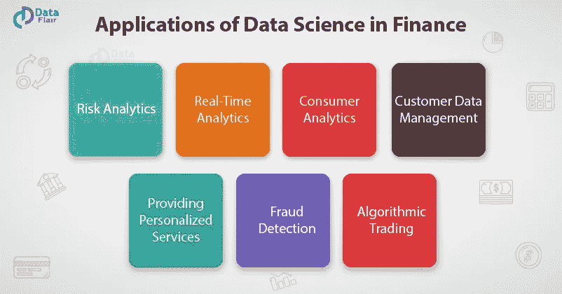
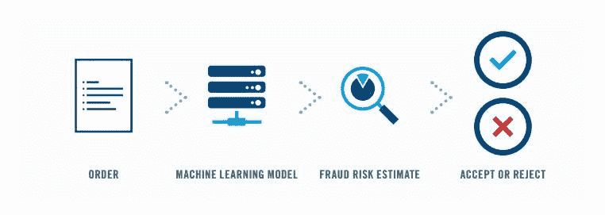

# 当心！金融中的数据科学技术不会让你做任何欺诈

> 原文：<https://towardsdatascience.com/beware-data-science-technology-in-finance-will-not-let-you-do-any-fraud-56a1f183dbf2?source=collection_archive---------18----------------------->

**你在生活中有没有做过诈骗的事情？**我知道；-).请注意，现在在数据科学的帮助下，你的欺诈行为可以被发现。是啊！您没有看错，数据科学现在正在帮助金融部门进行欺诈检测。除此之外，数据科学在金融领域还做了什么？激动吗？还等什么，探索篇——

金融从来都是关于数据的。事实上，数据科学和金融是相辅相成的。甚至在数据科学这个术语被创造出来之前，金融界就已经在使用它了。

# 数据科学在金融行业中的应用

*金融是数据的枢纽*。金融机构是数据分析的最早用户和先驱之一。数据科学广泛应用于风险分析、客户管理、欺诈检测和算法交易等领域。

## 1.风险分析

风险分析是金融中数据科学和商业智能的关键领域之一。借助风险分析和管理，公司能够做出战略决策，提高公司的可信度和安全性。由于风险管理衡量损失的频率，并将其乘以损失的严重性，因此数据构成了风险管理的核心。*风险管理是一个跨学科的领域，具备* [***数学、统计学和解决问题***](https://data-flair.training/blogs/math-and-statistics-for-data-science/) 的知识是必不可少的。虽然传统的结构化数据总是可以容纳在电子表格中，但更高级形式的数据是不结构化的。这种形式的大数据为机构提供了各种机会。

公司面临各种形式的风险。这些风险来源于竞争对手、信用、市场等。管理风险的主要步骤是识别风险、监控风险和确定风险的优先级。有大量可用的数据，如客户信息、金融交易。因此，机构在这种类型的数据上进行训练，以增加风险评分模型并优化其成本。风险管理的另一个重要方面是*核实客户的信誉*。为了分析信誉度，公司雇佣了数据科学家，他们使用 [***机器学习算法***](https://data-flair.training/blogs/machine-learning-algorithms/) 来分析客户的交易。

## 2.实时分析

在传统分析中，数据处理是以批处理的形式进行的。也就是说，数据处理本质上只是历史的，而不是实时的。这给需要实时数据以了解当前情况的各种行业带来了问题。然而，随着技术的进步和动态数据管道的发展，现在可以以最小的延迟来访问数据。随着数据科学在金融领域的应用，机构能够跟踪交易、信用评分和其他金融属性，而没有任何延迟问题。

***你查过*** [***数据科学是如何改造教育领域的***](https://data-flair.training/blogs/data-science-in-education/) ***？***

## 3.消费者分析

消费者个性化是金融机构的主要业务。在实时分析的帮助下，数据科学家能够从消费者行为中获得洞察力，并能够做出适当的商业决策。像保险公司这样的金融机构利用消费者分析来衡量客户的终身价值，增加他们的交叉销售，以及减少零以下客户，以优化损失。

## 4.客户数据管理

金融机构需要数据。事实上，大数据已经彻底改变了金融机构的运作方式。数据的数量和种类是通过社交媒体和大量交易贡献的。

数据以两种形式出现-

*   结构数据
*   非结构化数据

虽然结构化数据更容易处理，但非结构化数据会带来很多问题。这种非结构化的数据可以用几个 NoSQL 工具来处理，可以借助[***MapReduce***](https://data-flair.training/blogs/hadoop-mapreduce-tutorial/)来处理。

商业智能是大数据最重要的方面。行业利用机器学习来产生关于客户的见解并提取商业智能。人工智能中有各种工具，如自然语言处理、数据挖掘和文本分析，可以从数据中产生有意义的见解。此外，机器学习算法通过对客户数据的全面分析来分析金融趋势和市场价值的变化。

***通过***[***Data flair 大数据教程系列***](https://data-flair.training/blogs/big-data-tutorials-home/) 了解大数据的一切

## 5.提供个性化服务

金融机构负责向客户提供个性化服务。金融机构采用各种技术来分析客户信息，并对他们的互动产生洞察力。此外，金融机构正依靠基于语音识别和自然语言处理的软件来为其用户提供更好的交互性。

利用用户反馈的数据，金融机构能够对其客户需求进行可操作的洞察，从而增加利润。这将有助于这些机构优化其战略，并为其客户提供更好的服务。

## 6.欺诈检测

欺诈是金融机构的一大担忧。欺诈的危险随着交易数量的增加而增加。然而，随着大数据和分析工具的增长，金融机构现在可以跟踪欺诈行为。金融机构中最常见的欺诈之一是信用卡欺诈。这种类型欺诈的检测是由于算法的改进，提高了异常检测的准确性。此外，这些检测会提醒公司金融购买中的异常情况，促使他们冻结帐户，以最大限度地减少损失。

[***各种机器学习工具***](https://data-flair.training/blogs/machine-learning-tools/) 也可以识别交易数据中的异常模式，并提醒金融机构对其进行进一步调查。银行还必须应对其他与保险相关的欺诈。使用几种聚类算法，公司能够分离和聚类看起来非常可疑的数据模式。

## 7.算法交易

算法交易是金融机构最重要的部分。在算法交易中，有复杂的数学公式和闪电般的计算帮助金融公司设计新的交易策略。大数据对算法交易产生了巨大影响，数据科学已成为其最重要的特征。

算法交易中存在的数据由大量数据流组成，并涉及测量和描述底层数据流的模型。分析引擎的目的是通过更好地理解海量数据集来预测未来市场。

# 摘要

数据科学的使用主要是在风险管理和分析领域。公司使用数据科学客户组合管理通过商业智能工具分析数据趋势。数据科学也被用于算法交易，机器学习在预测未来市场方面发挥着关键作用。

霍普，你喜欢读这篇文章。以下是一些你必须阅读文章

[***医疗数据科学***](https://data-flair.training/blogs/data-science-in-healthcare/)

[***银行业中的数据科学***](https://data-flair.training/blogs/data-science-in-banking/)