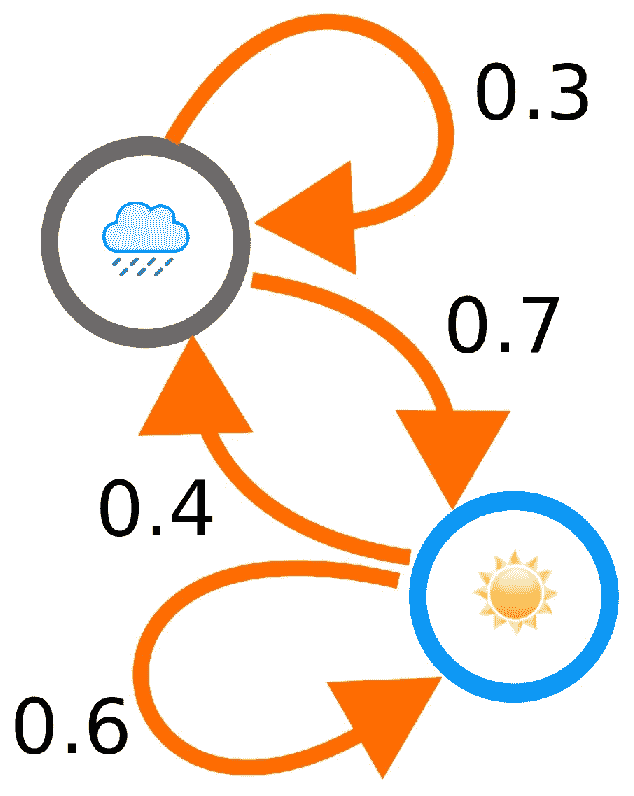

# 令人困惑的大脑

> 原文：<https://towardsdatascience.com/bewildering-brain-332d5192e95b?source=collection_archive---------22----------------------->


## 像鲍勃·迪伦那样用机器学习写歌。

> 由，就在孩子死去之前，
> 每个人都得来看她的手，
> 但有太多的哼，
> 父亲，当我可以告诉你下来…

他的诗句不是由诗人或音乐家写的。它们是由经过鲍勃·迪伦完整歌词训练的神经网络编写的。
机器人能创造艺术吗？我把这个问题留给哲学家。在这个小实验中，我只会尝试使用机器学习尽可能准确地模仿迪伦的歌曲风格。

罗伯特·艾伦·齐默曼，又名鲍勃·迪伦，被许多人视为偶像和美国音乐无与伦比的堡垒，可以说是美国有史以来最受欢迎的音乐家。职业生涯跨越 6(！！)几十年和 38 张录音室专辑，很容易看出原因。哦，别忘了他的唱片销量已经超过 1 亿张，这使他成为有史以来最畅销的音乐艺术家之一。然而，今天让我们聚集在这里的是他的歌词。根据维基百科，他的歌词融合了广泛的政治、社会、哲学和文学影响，挑战流行音乐惯例，迎合新兴的反主流文化。
听起来很有趣吧？

这种特殊的背景和他独特的风格为他赢得了全世界的认可和无数的奖项。最负盛名的是 2016 年诺贝尔文学奖**“因为在伟大的美国歌曲传统中创造了新的诗歌表达方式”。**

**他的签名风格是不会错的。**

## **或者是？**

**“*He not busy being born is busy dying”. It’s Alright, Ma (I’m Only Bleeding) is one of his most celebrated masterpieces.***

# **技术**

****

**为了这个小实验，我基于一个处理神经网络的框架。**

**值得一提的是，作为环境，我使用了 [Jupyter Notebook](https://jupyter.org/) 和 [Pycharm](https://www.jetbrains.com/pycharm/) ，所有的东西都是用 Python 3.6 开发的。**

**数据库中包括了从首张同名专辑到 2012 年[的《暴风雨》的所有歌曲。我从](https://open.spotify.com/album/3LnS0XKSzd2TFoagESGUw3?si=W-CbGl-ZTGeDPvVHdhG3dQ)[马特·穆赫兰的网站](http://mulhod.github.io/bob_dylan_lyrics/index.html)上拿到了这个文件。这节省了我很多时间，所以谢谢马特！**

**我特别使用了两种算法/技术:**马尔可夫链**和 **RNNs(递归神经网络)**。我建议比较和分析哪一个输出更好的结果，以及它们的表现如何。**

# **马尔可夫链**

**M arkov 链是随机过程，其主要特征是**一个事件的概率完全依赖于前一个事件**。这种缺乏记忆的特性被称为**马尔科夫特性。** 听起来很复杂，但是超级简单易懂。**

****

**如果我们把下雨理解为马尔可夫过程，下雨的概率只取决于昨天是否下雨。**

**有两种状态:下雨或不下雨。**

**如果我们在一个晴天，第二天下雨的概率是 40%，所以第二天有 60%的机会是晴天。**

**如果下雨，第二天有 30%的可能性会再下雨，70%的可能性会是晴天。**

**就这样，日复一日，我们可以只根据前一天的情况来计算下雨的概率:不管是不是雨季，不管全球变暖，也不管地理区域。**

**现在回到主题，我们可以将文本理解为一个马尔可夫过程，其中每个单词出现的概率只取决于前一个单词是哪个写的。这样，“预测文本”就成为可能。**

**为了将马尔科夫应用到迪伦的歌词中，我参考了汉斯·卡明的作品[，他在那里预测了罗辑的歌词](/predicting-logics-lyrics-with-machine-learning-9e42aff63730)。这个想法是创建一个代表英语的二元马尔可夫链。更具体地，创建连续单词的元组字典。因为我们使用的是二元模型，而不是单个单词(unigrams)，所以我们在预测中获得了更好的精度，最重要的是，模型创建的歌词具有更好的可读性。这意味着，**句子的下一个单词是用前两个单词而不是单个最后一个单词来预测的。****

**使用[熊猫系列](https://pandas.pydata.org/pandas-docs/stable/reference/api/pandas.Series.html)，我遍历了数据库中的所有歌词，并分别为行首、行尾和换行符(\n): `"<START>"`、`"<END>"`和`"<N>"`使用了特殊的标签。**

**为了进行预测，我们从字典中的键`(None, "<START>")`(必须是链中的第一个链接)开始，然后我们以随机的方式采样——但要考虑分布——列表中与该键相关的一个单词；我们将键移向我们刚刚采样的单词。我们继续这个过程，直到我们到达`"<END>".`**

**以下是该算法吐出的一些我最喜欢的短语:**

> **你这个天使，你，你让我在你的羽翼下，你走进我放铅笔的房间的样子。**
> 
> **我一定会去大北方森林，作为临别礼物。夏天的白天，夏天的夜晚都过去了，我知道我只是没有体温？**
> 
> **我去告诉你，宝贝，昨天深夜我梦见风中泥土上的铃铛。我走向更高层次的忏悔，**
> 
> **我走进杯子上面一个瞎子的嘴里，他开始想我可以，我不能放开我的羔羊的心**
> 
> **我如何再次徘徊在我的膝盖上，不需要一个我遇见的女人，把希望放在她身上不要给我，宝贝，我会在这电话线里做任何事。**
> 
> **我怎么会生病。然后他们给他们带来衣服！呜-呼！我现在还不知道，你要找的不是我，宝贝。**
> 
> **来吧，看看你的窗台。我的公路鞋还要多久才会消失？**
> 
> **对任何路过的人来说，再也没有信了，没有！除非你从荒凉街寄出。**

**很明显，这些歌词尽管有着明显的丹麦风格，却感觉像是现实的剪影。就像他的作品的复制粘贴，不同诗句的拼贴创造了一首新歌。许多短语与鲍勃写的相同。
**这是意料之中的，因为当我们使用二元模型搜索更高的可读性时，我们也减少了预测单词的方差。结果，我们得到 3 个或更多的单词来自同一首诗。使用单字也不是解决办法，因为不尊重单词的句法和形态顺序会失去意义:这将是一个随机顺序的单词汤。****

**马尔可夫链带来了易于实现和使用较少变量来预测结果的优势:但它也伴随着糟糕的预测。为了解决这个问题，我转向了一个更复杂的模型:递归神经网络，或 RNN。
另一个值得一提的细节:算法将继续预测，无论长度如何，直到到达链的末端(标签`<END>`)。这意味着运行该算法可以输出 2 个诗句，下一个可以输出 50 个。**

**“There must be some kind of way outta here” — Said the joker to the thief.**

# **RNN(递归神经网络)**

**R ecurrent networks 是一种人工神经网络，它可以识别来自传感器、股票市场或政府机构的数据序列中的模式，如文本、基因组、笔迹、口头语言或数字时间序列。这些算法考虑了时间和顺序；它们有一个时间维度。**

**与马尔可夫链相比，**递归网络具有记忆性。****

**为了理解递归网络，首先你需要理解普通网络的基础知识:*前馈*网络。这两种类型的网络都被称为神经元，因为它们通过在网络节点中执行的一系列数学运算来传递信息。一个在不接触同一个节点超过一次的情况下携带信息直到结束，而另一个在同一个网络上循环运行。后一种叫做**轮回**。**

**在前馈网络的情况下，给它们输入，你得到一个*输出*。在监督学习中，*输出*将是一个*标签。*这意味着数据被原始映射到一个类别识别模式，该模式决定，例如，用作输入的图像是否可以被分类为*猫*或*狗*。**

****另一方面，****不仅将当前看到的例子作为*输入*，而且它们还考虑先前在时间上已经感知到的。****

**在时间`t-1`做出的决定将影响稍后在时间`t`做出的决定。因此，递归网络有两个输入来源:现在和最近的过去，它们结合起来决定如何对新数据做出反应——就像人脑一样。**

**我们还需要分析**长短期记忆(LSTM)** 的概念，以完成对完整过程的理解。
如果我把迪伦所有的歌都喂给我的网络，让它完成这首歌的歌名，会发生什么？**

> **乌克兰人想家了…**

**我们知道下一个词是 ***【蓝调】*** (如果你不知道这首歌，你现在听它)。网络不会知道，因为这个信息不会重复很多次，或者它的发生不是足够近以至于不能被记住。**

**对于人类来说，如果一个短语出现在书名中，它一定是情节的重要部分，这是非常明显和直观的；即使是在它唯一出现的时候。与 RNN 相反，我们肯定会记得。即使他们忘记了，也有像 LSTM 网络这样的技术可以成功地处理这种情况。**

**当 rnn 记住所有的事情直到某个有限的深度时，LSTM 网络学会记住什么和忘记什么。**

**这允许 LSTM 网络到达并使用 RNNs 范围之外的存储器。由于被认为很重要，这些记忆首先被 LSTM 网络记住。**

****

**我们如何实现这一点？一般来说，循环网络有一个简单的结构，模块重复，数据流通过。简单的层通常是用简单的双曲正切(tanh)作为激活函数创建的。**

**另一方面，LSTM 网络具有更复杂的结构；将这些与其他几个函数结合起来，其中包括 sigmoids。它们不仅包括输入和输出门，还包括第三个门，我们称之为*。它接收信息是否值得记忆。如果是否定的，则删除该信息。***

***决策是如何进行的？每个门都与一个权重相关联。对于每次迭代，sigmoid 函数应用于输入，作为输出，我们接收到一个介于 0 和 1 之间的值。0 表示没有东西通过，1 表示所有东西都通过。
之后，每层的每个值通过反向传播机制进行更新。随着时间的推移，这允许入口学习哪些信息是重要的，哪些是不重要的。***

***为了实现这一切，我基于格雷戈·苏尔马的[文本预测器](https://github.com/gsurma/text_predictor)。我对模型做了一些小的修改，使其适应 Python 3，并对超参数做了一点改动，直到得到满意的结果。***

*****模型是基于字符的**:所有独特的字符都是用它们各自的频率计算出来的。张量是用它们指示的频率替换每个字符而创建的。输出的长度由一个参数预定义。在这种情况下，它是固定的。***

***更多细节，你可以在我的 [GitHub 账户](https://github.com/alexing/lyrics_prediciton)中查看我的代码。***

***[](https://github.com/alexing/lyrics_prediciton) [## 朗读/歌词 _ 预测

### Markov 链与 RNNs 在文本预测上的比较—Alex ing/lyrics _ prediction

github.com](https://github.com/alexing/lyrics_prediciton) 

技术细节说够了:让我们检查结果！


这里有趣的一点是，不仅可以看到最终结果，还可以看到**算法在每次迭代中的学习过程。**它是如何在短短的几个周期内从一堆字符变成一首首诗歌的。

我们还可以欣赏学习曲线，其中我们可以考虑损失函数如何最小化，直到它在不到 90k 次迭代中在接近 0.6 的渐近值附近建立。

## 迭代 0

```
5p4:HStdgoTxFtBy/IBBDJe!l5KT
HldE42:lt(-cdbA2lB2avwshp-w,M)cKyP]8 1arOsfsJSA
cWU6sU6E"JV54X9bfrxFV1EEnajkozd'Tk3iQkuUp02oekrQI-,,rAt-(PyfE6z-v7]8utBnD/Nxv:m;0Mw!)cYbnug
qo7t MXQhnq?X7qBTgKp9dJAojO2.87cN?:/0SJq:k
BS
yKDaj5G
0"U466;y8'7cxNLsYXVTUIxqbW0i0bZh8okns) Hf2?2R2hxddb;zXfv3J4iLfv-qOK4y[gaQuImW!XUyyBch9)GgcFB5f[Ri6?FaGno pBMQl hD ;tPUnyWuxg!B Qd6ot30tAlnLg2n?tLctfXTaz:9pIC3Z;fnA]A?q9k"B2r
m"eHTI"miA!d/iimz!/ndfzSKd.W[ALoLxE[l;PQI:PG ]EtUM4?(x4zBB-[wH;
GJT/JYA
zFGK9x05J1Ch[z2(/L4P?Ki
TYNK,7m
```

你什么都不知道，RNN 模特。冷启动后，用垃圾和随机字符初始化模型。

## 迭代 1000 次

```
temple at 
I hand you up to laby, 
You set you on always hole as madoo and use unknear, 
And thinking 
I want his dista, 
Coom on you make you." "What want 
Everybody was on 
Ira," ain't may bold by you.  
And the pend. 
Honey, day you don't eway you say" 
I mad in 
Game, 
No, contaw woman, 
How, way, 
Pryie you don't know, and couse 
I love are stone is sute curt suck block on 
Haye? 
Now, a make for etcide is lord, 
Walles 
And he lad feel, 
Take, blace 
And mave wease with nothing, 
But you
```

该模型在几次迭代中学习了哪些是创建迪伦歌曲的指示字符。也是它的形状:诗句的大小和基本的标点规则，如开始句子前的大写字母和逗号的用法。

## 迭代 2000

```
how. 
You never you been todred, 
Just crying her face to the night.  
Oh, uh, sang to time in you.  
Timb friend carbed as lace. 
We'll be the better does of my beantains, 
The mightenmed to cheat twist and you'll asy dressed them loves?  
With the mough seen of the facing gold, 
Take er can 
Man, wanded like mind for your morning the night up the feet the wond pring, 
Take did a grost ever neum. 
Pounsta fleason just comeless, them bads of me see there a womes of as too lotten up to turn, 
You
```

有些词已经是实词，词与词之间的形态关系开始显现:形容词和冠词作为名词的修饰语。动词后的间接修饰语、宾语和谓语。

## 迭代 4000 次

```
I world must be lady, babe, 
Ither didn't matked, don't remember helled things. 
They'll eter came life, mamber 
And the company together 
That 
I thinking for you, though protaured in the dance please 
Follower, 
I ain't never the one?  
Well, it air awa paries because a north that her in day you only think cannot the ground, her not a roll a mause where they're looked awhile, 
Can the 
Lad-eyes and the confesed white wiced to come me. 
You're in two if it is, slele noners, 
Ain't mes was blow
```

单词预测中的错误开始减少:词汇错误减少。

## 迭代 35000 次

```
with their highway.  
I cannon cloaked in a picture, 
It diamondy his man 
I'll see you even day he'd come there across, the moon after the parking, 
I'm dressed, 
I'm a bad line.  
Sanalured like a coller standing in a woman.  
I'll be banked inside, 
She sees - 
Shere road-luck in the dust he's well never know.  
With degreeing on a whole farms, but don't think twice and 
I took forwlet 
Johanna 
I never crash. 
I'm going to the jelf. 
All 
I never been don't know what 
I 
Night - 
Don't mean
```

对诗节有很好的形态学理解:即使歌词没有多大意义；它有诗歌或歌词的形式。

## 迭代 102000

```
guess he wat hope this nose in the last table if 
I don't mean to know. 
Well, 
I'm puts some dirty trouble for you in the law.  
Go dishes - 
And all the way from a cow, 
They'll stone you when you knew that, you are, you're gonna have to guess that

I after and flowing on you, laws are dead, might as 
I read is changed.  
I've taking for you, yesterday, a 
Martin 
Luther game was tried. 
He was without a home, 
Let the basement deep about hall."  
Well, 
I'm lose again the real land, 
Throw my
```

错误的数量已经明显减少。它看起来绝对像是人类写的。也许那个人超过了赞安诺的推荐剂量，但毕竟是人。

## 迭代 259000

```
guess in the confusion come with nothing in here together wrong. 
I saw sold, he puts in my bed.Going through the branchummy, 
There's an ended on the factiful longer and pierce of 
Blind expense 
And the wind blow you went, 
I've shine, 
Bent 
Before the world is on the snowfur warn - now, handled, your daughters are full of old, goes for dignity.  
Oh, you got some kid no reason to game 
Just and it's light and it evonces, 'round up 
Indian.  
Well, the bright the truth was a man patty
```

## 我们的网络学会了像鲍勃·迪伦那样写歌。

好吧，好吧。我接受。我们仍然有一些词汇错误，歌词可能没有太多意义。
即使一个人工智能生成的歌词仍然有这些小瑕疵，我们当然可以看到模型正确地学习了复制提供的数据集的风格。

如果我们考虑到网络是从零开始学习如何做这一切的，并且在开始时它对什么是字母或单词(甚至没有提到英语语法)没有任何理解，我们可以同意结果是令人惊讶的。我们能够检测数据集中的逻辑模式，并复制它们:网络没有任何时间输入语言是什么，或者在其上设置了什么规则，或者甚至正在处理的是来自医疗病人的临床图像或莎士比亚作品集。

# 结论和未来步骤

在这篇文章中，我计划比较两种完全不同的文本预测方法。一方面，马氏链带来了易于实现的优势。开发它们并不需要高深的理论或技术知识:但预测结果非常基本，而且没有达到预期。该领域的未来显然在于 rnn 的使用，即使实现、运行和测试它们需要很长时间、处理能力、张量的磁盘和存储器空间，特别是先进的技术和理论知识。

为了进一步提高精度，我们可以将后一阶段的输出预测与字典进行对比。这可以由从数据库或英语词典中提取的独特单词组成。通过这种方式，如果预测的单词不存在，我们可以消除它或者用具有最大相似性(较小距离)的单词来替换它。

同样，如果你愿意，你可以在[我的公共 GitHub 账户](https://github.com/alexing/lyrics_prediciton)中查看我的代码。

Let me ask you one question, is your money that good?
Will it buy you forgiveness, do you think that it could?

人工歌词还要多久才能到？谁将第一个挤出这个市场？[已经有已故音乐家的全息旅行。罗伊·奥比森、迈克尔·杰克逊和图帕克就是一些值得一提的例子。这个“死后音乐”的新时代会成为人为作词的完美借口吗？](https://www.phillymag.com/news/2018/09/19/hologram-concert-roy-orbison-tupac/)

感谢阅读！

# 来源

[](/predicting-logics-lyrics-with-machine-learning-9e42aff63730) [## 用机器学习预测逻辑的歌词

### 使用机器学习概念，我们可以分析 Logic 的嘻哈风格，并预测他实际会写的歌词。

towardsdatascience.com](/predicting-logics-lyrics-with-machine-learning-9e42aff63730) [](https://skymind.ai/wiki/lstm) [## LSTMs 和递归神经网络初学者指南

### 数据只能反向理解；但它必须向前看。—索伦·克尔凯郭尔，期刊内容实际上…

skymind.ai](https://skymind.ai/wiki/lstm) [](/text-predictor-generating-rap-lyrics-with-recurrent-neural-networks-lstms-c3a1acbbda79) [## 文本预测器—生成 Rap 歌词📄

### 递归神经网络语言建模

towardsdatascience.com](/text-predictor-generating-rap-lyrics-with-recurrent-neural-networks-lstms-c3a1acbbda79)***