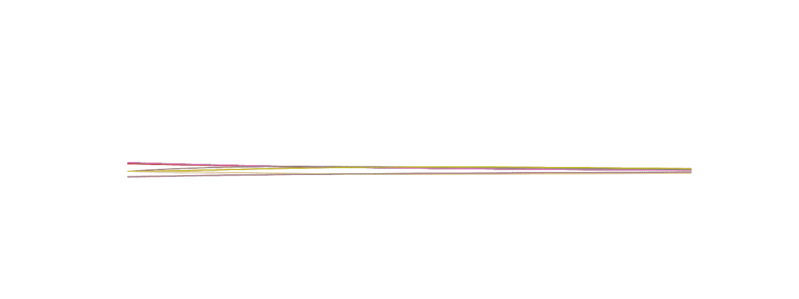
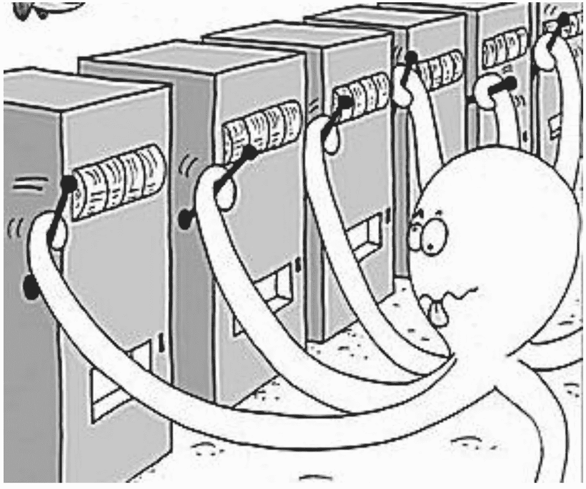
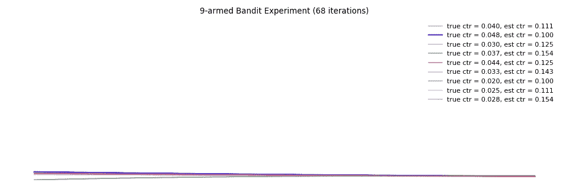
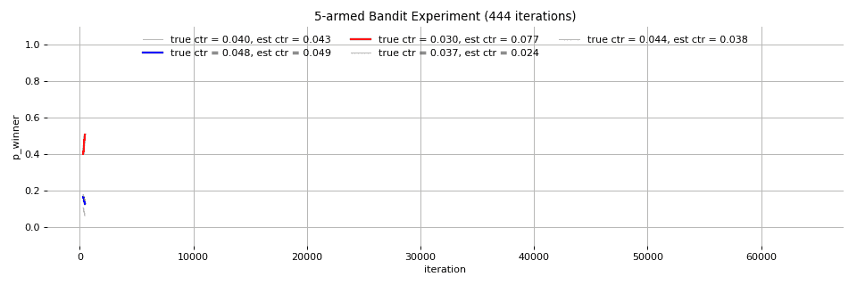
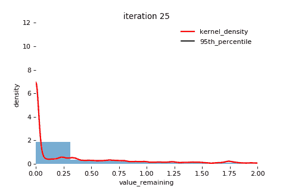
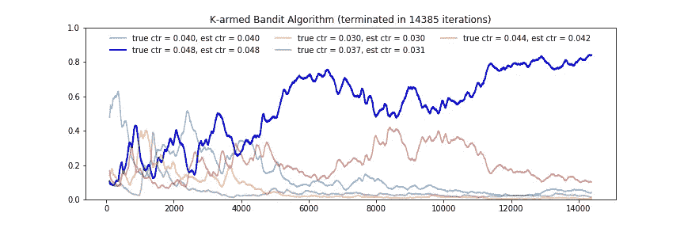
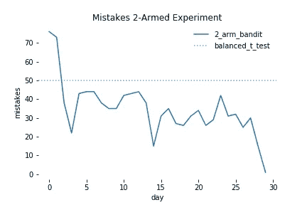
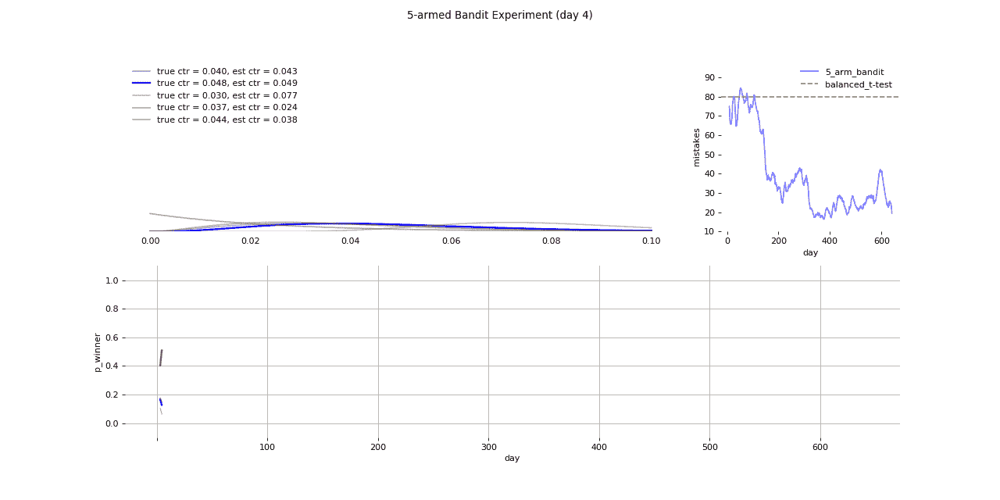
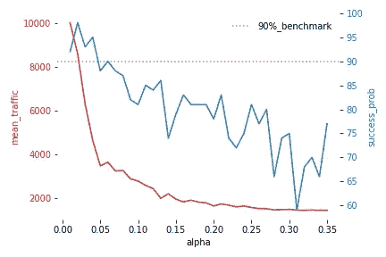

# 超越 A/B 测试:多臂强盗实验

> 原文：<https://towardsdatascience.com/beyond-a-b-testing-multi-armed-bandit-experiments-1493f709f804?source=collection_archive---------3----------------------->

## 基于 Thompson 抽样和蒙特卡罗模拟的 Google Analytics 随机 k 臂 bandit 检验研究

## A/B 测试摘要

A/B 测试依赖于经典的统计显著性测试。当我们想出一个新的产品特性时，我们可能想在向整个用户群发布之前测试它是否有用。该测试包括两组:一个治疗组(可以使用新功能)和一个对照组。然后，我们为这两个群体测量一个关键指标:平均网站时间(社交网络)，平均结账时间(电子商务)，或点击率(在线广告)。对各组之间的差异进行统计显著性检验。

经典的统计检验(z-检验，t-检验)保证假阳性率不超过α，常设置为 5%。这意味着当治疗组和对照组之间没有差异时，测试将有 5%的机会发现统计学差异。

平衡 AB 测试会将等量的流量分配给每个组，直到达到足够的样本量。但是，我们不能根据观察到的情况在测试期间调整流量分配。因此，A/B 测试的缺点是显而易见的:如果治疗组明显优于对照组，我们仍然必须在对照组上花费大量的流量，以获得统计显著性。

## 多臂土匪

鉴于 A/B 测试是一种频繁的方法，我们也可以用贝叶斯方法进行测试。这是可以理解的，一旦我们看到一种治疗方法明显更好，我们就想马上增加更多的用户。多臂强盗实验以可控的方式使这成为可能。

多臂土匪实验的基础是贝叶斯更新。每种治疗(称为“arm”，参见下面的类别定义)都有成功的概率，这被建模为伯努利过程。成功的概率是未知的，由 Beta 分布建模。随着实验的继续，每个分支都接收用户流量，Beta 分布也相应更新。为了可视化更新过程，请看我之前的帖子[这里](/visualizing-beta-distribution-7391c18031f1)。

在这篇文章中，我使用了谷歌在线广告匹配分析的例子。假设有 K 个臂。每个臂是一个广告，其点击率( *ctr* )遵循 Beta 分布。实验的目标是找到点击率最高的广告。

**汤普森取样**

简而言之，汤普森抽样是一种贪婪的方法，总是选择期望报酬最大化的手臂。在 bandit 实验的每次迭代中，Thompson sampling 只是从每个手臂的 Beta 分布中抽取一个样本 *ctr* ，并将用户分配到具有最高 *ctr* 的手臂。

Applying Bayesian updating to the Beta distribution of each arm

bandit 实验的精妙之处在于 Thompson 采样和 Bayesian 更新同时进行。如果其中一个分支表现良好，则更新其 Beta 分布参数以记住这一点，并且 Thompson 采样将更有可能从该分支获得高 *ctr* 。*在整个实验中，高性能的武器被奖励了更多的流量，而低性能的武器被惩罚了更少的流量。*

**蒙特卡洛模拟**

鉴于 Beta 分布估计的是 *ctr，*我们需要知道我们对 *ctr* 的每个估计有多大的把握。如果我们对目前具有最高 *ctr 的手臂足够有信心，*我们可以结束实验。

Monte Carlo simulation

蒙特卡洛模拟的工作方式是多次从 K 支队伍中随机抽取样本，并根据经验计算每支队伍获胜的频率(最高 *ctr* )。如果获胜的一方以足够大的优势击败第二方，实验就终止了。

**终止**

Google Analytics 引入了“实验中剩余价值”的概念(更多细节[此处](https://support.google.com/analytics/answer/2846882))。在每次蒙特卡罗模拟中，计算剩余值。如果我们选择α = 5%，那么当蒙特卡罗模拟中 95%的样本的剩余值小于获胜手臂值的 1%时，实验终止。

**模拟**

上面已经定义了效用函数，把它们放在一起就很简单了。对于每次迭代，都会有一个新用户到来。我们应用 Thompson 采样来选择手臂，并观察用户是否点击。然后我们更新手臂的β参数，检查我们是否对获胜的手臂有足够的信心来结束实验。

注意，我引入了一个*老化*参数。这是在宣布获胜者之前必须运行的最小迭代次数。实验的开始是最热闹的时期，任何一个失败者都有可能成功。预烧期有助于防止在噪音稳定下来之前过早结束实验。

实际上，这也有助于控制新奇效果、冷启动和其他与用户心理相关的混淆变量。谷歌分析强迫所有的强盗实验运行至少 2 周。

## 优势

bandit 试验的主要优点是它比 A/B 试验更早终止，因为它需要更小的样本。在点击率为 4%和 5%的双臂实验中，在 95%的显著性水平下，传统的 A/B 测试需要每个处理组 11，165。如果每天有 100 名用户，这项实验将需要 223 天。然而，在 bandit 实验中，模拟在 31 天后结束，达到上述终止标准。

Amount of traffic sent to the losing arm on each day (“mistakes”).

bandit 实验的第二个优点是该实验比 A/B 测试犯的错误更少。平衡的 A/B 测试总是将 50%的流量发送到每个组。上图显示，随着实验的进行，越来越少的流量被发送到失败的那一方。

以下是如何在模拟中运行 5 臂土匪实验。我们看到红色的手臂(ctr 为 4.4%)在前 150 次迭代中被误认为是获胜的手臂，我们将多达 80%的流量转移到了失败的手臂。但真正的蓝臂(ctr 4.8%)迎头赶上，成为真正的赢家。

## 交易

天下没有免费的午餐，更小样本量的便利是以更大的假阳性率为代价的。虽然我曾根据经验使用α作为假阳性率来终止实验，但在重复模拟多次后，假阳性率高于α。

α vs. sample size (traffic) and probability of finding correct winner

根据经验，5%的α在大约 91%的情况下找到获胜的手臂，而不是 95%。我们设置的α越小，我们需要的样本量就越大(显示为红色)，这与 A/B 测试的行为是一致的。

## 结论

事实证明，没有确定的赢家，对于产品经理、数据科学家和从业者来说，在做出选择之前，了解两种方法的优缺点是很重要的。在下列情况下，最好进行多臂 bandit 测试:

*   当将用户发送到失败的一方的成本很高时。在这个例子中，将用户与不良广告匹配只会导致更少的收入。损失是可以承受的。在其他情况下，例如在测试两种不同的帐户恢复方法时，每个分支的失败都意味着永久失去一个用户，多分支 bandit 实验显然是更好的选择。
*   对于用户流量不足的早期创业公司，多臂 bandit 实验效果更好，因为它需要的样本量更小，终止更早，比 A/B 测试更敏捷。
*   当有两个以上的变体需要测试时，bandit 实验可以帮助我们快速找到赢家。在 bandit 实验中，通常一次测试 4~8 个变体，而 A/B 测试仅限于每次测试两组。

多臂 bandit 测试的一个明显限制是，每个臂必须由 Beta 分布建模，这意味着每次尝试一个臂，都会导致成功或失败。这有利于对点击率和转换率进行建模，但如果您正在测试哪个结账过程更快，您必须对平均值的差异进行 t 检验。

另一方面，当公司有足够大的用户群时，当控制第一类错误(误报)很重要时，当我们可以对照控制组一次一个地测试它们中的每一个时，A/B 测试是更好的选择。

## 延伸阅读

下面的博客涵盖了与 AB 测试相关的主题，以及对本文中提到的关键概念的更深入的回顾。

*   可视化 Beta 分布和贝叶斯更新[ [链接](/visualizing-beta-distribution-7391c18031f1)
*   理解置信区间[ [链接](/understanding-confidence-interval-d7b5aa68e3b)
*   A/B 测试的力量[ [链接](/the-power-of-a-b-testing-3387c04a14e3)
*   你知道可信区间[ [链接](/do-you-know-credible-interval-e5b833adf399#bce7)吗
*   代码在我的 Kaggle [笔记本](https://www.kaggle.com/shawlu/k-armed-bandit)里。