# 超越条形图和饼图

> 原文：<https://towardsdatascience.com/beyond-bar-graphs-and-pie-charts-beb7f48cda5d?source=collection_archive---------12----------------------->

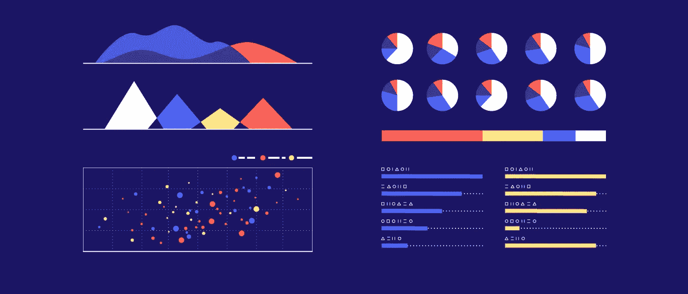

[link](https://www.columnfivemedia.com/how-to-data-visualization-report-design)

## 初学者指南

使用 Python、R、Tableau 和 RawGraphs 来有效而完美地交流数据

我明白。也许你忘了今天下午的报告。也许你有 5 分钟的时间在一天结束前把你老板想要的 3 张图片放在他的桌子上。也许你只是厌倦了在花费几个小时，甚至几天，清理和分析数据后处理和查看数据。我明白了，但是请不要拼凑一个条形图，添加一些颜色使它看起来更像是拼凑在一起的，然后把它扔到您的交付件上。有如此多的*工具用于创建数据的可视化，而你在 Powerpoint 中创建一个基本的(无用的)饼状图是对自己不公平的，而你本可以创建一些漂亮的和信息丰富的东西。*

即使你的视觉效果不是为了演示——也许它是你数据探索的一部分——你仍然要确保你是以一种能让你得出正确结论的方式来可视化它。

我们开始吧。

## 第一课:知道你能得到什么

有两种主要的工具可以用来创建视觉效果:编码包(例如 R 中的 ggplot2，Python 中的 seaborn 或 matplotlib)和可视化软件(例如表格、图表、草图)。这两者可以在不同的方面发挥作用，我们将使用一个关于难民的[数据集](https://www.kaggle.com/dhs/refugee-report)来可视化其中的一些差异。

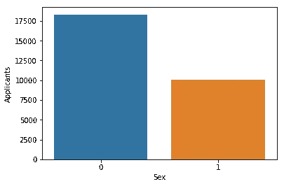

如果您希望在可视化数据的同时操作数据，那么编码包非常有用。例如，如果除了折线图之外，您还想显示它周围的置信带，那么添加到代码中就容易多了。或者，如果您在对数据执行回归过程之前创建可视化作为探索数据的一种方式，那么在代码中完成这一点也会更容易，因为只要它不符合您的交付成果，就不需要进行微调。最后，如果数据需要大量的清理，无论如何你都必须在你的代码中这样做，所以如果部分清理需要重做的话，创建可视化效果可能是有益的。

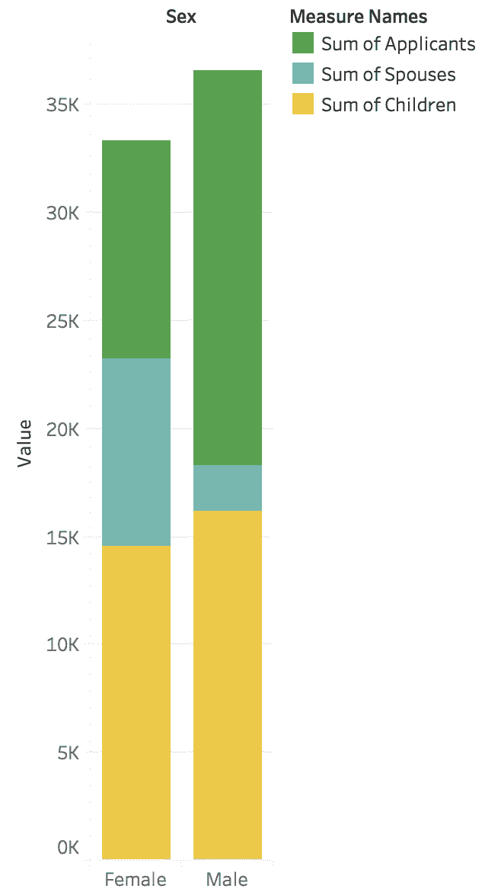

如果您试图创建模糊的视觉类型或编码大量信息，可视化软件非常有用。使用代码，根据变量的性质，您通常可以编码 2 个，也许 3 个额外的变量，但是更多的变量可以很容易地用软件编码，只需为您做一半的工作。尤其是当您的数据以奇怪的方式格式化时。为了对类似于左边条形图的图形进行编码，必须对数据进行重新组织，使难民类型本身成为一列，并且这些不同列中的数据必须进行组合。

如果数据集很小，这很简单，例如在本例中，但是如果您使用的是大型数据框，则可能很难对其进行重新格式化。

## 第二课:选择正确的图表

另一个可能影响你决定是使用编码平台还是可视化软件的因素是你想要制作的视觉效果的类型。下面是您可以在我前面提到的四个不同的包和平台中创建的图形类型。

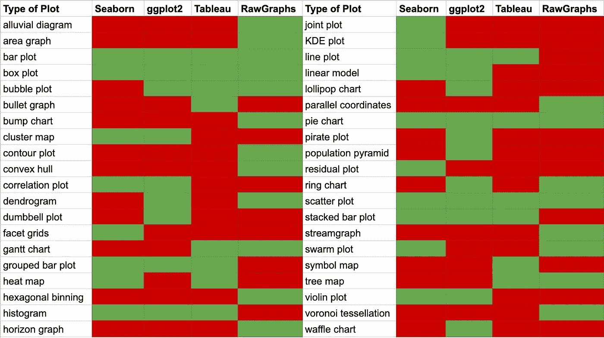

type of graphs available for each program

很容易满足于条形图或饼图，但愿不会如此。饼状图包含在上面的列表中，用于最少的合适场合，但是如果你还没有弄明白，你应该避免使用它们。他们很少有效地交流信息，尤其是在并排比较几个饼图的时候。在这种情况下，使用堆积条形图要简单得多，如果这不可能，那么你就不应该比较它们。

另一个常见的错误是过度使用线图。如果 x 轴上的值是离散的，这意味着它们之间的空间没有逻辑值，那么 y 轴上的值不应该连接。如果 x 值可以重新排列或者不是数字(除了日期)，请远离折线图。

从上面的列表中可以看出，并不是每种视觉都可以在每种平台上制作。是的，你总是可以做一个散点图或条形图，但是如果你想做一个圆形的树状图，你只能在 RawGraphs 中完成。或者，如果您想要制作美国的符号地图，最简单的方法是在 Tableau 中完成(加上 Tableau 有地图图层，可以添加这些图层以显示更多可能不在您的数据集中的信息)。

## 第三课:定制你的视觉效果，不要满足于橙色和蓝色

听着，我喜欢蓝色和橙色。作为弗吉尼亚大学的学生，这是我最喜欢的颜色组合。然而，当你的第 20 个图形仍然是蓝色和橙色的阴影，偶尔出现红色作为第三层时，它会变得很无聊。在代码和软件中，你可以选择你使用的颜色。现在，颜色不应该被随意使用。如果没有明确的、翔实的理由来添加色阶，**就不要添加色阶。**如果观察的颜色使用了与其大小、形状、长度等相同的信息，那么添加颜色只会让你的图表看起来更加混乱。

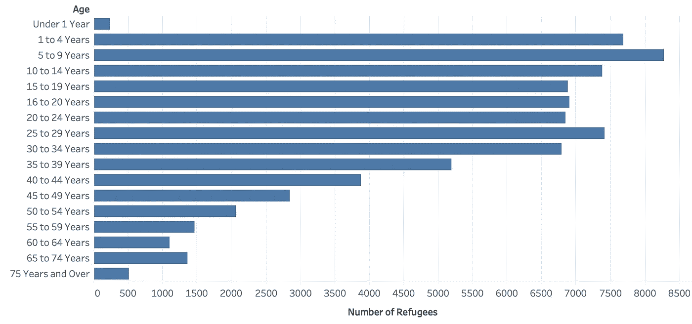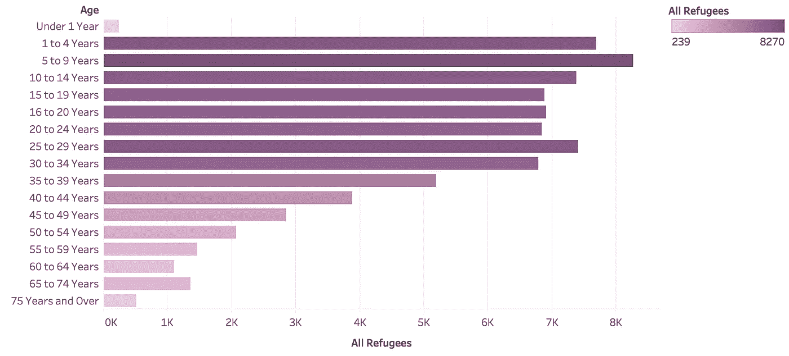

比较上面这两幅图。它们显示了同样多的信息，但是底部的一个用紫色阴影编码了难民的数量。是的，它看起来更漂亮，但它并没有给观众提供比第一张图更多的信息。

颜色也可以有偶然的含义。假设不是紫色，而是红色到绿色。这些颜色不仅对我们的色盲朋友不友好，而且我们在文化上也将红色与坏的联系在一起，将绿色与好的联系在一起。因此，如果 5 至 9 岁儿童的酒吧是亮红色，与绿色形成对比，我们可能会得出结论，即*有太多的 5 至 9 岁儿童*，这可能是真的，但可能不是视觉的目标。让我们看一个更糟糕的图表..

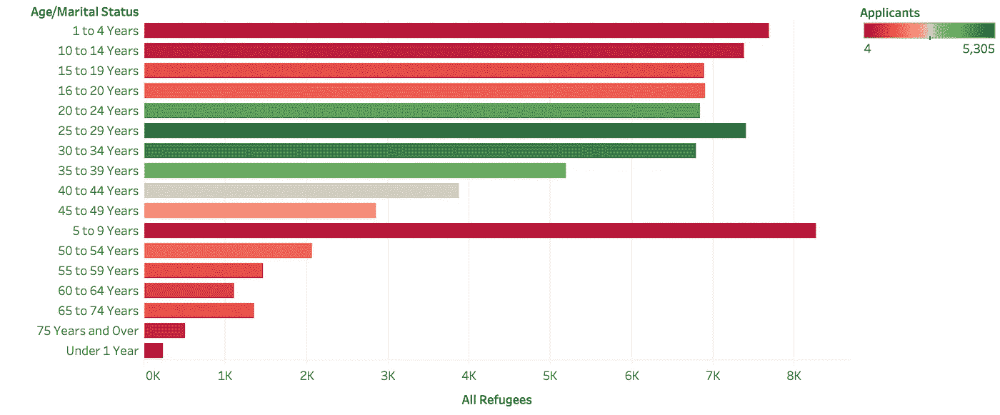

你能在这张图片上发现多少让你读起来更加困惑的东西？我们有年龄的字母顺序，令人困惑的 y 轴标签，以及编码申请人数的怪异色标。

对坐标轴上的值进行排序时，如果它们本质上不是序号/数字，则按升序或降序排列。这使得挑选最好的、最差的以及介于两者之间的东西变得容易得多。坐标轴的标签应该有目的地标注，如果您要比较具有相似信息的多个图表，请保持坐标轴的刻度不变。您不需要满足于列的名称，您可以通过一点点代码或在您的软件中进行一些编辑来定制它。最后，再次强调，要有意识地使用你的颜色。如果像这样的比例有意义(如果目标是 2000 名申请人，任何太低的都是不好的)，那么使用这个色标。

## 第四课:小心你的编码方式

颜色并不是给你的视觉增加额外信息的唯一方式。您可以采用的另一种方法是将数据点的大小与一个附加变量相关联。

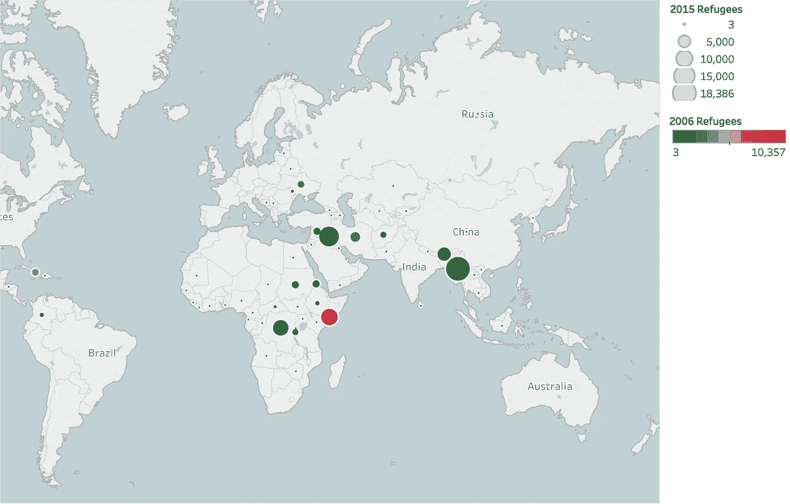

在这个视频中，点的颜色告诉你 2006 年有多少难民，而大小显示了 2015 年的难民人数。虽然仍然可以从中得出有效的结论，但是使用*区域时要小心。作为人类，我们通常更容易理解长度和宽度的差异，而不是面积。*

最后一点，编码数据不应该是你想要交流的主要数据。如果你真的想让某人从上一个条形图中得到的是应用程序的分布，那么用颜色来表示就不能有效地传达它。编码是针对次要数据的——包含这些数据是有用的，可以提供额外的洞察力，但对视觉效果可能不是至关重要的。

## 第五课:完全创建你的图形

*作为例子的视觉效果是不完整的。再说一遍，除非他们是为了数据探索，不会制作幻灯片或演示文稿，否则除了简单地制作条形图，还有更多事情要做。如果你回头看看我制作的第一个图表，我使用 Python 中的 seaborn 包，并且没有包括 x 轴的标签，所以你不能从中得出任何结论。你不知道 0 和 1 是什么——据你所知，它们可能是猫和狗。添加标签，添加标题，添加图例。确保如果有人看了你的视频，但不理解你的数据，他们能够得出正确的结论。*

# *有用的备忘单、代码和演练来帮助您*

## *Seaborn 备忘单和示例代码*

```
*sns.set_palette("Paired")sns.barplot(x='Sex', y='Applicants', data=data1).set_xticklabels(["Female","Male"])
plt.ylim(0,40000)
plt.title("Number of Refugee Applicants per Sex")sns.scatterplot(x='Marital Status', y='All', data=data2).set_xticklabels(["","Single","","Married","","Divorced/Separated","","Widowed"])
plt.ylabel("All Refugees")
plt.title("Number of Refugees by Marital Status")*
```

*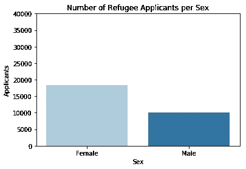**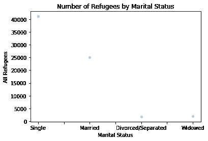**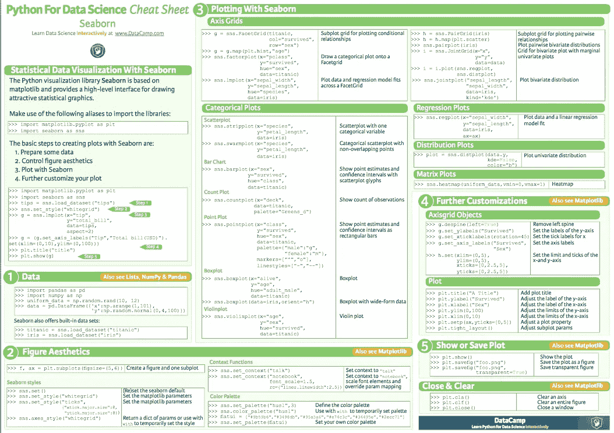*

*[https://www.datacamp.com/community/blog/seaborn-cheat-sheet-python](https://www.datacamp.com/community/blog/seaborn-cheat-sheet-python)*

## *ggplot2 备忘单和示例代码*

```
*ggplot(data, aes(x=data$Year,y=data$Refugees,color=data$Continent)) + geom_line() + labs(title="Refugees by Continent",x="Year", y="Number of Refugees") + scale_color_discrete(name="Continent") + 
  scale_x_continuous(breaks=c(2006,2008,2010,2012,2014))*
```

*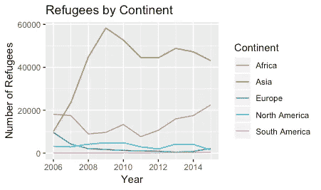*

*[https://www.rstudio.com/wp-content/uploads/2015/03/ggplot2-cheatsheet.pdf](https://www.rstudio.com/wp-content/uploads/2015/03/ggplot2-cheatsheet.pdf)*

## *Tableau 备忘单和演练示例*

*[https://confluence.umd.edu/download/attachments/551683736/Tableau%20Cheat%20Sheet%2010-31-2016.pdf?api=v2](https://confluence.umd.edu/download/attachments/551683736/Tableau%20Cheat%20Sheet%2010-31-2016.pdf?api=v2)*

## *RawGraphs 演练示例*