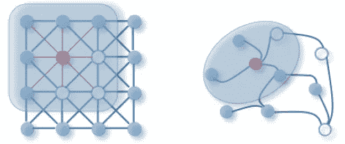
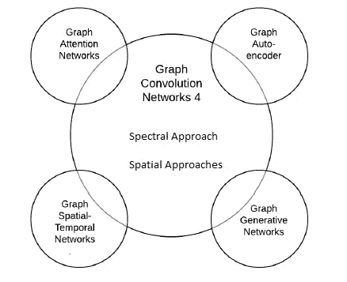
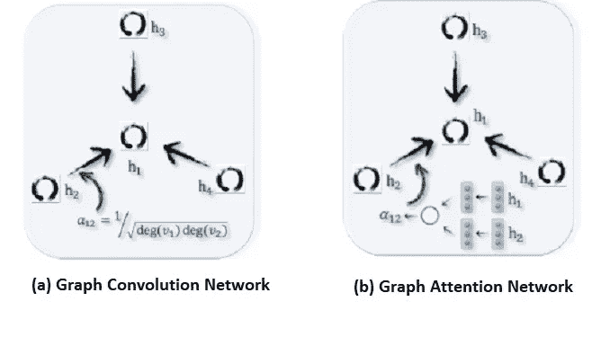
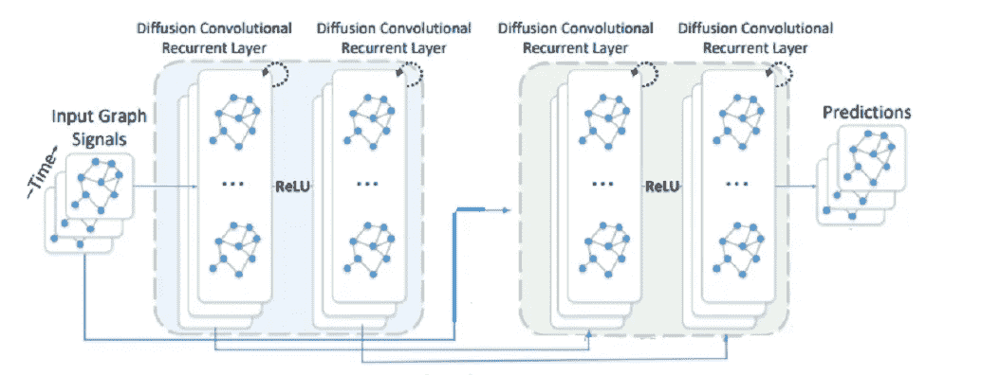

# 超越图卷积网络

> 原文：<https://towardsdatascience.com/beyond-graph-convolution-networks-8f22c403955a?source=collection_archive---------5----------------------->

## 深入探讨高级图形神经网络架构

图形神经网络虽然是一个相当新的概念，但作为一种有趣的分析图形的方法，即深度学习方法，已经获得了巨大的普及。GNNs 能够自然地适应许多具有固有图形结构的真实世界数据集，已经在许多不同的领域找到了应用，从在线广告到道路交通预测和药物设计。这篇博文:[图形神经网络的应用](/https-medium-com-aishwaryajadhav-applications-of-graph-neural-networks-1420576be574)列举了 GNNs 已经取得显著成果的各种领域。

早期的 GNNs 将通过以迭代的方式传播邻居信息来学习目标节点的表示，直到达到稳定的固定点。然而，GNNs 很难停留在这种初生的形式，它很快采用了其他成功的深度学习领域的想法，进化到我们今天所知的图形卷积网络的架构。

# 图形卷积网络

顾名思义，图卷积网络(GCN)，借鉴了卷积神经网络的思想，将它们重新定义为图的领域。至于图像，卷积框架的目的是捕捉图形节点的邻域信息。

Image Convolution and Graph Convolution

然而，gcn 有两种类型:光谱 gcn 和空间 gcn。基于频谱的方法通过从基于图形频谱理论的图形信号处理的角度引入滤波器来定义图形卷积。基于空间的方法将图卷积公式化为来自邻居的聚集特征信息。谱方法的一个缺点是，它需要同时处理整个图，这对于具有数十亿个节点和边的大型图(如社交网络图)来说是不切实际的。这种一起处理整个图形的要求带来的另一个缺点是，很难利用当今可用的并行处理能力。空间方法不受此影响，因为它们通过聚集相邻节点的信息直接在图形域中执行卷积。与采样策略一起，计算可以在一批节点中执行，而不是在整个图中执行，这有可能提高效率。

谱卷积方法的另一个痛点是，它们假设一个固定的图形，因此不能很好地推广到新的或不同的图形。另一方面，空间模型在每个节点上本地执行图形卷积，因此可以很容易地在不同的位置和结构上共享权重。由于所有这些因素，空间模型近年来吸引了越来越多的关注。

对于空间图形卷积，关键是学习函数 f，以通过聚合其自身的特征 Xi 和邻居的特征 Xj 来生成节点 vi 的表示。聚合函数必须是对节点排序的排列不变的函数，例如均值、求和及最大值函数。在特征聚合之后，诸如 Relu/Tanh 的非线性变换被应用于结果输出。为了探索节点影响范围的深度和广度，通常的做法是将多个图形卷积层堆叠在一起。每个隐藏的 GCN 层是聚合操作的一次迭代，随后是非线性激活。每个迭代/层使用来自前一个迭代/层的节点表示来获得当前迭代/层的表示。

GCN 的第一层促进一阶邻居之间的信息流动；第二层从二阶邻居，即从邻居的邻居获得信息。继续这样，通过堆叠多个层，每个节点的最终隐藏表示接收来自更远邻域的消息。

虽然 GCN 在节点级别上运行，但是图形池模块可以与 GCN 层交错，以将图形粗化为高级子结构。这种架构设计可用于提取图形级表示并执行图形分类任务。

由于 gcn 的效率不断提高，它们在许多应用领域产生了越来越好的结果，因此已经成为许多其他 GNN 模型的基准架构。

M ***超越 GCNs，*****以下是适用于各种不同问题类别的一些更复杂的图形神经网络架构的分类:**

**1.图形注意网络**

**2.图形自动编码器**

**3.图形生成网络**

**4.图形时空网络**

****

# **图形注意网络**

**注意机制几乎已经成为基于序列的任务的标准。注意机制有能力关注输入难题中最重要的部分。事实证明，这对于机器翻译和自然语言理解等任务尤其有益。由于注意力机制的模型容量增加，图形神经网络也可以受益于注意力模型。图形注意力网络类似于 GCNs，寻求聚合函数来融合相邻节点的表示、随机行走或来自多个候选模型的输出，以学习新的表示。关键的区别在于，图形注意力网络采用的注意力机制为更重要的节点、行走或模型分配更大的权重。注意力权重是通过端到端框架内的神经网络来学习的，该框架包括图形神经架构和注意力神经网络。**

**为了理解注意力机制如何应用于图结构数据，我们将看到如何使用注意力模型来聚集邻居节点信息以获得当前节点的表示。下图描述了不同之处:**

****

**在图(a)中，GCNs 在聚合过程中明确地将非参数权重 aij 分配给 vi 的邻居 vj，而图(b)中的图形注意力网络通过端到端神经网络架构隐含地捕获权重 aij，使得更重要的节点接收更大的权重。**

**类似地，对于基于随机行走的 GNN，不同的注意力权重被分配给不同的行走。图注意网络的优点是它们可以自适应地学习每个邻居的重要性。然而，由于必须计算每对邻居之间的注意力权重，计算成本和内存消耗迅速增加。**

# **图形自动编码器**

**图形自动编码器旨在通过编码器学习低维向量，然后通过解码器重建图形。这些向量可以是节点级的，即每个节点一个向量，生成图的密集低维矩阵表示，或者是图级的，即捕获图的所有结构和节点信息的向量。图形自动编码器是学习图形嵌入的一种流行方法，因为它们生成中间向量表示。**

**典型的解决方案包括利用多层感知器作为编码器来获得节点嵌入；解码器经由链路预测机制重建节点的邻域统计，例如节点之间的边。编码器可以捕获节点的一阶和二阶信息。对于平面图，很多算法直接对邻接矩阵进行处理，构造一个新的信息丰富的稠密矩阵。对于属性图，图自动编码器模型倾向于使用 GCN 作为编码器的构建块。图自动编码器模型的另一个变体涉及使用图生成机制(在下一节中讨论)从嵌入中重新创建图。**

**下图描述了图形自动编码器模型的一般结构:**

****

**编码器使用 GCN 层来获得每个节点的潜在表示。解码器计算由编码器产生的节点向量之间的成对距离。在应用非线性激活函数之后，解码器重构图邻接矩阵。以这样的方式训练整个模型，使得计算的节点向量之间的简单成对距离(随后是非线性运算)足以再现图的边信息。也就是说，编码器和解码器被联合训练，因此学习到的节点表示使得解码器能够补充编码器。**

**在训练之后，解码器模块可以被断开以仅产生向量，并且将它们用作图/节点嵌入，其可以被用作进一步下游处理的输入。**

# **图形生成网络**

**给定一个数据分布，图生成网络(ggn)的目标是根据特定的约束条件，从数据中生成合理的结构。也就是说，他们试图捕捉给定数据中隐含的实体及其关系，并试图将它们建模为图形结构。或者，给定一组观察到的图，ggn 可以尝试生成具有某些属性的新图。GGNs 的一个有前途的应用领域是化学化合物合成。在化学图形中，原子被视为节点，化学键被视为边。任务是在给定一组现有分子的情况下，发现具有某些化学和物理性质的新的可合成分子。GGNs 的另一个应用是在自然语言处理中，其中生成语义或知识图通常以给定的句子为条件。**

**然而，给定图的经验分布来生成图从根本上来说是具有挑战性的，这主要是因为图是复杂的数据结构。一种方法是将生成过程分解为交替形成节点和边。图的深度生成模型(DGMG)是这种方法的代表作品之一。DGMG 利用 GCN 来获得现有输入图的矢量表示。生成节点和边的决策过程以该向量为条件。DGMG 递归地向一个生长图提出一个节点，直到一个停止标准被唤起。在添加新节点后的每一步中，DGMG 反复决定是否给添加的节点添加边，直到决定变为假。**

**另一种方法是基于用于生成图像的生成对抗网络(GANs)。但是在对抗网络中，图卷积网络被用作构建块，而不是使用卷积神经网络。GAN 由一个生成器和一个鉴别器组成，两者相互竞争以提高生成器的真实性。首先，生成器从给定的数据分布中生成候选图。这个候选图通常被称为伪图。鉴别器的目的是从经验数据中鉴别出伪造的样本。此外，奖励网络可以与鉴别器并行引入，以鼓励生成的图拥有某些属性。鉴别器和奖励网络被馈送伪造图形的矢量表示；它们都单独输出一个分数，作为对生成器的反馈。以下是该架构的示意图:**

****

**上述两种方法的缺点是它们不能扩展到大的图，因为具有 n 个节点的图的输出空间是 n^2.**

# **图形时空网络**

**时空图是其中节点和/或边特征随时间 t 变化的图结构。例如，道路交通网络可以建模为图，其中每个关键位置是一个节点，并且该位置的传感器在多个时间步长内监控该位置的交通速度；因此，节点值(该位置的交通速度)会随着时间不断变化。边可以简单地是成对的传感器或位置节点之间的距离。使用道路网络的空间图的时间信息，可以预测时空图的节点的未来时间步的交通。**

**交通预测问题的一个变体是出租车需求预测问题，其在智能交通系统中具有非常实际的使用案例，智能交通系统预先分配出租车资源以满足出行需求并减少浪费能量并恶化交通拥堵的街道上的空出租车。鉴于优步和 Ola 等在线运输市场的繁荣，这一点尤其有用。在交通预测的情况下，关键位置可以建模为节点，具有诸如这些位置的交通和天气状况的特征:这些随着一天或一个月的时间不断变化。节点标签可以是特定区域中请求的出租车数量，这也随时间变化，问题是预测未来时间步长的这些值。**

**图时空网络的核心思想是同时考虑空间依赖和时间依赖。许多当前的方法应用 GCNs 来捕捉空间依赖性，以及一些 RNN 或 CNN 来建模时间依赖性。一种称为扩散卷积递归神经网络(DCRNN)的方法引入扩散卷积作为图形卷积来捕获空间相关性，并使用具有门控递归单元(GRU)的序列到序列架构来捕获时间相关性。DCRNN 使用图形(扩散)卷积层处理 GRU 的输入，以便递归单元同时接收来自最后时间步长的历史信息和来自图形卷积的邻域信息。DCRNN 的优势在于，由于递归网络架构，它能够处理长期依赖性。**

****

**在上面的部分中，我们回顾了一些高级图形神经网络架构，这些架构利用了深度学习领域中用于各种问题的先前成功的架构。几乎所有这些都使用图卷积作为构建模块。即便如此，这些复杂的架构更适合某些类型的图形和/或问题用例，因此产生更好的结果。随着 GCNs 效率的提高，我们将会看到更多这样的变化出现，GNNs 的分类也将不断增长！**

## **参考资料:**

**[https://arxiv.org/abs/1901.00596](https://arxiv.org/abs/1901.00596)**