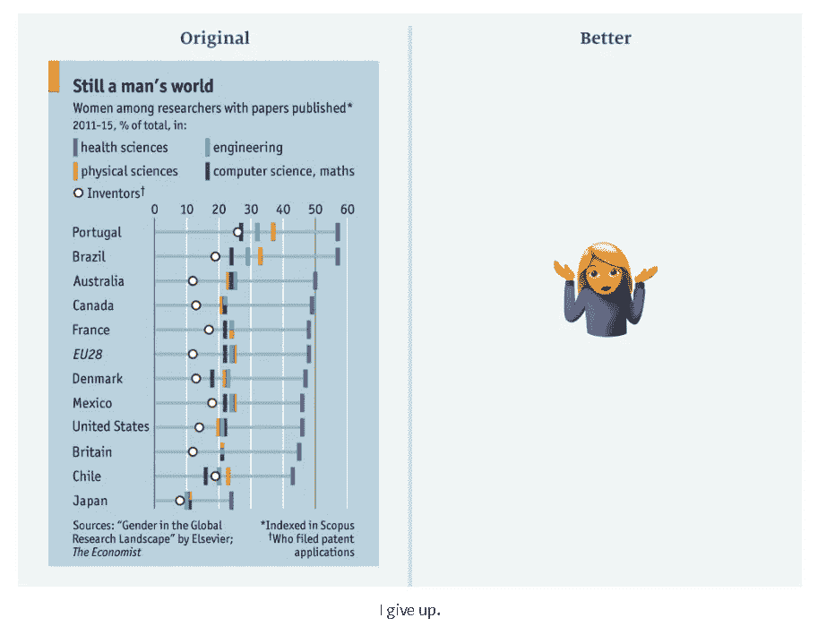
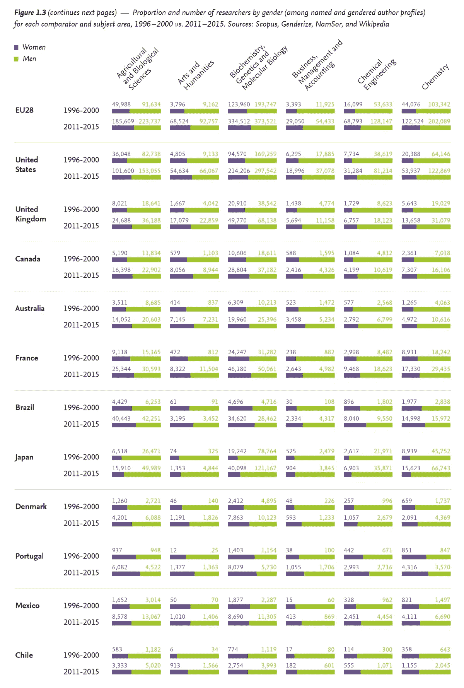
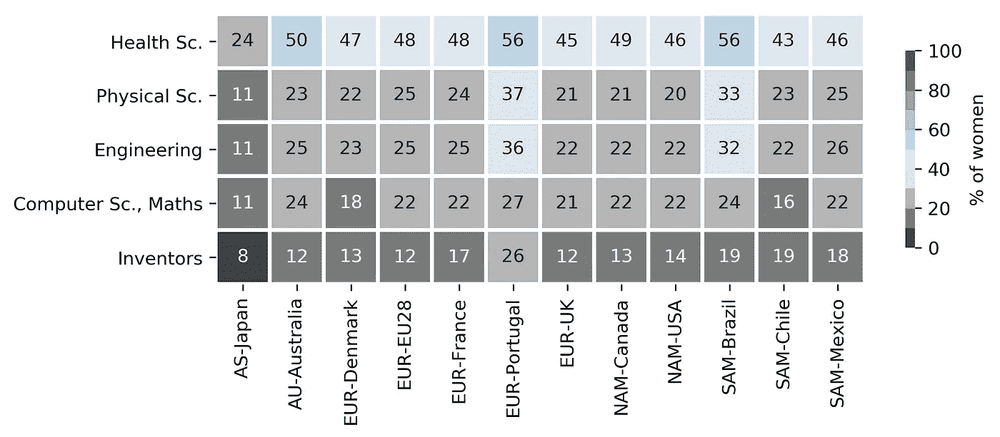
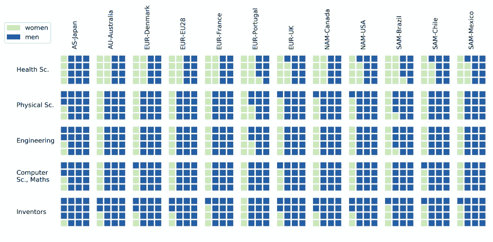
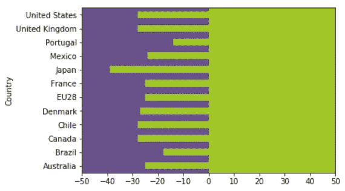
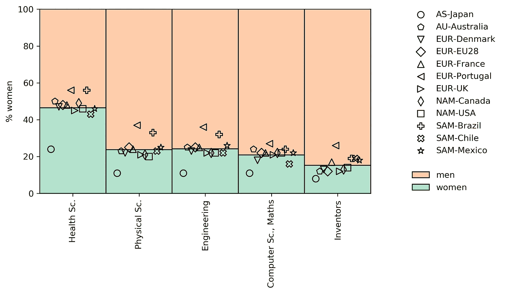

# 超越柱状图:在科学中可视化性别不平等

> 原文：<https://towardsdatascience.com/beyond-the-bar-plot-visualizing-gender-inequality-in-science-7d77f5a01953?source=collection_archive---------25----------------------->

Baby bar plots coming to life (pixabay/TK)

## 当你有来自 12 个国家超过 5 个维度的性别比例数据时，所有数据都显示“大约 25%”，你想在不去除复杂性的情况下制作一个引人注目的视觉效果，该怎么办？

《经济学人》的 Sarah Leo 最近写了一篇[有趣的文章](https://medium.economist.com/mistakes-weve-drawn-a-few-8cdd8a42d368)，她给出了一些图表的例子，这些图表是“ *(1)误导性的，(2)令人困惑的，(3)未能阐明观点的”*，以及她提出的修改意见。我对她的上一个例子很感兴趣，这个例子讲述了科学出版中性别失衡的故事，她没有提出更好的图表，而是征求意见。

Never give up! [(Source)](https://medium.economist.com/mistakes-weve-drawn-a-few-8cdd8a42d368)

我认为这种观想的主要问题是:

*   作为读者，**看着看着就要想太多**！没有明显的颜色或图标代码，没有明显的国家分组暗示潜在的模式
*   **对数据本身的解读不清晰** —学科(竖线标记)被塞进一个单轴上，由一条从 0 到“健康科学”的横线连接，而各行似乎是按横线的总长度排序的，这让我很困惑:点是标记整体的比例，还是单独的数据点？比方说，在葡萄牙，我看到 26%的人表示“发明家”，27%的人表示“计算机科学”，36%的人表示“工程”，等等，所有这些都是相关联的——所以我也可以这样理解:有 26%的发明家，27%-26% = 1%的计算机科学家，36%-27%=9%的工程师等等，这不是作者的意图
*   **扭曲** —水平刻度范围从 0%到 60%，因此“健康科学”的数据位于可见图的最右侧，其他数据点位于中间。这给人一种印象，即女性的比例比实际高得多
*   **无限潜能的幻觉**—蓝色水平线连接零点和数据点，而右边的空间呈现为空白。这给人一种错误的印象，即所绘制的只是一个 KPI，女性只要付出更多的努力，就可以提高和进一步提升。事实上，右边的所有空间都被填满了(而且是由男科学家填满的)

受 Sarah 的问题和评论部分一些有趣的评论的启发，我想出了其他可以说明文章要点的可视化示例，而没有遭受上面列出的问题。当我用 Python 制作这些图时，它们在美学意义上(字体、颜色等)还不能印刷。)，但它们传达了我提出的主要设计思想。如果你愿意，你也可以[查看代码](https://github.com/paniterka/dviz-various/blob/master/201904_genderequality.ipynb)。

## 数据和故事

首先，为了理解图中的主要信息，我看了看[《经济学人》](https://www.economist.com/science-and-technology/2017/03/11/science-remains-male-dominated)中的故事以及[Elsevier](https://www.elsevier.com/research-intelligence/campaigns/gender-17)的原始报告。虽然最初的报告(也可以使用一些图形改造)详细分析了科学和技术许多方面的性别失衡，但这篇短得多的文章专注于一个简单的信息，即在所有调查的领域和国家，男性仍然主导着科学出版。两种文本中的照明都非常依赖于水平条形图，其中一行对应一个国家。

Elsevier report: an endless forest of seemingly identical violet-green bar plots.

《经济学人》的总结很好地抓住了全局，并立即指出了可视化该数据集的明显问题:**所有这些数据看起来都相似**。因为大多数时候，无论哪个国家，哪个科学学科，男性始终比女性多得多。这意味着，当我们试图按原样绘制数据时，会有很多:

*   **视觉冗余** —绝大部分空间都用于一个类别，“男人”，例如以空白空间或充满单一颜色的大区域的形式。这有一个危险的后果:为了节省空间和墨水，人们很容易在印刷版中削减轴的限制，正如《经济学人》的原始插图中所发生的那样，女性比例从 0%上升到 60%，扭曲了数据的视觉解释
*   **令人困惑的重复**——因为我们展示了许多独立的图，但其中的数据看起来几乎相同

因此，在为摘要文章制作插图时，我们可以通过以下方式获得更清晰的图像:

*   **聚合学科** —通过识别诸如“STEM”、“生命科学”、“社会科学”、“专利申请”等集群，我们观察数据中的自然分组
*   **汇总国家** —这是一个棘手的问题，因为我们直觉上期望看到国家之间的差异，虽然我理解提供证据或惊喜的论点，但我仍然主张汇总。首先，我们不需要在视觉上展示一切——我们完全可以在文本中写下“性别最平等的国家是葡萄牙和巴西”。第二，基础数据实际上并不清楚国家类别的区别。我认为，总的来说，将这些伪国家聚集在一起比提供一个误导性的区分要好
*   **宁滨实际值**——因为对于普通观众来说，21%和 23%之间的差异真的很重要吗？重要的是 20%和 50%之间的区别
*   在**单独的图或插页**中对聚合趋势的有趣异常值进行评论

这种复杂性的降低可能会立即解决原始情节中存在的“数据过多”问题。另一个更重要的问题是为了节省空间而削减 x 轴的限制，这个问题可以通过与编辑的仔细协商来解决。

但是，我们能在不降低复杂性的情况下找到更清晰的数据表示吗？我们来实验一下！

## 提议 1:热图

在第一个建议中，我抛弃了条形图的概念，取而代之的是热图，这使得数据点之间的模式更加明显。在这里，我没有将值编码为长度，而是使用颜色及其强度，并将我的数据呈现为颜色矩阵，其中科学学科对应于行，而被大陆分隔的国家对应于列。

**颜色编码。**我最初想遵循 Elsevier 文章中使用的颜色编码，但我发现它给人的印象是错误的。爱思唯尔将绿色用于男性，绿色最琐碎的含义是“正确”，因此这里有 95%的绿色瓷砖表明绿色值实际上是理想值。相反，我选择了灰色，并武断地将 40%设定为一个阈值，在这个阈值上，我开始使用蓝色来突出性别最平等的国家和学科。我发现 40%是视觉冲击和数据解读之间的一个很好的折中。我还使用颜色以 10%的步长做宁滨，但是如果有人真的想知道确切的数字，它仍然在图上。

**几何。**通过旋转初始几何图形，将学科排列成行，我更强调学科因素，而不是地理因素。此外，因为这些国家是按洲排列的，所以矛盾的是更容易看出它们中的哪一个是突出的。

## 提议 2:华夫饼

这里我没有使用条形或颜色，而是使用了华夫饼干图来说明性别比例。学科之间的区别不像热图中那样明显，但对科学领域男女比例的总体印象更相关。我发现在一个华夫饼干中有 16 块瓷砖不仅是精确度和通用性之间的一个很好的折衷，而且给出了 2 个研究组的单个华夫饼干[大小。这种表现的缺点是它会触发](https://www.ncbi.nlm.nih.gov/pmc/articles/PMC4465944/)[赫尔曼网格错觉](https://www.illusionsindex.org/i/hermann-grid)。

**色彩。**我在这里纠结了一会儿。我发现同等强度的颜色传达出的一个群体优于另一个群体的印象不如不同强度的颜色好。我满足于给男人深蓝色，给女人浅绿色，这强调了男人仍然是大多数。我发现颠倒颜色——女性深蓝色，男性浅绿色——给人太多进度条的印象，在进度条上，浅色的瓷砖只是可以拿走的空瓷砖。但这也是一个品味问题。

Different waffle colorings.

## 提议 3:重塑酒吧情节

在这里，最初我想画一个有两个不同颜色区域的图形，一个区域“侵犯”了另一个区域，超出了平等的边界，但结果是，嗯，超级丑:

There is only that much ugliness a plt.axes() can take

所以我放弃了最初的想法，取而代之的是一个柱状图，但是重新发明了。

我再次把重点放在作为组织类别的学科上，并使用分散在一个学科中的各种形状的标记对不同的国家进行编码。为了更直观，我计算了各国的平均值，并画了一个条形图作为散点图的背景。关于特定国家的信息现在不太容易获得(如果图表是交互式的，标记选择得更仔细会更好)，但离群值仍然很容易识别。

我决定使用竖线，并对两种性别(不仅仅是女性)相对应的部分进行着色，这样就能唤起一种重力的直觉，并在地块的上半部分放置一些重物，推动绿色和橙色区域之间的边界。

## 结论

对我来说，这是一次有趣且富有创造性的旅程，我希望我的结果能给你带来灵感！主要的信息是，条形图很容易想到，但是还有一大堆其他类型的图可以尝试。请在评论中告诉我你的想法。

一方面，科学家在国际上流动性极大，另一方面，要找出哪一个是可能影响科学界女性与男性比例的主导因素并不容易:是原籍国，还是现居国？报告本身的数据在给国家贴标签方面也不完美。原始数据来自 Scopus，性别归因于基于名字的科学家的名字(前提是他们输入完整的名字，而不仅仅是名字的首字母)，国家被设置为由给定个人的第一篇论文的从属关系决定(遵循的逻辑是，人们主要在他们的原籍国发表他们的第一篇论文——这本身是一个有争议的假设，但不是完全不合理的)。但这意味着标有“法国”的柱状图并没有真正反映在法国工作的科学团体中的性别平衡，读者可能会如何解读它。相反，它告诉我们在法国发表第一篇论文的科学家中有多少人，无论他们的文化背景或目前的关系如何。