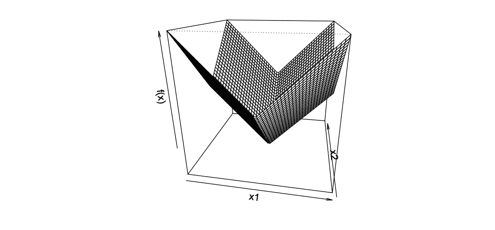
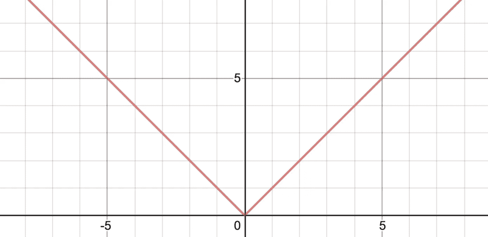
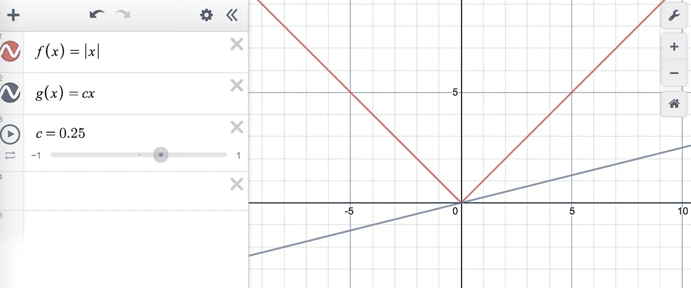
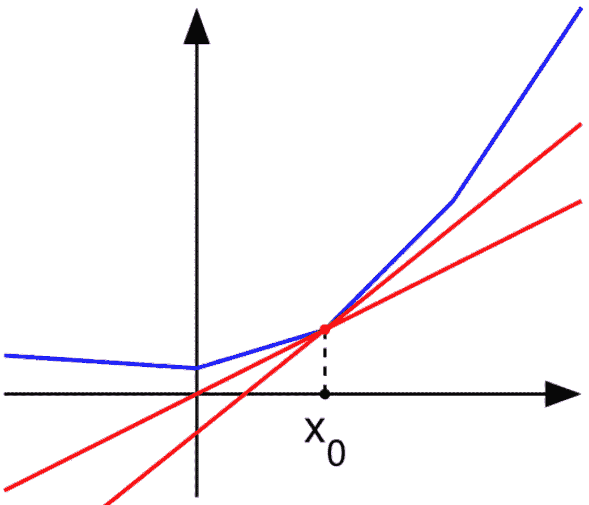

# 超越导数——次导数

> 原文：<https://towardsdatascience.com/beyond-the-derivative-subderivatives-1c4e5bf20679?source=collection_archive---------23----------------------->

## 机器学习技术通常依赖于可微函数，但实际情况很少如此。我们能做些什么呢？

Not every function is so nice!

# 介绍

如果你已经克服了理解机器学习的最初几个障碍，那么你很可能听说过一种被称为**梯度下降**的技术。

当谈到最小化一个函数 *f* 时，我们可以用下面的规则更新我们对最小值 *x* 的猜测:

Old faithful (gradient descent).

这一切都很好，但往往有一个重要的细节被掩盖了。我们的函数 *f* 需要**可微**，这意味着我们可以计算它在所有可能的点 *x* 的导数。

**停下来问自己:**这是我们真的可以掩盖的细节吗？我是说，大多数函数都是可微的吗？退一步说，所有可能函数的空间是巨大的，你可能在街上遇到的典型函数可能是相当讨厌的。事实上，几乎每个函数在一个点上都是不可微的！这仍然是[即使你限制为连续函数的情况。](http://homepages.math.uic.edu/~marker/math414/fs.pdf)

# 损失函数的可微性

如果你有足够的勇气点击那个链接，那么你会很快意识到我们正在进入技术领域。但这不是重点——希望我们能在这里阐明这一点。

记住，在机器学习中，正在优化的函数通常是**损失函数。**我们来看一个简单的损失函数:绝对值函数。

f(x) = |x|, absolutely.

如果你已经有一段时间没学微积分了，那么记住导数的一种解释是该点切线的*斜率。*

绝对值函数是**不**可微的函数的典型例子，特别是在点 *x =* 0 处。

如果你看看其他损失函数，你可能会惊讶地发现它们也是不可微的。那么是什么原因呢？

技术性的是，对于机器学习问题，我们真的只需要我们的损失函数在几乎每一点都是可微的。这实际上是一个技术术语，它被称为几乎处处可微。

但这仍然只是一个小小的修正。如果我们想把像梯度下降这样的东西推广到**不可微的函数上呢？**

# 定义次导数

如果你回头看看绝对值函数，你可以给出一个关于为什么它在 *x =* 0 处不可微的论点，因为在那一点没有唯一的切线斜率。

把在 *x* = 0 处的函数想象成一种尖边，然后你可以想象一大串不同斜率的线接触原点。

Play with this graph [here](https://www.desmos.com/calculator/shg8v05ven)!

让我们从切线斜率的概念出发，推广导数的概念。

**次导数**是导数的延伸。与导数不同，次导数不仅仅是一个数字，而是一个点的集合。形式上，一个点上的次导数是位于图中该点下的所有切线的斜率集合。

看一看。在下图中，点 x_0 处的函数(蓝色)至少有两条切线(红色)位于图形下方。这些切线的斜率构成了次导数。

The subderivative at a point is **all slopes** that lie beneath the graph.

它所要求的只是函数是*凸的*，这意味着在图上的任意两点之间画一条线保持在函数的同一侧。

为了把我们刚才所说的放到一个正式的定义中，我们可以把在一个点上的次导数(或次梯度)定义为:

这里使用了用于偏导数的相同符号，但是在这个上下文中，它用于表示点的集合，而不仅仅是单个值。

# 含义

那么现在我们已经定义了什么是次梯度，我们能继续修改梯度下降来得到…次梯度下降吗？事实上，我们可以！

有许多[方法](https://en.wikipedia.org/wiki/Subgradient_method)使用次导数作为导数的替代，我不会阻止你自己去寻找这些方法。

随着机器学习技术变得越来越复杂，它们将更有可能依赖于不可微的损失函数和优化。因为我们仍然想解决这些问题，所以我们有可行的技术来处理这些情况变得更加重要。

如果你想了解更多关于次梯度的知识，这里有很多关于它的好的幻灯片。这将是相当技术性的，但这不应该阻止你浏览或至少看漂亮的图片和方程！

一如既往，欢迎在下方评论联系！过去我真的很高兴收到人们的来信，这有助于我聚焦未来的文章！