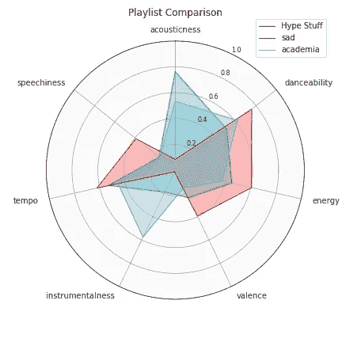
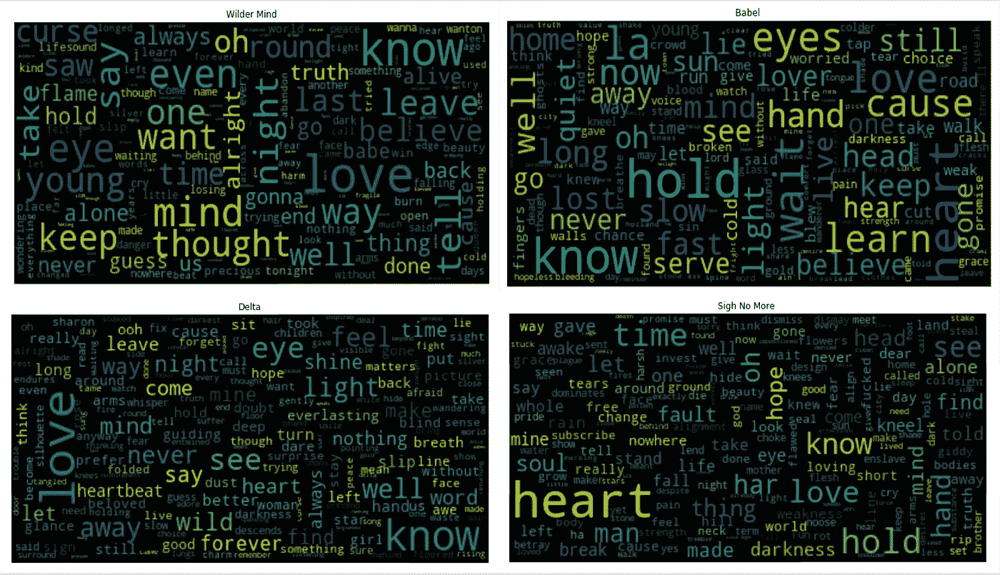
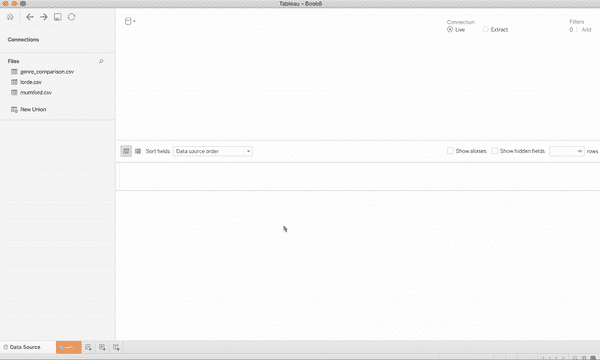
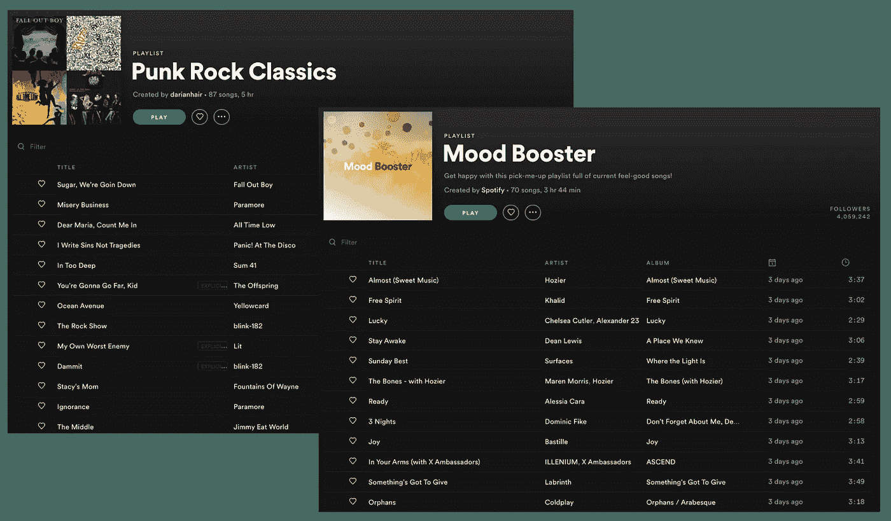
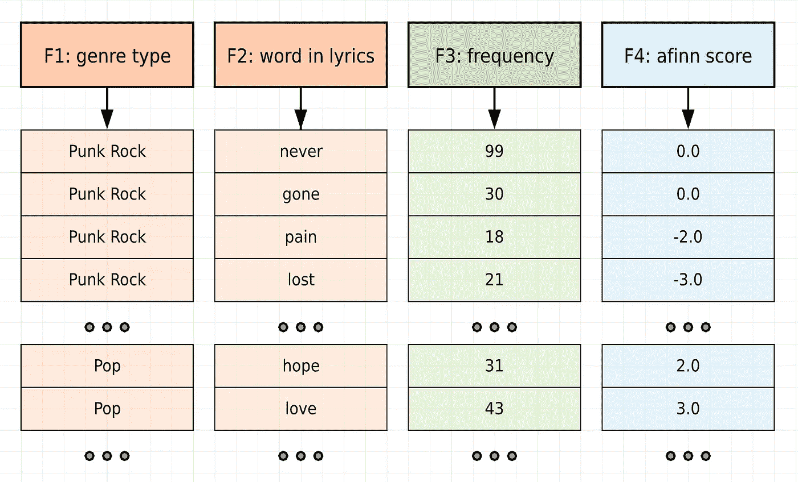

# 超越歌词:音乐和数据可视化的交集

> 原文：<https://towardsdatascience.com/beyond-the-lyrics-the-intersection-of-music-and-data-visualization-4a71039f447c?source=collection_archive---------26----------------------->

## 使用 Spotify API 和 Tableau 对歌词进行情感分析

关于数据科学，我最喜欢的事情之一是偶然发现一些最酷、最强大的工具，这些工具能让我立即做一些酷而强大的事情。我最近创建了一个 Spotify 开发者账户，学习了如何抓取歌词，了解了情感分析、词云以及其他 NLP 概念，并自学了如何使用一款名为 Tableau 的出色的交互式数据可视化软件。最重要的是，我有一个长长的清单，上面列有我接下来要处理的进一步的项目。

这两篇媒体文章帮助我朝着一个富有成效、不断向前发展的方向前进，如果我不给予它们信任，那将是我的失职。第一个名为“通过 Python 提取你最喜欢的艺术家的 Spotify 数据”，由 Rare Loot 提供。第二个叫做“Tableau 中的单词云:快速和简单”,作者是我最喜欢的数据科学作者之一 Parul Pandey。

[](https://medium.com/@RareLoot/extracting-spotify-data-on-your-favourite-artist-via-python-d58bc92a4330) [## 通过 Python 提取您最喜欢的艺术家的 Spotify 数据

### Spotify 是世界上最受欢迎的流媒体平台之一。他们也有一个 API 供开发者使用…

medium.com](https://medium.com/@RareLoot/extracting-spotify-data-on-your-favourite-artist-via-python-d58bc92a4330) [](/word-clouds-in-tableau-quick-easy-e71519cf507a) [## Tableau 中的单词云:快速简单。

### 使用 Tableau 轻松创建单词云。

towardsdatascience.com](/word-clouds-in-tableau-quick-easy-e71519cf507a) 

# 创建雷达图，根据音频特征比较播放列表

在我从 Spotify 检索到我的客户 id 和客户秘密后，我想处理一个迷你项目来熟悉 API。我快速浏览了 [Spotify 开发者发现页面](https://developer.spotify.com/discover/)，从社区成员已经开发的应用中获得灵感。我个人最喜欢的是[播放列表](https://playlistsouffle.com/)和[艺术家探索](https://artist-explorer.glitch.me/)。

然后我读了一篇关于这个神秘的名为 spotipy 的库的文章，有了这样一个完美的名字，你可能会猜到我的下一步是什么……是的，一个不错的老 pip 安装。spotipy 库使您能够提取音频特征(例如，声音、能量、速度、舞蹈性、活力、响度、乐器性、语速、效价等。)来自任何给定的歌曲。这些词中的一些听起来可能是编造的(确实是)，但这些音频功能实际上可以告诉你关于一首歌的很多信息，我很快就会知道。

所以唉，我开始摆弄一些代码。我从中获得灵感的第一篇嵌入式媒体文章向读者展示了如何提取你最喜欢的 Spotify 艺术家的特征数据。我想通过将一种音乐风格的内聚播放列表与另一种完全不同的音乐风格的内聚播放列表并列显示来偏离这个用例。我决定对比一个我有时无耻地听的悲伤播放列表(叫做“sad”)，一个我 18 岁的弟弟做的最绝对不悲伤的播放列表(叫做“Hype Stuff”)，一个我学习时听的器乐播放列表(叫做“academia”)。

设置如下所示:

```
import spotipy
import numpyusername = 'YOUR-SPOTIFY-USERNAME'
client_id  = 'YOUR-CLIENT-ID'
client_secret = 'YOUR-CLIENT-SECRET'
client_credentials_manager = SpotifyClientCredentials(client_id=client_id, client_secret=client_secret)
```

接下来，我为三个播放列表中的每一个制作了一个 Spotify URIs 列表，并提取了每首歌曲的音频特征，将它们放在一个字典中，播放列表名称作为键，特征数据列表作为值。如果你有兴趣看代码，看看下面的要点。

现在，有趣的是。下面是获取这些特征值并制作雷达图的代码。



rap music vs. sad music vs. instrumental music, all on one radar graph

如果你对 spotipy 库如何分析音乐以提取特征感到好奇，请访问[此链接](https://developer.spotify.com/documentation/web-api/reference/tracks/get-audio-features/)了解更多关于这些特征的信息。我最终只在我的雷达图上包括了 7 个特征，因为我对活跃度、响度或受欢迎程度不感兴趣。活跃度和响度不能告诉我任何关于音乐的深刻见解，流行度太主观了，无法推断出任何意义。

我认为除了化合价和能量，所有的特征都是不言自明的。配价描述了一首曲目所传达的音乐积极性。高价曲目听起来更积极(例如，快乐、愉快、欣快)，而低价曲目听起来更消极(例如，悲伤、沮丧、愤怒)。对 rap 播放列表的价值要有所保留，因为我不确定这个功能更依赖于抒情内容还是节奏。能量是一种从 0.0 到 1.0 的度量，代表强度和活动的感知度量。通常，高能轨道感觉起来很快，很响，很嘈杂。例如，死亡金属具有高能量，而巴赫前奏曲在音阶上得分较低。很准确，对吧？这些描述可以很好地检查您生成的任何数据可视化。

上面的雷达图允许我们对每个播放列表的关键特征进行瞬间推断。例如，说唱音乐的节奏最快，说话最多，活力和舞蹈性得分最高。你可能想坐下来看下一个观察:器乐播放列表有最高的器乐分数，悲伤播放列表有最高的音响分数。尽管图表告诉我们人们可以很容易地对被检查的播放列表做出什么样的假设，但是想象一下研究你的“每周发现”播放列表是如何随着时间的推移而变化的，或者其他一些稍微模糊的事情。雷达图不仅强大，而且是一种艺术形式。成功制作它们的过程会让你觉得自己是一个超级老练的程序员。当您觉得已经从类似下面代码片段的 matplotlib 基础中毕业时，您应该继续学习雷达图。

```
import matplotlib.pyplot as plt
x = list(range(10))
y = list(range(10))
plt.plot(x, y)
```

当执行一个从概念到可视化的项目时，Python 和 matplotlib 一直是我的面包和黄油，但我渴望一些与我的技能相关的新东西，一些需要学习、黑客和修补才能达到最终目标的东西。进入 Tableau。我在 LinkedIn 上看到过无数的招聘信息，称 drop Tableau 是一项理想的资格，但我从来不知道它是什么，也不知道它有什么了不起。所以我做了一些功课，了解了它的功能。我得出的结论是，它最适合我的需求，因为它能让我更好地控制我的数据可视化，我认为这是这个项目最重要的方面。

最近在我的大数据课上学习了自然语言处理(NLP)技术后，我想看看我是否能从歌词中获得一些见解。我找到了一个名为 PyLyrics 的图书馆，只要你知道歌曲名和歌手，你就可以从任何一首流行歌曲中找到歌词。然后，我重新利用了一个旧脚本，将歌词整理成一个有用的单词列表。

# 用 Tableau 研究同一艺术家不同专辑的抒情内容

我想分析同一位艺术家不同专辑的抒情内容。我对研究蒙福之子乐团特别感兴趣，因为我认为他们的每张专辑都有一个非常集中的主题。此外，毫无疑问，蒙福之子乐团一直是我父亲最喜欢的乐队，所以我从小就学会了如何演奏“空气班卓琴”,并将他们的音乐放在心里。对于不知道的人来说，他们是一支英国民谣摇滚乐队，声音非常鲜明。主唱马库斯·芒福德(Marcus Mumford)经常被描述为拥有来自深深的激情和情感的严肃而沙哑的嗓音。


A photo of Mumford & Sons performing live and Marcus Mumford rocking out on the guitar

乐队的专辑 *Wilder Mind* 收录了名为“狼”、“怪物”、“蛇眼”和“宽肩野兽”的歌曲，但人们可能会说，他们所有歌词的核心都是这个强有力的爱情主题。另一方面，他们最近的专辑 *Delta* ，表达了空虚和渴望。它的特点是歌曲名为“指路明灯”，“画你”，“如果我说”，“女人”，“心爱的”，“溜走”。仅仅是歌名的并列就足以让我全力投入这个情感分析项目。我着手制作一个歌词的可视化，展示两张专辑之间的鲜明对比。

单词云是一种快速了解文本语料库中使用的单词的有趣方式，所以我做的第一件事是筛选歌词，并进行非常严格的数据清理。数据清理过程包括以下步骤:

1.  将所有单词设为小写
2.  删除停用词(注意:停用词是指“the”、“is”、“are”等词。).
3.  删除标点符号，特别是带括号、省略号、逗号、句号、感叹号等的单词。
4.  删除号码
5.  删除长度小于 2 的单词，因为空字符串和单字符单词不应出现在语料库中

Here is the code you will need to clean any given corpus before making a word cloud

一旦完成，我就根据单词是从哪个专辑中提取的，制作了一个语料库词典(“语料库”的复数)。我使用一个计数器对象来获取每个语料库中每个单词的频率，然后将数据写入一个逗号分隔值(CSV)文件，稍后我会将该文件导入 Tableau。CSV 文件是根据下面提供的示意图构建的。


Schematic of column / variable layout of the CSV file that was imported into Tableau

当我在 Jupyter 笔记本上准备好所有可用的数据时，我使用 Python wordcloud 库为每个按相册分组的语料库生成了一个快速的单词云。你可以在下面看到结果。有趣的是,“爱”和“心”这两个词不难在下图的 4 个支线剧情中找到。每张专辑都有自己独特的高频词，非常有趣，让我们能够推断主题。



我仍然希望对我的单词云有更多的控制。我希望能够控制每个单词的颜色和大小——如果我真的想疯狂的话，甚至可以控制形状。所以我在我的桌面上启动了 Tableau，并摆弄它，直到我产生了一个我满意的可视化效果。如果你对我做了什么感到好奇，可以看看下面的 GIF。



Step-by-stop process of producing a word cloud in Tableau


Final result for Mumford & Sons lyrical word cloud by album

在上面的单词云中，可以看到各种蒙福之子乐团歌词中所有最常见的单词。每个词都被指定了一种颜色，这种颜色与歌词所属的专辑相关联(参见右侧的图例)。关于这个图有趣的一点是，最突出的词是“爱”和“心”，如果你观察足够长的时间，你可能会发现这些词多次出现。Wilder Mind 专辑包含了许多怪物和野兽的图像，像“眼睛”和“思想”这样的词跃然眼前。 *Delta* ，另一方面，包含像“永远”、“光”和“永恒”这样的词。这种通过简单观察哪些词突出来进行的内在情感分析表明，像词云这样的工具可以非常有力地帮助我们了解音乐。此外，研究的迫切需要——研究同一位艺术家不同专辑中的主题——可以用实际的歌词数据来探索，而不仅仅是音乐行业中知识渊博的专家。

# 使用 Tableau 基于情感分数比较流派

上一个项目涉及制作一个可视化的图像，以更有见地的方式检查歌词，但我意识到 CSV 文件实际上可以保存更多的变量，进一步告诉我们一些关于歌词的信息。例如，如果我们使用情感分析来研究给定歌曲子集中的词有多积极或消极呢？然后我们可以潜在地使用机器学习来根据歌曲的情感分布将歌曲分类成一个流派。好吧，我们先别得意忘形，但这一切都很有希望。

为了建立案例研究，我查看了两个流行的 Spotify 播放列表:Mood Booster 和朋克摇滚经典。我选择这两个播放列表没有别的原因，只是因为在我看来，它们在情感上截然相反。



Where the data actually comes from

流行音乐通常是关于爱情、金钱、聚会等的。，所以我们可以说歌词触及的话题通常比朋克摇滚乐轻松。我们可以得出的另一个有趣的对比是音乐创作的时间段。两个不同播放列表的歌曲集之间平均有十年的差距，所以这可能与我们将在可视化中看到的内容有关。

除了一个新元素:afinn 分数之外，我按照与前一个子项目几乎相同的过程收集数据。由 Finn RUP Nielsen 开发的 afinn 库提供了一种基于单词列表的 Python 情感分析方法。前提是，它将所有单词放在光谱的某个位置，其中-5 是可能存在的带负电最多的单词，0 是中性的，+5 是可能带正电最多的单词。如果你好奇，可以使用这个[网络应用](https://darenr.github.io/afinn/)来感受一下它是如何工作的！

为了产生我为这个项目设想的 Tableau 可视化效果，我需要在我的 CSV 文件中增加一列(F4)。下面是新数据设置的示意图。请注意，列 1 (F1)现在包含流派类型，而不是专辑名称。然而，其他的一切都是完全一样的，所有相同的清理都必须完成，以获得不可避免地会填充新单词云的单词。



Schematic of column / variable layout of the CSV file that was imported into Tableau

既然你已经对单词云以及如何制作单词云有了很好的理解，我就不再赘述 Tableau 中的相同步骤了。让我们看看视觉效果吧！


Side-by-side comparison of word clouds for different genres, colored by sentiment score

如上图所示，与“情绪助推器”播放列表相比，“朋克摇滚经典”播放列表中的负面词汇明显更多。在“情绪助推器”播放列表中唯一高频出现的负面词是“地狱”一词，情绪得分为-4.0。显然，它也出现在许多朋克摇滚歌曲的歌词中。也就是说，朋克摇滚歌曲不纯粹是焦虑或充满负面情绪。歌词中提到了“爱”、“希望”、“想要”和“希望”。不过，总的来说，分析这两个词云非常有趣，尤其是在过滤掉频率小于 10 的词之后。

我希望我能解决的一个很大的限制是必须产生两个独立的单词云并并排比较它们。我的目标是有一个单词云，并根据两个不同的变量给单词着色:一个是流派(存储在 F1 中)，另一个是 afinn 分数(存储在 F4)。我从来都不知道如何为一个图制作两种不同的色谱，但这仅仅是我制作 Tableau 的一个起点。

# 如何在家里尝试这个

如果你有兴趣复制这些项目中的任何一个，或者将这些工具提升到一个新的水平，所有的代码都可以在我的 GitHub 资源库中找到，关于这个项目:[https://github.com/sejaldua/lyrical-sentiment-analysis](https://github.com/sejaldua/lyrical-sentiment-analysis)。代码在名为 public_code.ipynb 的 Jupyter 笔记本中进行了清晰的组织和注释。如果您有任何问题，请随时通过 sejaldua@gmail.com[与我联系。](http://sejaldua@gmail.com)

# 结束语

如果你从这篇文章中学到了什么，我希望那就是从数据科学的角度研究音乐是一项无限的努力。还有音频特征提取、抒情情感分析、聆听行为等等，都在等待检验。还有许多不同的数据镜头和技术可以让你探索音乐。Spotify API 是一个真正的幸事，Tableau 使数据可视化看起来比你我都知道的要干净和容易得多。凡是你感兴趣的，就开始玩，然后用你的发现讲个故事。感谢您阅读我的第一篇文章！

如果你有兴趣了解更多我的作品，我欢迎你关注我的网站(【https://sejaldua.com】[)和/或 GitHub(](https://sejaldua.com))。