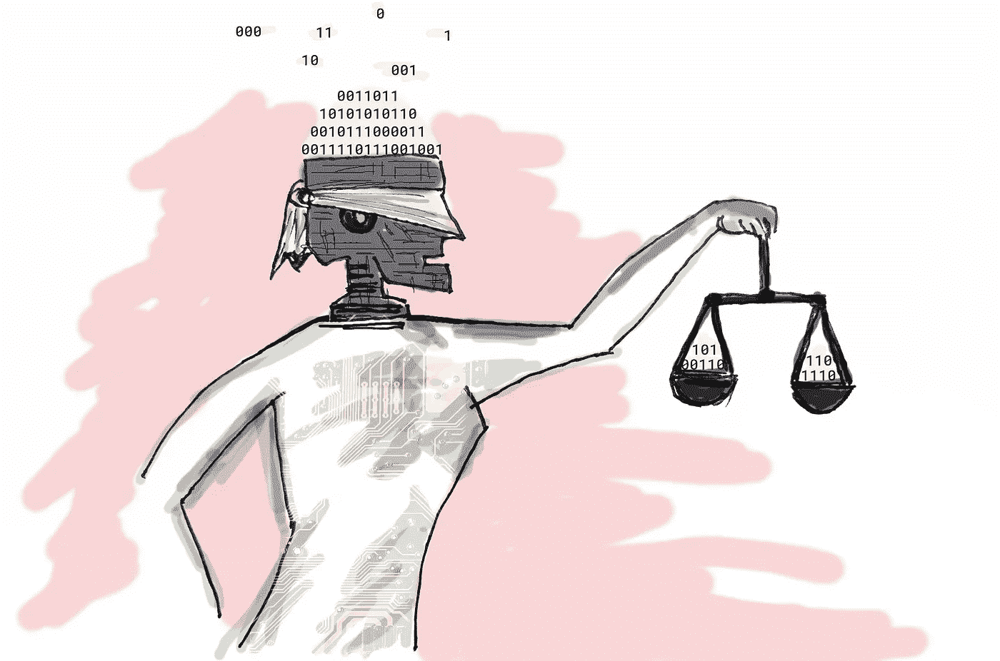
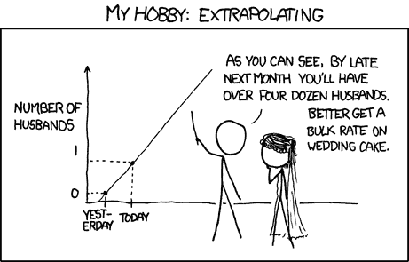
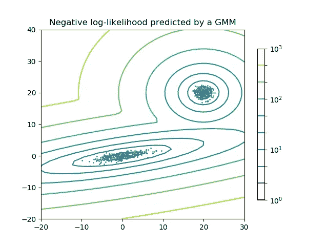
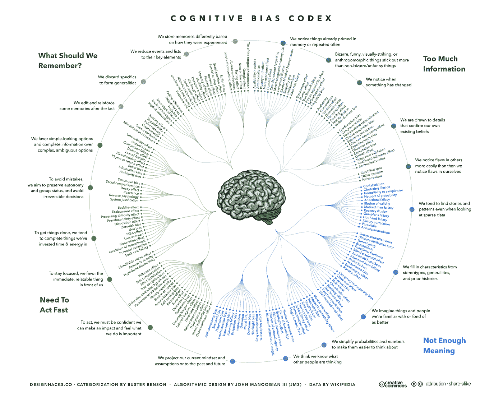
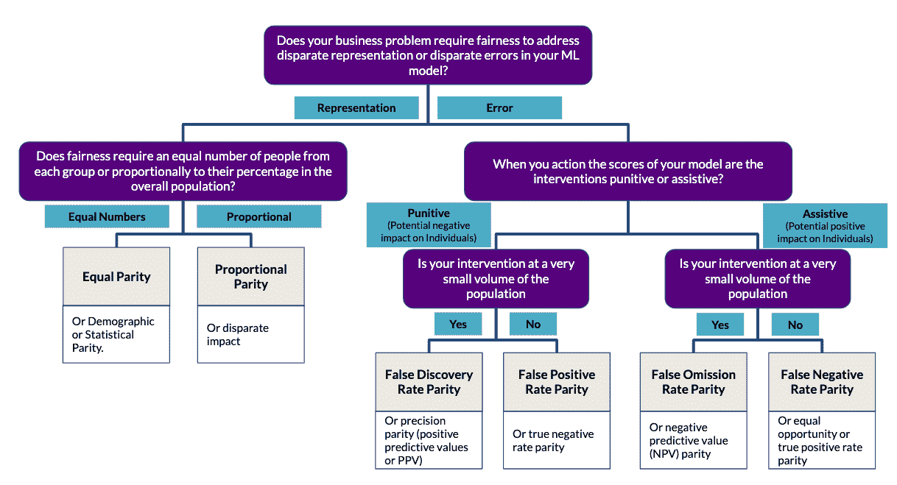
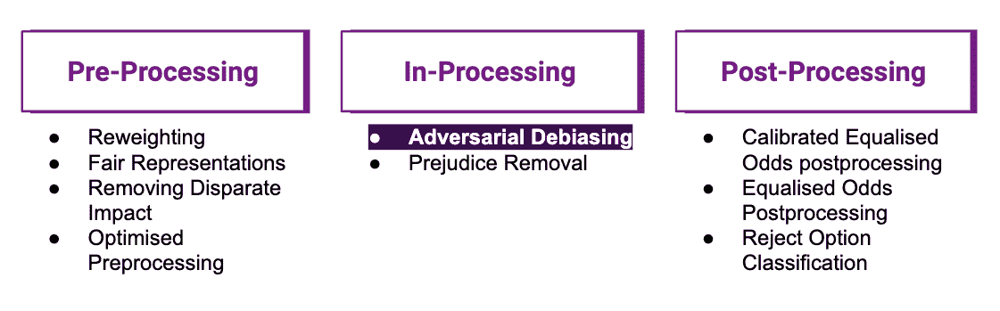
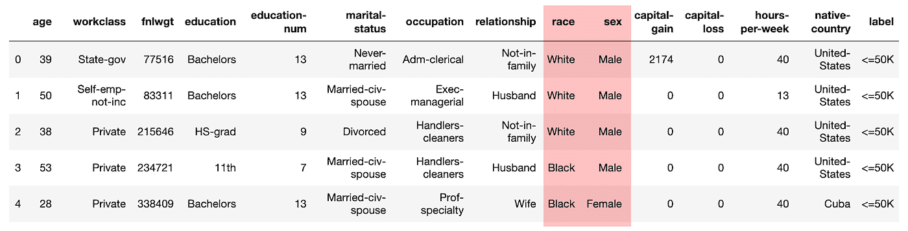
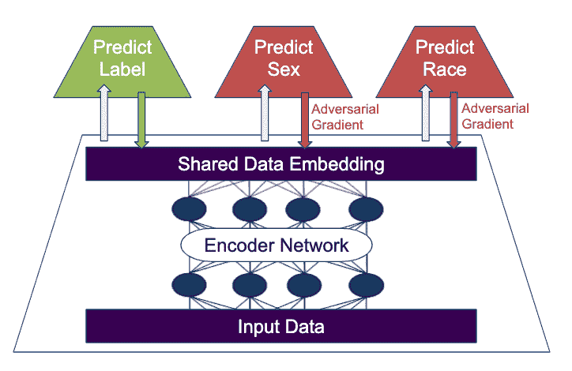
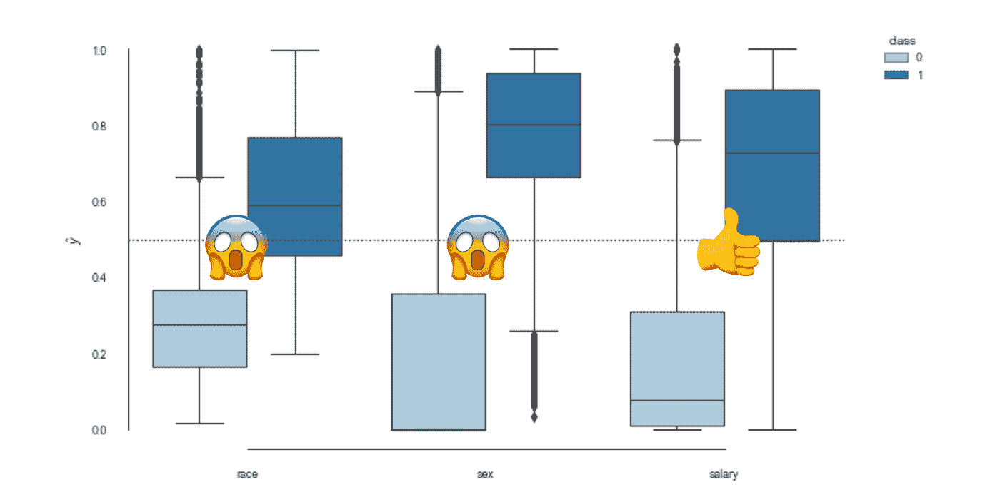
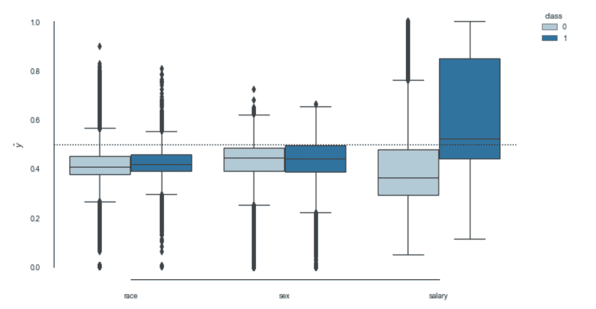

# 偏见和算法公平

> 原文：<https://towardsdatascience.com/bias-and-algorithmic-fairness-10f0805edc2b?source=collection_archive---------7----------------------->

## *现代商业领袖在由数据统治的全新世界中的新责任。*

随着数据科学沿着炒作周期前进，并作为一项业务功能变得成熟，该学科面临的挑战也在增加。

过去几年，数据科学的问题陈述从“我们浪费了 80%的时间来准备数据”，到“生产部署是数据科学最困难的部分”，再到“缺乏可衡量的业务影响”。

但是，随着商业数据科学符合业务功能并克服早期问题，我们面临着新的挑战性问题陈述:

*   **数据伦理，**
*   **模型可解释性和问责制，**
*   **算法公平性**。

虽然数据科学家和商业领袖可以在很大程度上依赖技术进步来解决第一轮数据科学初期问题，但希望技术独自解决这些新挑战是错误的。

我个人承认，在如何使用数据方面，我天真了太久，在如何解决这个问题上，我被误导了。我不能一个人进去？

这不是一个学术上和法律上的全面讨论，而是我个人的经历和旅程的记录。为了更详细地了解人工智能中公平和问责的法律含义，我建议跟随桑德拉·沃希特博士并阅读，例如，“[合理推理的权利:重新思考大数据和人工智能时代的数据保护法](https://www.law.ox.ac.uk/business-law-blog/blog/2018/10/right-reasonable-inferences-re-thinking-data-protection-law-age-big)

# 黑盒没了吗？

我经历了对数据科学作用的理解的第一次挑战，当时逐渐消退的宣传再也不能为机器学习黑盒开脱。模型可解释性从一个意想不到的方向进入了我的思维:我的涉众。利益相关者比大多数数据科学家更关心模型的详细工作原理！这并不意味着我没有意识到黑匣子，但我是从降低风险的心态来处理它的。(交叉验证、对模型输入和输出的广泛测试、日志记录和监控、对模型使用的限制、诚信、快速失败和再次尝试……)

我过去和现在都认为数据科学是生产中的实验。虽然我以前认为黑盒只是需要安全措施来确保预测有意义，但我现在明白了为什么一些模型的可解释性不仅是为了问责，也是为了对预测有意义有实际信心。为了限制 ML 黑盒的**人工愚蠢**，我们需要模型可解释性来定义何时对表现良好的输入数据进行评分是安全的，何时最好不要对之前未看到的输入数据进行评分。

**对于决策空间的插值，最大似然法是非常适合和强大的。不幸的是，使用 ML 将决策推断到新的和看不见的数据的不安全领域太容易和诱人了，这些数据从来不是模型训练和模型验证的一部分。**

[**https://xkcd.com/605/**](https://xkcd.com/605/)**, (CC BY-NC 2.5)**

虽然 ML 黑箱在我的日常工作中只是一个灰箱，但模型可解释性给我提供了所需的信心，并提高了我们的能力**约束人为的愚蠢**，将我们的模型保持在充分理解的安全措施内。这意味着有时不提供分数更好。

[Scikit](https://www.google.com/url?sa=i&source=images&cd=&cad=rja&uact=8&ved=2ahUKEwiW45rBooDlAhVFJBoKHdhsDNMQjhx6BAgBEAI&url=http%3A%2F%2Fscikit-learn.org%2Fstable%2Fmodules%2Fmixture.html&psig=AOvVaw38TRN5Wp0pRmqLDX7USmfB&ust=1570198236469560)

实现这一点的一个非常简单但非常强大的方法是，在你的训练数据上拟合一个独立的**高斯混合模型**，作为你的决策空间的置信边界。如果模型输入不在 GMM 的置信边界内，就不要返回模型输出。

目前，一方面，我希望数据科学领域的科学和技术进步将进一步解决模型可解释性问题，另一方面，作为一名数据科学家，我很乐意承担模型可解释性的责任。

# 偏见

虽然模型可解释性是商业数据科学功能本身所拥有的责任，但是数据伦理和算法公平不能仅仅由数据科学拥有！为什么？因为公平的模型是对精确模型的权衡，达到这种平衡意味着高级领导的责任。希望当你看到文章结尾的总结时，这开始变得更有意义。

事实是，任何从人类行为中产生或导出的数据点，本质上都受到我们人类似乎无穷无尽的偏见的影响。仅举几个例子:

**群体内偏好和群体外消极**:对我们自己社会群体中的人的偏好，而不是对惩罚或给群体外的人施加负担的偏好。在偏见和歧视中起重要作用的偏见。

**基本归因错误**:当我们倾向于将某人的行为归因于其性格的内在品质而非情境背景时。

负面偏见:当我们强调负面经历多于正面经历，这对社会判断和印象形成有重要影响。

**刻板印象**:当我们期望一个群体中的某个成员具有某些特征，却没有这个人的实际信息。

**从众效应**:当我们做或相信一些事情，因为许多其他人也这样做。

偏见盲点:我们看不到自己个人偏见的倾向。

我们所有的数据都是有偏见的，因为这个世界是有偏见的。

## 修正世界上的偏见超出了数据科学家的工作范围。然而，不要用 ML 模型来加强现有的偏见是一个数学问题，并且很快从纯粹的道德义务转变为现代数据科学家的工作要求。

解决数据科学中的偏见是一个极其复杂的话题，最重要的是，没有通用的解决方案或灵丹妙药。在任何数据科学家能够致力于减少偏差之前，我们需要通过参考以下**公平树**来定义我们业务问题环境中的公平:

The Fairness Tree, Adapted from [http://www.datasciencepublicpolicy.org/projects/aequitas/](http://www.datasciencepublicpolicy.org/projects/aequitas/)

根据您的业务问题导航公平树绝非易事。举个例子(改编自这里的)假设你想设计一个 ML 系统来处理**抵押贷款申请**并且只有一小部分申请是由女性提出的。

1.  **群体无意识选择**:我们在申请过程中完全忽略性别信息。因为贷方可能批准的数量有限，所以这些批准会根据客观的、性别中立的标准授予最有资格的个人。但是，删除性别和性别代理信息并不能解决历史偏见，通常也不是一个非常有效的减轻偏见的过程，正如我们将在下面美国人口普查数据的实例中看到的那样。
2.  **调整后的群体阈值**:由于历史偏见使得女性看起来不如男性值得贷款，例如工作经历和育儿责任，我们对不同群体使用不同的审批阈值。
3.  **人口统计均等**:批准率应反映集团申请的百分比。但这不会考虑抵押贷款违约的风险。
4.  机会均等:有贷款能力的男女获得抵押贷款的比例相同。这似乎符合商业目标的按揭贷款，似乎是公平的。“有资格获得理想结果的个人应该有平等的机会被正确归类为这一结果。”([莫里茨·哈特](https://mrtz.org))
5.  **精准平价**:不发放贷款会对个人产生非常负面的影响。在机会均等的情况下，两个群体都有真正的正均等。但是，如果该模型在女性不偿还贷款(假阴性)方面的错误率是男性的两倍，那么该模型拒绝的有贷款资格的女性将是男性的两倍。因此，应该对模型进行调整，以使两组的批准和拒绝总数中模型出错的百分比相同。精确奇偶校验也是公平树所建议的(错误>惩罚性>小干预量)。

# 算法公平

确定公平的合适定义只是第一步。下一步是选择合适的偏差缓解策略。同样，减少偏见是一个复杂的话题，也没有通用的方法或灵丹妙药。下图显示了 IBM 的 [AIF360](https://github.com/IBM/AIF360) 工具包中 3 个主要类别的缓解策略和现有实现:

IBM 的 trusted AI 是了解更多详情的绝佳资源:[https://www . research . IBM . com/artificial-intelligence/trusted-AI/](https://www.research.ibm.com/artificial-intelligence/trusted-ai/)

## TensorFlow 2.0 的对抗性去偏——一个例子

为了强调有偏见数据的挑战以及数据科学家可以做些什么，我们来看一下 1994 年美国人口普查收入数据集。

目标是一个分类模型来预测一个人的年收入是否超过 5 万美元。这个问题从根本上来说是有偏见的(性别薪酬差距、歧视等)。)且数据集包含敏感数据:**种族**和**性别**。因此，我们从模型输入中移除敏感数据，试图建立一个**组不知道的分类器**。下图显示了我们用于解决问题的神经网络架构:

该架构使用一个编码器神经网络来创建一个共享数据嵌入，该数据嵌入为 3 个分类神经网络提供数据，目标是预测个人的工资、性别和种族。

在第一轮中，我们**而不是**使用任何对抗性梯度，并将模型训练为**标准多头分类器**，以查看我们尝试的群体无意识有多成功。下图显示了 20 个时期后的模型性能:

Epoch 20: Loss: 1.357 salary_accuracy: 0.829 sex_accuracy: 0.825 race_accuracy: 0.830

**显然，删除敏感数据并不会让我们的模型组不知情**。我们可以从剩下的数据中很好地预测性别和种族。这一点也不奇怪，因为我们的问题也是历史偏见，敏感数据与所有其他特征相关，例如教育、职业选择等。

我们将使用**对抗性神经网络**从共享数据嵌入中删除任何种族或性别相关信息。TensorFlow 2.0 的定制训练循环训练 4 个时期的 NN 头，以适应当前的共享数据嵌入，随后是编码器的**对抗训练**，使用来自性别和种族分类器的负梯度:

3 个神经网络头的目标是尽可能准确地对个人进行分类，而编码器的目标是提高工资分类器的准确性，同时**消除性别和种族的可预测性**。

让事情变得更复杂的是，在我们对公平的定义中，我们还必须解决数据集中不同群体的严重不平衡。不平衡数据是现实世界数据集中的一个常见挑战，我们解决了模型的损失和准确性计算中的不平衡。这就是为什么我们使用与我们的数据批次不平衡相对应的**自定义权重**和***TF . nn . weighted _ cross _ entropy _ with _ logits()*函数在神经网络输出层中进行线性激活以检索逻辑。**

**模型的对抗性训练的结果看起来如下:**

****

**我们成功地从编码器产生的共享数据嵌入中去除了种族和性别的可预测性。但由于世界存在偏见，薪资分类的准确性也受到了严重影响，尤其是对高收入者的可预测性。我想这没什么好惊讶的。**

# **摘要和数据伦理**

**数据科学有能力改变业务，在降低 B2B 的风险和成本方面大有作为，并在 B2C 中提供创新的新产品。但是数据科学应用伴随着巨大的责任。**我们必须不惜一切代价避免数据科学以不可解释和不可解释的方式自动强化偏见。****

**这篇文章有望阐明一些重要的观点:**

*   **公平和减少偏见是一个复杂的话题，我当然不是专家**
*   **在我们生活的这个充满偏见的世界里，减少偏见**会影响模型的准确性**，我们会看到准确性与公平性之间的权衡困境。**
*   **从模型输入中移除敏感数据并不会使您的模型组不知情或不公平。**
*   **我们必须首先记录敏感数据，以便在模型的对抗性去偏中使用它。这对于解释数据保护和数据伦理“[使用与用户需求](https://www.gov.uk/guidance/3-use-data-that-is-proportionate-to-the-user-need#personal-data-and-proportionality)成比例的数据”具有重要意义。数据保护法对个人数据非常明确，对个人可识别的敏感数据更为严格。不记录此类数据似乎是最简单、最安全的合规选择，而且表面上似乎是通过群体意识不到来促进公平。但是我们在上面的美国人口普查数据的例子中已经看到这是错误的！它可能符合数据保护法，但它没有实现公平。**虽然数据保护促使企业不收集敏感数据，但道德数据使用实际上促使企业投资于安全合规的敏感数据收集。****

**这就是**高级商业领袖**再次出现的原因，他必须做出决定并承担责任:**

*   **模型的准确性与公平性，对收入有影响的决策**
*   **避免收集敏感数据以实现理想的数据保护，而不是收集敏感信息以在公平的去偏见模型中合乎道德地使用数据，这是一个具有风险和成本影响的决策(例如，数据泄露、安全数据基础架构等)。)**

****

**Jan 是公司数据转型方面的成功思想领袖和顾问，拥有将数据科学大规模应用于商业生产的记录。他最近被 dataIQ 评为英国 100 位最具影响力的数据和分析从业者之一。**

****在 LinkedIn 上连接:**[**https://www.linkedin.com/in/janteichmann/**](https://www.linkedin.com/in/janteichmann/)**

****阅读其他文章:**[**https://medium.com/@jan.teichmann**](https://medium.com/@jan.teichmann)**