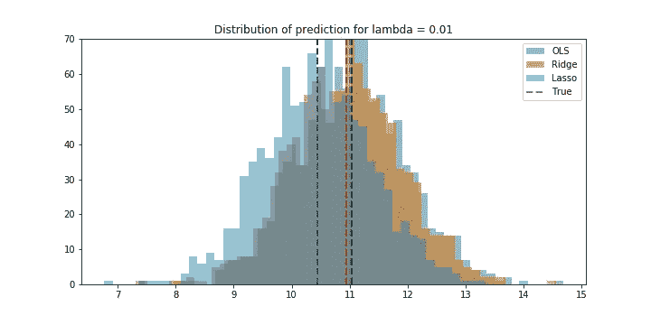

# 线性模型中的偏差和方差

> 原文：<https://towardsdatascience.com/bias-and-variance-in-linear-models-e772546e0c30?source=collection_archive---------7----------------------->

## 线性模型的偏差和方差权衡

我相信每个人过去都见过这个图表:

First figure in Scott Fortmann-Roe’s [Understanding the Bias-Variance Tradeoff](http://scott.fortmann-roe.com/docs/BiasVariance.html).

[了解偏差-方差权衡](http://scott.fortmann-roe.com/docs/BiasVariance.html)详细介绍了权衡和误差，我强烈推荐。上图是帖子上的第一个图，显示了多个模型在不同偏差和方差误差下的预测。靶心是我们想要预测的真实值，蓝点是模型实际预测的值。在这篇文章中，我想尝试并直观地展示线性模型中偏差和方差的权衡。

## 为什么是线性模型？

因为它们很容易理解，并且提供了一种非常简单的方法来控制这些误差——通过正则化。众所周知，与非线性模型相比，普通最小二乘(OLS)回归可以给出方差较低的无偏结果。**岭** (OLS 带 L2 点球)和**拉索** (OLS 带 L1 点球)给出了有偏差的结果，与 OLS 相比方差低得多。惩罚程度由正则化系数λ控制。这反过来控制两个误差，我们将在下面看到。Lasso 实际上是一个特例，因为它积极地将系数估计值推至零，但有助于保持事物的前瞻性。你可以在这里阅读更多关于正规化[的内容。](/regularization-in-machine-learning-76441ddcf99a)

## 程序

我将坚持使用 Scott 的文章中用来从概念上描述错误的方法。我在这里任意挑选所有固定的数字。

1.  从 *y = α+ βx + ϵ* 模拟 500 个数据点，其中 *ϵ ~ N(0，8)，x ~ U(-2，2)，α = 2* 和 *β = 3。*
2.  重复第一步 1000 次，收集所有数据集。
3.  对于每个集合，用固定的λ拟合 OLS、脊和套索模型，以预测 *x = 3 时的 *y* 。*预期预测应该是 *2 + 3* x *3 = 11*

现在我们有 3000 个(1000 个 OLS + 1000 个山脊+ 1000 个套索)预测，我们可以看看这些模型的真正“本质”。你可以在我的 GitHub 页面[这里](https://github.com/DarkestFloyd/blog_files/blob/master/bias_variance/bias_variance.ipynb)找到所有代码。

关于如何阅读情节的注释。我要你注意两件事。真实值(显示为黑色虚线)和模型的平均预测值(显示为相同颜色的虚线)之间的距离。这个距离就是模型的**偏差**(或偏差的平方)。与真实值(11)的大偏移是大偏差。
2。直方图的宽度是模型的**方差**。宽度越大，方差越大。

## λ ~ 0

从一个非常小的λ值开始。这相当于没有罚分，因此我们可以预期在 OLS 对山脊和套索的结果是一样的。

情节没有给人惊喜。所有这三种分布都与真实值周围的平均值重叠。请注意分布是如何分散的。从 9 到 13 的预测中有很大的差异。

## λ = 0.01

通过(非常)小的代价，很容易看到正则化的效果。分布已经向左移动(从平均值可以明显看出)。在山脊观察到一个小的偏差，在套索观察到一个相对较大的偏差。不清楚方差是否已经改变。

## λ = 0.05

在λ = 0.05 时，Lasso 已经过于激进，偏差为 3 个单位。岭是足够接近，但看起来它有相同的方差。因此，对于这个数据来说，山脊还没有优势。

## λ = 0.1

与上面几乎相似的结果。目前还很难注意到差异有任何变化。

## λ = 0.5

更高的惩罚提供了一些(合理的)令人满意的线索。山脊上的偏差增加了近三个单位，但方差较小。Lasso 非常积极地推动β的零系数估计，导致结果偏差很大，但方差很小。

## λ = 1 —一些好结果！

在这里，权衡显然已经改变了立场。以较高的偏置为代价，脊的方差较小。

## λ = 5

为了让大家真正理解这一点，这里有一个非常大的惩罚。以更高的偏差为代价，脊上的方差很小。你可能永远不会需要这么大的罚款。但事实很清楚，较低的方差是以较高的偏差为代价的。

## 各种正则化值的偏差和方差

对一系列正则化值重复上述操作，可以得到清晰的图像。

*   偏差计算为平均预测值和真实值之间的距离-真实值减去平均值(预测值)
*   方差是平均预测值与平均值(预测值减去平均值(预测值))的平均偏差

这些图给出了相同的观察结果。OLS 的偏差最小，但方差最大。在λ = 0.2 左右(β变为 0，因此对于 *x* ) *的所有值，预测 *y = α* )后，山脊看起来像平滑移动，套索是恒定的。*

## 理想分布

更好的数据选择可以给我们一个理想的预测抽样分布图。

由于重叠分布，山脊提供的优势在这里非常明显。岭给出一个稍有偏差的预测，但会给出一个比 OLS 更接近的预测。这才是脊的真正价值。一个小偏差，但更一致的预测。OLS 给出了一个公正的结果，但不是很一致。这很关键，OLS 给出了一个无偏的结果 ***平均，而不是一直*** *。*这就是线性模型中的偏差和方差权衡取*形*。

你可以在这里找到我在这篇文章中使用的所有代码。我建议您针对不同的λ值运行它，亲自查看变化。甚至可以在不同的数据集上使用它，看看是否可以看到一些重叠。如果你对这篇文章有任何建议，请随时和我打招呼。

我只想花点时间感谢让这篇文章成为可能的每一个人。一定要花点时间分享并表达你的感激之情。:)感谢阅读！