# 机器学习中的偏见:面部识别模型如何显示种族主义、性别歧视和年龄歧视的迹象

> 原文：<https://towardsdatascience.com/bias-in-machine-learning-how-facial-recognition-models-show-signs-of-racism-sexism-and-ageism-32549e2c972d?source=collection_archive---------8----------------------->

## 通过年龄和性别预测的镜头检查面部识别中的偏见，以鼓励公平、负责和透明的机器学习的发展。

**By:** [**【安珀】卡米莱里**](https://www.linkedin.com/in/ambercamilleri/)**[**罗比·盖根**](https://www.linkedin.com/in/robert-geoghegan/)**[**雷切尔·米德**](https://www.linkedin.com/in/rachelmmeade/)**[**塞巴斯蒂安·奥索里奥**](https://www.linkedin.com/in/sebastianosorioagudelo/)**[**秦沛·邹**](https://www.linkedin.com/in/qinpei-zou/)********

****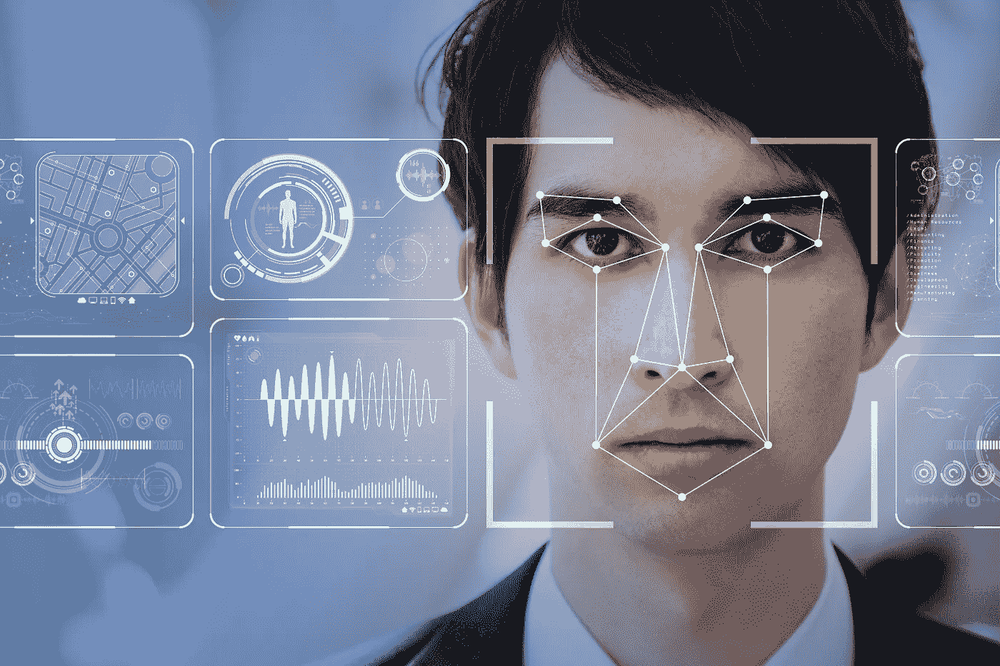****

****Licensed from Adobe Stock****

****早在 2018 年，技术市场研究公司 Counterpoint 的一篇[文章](https://www.counterpointresearch.com/one-billion-smartphones-feature-face-recognition-2020/)预测，到 2020 年，超过**部** **亿部智能手机**将配备面部识别功能。今天，苹果、三星、摩托罗拉、一加、华为和 LG 都提供具有面部识别功能的设备。****

****当我们把手机装进口袋，走到外面时，公共场所布满了面部识别摄像头，全球各地有数百家甚至数千家零售店使用面部识别摄像头。大多数大型零售商对他们使用面部识别来防盗守口如瓶，但像 [this](https://www.bbc.com/news/technology-48718198) 这样的文章证实了像塔吉特和沃尔玛这样的大品牌已经在他们的商店里试验面部识别。****

****不久，这些商店和其他商店可能会推出面部识别功能，以提高商店忠诚度计划或定制服务。福布斯[的一篇文章](https://www.forbes.com/sites/bryanpearson/2018/03/15/3-ways-retailers-can-use-facial-recognition-to-express-better-experiences/#3b3fc0117661)指出，忠诚度会员通常已经同意与品牌分享个人数据，因此通过面部识别增强忠诚度计划可能在不久的将来。这种趋势正在许多行业出现，从识别癌细胞到预测罪犯再次犯罪的可能性。****

********

****Licensed from Adobe Stock****

****随着它的迅速普及，我们觉得理解这项技术很重要，所以我们决定通过构建我们自己的卷积神经网络来探索图像检测和分类的内部工作方式，该网络能够从一个人的图像中预测他或她的年龄和性别。我们将使用通用行业基准的模型和数据集。然后，使用模型的预测，我们将进一步检查模型可能存在的任何偏差。尽管我们的发现可能无法完美代表当今商业部署中使用的模型，但该项目旨在揭示机器学习中的偏见，并强调公平、负责和透明的机器学习的深思熟虑的发展的重要性。****

******初步研究******

****近年来，对公平、负责和透明的机器学习领域的研究获得了极大的关注。在所有形式的机器学习中都发现了无意识的偏见，例如 [Bolukbasi 等人，2016](https://papers.nips.cc/paper/6228-man-is-to-computer-programmer-as-woman-is-to-homemaker-debiasing-word-embeddings.pdf) 在一种常用的文本分析技术中分析了性别偏见:在谷歌新闻文章上训练的单词嵌入。研究人员建立了一个模型来预测一个类比应该如何结束使用性别特定的词，如“男人是国王，女人是 _ _ _ _ _ _ _ _ _ _”，该模型将预测女性的对等词“女王”。在用谷歌新闻文章训练了模型之后，研究人员使用了非性别职业来观察女性。因为“男人对于电脑程序员就像女人对于 _ _ _ _ _ _ _ _ _ _”这个模型预测了“家庭主妇”。模型中其他极端的“女性”职业包括:“护士”、“接待员”、“图书管理员”和“理发师”，而极端的男性职业包括:“艺术大师”、“船长”、“哲学家”和“船长”。这些模型反映了在谷歌新闻等常用数据源中发现的社会偏见，这些数据源用于许多商业、政府和研究领域，却没有意识到或纠正性别偏见。****

****在许多面部分类模型中也是如此。 [Buolamwini 等人，2018](http://proceedings.mlr.press/v81/buolamwini18a/buolamwini18a.pdf) 分析了跨浅色和深色皮肤男性和女性的商业性别分类产品的准确性。他们的研究考虑了微软、Face++和 IBM 出售的产品，发现它们在男性和浅色皮肤的人身上表现得更好——下表显示了每个产品在从图像预测男性或女性的二元分类中的准确性。****

****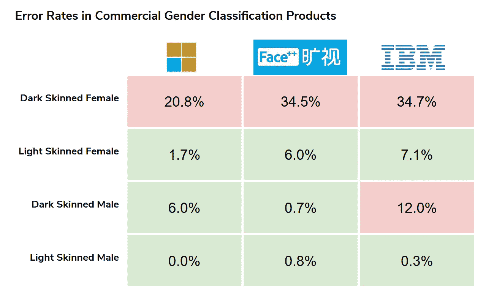****

****鉴于政府和企业如今都在使用这些产品，这种差异令人担忧。这种偏见的证据正在许多行业中被发现，从使用 81%欧洲出生参与者数据集的基因组学医学研究( [Popejoy 和 Fullerton，2016](https://www.nature.com/articles/538161a) )到刑事诉讼，这些刑事诉讼由模型告知，这些模型错误预测黑人被告重复犯罪的可能性是白人被告的两倍( [Angwin 等人，2016](https://www.propublica.org/article/machine-bias-risk-assessments-in-criminal-sentencing) )。****

****在研究我们从图像中预测年龄和性别的具体问题时，我们发现执行这些预测的大多数模型都是在来自维基百科和 IMDB 的最受欢迎的 100，000 名男女演员上训练的。作为名人的数据集，训练数据主要是白人，男性比例更高，大多数名人看起来比同龄的非名人要年轻得多——这造成了对老年人进行分类的偏见。****

****我们的重点是试图量化这些偏见，并尝试纠正它们的方法。****

******型号选择******

****我们选择使用卷积神经网络(CNN)作为我们的主要模型也是基于我们最初的研究。年龄预测本质上是一个回归问题，因此使用通常使用分类损失函数训练的 CNN 不是一个明显的选择。然而，我们发现，CNN 在图像识别任务上一直表现良好，并且已经成为这类任务的行业标准。****

****在过去的十年中，ImageNet 大规模视觉识别竞赛已经成为 CNN 能力和准确性的试验场。他们在这些年度比赛中的出色表现使得 CNN 被大规模接受为图像分类任务的“首选”模型。ImageNet 竞赛是 1，000 个类别的分类竞赛，训练集中有超过 100 万个图像。学者和专业人士都在竞争，一路改进 CNN。2010 年至 2017 年间，竞赛中的分类误差从 28.2%降至 2.3%。****

****最终，我们采用了 VGG-Face 架构，一个 16 层 CNN，具有 13 个卷积层(一些具有下采样)、2 个全连接层和一个 softmax 输出。像我们这样的模型可以在[这里](https://www.researchgate.net/profile/Masaki_Nakada/publication/319284653/figure/fig2/AS:655554917720065@1533307880238/VGG-Face-network-architecture.png)找到。尽管分类损失函数并不理想地适合于年龄分类，但我们选择使用这种特定的模型，因为它具有出色的基准性能、丰富的文档以及我们对初始权重实施迁移学习的能力。我们最初的模式(在再培训之前)完全依赖于迁移学习，最初的来源可以在[这里](https://github.com/serengil/tensorflow-101/tree/master/python)找到。****

******数据选择******

****模型最初训练的图像来自 IMDb 和维基百科。这些数据是利用 IMDb 10 万名最受欢迎的男女演员的名单收集的，包括他们的面部图像，并附有时间戳、出生日期和性别。在 100，000 名男演员和女演员中，20，284 人有可用数据，平均每个名人有 26 张照片，数据集中共有 523，000 张照片。****

****年龄标签基于 IMDb 和维基百科上记录的出生日期和图像的时间戳。这是假设出生日期在这些网站上是准确的。没有时间标记的照片被删除，因为照片中人的年龄无法确定。一些图像来自电影的剧照，并且图像的时间戳基于制作时间，但是制作时间延长的电影可能导致时间戳信息的一些不准确性。因此，图像的年龄标签可能存在一些不准确之处。****

****尽管维基百科和 IMDB 的数据集很大，而且标签也很好，但名人的照片可能并不能代表普通大众。为了提供我们的模型如何在公众面前表现的代表性测量，我们还采用了来自 [UTKFace](https://susanqq.github.io/UTKFace/) 数据集的图像来重新训练模型，并作为精确误差测量的测试集。UTK 的数据既有裁剪过的照片，也有未裁剪过的照片；每个数据集的示例如下所示。UTKFace 是一个大规模的人脸数据集，包含超过 20，000 张照片，并带有年龄、性别和种族的注释。****

****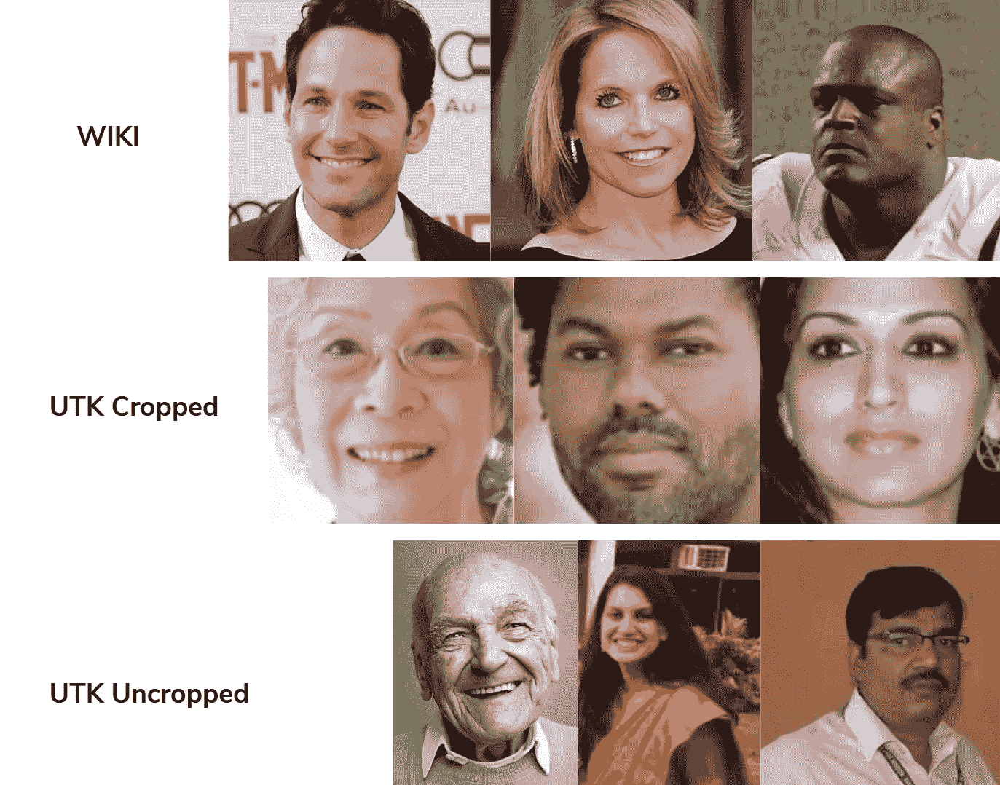****

****Examples of photos from each dataset****

******年龄预测******

****我们的模型是在来自 IMDB-Wikipedia 数据集的大约 450，000 张照片的子集上预先训练的；训练中未使用的剩余照片被指定为样本外测试集。下面显示了该测试集的平均预测值与实际年龄的对比。实际(每个注释)年龄在 x 轴上，平均预测年龄(根据我们的 CNN 模型)显示在 y 轴上。人们可能会预期，在大型数据集上训练的模型，在与训练集非常相似的图像上进行预测，会表现得很好，我们的观察结果与这一预期相符。****

****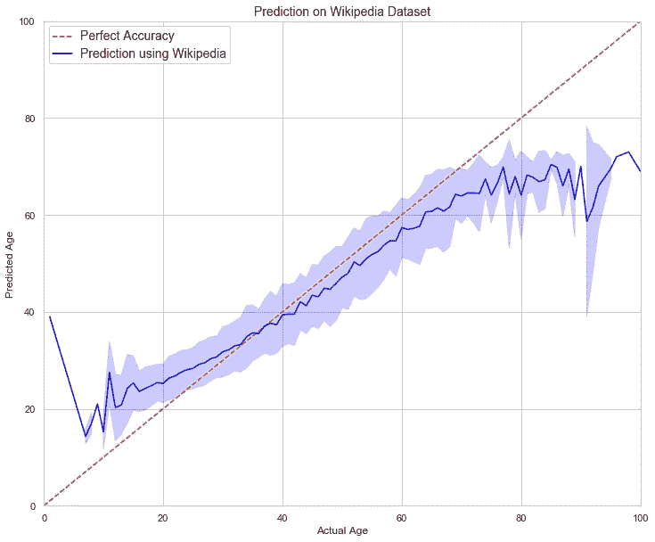****

****为了获得预测，我们评估了 softmax 输出的两种不同解释。CNN 的最后一层是 softmax 层，它输出给定图像属于 101 个类别中的每一个的概率，每个类别对应于一个年龄(0 到 100)。这些概率可以解释为加权平均值，即将图像属于每个类的概率乘以该类的值。或者，预测可以简单地是具有最大概率的类别的年龄。最大概率解释总是导致较高的误差，因此我们采用加权平均解释来进行预测。****

****我们选择关注平均绝对误差(MAE ),这是我们对误差的主要度量，因为它对异常值更稳健，并且是年龄预测问题中误差的明显行业标准度量。作为对比，[本文](https://arxiv.org/pdf/1702.04280.pdf)从 2017 年开始引用了几个商用 API 预测年龄的 MAE，并将微软的 Face API 年龄预测工具的 MAE 列为 7.62 年。我们从维基百科图片预测人的年龄时的平均寿命是 5.3 年。****

****然而，我们知道，这种误差测量可能并不能很好地反映模型对非名人面孔年龄的预测。非名人图像通常在图像分辨率、照明和面部特征方面不同于名人照片，这应该会影响模型的预测能力。由于训练集中测试集的信息泄漏，MAE 也可能人为地低。例如，如果一个名人在数据集中有多个图像，并且一些图像最终出现在训练集和测试集中，神经网络可能只是“识别”一个熟悉的面孔并匹配 hir 或她的已知年龄，而不是“预测”他或她的年龄。因此，我们的下一步是对 UTK 数据集进行预测。****

****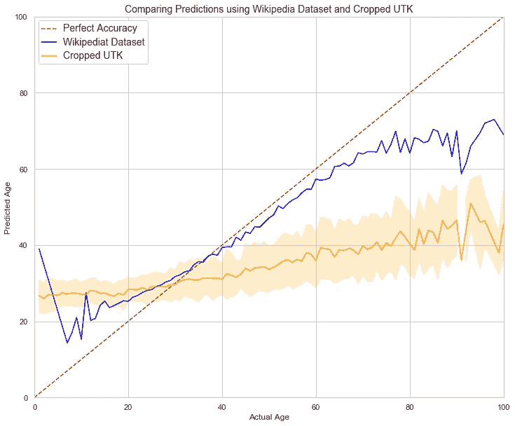****

****我们从预测 UTK 的一组裁剪照片的年龄开始。在没有仔细查看来自 UTK 和维基百科-IMDB 数据集的照片示例的情况下，我们假设裁剪后的照片与 CNN 最初训练的数据最相似。尽管我们预计该模型在本次实验中表现不佳，但我们仍然对该模型未能准确预测年龄的程度感到惊讶，特别是在老年人中。然而，经过进一步的研究，我们发现从 UTK 数据集裁剪的图像比从维基百科-IMDB 集中裁剪的图像更接近。这导致头发、耳朵和其他面部特征经常从图像中被裁剪掉。如果我们想要匹配模型最初被训练的照片的格式，我们最好使用未剪辑的照片。****

****然而，在重新运行该模型之前，我们还从未裁剪的 UTK 数据集中移除了标注年龄低于 16 岁的照片。我们删除这一年龄组的理由基于两个关键论点:首先，原始数据和 UTK 数据集对于 16 岁以下的人来说都是稀疏的。第二，我们的用例通常与非常年轻的人不太相关。****

****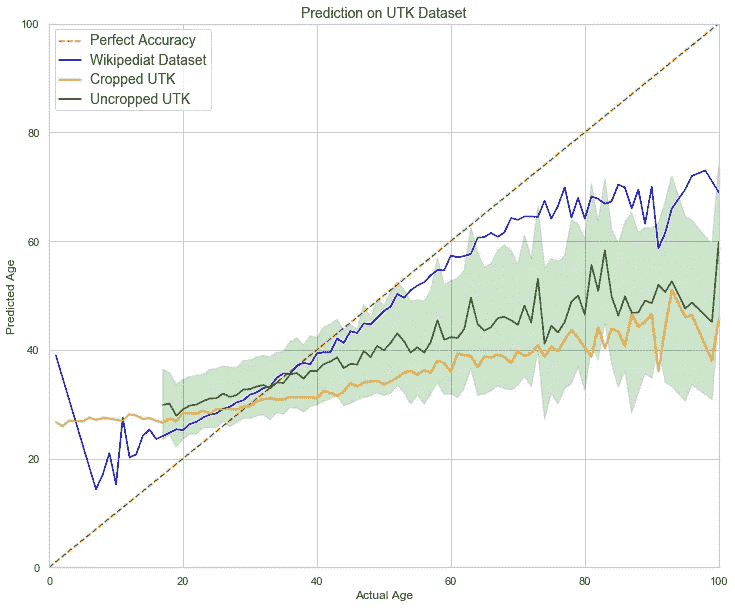****

****由此得出的预测大约有 10 年的平均误差。这代表了对裁剪数据集预测的显著改进，证实了我们的直觉，即测试集中的照片在裁剪、分辨率、光照等方面与原始训练数据中的照片非常相似是很重要的。****

****下一个明确的步骤是，通过重新训练神经网络的最后两个完全连接的层和 softmax 输出，尝试提高模型对非名人面孔的预测能力。我们保留了最初的 14 层及其权重不变，以保留神经网络的特征提取部分，这将需要大量的数据来重新训练，但允许我们微调生成预测的神经网络部分。****

****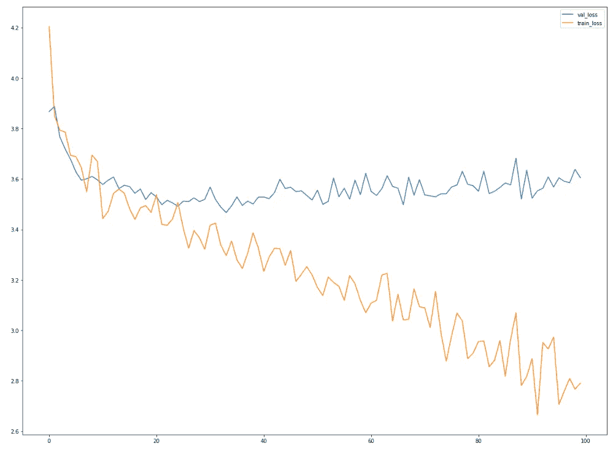****

****Retraining fully-connected layers****

****最初，我们使用 Adam 优化对 UTK 未裁剪数据的子集进行了 250 个时期的再训练。可视化显示了前 100 个时期，并在大约 30 个时期内实现了最低的验证损失。蓝线代表验证失败，橙色代表训练失败。我们为验证损失最低的模型保存了权重，以避免过度拟合。作为这个再训练过程的结果，我们在 UTK 非裁剪测试集上的预测有了实质性的提高。****

****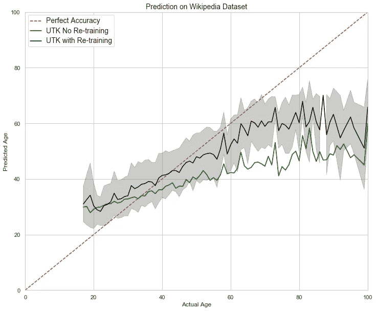****

****再培训将我们的测试平均寿命从 10 年减少到大约 8.4 年。基于与测试集中的照片更相似的照片来调整完全连接的层的权重产生了明显的差异。UTK 的数据通常具有较低分辨率的照片，较差的照明，以及化妆较少的女性，因此原始模型的一些糟糕表现可以归因于图像中的这些审美差异。****

****除了这一改进之外，该模型在预测老年人的年龄方面仍然表现不佳。检查 UTK 数据集，我们观察到，像模型最初训练的维基百科数据集一样，绝大多数图像是 20 至 35 岁之间的人。我们推测，缺乏老年人的数据可能是导致该数据区域表现不佳的原因。****

****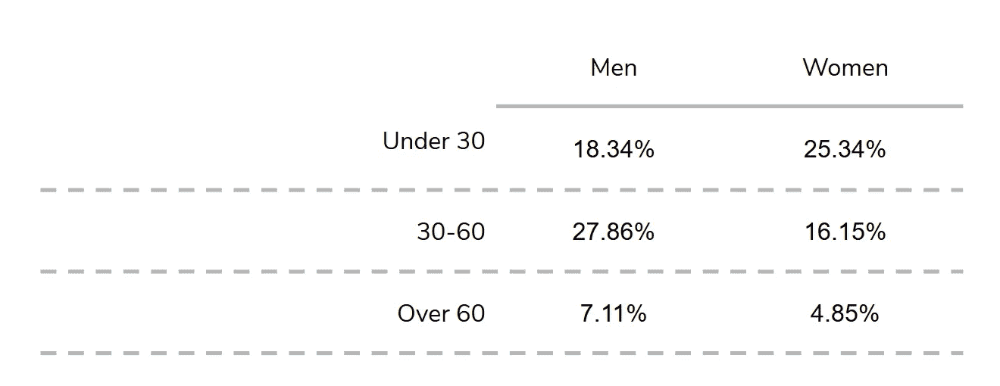****

****Proportion of Data in UTK Dataset By Gender & Age****

****不考虑重新训练整个神经网络的选项，有两种常用策略可用于尝试提高模型性能:调整损失函数以进一步惩罚该组的不良预测，或者复制训练数据的不良表现区域的每个数据点以有效地实现同样的效果。我们开始复制所有 60 岁以上的人的照片，然后试着把它们增加三倍。****

****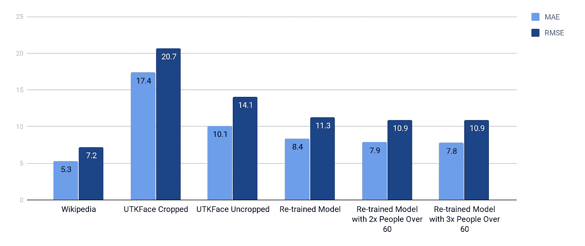****

****通过创建超过 60 岁的人的多个图像，该模型因错误标注他们的年龄而进一步受到惩罚。大部分改进是通过复制照片获得的，将 MAE 从 8.4 提高到 7.9。通过将图像增加三倍，实现了 0.1 年 MAE 的微小增量改善。****

****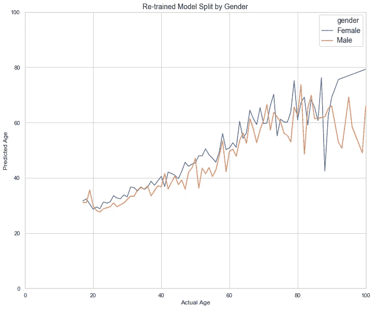****

****除了简单地改进 CNN 的权重，我们还对检验模型预测的偏差感兴趣。我们按照人口统计学将我们的最佳模型(用三份 60 岁以上的图像重新训练)的预测分开，以检查模型性能的离散性。当按性别区分预测时，预测中的偏差似乎是相似的。总的来说，该模型一贯高估年轻女性的年龄，其程度超过男性，但低估老年女性的年龄可能没有男性严重。随着年龄的增长，两性之间的差异也在增加。对于老年人来说，这种差异的增加和准确性的下降可能是由于该地区的数据相对稀少。****

****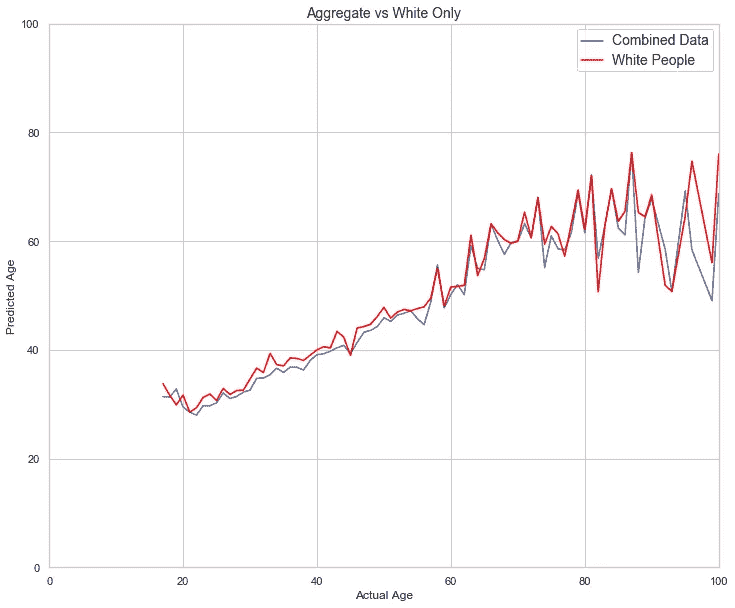********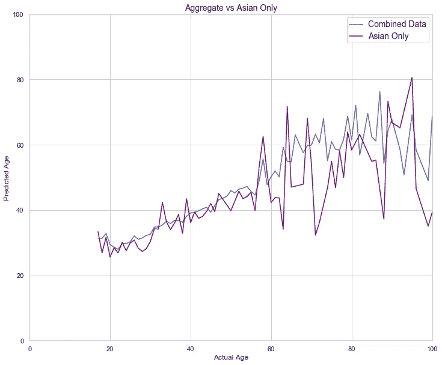****

****另一个显著的对比可以通过按种族划分预测来进行。未裁剪的 UTK 数据集主要是高加索人的照片，因此毫不奇怪，该模型对高加索人的表现与它对整个数据集的表现相当。请注意，与测试数据中对亚洲人的截然不同的预测相比，对高加索人的预测是多么相似。亚洲人在照片中占少数，对于该种族的老年人来说，预测不太准确，而且非常不稳定。正如我们所料，正如这两个例子所证明的那样，对于拥有大量数据的人群，预测通常更准确，而对于在数据集中代表性较低的人群，预测则不太准确。****

******校正模型******

****为了进一步完善神经网络做出的预测，我们创建了一个二级模型，用于校正基于年龄、性别和种族的系统性低估或高估。通过这个模型的生成，我们对与人口统计组相关的不同程度的偏差有了更好的理解。****

****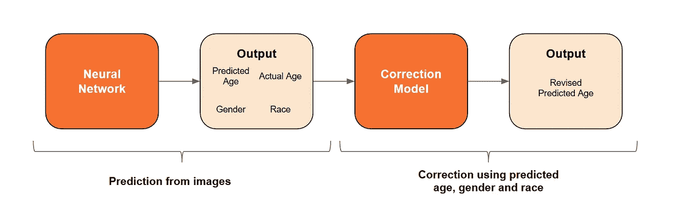****

****校正模型中使用的特征包括:卷积神经网络的预测年龄、人的性别(男性或女性)和人的种族(白人、黑人、亚洲人、印度人和其他人)。我们测试和调整了几个模型，以便选择最合适的校正模型，下表显示了每种类型中性能最好的模型。****

****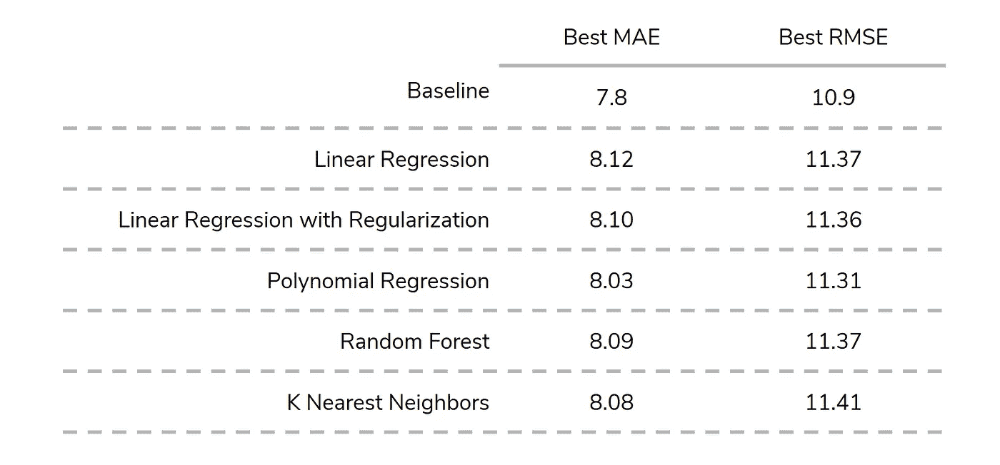****

****我们尝试的模型没有一个能改进原始模型的输出。我们认为这是由于一套简单的特征，只考虑了一个人的预测年龄、种族和性别。考虑到人们在较高年龄时一贯的预测不足，这是令人惊讶的。作为第二个解决方案，我们测试了一些简单的试探法，看看它们是否能改善我们的预测。为了做到这一点，我们采用了不同年龄段、性别和种族的预测年龄和实际年龄之间的平均差异。结果如下表所示:****

****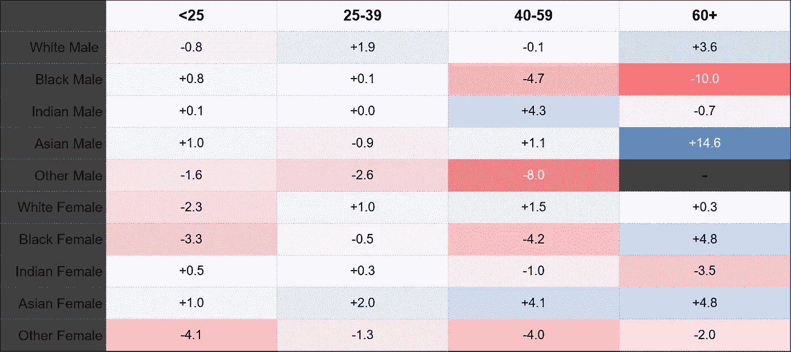****

****Average Difference Between Predicted and Actual Age, Grouped by Predicted Age, Race and Gender****

******性别预测******

****除了年龄预测，我们还建立了一个卷积神经网络来预测同一组图像的性别。性别分类是二元的，只考虑在各自数据集中确定的男性或女性。预训练的神经网络在 IMDB 和维基百科的名人数据集上表现非常准确，并以 99%的准确率预测了正确的性别。使用混合种族和非名人的 UTK 人脸数据集返回了低得多的 78%的整体准确率。准确率因种族和性别而有很大差异:从印度和白人男性的 98%的准确率到黑人女性的 46%的准确率。****

****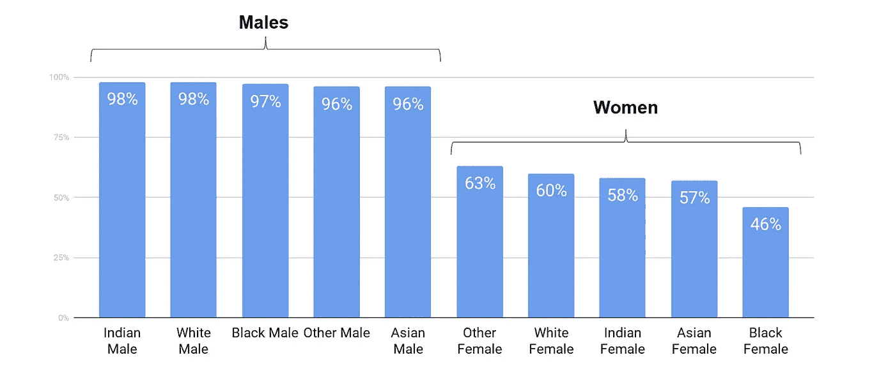****

****Accuracy for Gender Prediction Model****

****结果显示了在研究中发现的类似的性别偏见，即该模型在女性图像上的表现始终低于男性照片。当比较所有类别时，该模型对黑人女性的照片表现最差。差异之大令人惊讶。所有种族的男性都被正确分类，准确率为 96%，而表现最好的女性种族只有 63%的准确率。如下图所示，女性的年龄进一步放大了这种不准确性。****

****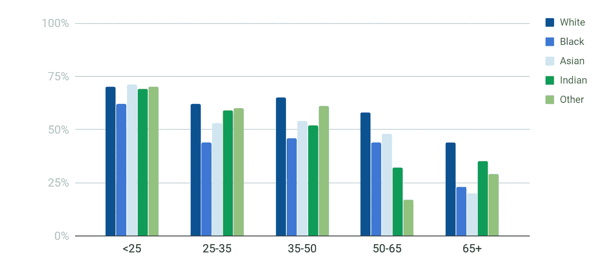****

****Accuracy of Gender Predictions for Females Only****

****与我们在预测年龄时看到的类似，在测试数据中，年龄最大的受试者的性别预测表现最差。我们也看到了对黑人女性的偏见，这种偏见导致了所有年龄段的预测都不准确。****

****这些结果反映了训练数据集中的问题。训练数据中男性人数比女性多两到三倍，少数民族人数不足。最令人惊讶的是，鉴于训练数据集主要是白人，所有种族的男性结果都是如此——这表明种族并没有显著影响男性的性别预测。对于女性来说，种族扮演着重要的角色，这可以从所有年龄组的种族的不同准确性中看出。此外，该数据表明，对女性性别预测的最大偏差是年龄。****

******测试我们的模型******

****作为最后的测试(也是为了我们自己的享受),我们将模型指向我们自己和朋友。为此，我们收集了 51 张人们的脸部照片，其中包括他们在脸书的个人资料照片和亲自拍摄的照片。我们的目标是表明，我们重新训练的模型在预测年龄和性别方面比根据名人图片训练的原始模型更准确。****

****重新训练的模型在拍摄真人照片时表现优于原始模型，而原始模型在精心挑选和光线充足的脸书个人资料照片上表现更好。****

****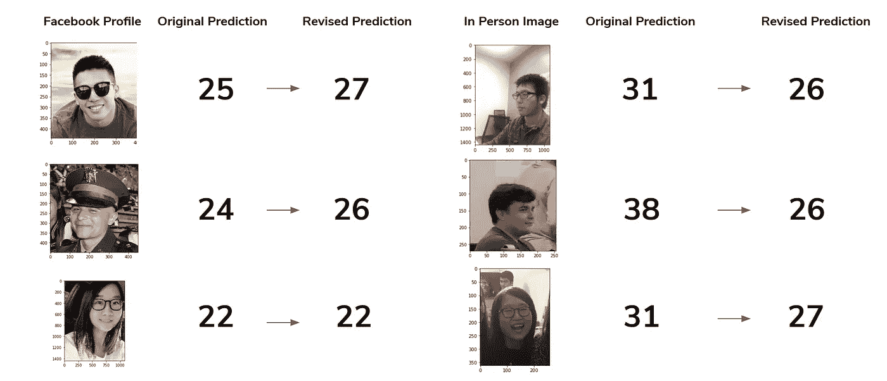****

****我们认为，性能的差异与训练数据集的差异一致，在训练数据集中，人们策划的高质量脸书个人资料照片更接近地反映了名人形象，而真人照片更接近地反映了我们重新训练模型中使用的普通人。总体而言，重新训练的模型表现最佳，准确率提高了 10–20%。****

******结论******

****作为在不平衡数据集上训练的结果，我们 CNN 的预测尖锐地展示了其预测中的种族、性别和年龄偏见。通过重新训练和重新平衡数据，我们能够在减少偏倚方面取得增量改进，将年龄的初始 MAE 提高 24%。然而，这些改进只是渐进的变化。需要对更好地代表少数民族的平衡数据集进行深思熟虑的监管，以适当消除这些偏见。鉴于机器学习模型在企业和政府中的普遍存在，这一点尤为重要，这些模型是根据这些数据集进行训练的。有大量证据表明有偏见的模型对少数群体产生了影响，但由于知识差距、数据收集的成本以及部署这些模型时有限的制衡，变化是缓慢的。透明度和意识是重要的第一步，但要真正确保机器学习对每个人都是公平和负责的，还有更多工作要做。****

******GITHUB 资源库******

****【https://github.com/rmmeade/APM_Faces_Proj/settings ****

******资源******

*****特别感谢奥斯汀德克萨斯大学的 Joydeep Ghosh、Shubham Sharma & Disha Makhija 博士的慷慨指导和建议。*****

****[年龄和性别预测 CNN 发自 Sefik Ilkin Serengil](https://github.com/serengil/tensorflow-101)****

****[UTK 人脸数据集](https://susanqq.github.io/UTKFace/)****

****[IMD b-维基百科数据集](https://data.vision.ee.ethz.ch/cvl/rrothe/imdb-wiki/)****

****[性别差异:商业性别分类的交叉准确性差异](http://proceedings.mlr.press/v81/buolamwini18a/buolamwini18a.pdf)****

****[男人对于电脑程序员就像女人对于家庭主妇一样？去偏置词嵌入](https://papers.nips.cc/paper/6228-man-is-to-computer-programmer-as-woman-is-to-homemaker-debiasing-word-embeddings.pdf)****

****[基因组学在多样性上失败了](https://www.nature.com/articles/538161a)****

****朱莉娅·安格温、杰夫·拉森、苏亚·马特和劳伦·基什内尔的《机器偏见》，ProPublica****

****[人脸识别、卷积神经网络和子空间学习](https://ieeexplore.ieee.org/abstract/document/7984551)****