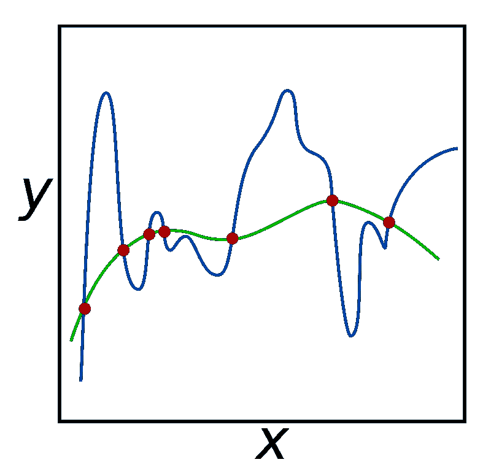

# 偏差、方差和正则化

> 原文：<https://towardsdatascience.com/bias-variance-and-regularization-f3a0eefe99af?source=collection_archive---------23----------------------->

## 数据科学中的三个基本概念

每一个初露头角的数据科学家都面临着一个困境，那就是接受诸如过拟合、欠拟合、偏差、方差以及最后但并非最不重要的正则化等词汇。

我的一个有趣的同事会对所有数据科学问题给出相同的答案。“它必须被正规化”，然后笑着说。有趣的是，他会侥幸逃脱，因为大多数时候他是对的。

让我们看看这些术语，并把它们一个一个地铭刻在我们的记忆中。这是我对每个术语的理解，如果你觉得我错了，请随时纠正我。保留下图作为参考来理解这些概念。

source: [https://towardsdatascience.com/understanding-the-bias-variance-tradeoff-165e6942b229](/understanding-the-bias-variance-tradeoff-165e6942b229)

*   **偏差:**假设你的机器学习模型在一组数据上表现非常糟糕，因为它没有推广到你所有的数据点。这是当你说你的模型有很高的偏见。当模型不合适时，会出现这种现象。
*   **方差:**假设你的机器学习模型试图成功地解释一个数据集中的所有或大部分所有点。如果它在其他测试数据集上运行时表现不佳，则称之为高方差。因此，当模型过拟合时，就会出现偏差。
*   **正则化:**用于处理高方差的回归方法称为正则化。正则化对过度拟合模型的作用是，通过惩罚回归系数，消除或最小化具有较大异常值的预测器列的影响。结果是一个更平滑的模型，可以很好地工作在具有类似数据的其他测试数据集上。

Source: [https://en.wikipedia.org/wiki/Regularization_(mathematics)#/media/File:Regularization.svg](https://en.wikipedia.org/wiki/Regularization_(mathematics)#/media/File:Regularization.svg)

附加信息:

我通过 sklearn 使用了两种主要类型的正则化子。

1.  这个正则化器基本上试图同时惩罚所有的系数。
2.  **Lasso:** Lasso 选择性地仅惩罚具有高异常值的预测值，并从模型中忽略这些预测值。因此，其结果是一个能很好地概括新数据的模型。