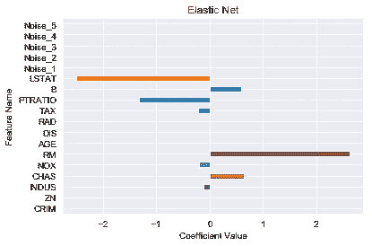

# 线性回归中的偏差、方差和正则化:套索、脊和弹性网——差异和用途

> 原文：<https://towardsdatascience.com/bias-variance-and-regularization-in-linear-regression-lasso-ridge-and-elastic-net-8bf81991d0c5?source=collection_archive---------6----------------------->

Photo by [pan xiaozhen](https://unsplash.com/@zhenhappy?utm_source=medium&utm_medium=referral) on [Unsplash](https://unsplash.com?utm_source=medium&utm_medium=referral)

回归是一种非常流行和常见的机器学习技术。往往是学习机器学习的起点，线性回归对于容易理解的问题是一种直观的算法。它通常可以在你试图预测一个连续变量(一个可以取某个数值范围内的任何值的变量)时使用，线性回归和它的亲属通常是强有力的选择，并且几乎总是最好的起点。

# 线性回归

这个博客假设了普通最小二乘(OLS)线性回归的功能知识。你可以在这里[这里](https://medium.com/@gilberttanner/linear-regression-explained-8e45f234dc55)或者[这里](/linear-regression-detailed-view-ea73175f6e86)阅读更多关于 OLS 线性回归[。](https://medium.com/data-science-group-iitr/linear-regression-back-to-basics-e4819829d78b)

# 偏差-方差权衡

From [Seema Singh](/understanding-the-bias-variance-tradeoff-165e6942b229)

在机器学习中建立最佳模型的很大一部分是处理偏差-方差权衡。偏差是指模型的正确(或不正确)程度。一个非常简单的模型，犯了很多错误，据说有很高的偏差。一个在训练数据上表现良好的非常复杂的模型被称为具有低偏差。与偏差负相关的是模型的方差，它描述了如果一个预测因子发生轻微变化，预测可能会发生多大的变化。在上面提到的简单模型中，模型的简单性使得其预测值随预测值变化缓慢，因此方差较低。另一方面，我们复杂的低偏差模型可能非常适合训练数据，因此预测值会随着预测值的轻微变化而大幅变化。这意味着这个模型有很高的方差，它不能很好地推广到新的/看不见的数据。

低偏差/高方差模型表现出所谓的过度拟合，即模型有太多的术语，并在总体趋势之上解释数据中的随机噪声。这导致它对模型以前没有见过的数据表现不佳。高偏差/低方差模型表现出所谓的拟合不足，即模型过于简单/术语太少，无法正确描述数据中的趋势。同样，该模型将在新数据上苦苦挣扎。这两种模型类型都不理想，我们希望达到某种中间状态，在这种状态下，我们有适当数量的项来描述趋势，而不适合噪声。因此，我们需要某种特征选择，其中与因变量没有关系的预测因子在最终模型中没有影响。

Image from [Sydney Firmin](https://community.alteryx.com/t5/Data-Science-Blog/Bias-Versus-Variance/ba-p/351862)

偏差-方差权衡如上图所示。模型的总误差由三项组成:偏差、方差和不可约误差项。正如我们在图中看到的，我们的总误差最小化的最优解是在某个中等模型复杂度，偏差和方差都不高。

# OLS 线性回归的弱点

线性回归找出使 R 最大 RSS 最小的系数值。但是这可能不是最好的模型，并且将为提供的每个预测值给出一个系数。这包括几乎没有预测能力的术语。这导致了一个高方差、低偏差的模型。因此，我们有潜力改进我们的模型，通过用偏差交换一些方差来减少我们的总体误差。这种交易以正则化的形式出现，其中我们修改我们的成本函数来限制我们的系数的值。这使得我们可以用过度的方差来换取一些偏差，从而潜在地减少我们的总体误差。

# 套索

The Lasso cost function, from [Wikipedia](https://en.wikipedia.org/wiki/Lasso_(statistics))

Lasso(有时风格化为 lasso 或 LASSO)在成本函数中添加了一个附加项，将系数值之和(L-1 范数)乘以一个常数λ。这个额外的项对模型不利，因为它的系数不能解释数据中足够的变化量。它还倾向于将上述不良预测器的系数设置为 0。这使得套索在特征选择中很有用。

然而，Lasso 对某些类型的数据感到困惑。如果预测值的数量(p)大于观测值的数量(n)，Lasso 将最多选取 n 个预测值作为非零值，即使所有预测值都相关。Lasso 还将与共线要素(它们是相关的/强相关的)进行斗争，在这种情况下，它将只选择一个预测值来表示相关预测值的完整套件。这种选择也将以随机的方式进行，这不利于再现性和解释。

重要的是要注意，如果λ= 0，我们实际上没有正则化，我们将得到 OLS 解。当λ趋于无穷大时，系数将趋于 0，模型将只是一个常数函数。

# 里脊回归

Thanks to [Kyoosik Kim](/ridge-regression-for-better-usage-2f19b3a202db)

岭回归还在成本函数中增加了一个附加项，但取而代之的是对系数值的平方(L-2 范数)求和，并将其乘以某个常数λ。与 Lasso 相比，这个正则化项将减少系数的值，但不能强制系数正好为 0。这使得岭回归的使用在特征选择方面受到限制。然而，当 p > n 时，与 Lasso 不同，如果需要，它能够选择 n 个以上的相关预测因子。它还会选择共线特征组，发明者称之为“分组效应”

与 Lasso 非常相似，我们可以改变λ来获得具有不同正则化级别的模型，其中λ= 0 对应于 OLS，λ接近无穷大对应于常数函数。

有趣的是，对套索和岭回归的分析表明，这两种技术并不总是比另一种更好；人们必须尝试这两种方法来决定使用哪一种方法。

# 弹性网

Thanks to [Wikipedia](https://en.wikipedia.org/wiki/Elastic_net_regularization)

弹性网包括 L-1 和 L-2 范数正则项。这给了我们套索和岭回归的好处。已经发现它具有比 Lasso 更好的预测能力，同时仍然执行特征选择。因此，我们可以两全其美，用山脊的特征组选择来执行 Lasso 的特征选择。

弹性网络带来了确定最优解的两个λ值的额外开销。

# 快速示例

使用 sklearn 中可用的波士顿住房数据集，我们将检查我们所有 4 个算法的结果。在这些数据的基础上，我对数据进行了缩放，并创建了 5 个额外的随机噪声“特征”，以测试每个算法过滤掉无关信息的能力。我不会做任何参数调整；我将实现这些现成的算法。你可以在 sklearn 的文档中看到默认参数。([线性回归](https://scikit-learn.org/stable/modules/generated/sklearn.linear_model.LinearRegression.html)、[套索](https://scikit-learn.org/stable/modules/generated/sklearn.linear_model.Lasso.html)、[山脊](https://scikit-learn.org/stable/modules/generated/sklearn.linear_model.Ridge.html)、[弹力网](https://scikit-learn.org/stable/modules/generated/sklearn.linear_model.ElasticNet.html))。)我的代码很大程度上是从 Jayesh Bapu Ahire 的这篇文章中采用的。我的代码可以在我的 github [这里](https://github.com/aschams/LinearRegressionBlog)找到。

## 系数

Linear Regression Coefficients

我们可以看到，线性回归为我们的所有 5 个噪声特征分配了非零值，尽管它们都没有任何预测能力。有趣的是，这些噪声要素的系数大小与数据集中的一些真实要素相似。

Lasso Coefficients

正如我们所希望的，Lasso 做得很好，将我们的所有 5 个噪声特征减少到 0，以及数据集中的许多真实特征。这确实是一个比线性回归简单得多的模型

Ridge Regression Coefficients

岭回归犯了一个类似的错误，即非正则化线性回归，将系数值分配给我们的噪声特征。我们也看到一些特征具有非常小的系数。

Elastic Net Coefficients

很像套索，弹性网使几个特征的系数为 0。然而，它不像 Lasso 那样产生很多系数 0。

## 模型性能

Mean Squared Error of the different models

对于所提供的示例，根据 MSE，岭回归是最佳模型。这可能看起来违背直觉，但重要的是要记住岭回归模型用一些方差来换取偏差，最终导致总体误差更小。套索和弹性网模型用大量的方差换取了偏差，我们发现我们的误差增加了。

有趣的是，套索和弹性网比线性回归有更高的 MSE。但这是否意味着这些模型毫无疑问更糟糕呢？我认为不是，因为套索和弹性网模型也执行特征选择，这给了我们模型更好的可解释性。系数被解释为因变量的变化，预测值*增加一个单位，* *所有其他预测值保持不变。*在复杂模型的情况下，不能合理地满足保持所有其他预测因子不变的假设。

最终，使用哪种模型最终取决于开始分析的目标。我们在寻找最好的预测吗？那么岭回归似乎是最好的。我们是否在寻找可解释性，寻找对底层数据的更好理解？那么弹性网可能是一条路要走。请记住，我没有参数调整。这些算法都有许多相关的参数，可以根据分析的目标调整这些参数来改进模型。作为数据科学从业者，我们的工作是定义这些期望(在分析开始之前)，以帮助指导我们找到最佳解决方案。

# 结论

1.  偏差-方差权衡是复杂模型和简单模型之间的权衡，其中中等复杂度可能是最好的。
2.  Lasso、Ridge Regression 和 Elastic Net 是普通最小二乘线性回归的修改，它们在成本函数中使用额外的惩罚项来保持较小的系数值并简化模型。
3.  当数据集包含预测能力较差的要素时，Lasso 对于要素选择非常有用。
4.  岭回归对于分组效果很有用，可以一起选择共线特征。
5.  弹性网结合了套索和岭回归，有可能产生一个既简单又有预测性的模型。