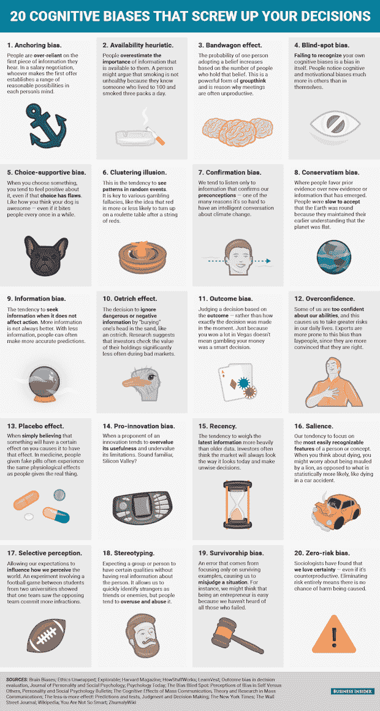
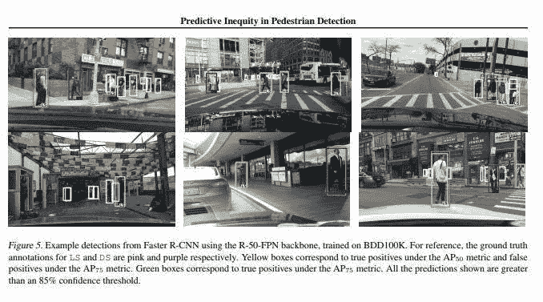

# 机器学习中的人类偏见

> 原文：<https://towardsdatascience.com/bias-what-it-means-in-the-big-data-world-6e64893e92a1?source=collection_archive---------20----------------------->

## 这对我们现代大数据世界意味着什么


偏见是人性不可避免的一部分。之前的研究表明，当人们分心时，认知偏差会优化大脑功能。偏见受到你的环境、经历的影响，并且很难消除。最小化偏见影响的一个方法是意识到你可能会遇到的偏见。

在这篇文章中，我将描述不同类型的偏见在机器学习项目中可能造成的一些影响。举例说明由这些偏见引起的问题的根源以及为什么偏见是有用的。

由于人类固有的偏见，偏见会反映在世界上存在的所有数据中。随着机器学习和大数据的日益普及和普及；世界上存在着难以想象的数据深度和可用工具。有了这些数据，偏见会影响数据和我们的推论。

偏差不仅仅存在于数据中，科学家在进行研究、实验或实现算法时也可能存在不可知的偏差。简单的步骤，例如在测试时不考虑某些参数或特性，可能会导致真正的后果。



[Source](https://www.businessinsider.com/cognitive-biases-that-affect-decisions-2015-8)

影响机器学习算法的偏差的术语是**机器偏差**。它与所用数据的偏差或研究者的偏差如何影响最终结果有关。机器偏差对现实世界有影响，会带来危险并强化系统偏差。

# 示例 1:图像识别中的采样偏差

## 对于自动驾驶汽车中的行人检测，有色人种更难分类。



Note: This was research from a [scientific paper](https://arxiv.org/pdf/1902.11097.pdf), which does not reflect commercial self-driving systems

这个具体问题是由**采样偏差**引起的，这是一种来自不平衡训练数据的偏差，它不能代表模型将在其中运行的环境。例如，只在美国农村的行人照片上训练的行人识别模型在多元文化的城市中不会很好地运行，因为来自两个人口的行人不会有相似的外观。

这个例子是在现实生活中实现的，因为社会正在向更多的自动驾驶汽车发展。这个问题很可能是由于在训练 CNN 算法时，训练数据中缺少来自代表性不足的背景的个体而引起的。这也可能是由于深色皮肤或深色衣服与背景之间的对比度较低的自然困难造成的。

# **示例 2:情感分析中的偏见**

**偏见偏见**当算法接受来自数据源的细微偏见时，即使它被完美地采样。

用来描述这种偏见的经典例子是一个机器学习模型，它旨在区分照片中的男性和女性。训练数据包含厨房中女性的图片比厨房中男性的图片多，或者男性编码的图片比女性多，则算法被训练为由于数据中表示的真实世界中发生的偏见而对从事这些活动的人的性别做出不正确的推断。

情感分析是使用机器学习算法来检测文本主体的情感或主观情感。目前，这些算法通过利用预构建的单词嵌入来运行，单词嵌入是一种预设计的模型系统，用于产生从文本主体构建语言上下文的向量，以分析文本的情感。然而，几乎所有流行的单词嵌入都是在人类数据上训练的，如新闻文章( [word2vec](https://en.wikipedia.org/wiki/Word2vec) )或网页([手套](https://nlp.stanford.edu/projects/glove/))以及受到现实世界中偏见影响的[。](https://researchportal.bath.ac.uk/en/publications/semantics-derived-automatically-from-language-corpora-necessarily)

下面是使用手套嵌入和线性分类器构建的简单[情感分析模型的输出示例。这个简单的情感分析模型的例子并没有反映消费者层面的系统。](http://blog.conceptnet.io/posts/2017/how-to-make-a-racist-ai-without-really-trying/)

```
text_to_sentiment("this example is pretty cool")
3.8899689260
text_to_sentiment("this example is ok")
2.7997773492
text_to_sentiment("meh, this example sucks")
-1.1774475917
```

这就是该系统的预期工作方式，即“相当酷”与其他积极的词相关，这给了它比“糟透了”更高的分数。

```
text_to_sentiment("Let's go get Italian food")
2.0429166109
text_to_sentiment("Let's go get Chinese food")
1.4094033658
text_to_sentiment("Let's go get Mexican food")
0.3880198556
```

偏见的影响出现了，因为带有单词“墨西哥”和“中国”的负面网页比带有单词“意大利”的负面网页多，所以带有“意大利”的情绪得分比其它单词更积极。

```
text_to_sentiment("My name is Emily")
2.2286179365
text_to_sentiment("My name is Heather")
1.3976291151
text_to_sentiment("My name is Yvette")
0.9846380213
text_to_sentiment("My name is Shaniqua")
-0.4704813178
```

这个例子与上一个类似，与不太常见的名字相比，更常见的名字往往出现在更积极的网页中，这提高了积极的情绪。

简单地说，种族偏见存在于情感分析系统中，因为种族偏见也出现在训练它的数据中。当单词的情感被网页训练时，在 GloVe 的情况下，种族单词或名字可能具有较低的情感，因为包含那些单词或名字的正面 web 评论和页面的数量较少。这在我们的模型中产生了种族偏见，因为给出的数据只会强化现实世界中存在的系统性偏见。

偏见以多种形式存在，例如[刑事司法系统中带有预测模型的种族偏见](https://www.propublica.org/article/machine-bias-risk-assessments-in-criminal-sentencing)并且很难纠正，因为它来自于现实世界中存在的偏见的反映。了解您正在处理的数据的领域知识，并意识到其中存在的复杂性，这一点很重要。

# 例子 3:算法偏差，策划“年度最佳播放”

有时候，这真的只是算法的问题。算法偏差是当算法，由于它是如何设计的，将有偏见内置。Spotify 每年都会根据你前一年听的歌曲创建一个播放列表。由于算法的设计，你两年前听的歌曲存在算法偏差。因为*算法考虑了你听了多少前一个播放列表*中的歌曲，它为那些歌曲建立了一个偏好。

# 但这并不是一件坏事

人类通常不会经历音乐偏好的剧烈变化。你前几年喜欢的歌曲*在今年会变得更加有趣。偏差不是固有的负值，虽然算法中存在偏差，但算法在 Sporify 平台中是有效的。有偏差的训练数据是一种预处理数据。意识到这种偏见很重要，但这不一定是件坏事。*

比如 LinkedIn 有一个 messenger 系统，有很棒的回复建议系统。这是因为 LinkedIn 训练其模型的信息更偏向于商务正式信息。有偏差的训练数据可以使基于使用它们的上下文的模型受益。LinkedIn 的回复推荐系统如果用于非正式的短信，效果不会很好，但对于基于职业生涯的专业网站中的商业信息来说是完美的。

重要的是要意识到在分析过程的每一步中可能出现的偏差。意识到偏见以及它们如何通过上下文影响我们的模型是很重要的，因为它可能是致命的缺陷，也可能是惊人的好处。随着世界上收集和分析的数据越来越多，了解数据的所有细节和复杂性非常重要。

理解机器学习算法就是算法很重要。在统计和编程的下面是简单地试图最大化或最小化一个等式的数学等式。说到底，大家都明白“垃圾进就是垃圾出”。

*注意:因为我想把重点放在可能来自数据或模型实现的偏差形式上，所以我选择谈一点关于统计和机器学习偏差的技术定义。*

## 参考

[1] S. Plous，[《偏见、定型和歧视的心理学:概述》](https://pdfs.semanticscholar.org/c6c0/2f8929a48871689d757122c1bb346c6265b5.pdf) (2003 年)，理解偏见和歧视(第 3-48 页)。美国纽约州纽约市:麦格劳-希尔公司。

[2] S. Lee 和 S. Lebowitz， [20 种让你的决定变得一团糟的认知偏见](https://www.businessinsider.com/cognitive-biases-that-affect-decisions-2015-8) (2015)，商业内幕

[3] B. Wilson，J. Hoffman 和 J.Morgenstern，[物体检测中的预测不平等](https://arxiv.org/pdf/1902.11097.pdf) (2019)，arXiv

[4] A. Caliskan，J. J Bryson 和 A. Narayanan，[从包含类人偏见的语言语料库中自动导出的语义](https://researchportal.bath.ac.uk/en/publications/semantics-derived-automatically-from-language-corpora-necessarily) (2017)，*科学*， *356* (6334)，183–186。[https://doi.org/10.1126/science.aal4230](https://doi.org/10.1126/science.aal4230)

[5] R. Speer，[如何在不真正尝试的情况下制造一个种族主义的人工智能](http://blog.conceptnet.io/posts/2017/how-to-make-a-racist-ai-without-really-trying/) (2017)，ConceptNet 博客

[6] J. Angwin，J. Larson，S. Mattu 和 L. Kirchner，[机器偏差](https://www.propublica.org/article/machine-bias-risk-assessments-in-criminal-sentencing) (2016)，Propublica