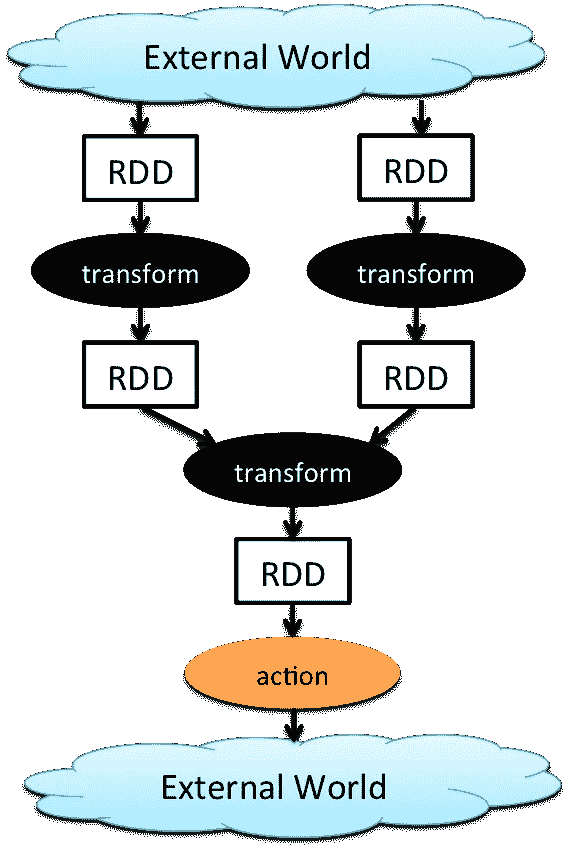

# 大数据分析:Spark 和 Hadoop

> 原文：<https://towardsdatascience.com/big-data-analysis-spark-and-hadoop-a11ba591c057?source=collection_archive---------8----------------------->

## 介绍大数据和用于处理大数据的不同技术，如 MapReduce、Apache Spark 和 Hadoop。

(Source: [https://images.xenonstack.com/blog/10-vs-of-big-data.png](https://images.xenonstack.com/blog/10-vs-of-big-data.png))

# 大数据

据《福布斯》报道，每天产生大约 2.5 万亿字节的数据。尽管如此，这个数字预计在接下来的几年里会不断增加(90%的现有存储数据是在过去两年内产生的)[1]。

大数据不同于存储在关系数据库中的任何其他大量数据的地方在于它的异构性。这些数据来自不同的来源，并且是用不同的格式记录的。

通常采用三种不同的数据格式化方式:

*   **非结构化** =无组织的数据(如视频)。
*   **半结构化** =数据以不固定的格式组织(如 JSON)。
*   **结构化** =数据以结构化格式存储(如 RDBMS)。

大数据由三个属性定义:

1.  **卷** =由于数据量大，在单台机器上存储数据是不可能的。我们如何在多台机器上处理数据以确保容错？
2.  多样化=我们如何处理来自不同来源、使用不同模式格式化的数据？
3.  **速度** =如何快速存储和处理新数据？

可以使用两种不同的处理技术来分析大数据:

*   **批处理** =通常在我们关心数据的数量和种类时使用。我们首先存储所有需要的数据，然后一次性处理这些数据(这会导致高延迟)。一个常见的应用示例是计算每月工资总额。
*   **流处理** =如果我们对快速响应时间感兴趣，通常会采用。我们一收到数据就进行处理(低延迟)。一个应用示例可以是确定银行交易是否是欺诈性的。

大数据可以使用不同的工具进行处理，如 MapReduce、Spark、Hadoop、Pig、Hive、Cassandra 和 Kafka。每一种不同的工具都有其优势和劣势，这决定了公司可能决定如何使用它们[2]。

Figure 1: Big Data Tools [2]

现在，许多公司普遍使用大数据分析来预测市场趋势、个性化客户体验、加快公司工作流程等

# MapReduce

当处理大量数据并且资源耗尽时，有两种可能的解决方案:水平扩展或垂直扩展。

在水平扩展中，我们通过添加更多相同容量的机器和分配工作负载来解决这个问题。如果使用垂直扩展，我们可以通过增加机器的计算能力(如 CPU、RAM)来进行扩展。

垂直缩放比水平缩放更容易管理和控制，并且在处理相对较小的问题时被证明是有效的。尽管如此，在处理大型问题时，水平缩放通常比垂直缩放更便宜、更快。

MapReduce 基于水平缩放。在 MapReduce 中，计算机集群用于并行化，从而更容易处理大数据。

在 MapReduce 中，我们将输入数据分成许多部分。然后，每个零件被发送到不同的机器进行处理，最后根据指定的 *groupby* 函数进行汇总。

Figure 2: MapReduce in action [3]

# 阿帕奇火花

Apache Spark 框架是作为 MapReduce 的改进而开发的。让 Spark 从竞争对手中脱颖而出的是它的执行速度，比 MapReduce 快 100 倍左右(中间结果不存储，一切都在内存中执行)。

Apache Spark 通常用于:

1.  读取存储和实时数据。
2.  预处理大量数据(SQL)。
3.  使用机器学习和流程图网络分析数据。

Figure 3: Apache Spark Libraries [4]

Apache Spark 可以配合 Python、R、Scala 等编程语言使用。为了运行 Spark，通常使用基于云的应用；如亚马逊网络服务、微软 Azure 和 Databricks(提供免费社区版)。

使用 Spark 时，我们的大数据通过弹性分布式数据集(rdd)实现并行化。rdd 是 Apache Spark 最基本的抽象，它获取我们的原始数据并将其划分到不同的集群(workers)中。RRD 是容错的，这意味着它们能够在任何一个工人失败的情况下恢复丢失的数据。

rdd 可用于在 Spark 中执行两种类型的操作:转换和操作(图 4)。

Figure 4: Apache Spark Workflow [5]

转换从 RDD 创建新的数据集，并返回结果 RDD(例如，通过关键操作进行映射、过滤和归约)。所有的转换都是惰性的，它们只在一个动作被调用时执行一次(它们被放在一个执行图中，然后在一个动作被调用时执行)。

取而代之的是使用动作从 Apache Spark 中获取我们的分析结果，并将一个值返回给我们的 Python/R 应用程序(例如收集和获取操作)。

为了在 Spark 中存储键/值对，使用对 rdd。rdd 对由存储在元组中的两个 RRD 组成。第一个元组元素用于存储键值，第二个元组元素用于存储值元素(key，value)。

# Hadoop

Hadoop 是一组用 Java 编写的开源程序，可用于对大量数据执行操作。Hadoop 是一个可扩展、分布式和容错的生态系统。Hadoop 的主要组件有[6]:

*   **Hadoop YARN** =管理和调度系统资源，将工作负载划分到一个机器集群上。
*   **Hadoop 分布式文件系统(HDFS)** =是一个集群文件存储系统，旨在提供容错、高吞吐量和高带宽。它还能够以任何可能的格式存储任何类型的数据。
*   **Hadoop MapReduce** =用于从数据库中加载数据，对其进行格式化并对其进行定量分析。

Figure 5: Hadoop Ecosystem [7]

Hadoop 的一些应用示例有:搜索(如雅虎)、日志处理/数据仓库(如脸书)和视频/图像分析(如纽约时报)。

Hadoop 传统上是第一个大规模使用 MapReduce 的系统，尽管 Apache Spark 由于其更快的执行速度而成为许多公司的首选框架。

# 结论

大数据一词最初被用来描述一个问题:我们产生的数据超过了我们实际处理的能力。经过多年的研究和技术进步，大数据现在被视为一个机遇。由于大数据，人工智能和深度学习的最新进展已经成为可能，使机器能够执行几年前似乎不可能执行的任务。

# 联系人

如果你想了解我最新的文章和项目[，请通过媒体](https://medium.com/@pierpaoloippolito28?source=post_page---------------------------)关注我，并订阅我的[邮件列表](http://eepurl.com/gwO-Dr?source=post_page---------------------------)。以下是我的一些联系人详细信息:

*   [领英](https://uk.linkedin.com/in/pier-paolo-ippolito-202917146?source=post_page---------------------------)
*   [个人博客](https://pierpaolo28.github.io/blog/?source=post_page---------------------------)
*   [个人网站](https://pierpaolo28.github.io/?source=post_page---------------------------)
*   [中等轮廓](https://towardsdatascience.com/@pierpaoloippolito28?source=post_page---------------------------)
*   [GitHub](https://github.com/pierpaolo28?source=post_page---------------------------)
*   [卡格尔](https://www.kaggle.com/pierpaolo28?source=post_page---------------------------)

# 文献学

[1]什么是大数据？—大数据世界入门指南。阿努什里·苏布拉马年，爱德华卡！。访问地点:[https://www.edureka.co/blog/what-is-big-data/](https://www.edureka.co/blog/what-is-big-data/)

[2]查看一些最著名的大数据工具及其优缺点，以分析您的数据。机器人之家。访问:[https://www . houseofbots . com/news-detail/12023-1-see-some-best-known-big-data-tools-there-advantage-and-missives-to-analyze-your-data](https://www.houseofbots.com/news-detail/12023-1-see-some-best-known-big-data-tools,-there-advantages-and-disadvantages-to-analyze-your-data)

[3]什么是 MapReduce？。莎娜.珀尔曼塔伦德。访问地点:【https://www.talend.com/resources/what-is-mapreduce/ 

[4] Apache Spark 文档。访问地点:【https://spark.apache.org/ 

[5]Apache Spark 的转换和操作是如何工作的…亚历克斯·安东尼，中号。访问:[https://medium . com/@ aristo _ Alex/how-Apache-sparks-transformations-and-action-works-CEB 0d 03 b 00d 0](https://medium.com/@aristo_alex/how-apache-sparks-transformations-and-action-works-ceb0d03b00d0)

[6] Apache Hadoop 用 5 分钟或更短时间解释。什拉万蒂·登特姆达斯·克雷德拉。访问地址:[https://www . credera . com/blog/technology-insights/open-source-technology-insights/Apache-Hadoop-explained-5-minutes-less/](https://www.credera.com/blog/technology-insights/open-source-technology-insights/apache-hadoop-explained-5-minutes-less/)

[7] Hadoop 生态系统及其组件—完整教程。数据天赋。访问地址:[https://data-flair . training/blogs/Hadoop-ecosystem-components/](https://data-flair.training/blogs/hadoop-ecosystem-components/)