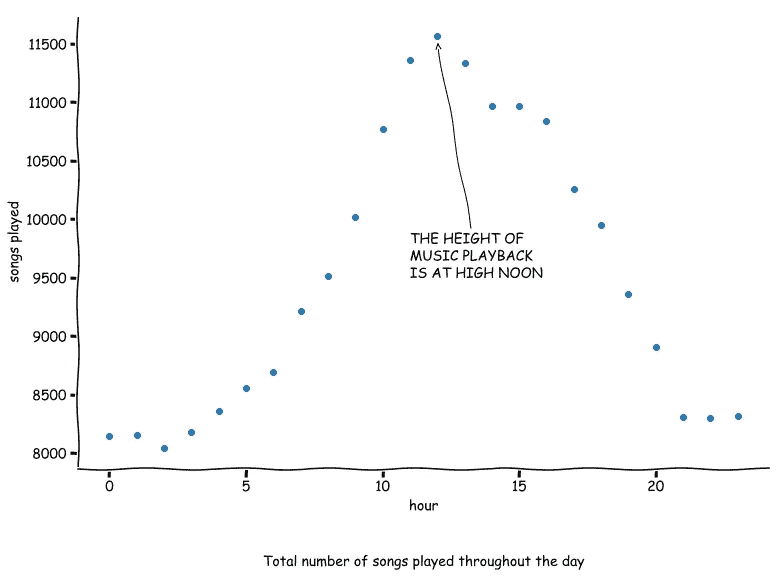
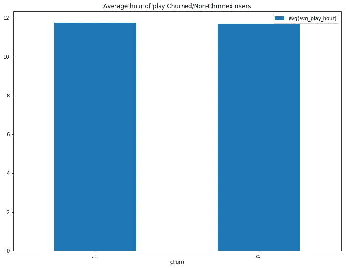
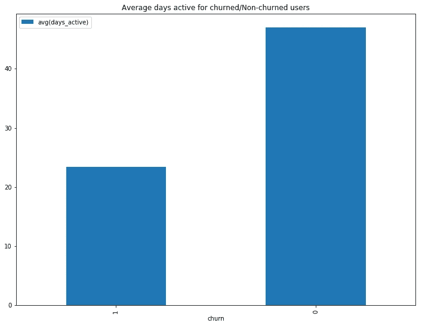
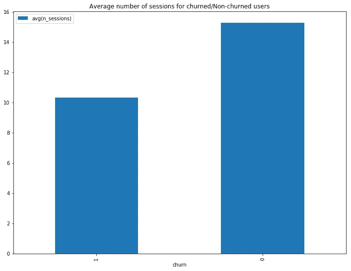
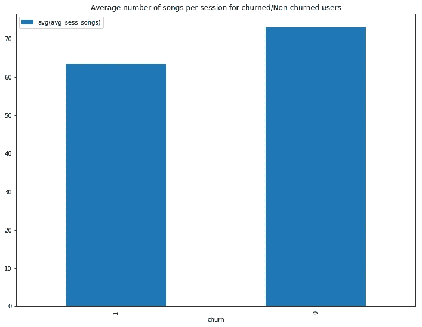
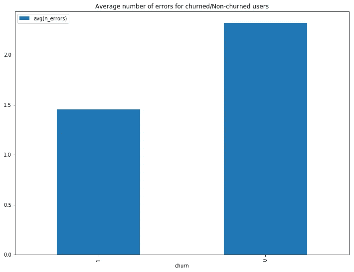

# 大数据分析:用 PySpark 预测客户流失

> 原文：<https://towardsdatascience.com/big-data-analytics-predicting-customer-churn-with-pyspark-19cd764f14d1?source=collection_archive---------10----------------------->


Photo by [Leio McLaren (@leiomclaren)](https://unsplash.com/@leio?utm_source=medium&utm_medium=referral) on [Unsplash](https://unsplash.com?utm_source=medium&utm_medium=referral)

对于任何基于订阅的商业模式来说，一个更紧迫的问题是什么让人们订阅，更重要的是*退订*。带上你的 Spotify-s、Pandora-s 或网飞-es。这些公司的核心收入来源于用户订阅费。因此，如何留住这些客户对他们的生存至关重要。

# **了解客户流失**

在客户群的背景下，good ol' Wikipedia 将流失率定义为“在给定时间段内离开供应商的合同客户或订户的比例”。换句话说，有多少人在弃船(或*大锅*)？他们可能会订阅竞争对手的业务，或者完全放弃这项服务。


Design by [Artpunk101](https://www.teepublic.com/user/artpunk101)

> 如果你错过了，大锅是服务的隐喻，泄漏是流失的隐喻。

更确切地说，如果我们的大锅漏得比灌得快，那么它将不可避免地干涸。这是我们当前项目的主要问题:预测哪些用户可能会取消在线音乐流媒体服务的订阅，更重要的是，*为什么*？

让我们从检查我们拥有的数据集开始。

完整的数据集是一个非常细粒度的用户日志，存储在 AWS 上的 12 GB json 文件中——在这样的大小下，只有 Spark 这样的大数据框架才是可行的。为了理解可用的特性并构建我们的模型，我们将从使用一小部分数据开始(大约 128 MB)。该示例将在单台计算机上用于探索性数据分析。

第一步是加载我们的数据，如下所示:

让我们通过打印模式来享受丰富的数据:

```
root
 |-- artist: string (nullable = true)
 |-- auth: string (nullable = true)
 |-- firstName: string (nullable = true)
 |-- gender: string (nullable = true)
 |-- itemInSession: long (nullable = true)
 |-- lastName: string (nullable = true)
 |-- length: double (nullable = true)
 |-- level: string (nullable = true)
 |-- location: string (nullable = true)
 |-- method: string (nullable = true)
 |-- page: string (nullable = true)
 |-- registration: long (nullable = true)
 |-- sessionId: long (nullable = true)
 |-- song: string (nullable = true)
 |-- status: long (nullable = true)
 |-- ts: long (nullable = true)
 |-- userAgent: string (nullable = true)
 |-- userId: string (nullable = true)
```

# **探索性分析**

粗略地看了一下数据，我们注意到有些行中缺少了用户 Id。经过进一步调查，似乎只有以下页面没有 *userId* :

```
+ — — — — — — — — — -+
|                page|
+ — — — — — — — — — -+
|                Home|
|               About|
| Submit Registration|
|               Login|
|            Register|
|                Help|
|               Error|
+ — — — — — — — — — -+
```

这让我们相信这些没有 ID 的页面点击来自那些没有注册、没有登录或者没有播放音乐的人。所有这些页面最终都会导致播放音乐。然而，由于这些行包含的大部分都是空值，所以在开始分析之前，我们将删除它们。

仅从上一节的特性名称列表中，我们就可以知道数据有多丰富。可以肯定地说，用户与应用程序的每一次交互都会被记录下来。

在不深入数据的情况下，我们首先需要定义*变动*。对于我们的项目来说，一个不安的用户就是访问了“取消确认”页面的人。这是用户确认取消请求的地方。此后，任何访问过该页面的用户都将被归类为“搅动者”，否则他们将被视为“非搅动者”。

对我们来说幸运的是，打印出*页面*特性中的类别表明它就有这样一个值。

```
+-------------------------+
|page                     |
+-------------------------+
|About                    |
|Add Friend               |
|Add to Playlist          |
|Cancel                   |
|***Cancellation Confirmation***|
|Downgrade                |
|Error                    |
|Help                     |
|Home                     |
|Login                    |
|Logout                   |
|NextSong                 |
|Register                 |
|Roll Advert              |
|Save Settings            |
|Settings                 |
|Submit Downgrade         |
|Submit Registration      |
|Submit Upgrade           |
|Thumbs Down              |
|Thumbs Up                |
|Upgrade                  |
+-------------------------+
```

通过查看随机用户活动的一些选定列，我们可以获得更好的洞察力。

```
+--------------------+-------------+---------+-----+---------+
|              artist|itemInSession|   length|level|     page|
+--------------------+-------------+---------+-----+---------+
|         Cat Stevens|            0|183.19628| paid| NextSong|
|        Simon Harris|            1|195.83955| paid| NextSong|
|         Tenacious D|            2|165.95546| paid| NextSong|
|          STEVE CAMP|            3|201.82159| paid| NextSong|
|             DJ Koze|            4|208.74404| paid| NextSong|
|           Lifehouse|            5|249.18159| paid| NextSong|
|Usher Featuring L...|            6|250.38322| paid| NextSong|
|                null|            7|     null| paid|Thumbs Up|
|            Harmonia|            8|655.77751| paid| NextSong|
|           Goldfrapp|            9|251.14077| paid| NextSong|
+--------------------+-------------+---------+-----+---------+
```

或者我们可以观察一天中什么时候歌曲播放最多。结果是在中午或午餐时间。



xkcd-like scatter plot

# **特色工程**

既然我们已经清楚地确定了流失的用户，那么是时候戴上数据科学的帽子，尝试确定流失率的影响因素了。*如果一个人对服务不满意，他会怎么做？* 我将尝试用以下 6 个工程特性来回答这个问题:

1.  **用户播放歌曲的平均小时数**



也许没有享受这项服务的人倾向于在每天不同的时间播放音乐。很明显，这两组之间的差异可以忽略不计。搅动和非搅动用户之间的实际值分别为 11.74 和 11.71。只差了 1 分 48 秒。然而，我们将把它保留在我们的模型中，因为一旦我们把它与我们将要创建的其他特性结合起来，它可能会被证明是有用的。

**2。性别**

我们的音乐流媒体服务可能对某一性别更有吸引力。值得调查的是，某一性别是否在被搅动的用户中被过度代表。我们将为性别创建一个虚拟变量，男性的值为 1，女性的值为 0。

通过按性别和流失率对用户进行分组，我们可以清楚地看到，在流失率较高的群体中，男性的比例过高。62%的呕吐过的用户是男性，而非呕吐过的用户中只有 51%是男性。所以男性更有可能取消订阅。

```
+-----+------------------+
|churn|   avg(gender_dum)|
+-----+------------------+
|    1|0.6153846153846154|
|    0|0.5144508670520231|
+-----+------------------+
```

**3。活动天数**



刚刚注册这项服务的人可能还没有对这项服务形成真正的看法。首先，他们没有足够的时间尝试所有不同的功能。人们也需要时间来适应任何新软件。这在理论上应该会让那些订阅时间不长的新用户更有可能取消订阅或流失。

事实证明，我们的理论是准确的，新用户比老用户更有可能取消。

**4。会话数量**

更频繁登录的用户享受这项服务是有道理的，因为他们使用它的频率更高了。有人登录的次数越多，就越有可能继续使用我们的服务。



事实证明这是准确的。类似于*日活动*功能，新用户或不经常使用该服务的人更有可能取消。

**5。每期平均歌曲数量**

重要的不仅仅是会议的数量，还有质量。即使对于偶尔播放音乐的用户来说，他们仍然可以每次持续收听大量歌曲。表明体验良好，尽管他们使用的次数很少。



虽然差别很小，但肯定是看得见的。这种影响可能不如前两个计算的特征那么显著，但它足够明显，可以保留在我们的分析中，并找出它的相关性。

**6。遇到的错误数量**

我们能收到的最烦人的消息之一是错误消息。尤其是干扰我们全神贯注的东西，如流媒体电影或音乐。平均而言，经历更多错误的用户应该更有可能取消他们的服务，因为他们有过更糟糕的经历。我们来看看判决结果。



事实证明，兴奋的用户经历的错误更少。这可能是因为非搅动用户活跃的时间范围更长。因此，我们使用这项服务的时间越长，就越有可能出错。从各方面考虑，错误率很低。

# 构建我们的模型

随着我们的功能得到适当的设计，我们将训练三个模型，并选择最好的一个:

1.  逻辑回归
2.  随机森林
3.  梯度增强树

在我们构建模块化代码的尝试中，我们编写了一个函数，为每个模型构建一个管道并运行它。如果我们想要在具有不同超参数的数据上训练我们的模型，也需要参数网格。

在从超参数的组合中找到最佳拟合模型后，它由我们的函数返回。然后，我们可以将每个模型应用于我们的测试数据，并通过使用标准的评估度量来计算它的准确性。在这种情况下，我们将使用 F1 的分数。

F1 分数是精确度和召回率的加权平均值。这是一个很好的衡量一般问题的方法，因为它不会仅仅因为假阳性或假阴性而严重扭曲。当我们的阶级分布不均匀时，这一点特别有用，这正是我们现在的情况。

最终结果是:

```
The F1 score for the logistic regression model is: 0.825968664977952
The F1 score for the random forest model is: 0.8823529411764707
The F1 score for the gradient-boosted tree is: 0.8298039215686274
```

通过使用相同的指标，我们可以很容易地比较所有 4 个模型，并得出结论，在这个“较小”的数据集中，预测用户流失最准确的模型是随机森林分类器。

## 全数据集训练

下一步是获取我们的功能代码，并在 AWS 上的集群上运行它。我们在尝试对整个数据集进行分析时遇到了几个问题。虽然这些问题看起来很小，但考虑到 Spark 集群处理数据所花费的时间，解决它们需要很长时间。

首先，集群上的熊猫版本已经过时。我们通过简单地将有问题的方法从“toPandas()”改为“show()”来解决这个问题。虽然输出看起来不那么吸引人，但它达到了目的。

其次，Spark 在一定时间后超时，这使得超时前的结果无用。我能找到的唯一可行的解决方案是增加集群大小，以缩短处理代码所需的时间。

这是一个令人惊讶的问题，因为 Spark 是一个大数据框架，所以预计会有很长的处理时间。

第三，鉴于超时问题以及处理一个模型上的数据需要多少时间，对超参数执行网格搜索被证明是特别具有挑战性的。所以为了我们自己的理智，我们使用默认参数作为我们选择的分类器。

最后，最大的问题发生在模型评估阶段。即使模型被训练得没有任何明显的问题，我仍然得到下面的错误消息，并且找不到解决方法。

```
Exception in thread cell_monitor-17:
Traceback (most recent call last):
  File "/opt/conda/lib/python3.6/threading.py", line 916, in _bootstrap_inner
    self.run()
  File "/opt/conda/lib/python3.6/threading.py", line 864, in run
    self._target(*self._args, **self._kwargs)
  File "/opt/conda/lib/python3.6/site-packages/awseditorssparkmonitoringwidget-1.0-py3.6.egg/awseditorssparkmonitoringwidget/cellmonitor.py", line 178, in cell_monitor
    job_binned_stages[job_id][stage_id] = all_stages[stage_id]
KeyError: 1256
```

我无法正确地衡量准确性或找到随机森林分类器的混淆矩阵。不幸的是，我们只能假设，当使用 AWS 上的集群训练完整数据集时，该模型的性能会更好。

## 特征重要性

从商业角度来看，模型的准确性并不是决策者唯一感兴趣的事情。他们还想知道到底是什么促使人们取消或退订他们的服务。下图显示了每个特性在决策中的确切作用。

```
+--------------+----------+
|feature       |importance|
+--------------+----------+
|days_active   |0.4959    |
|n_sessions    |0.2146    |
|avg_play_hour |0.1355    |
|avg_sess_songs|0.1009    |
|n_errors      |0.0386    |
|gender_dum    |0.0145    |
+--------------+----------+
```

事实证明，在预测用户流失时，活跃天数和流媒体音乐的会话数是最重要的特征。

# 结论

概括地说，我们利用 PySpark，或者 Python 的 Spark。有了这个框架，我们构建了一个端到端的机器学习工作流。该工作流可以通过分析每个用户与所述服务的交互来识别音乐流服务的潜在客户。

数据探索这一步非常有趣，因为我们可以从用户的习惯中清楚地看到他们的行为。至少可以说，看看一些会议持续了多长时间，持续到多晚，以及音乐类型在一天的不同时间是如何变化的，是很有趣的。

工程特征集中于各种行为。它们包括与服务的互动，或者注重时间和个性而不是音乐品味的聆听习惯。这些行为还包括对服务满意度的测量，例如用户遇到的错误总数。在训练我们的模型之前，所选择的特征被缩放到范围`[0,1]`，以便较大的值不会扭曲模型。最后，我们发现我们组中最好的模型是随机森林分类器。我们试图在完整的数据集上训练它，以获得更好的结果。

大数据分析有其独特的挑战。调试如此漫长的过程被证明是非常耗时的。但最后，这是一个非常有趣的练习，结果更有趣。

## 未来的改进

尽管有些模型表现得出人意料地好，我还是很想看看对最成功的模型进行交叉验证的结果。微调超参数可能会产生模型的优化版本，该版本可能足够健壮以用于生产。但是为了达到这个结果，我们要么需要更多的电脑，要么需要更多的咖啡。