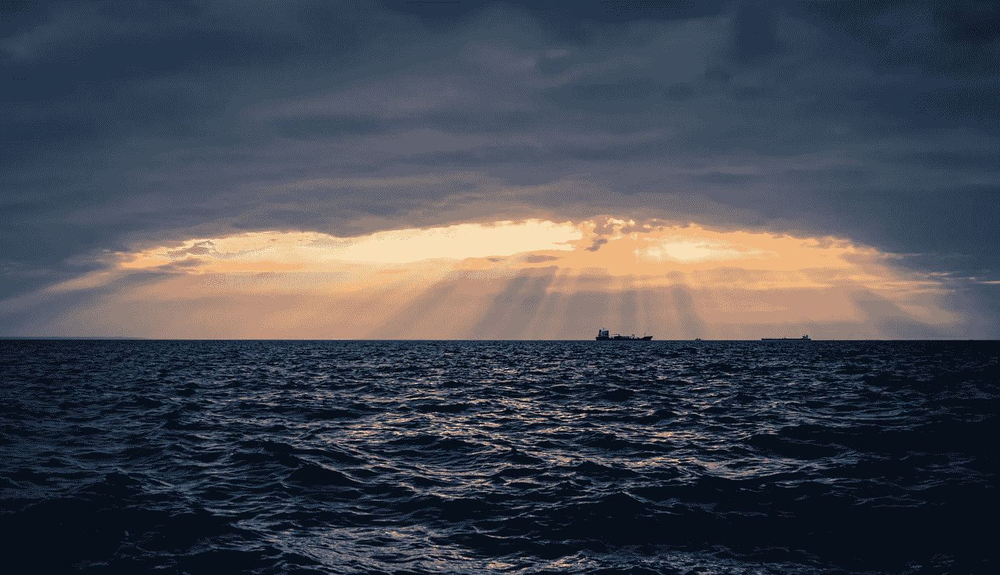
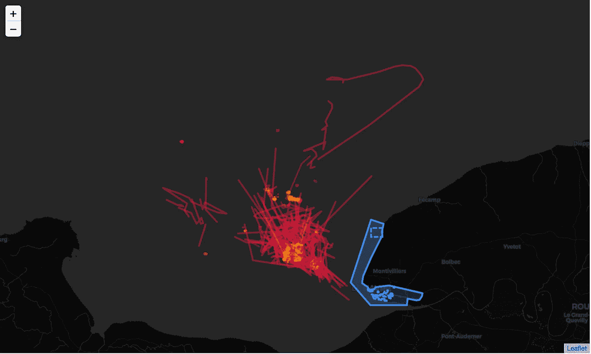
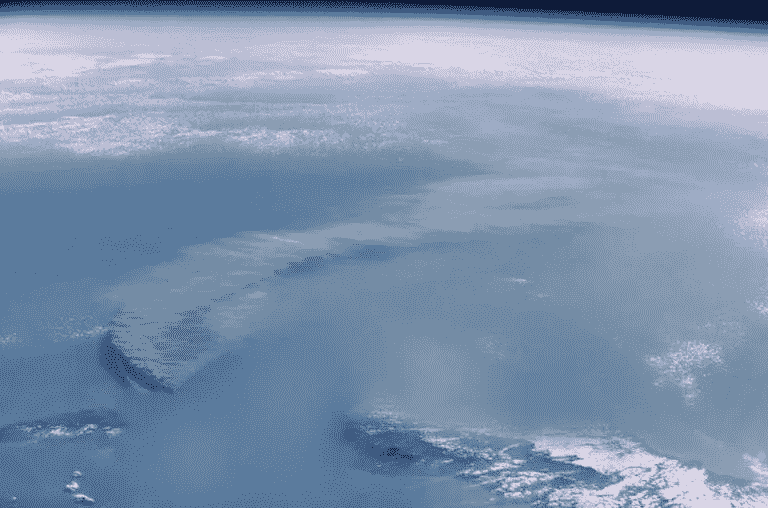
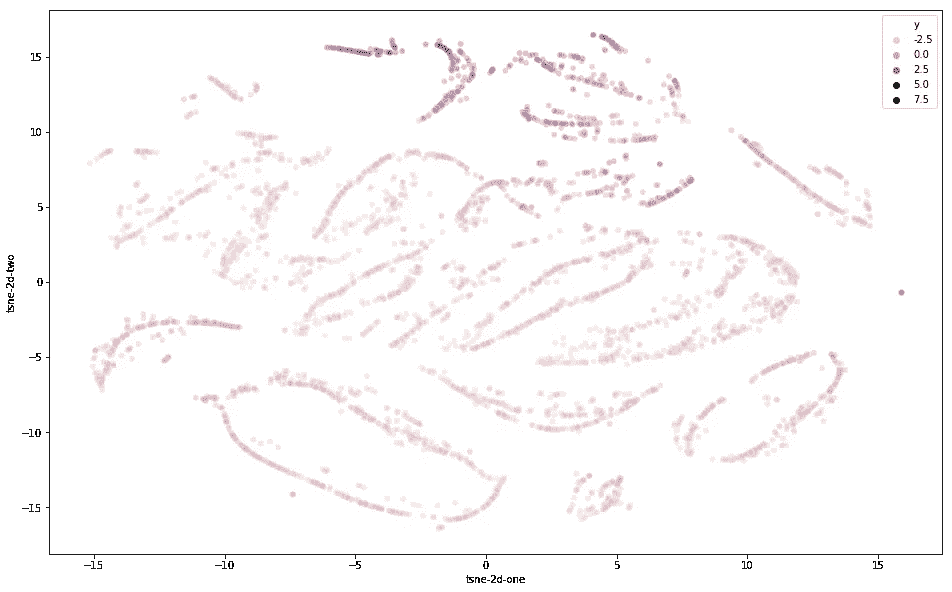
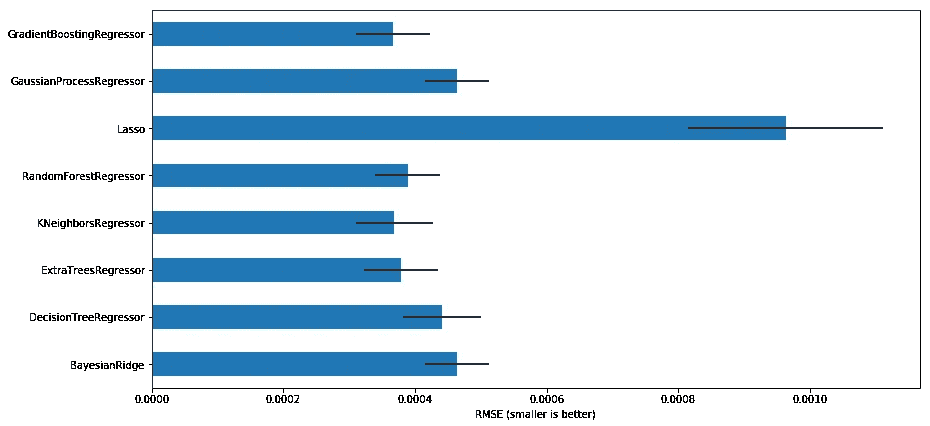
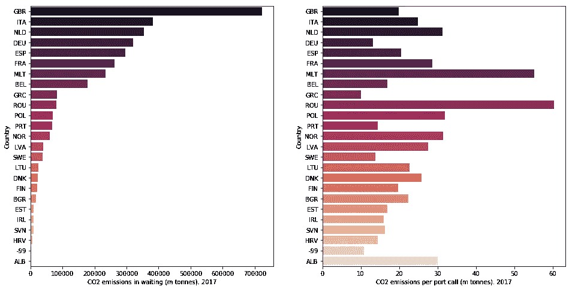
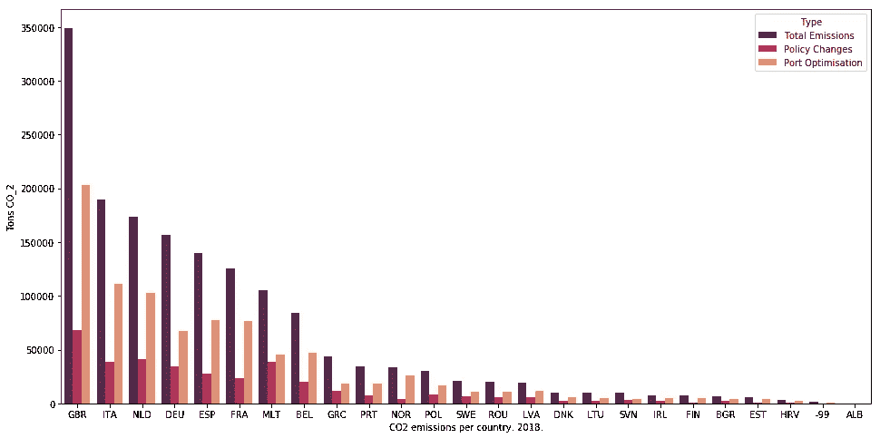

# 大数据与海洋运输的环境影响。

> 原文：<https://towardsdatascience.com/big-data-and-environmental-impact-of-the-maritime-transportation-299030dbb929?source=collection_archive---------27----------------------->



## 我们如何利用机器学习和大数据来拯救地球。

封面照片是住在港口附近的人都知道的一个例子。平均而言，每一艘停泊在欧洲港口的船只，都有另一艘在外面等待，等待的环境影响与停泊在港口内的环境影响相比较。我们发现这种影响可以减少 80%。

在我们之前的文章【1】中，我们提到我们发现了奇怪船只行为的数字痕迹。船只花费大量时间在港口和锚地附近停泊或移动。
这些等待时间以及港口内的等待时间对当前和未来船舶的燃料消耗以及温室气体、颗粒物、NOₓ和 SOₓ的排放造成了重大影响，增加了港口运营对当地环境的影响。
欧盟( [EU Regulation 2015/757](http://eur-lex.europa.eu/legal-content/EN/TXT/PDF/?uri=CELEX:02015R0757-20161216&qid=1484666516378&from=EN) )要求自 2018 年 1 月 1 日起，所有船只在欧盟区域内从事进出欧盟区域的航运活动时，必须申报 CO₂。这些数据包括在港口停泊期间的 CO₂排放量，但不包括在港口外等待期间的排放量。

我们对这些等待时间和相关排放的估计感兴趣，因为它们不会带来任何价值，并且是由港口拥挤或船长或货船基于经济的决策造成的。

文章由四部分组成:

*   数据预处理，我们给出等待轨迹的细节。
*   CO₂排放的可用数据，其中我们概述了不同制度下不同船舶的 CO₂排放数据的估算算法。
*   CO₂的总排放量，我们比较港口和国家的综合排放量。
*   呼吁采取行动，我们提出了减少海岸线附近 CO₂排放量的两种方法，并量化了这些方法的可能结果。



Trajectories of the vessels waiting to enter Le Havre port.

# 数据预处理。

[Mariquant](https://www.mariquant.com/) 从 2016 年初到 2018 年年中，从一家 AIS 数据提供商获得散货船和油轮的每小时数据。该数据包含来自约 19 000 艘有记录的独特船只的信息，作为未压缩的拼花文件大约占用 100 Gb。

我们有一个多边形库，有大约 8 000 个港口和 20 000 个锚地和等候区。大多数时候，锚泊多边形位于端口多边形之外，我们使用图形算法来确定哪个锚泊属于哪个端口。

我们使用随机森林分类器[2]来寻找船只轨迹上的等待点。您可以在之前的文章[“从 AIS 数据的海洋中创建海上航线”【1】中找到我们方法的详细信息。](/creating-sea-routes-from-the-sea-of-ais-data-30bc68d8530e)

除了用于路线准备的保守检查外，我们还增加了额外的入口-出口检查。如果 80%的轨迹段之间的角度小于 15 度，则我们排除所有的开始和结束轨迹段。

在这种方法中，上图中那些看似直的短直线实际上是“卷曲的”，如下图所示。


# 关于 CO₂排放量的现有数据。

大多数船只不使用测量排放的仪器方法；而且，相当比例的船舶甚至没有燃油流量计。因此，可用的报告(如[3]和[5])是从理论估计构建的。一些初创企业/扩大规模的企业对这个问题有部分解决方案，但没有一个被业界接受。
此外，测量结果总有可能被船员轻易篡改(就像传感器周围的过滤器)。



This photo presumably shows a smoke trail of the Russian aircraft carrier; however, this is a photoshopped image of the Mount Etna eruption. Original image: *Istituto Nazionale di Geofisica e Vulcanologia, Sezione di Catania.*

令人失望的是，留给我们的要么是技术效率的理论估计，要么是船东/管理公司提供的数据。我们决定使用来自 [EU-MRV 系统](https://mrv.emsa.europa.eu/#public/emission-report)的报告数据，因为它被认为是由独立评估人验证并被欧盟委员会接受的。

对于每艘船(IMO ),该数据包含:

*   总燃料消耗量[百万吨]*
*   CO₂总排放量[百万吨]
*   MS 管辖范围内港口间所有航程的 CO₂排放量[m 吨]
*   从 MS 管辖的港口出发的所有航程的 CO₂排放量[m 吨]
*   MS 管辖范围内港口所有航次的 CO₂排放量[m 吨]
*   在 MS 管辖范围内的港口泊位发生的 CO₂排放量[m 吨]
*   每公里年平均 CO₂排放量[千克 CO₂ /英里]
*   在海上度过的总时间[小时]

-此处的“m 吨”是公吨

根据现有数据，无法直接计算油耗和 CO₂排放量。燃料消耗与船速呈非线性(立方)关系。它还取决于浪高、海流和风速、螺旋桨类型，甚至取决于船体的状况(藤壶会增加燃料消耗)。考虑到这些限制，我们知道我们可以获得 CO₂排放量的高水平估计。

在锚泊过程中，船舶可能不使用主发动机，而是使用所谓的辅助发动机来提供电力、热量、动力泵等。另一个限制是对这些发动机排放的估计，因为它不依赖于主发动机的性能。一些研究[4]估计，辅助发动机产生大约 30%的总排放量。考虑到这些因素，我们决定用 CO₂/seconds 在港外航行时的音调来估算排放量。

```
co2_table['em/s'] = (co2_table['Between'] + co2_table['Depart'] + co2_table['Arrive'])/(co2_table['Time'] * 3600)
```

有趣的是(因为原始数据需要验证),有一些极端的异常值，我们决定忽略:

## 输入缺失数据

[EU-MRV 系统](https://mrv.emsa.europa.eu/#public/emission-report)拥有 2018 年进入欧盟港口的船只数据，这只是我们数据库中的一部分船只。因此，我们需要找到一种方法来估计这些不存在的船只的排放量。

## 根据现有数据计算排放量的可能性

船舶发动机排放可能与船舶特征、其宽度、LoA(总长度)和 DWT(载重量)相关。为了验证我们的假设，我们可以运行[主成分分析](https://en.wikipedia.org/wiki/Principal_component_analysis) (PCA)并可视化相关性。

```
from sklearn.preprocessing import StandardScaler
data = train[['beam','loa','dwt', 'em/s']].values
scaler = StandardScaler()
scaler.fit(data)
strain = scaler.transform(data)from sklearn.decomposition import PCA
pca = PCA(n_components=3)
pca.fit(strain[:,0:3], strain[:,3])  
print(pca.explained_variance_ratio_)
ps_train = pca.fit_transform(strain[:,0:3])pres_df = pd.DataFrame(data=ps_train, columns=["pca-one", "pca-two", "pca-three"]).assign(y=strain[:,3])import seaborn as sos
g = sns.PairGrid(pres_df, vars=["pca-one", "pca-two", "pca-three"], height=5, palette="rocket",
                 hue="y")
g = g.map_diag(plt.hist, edgecolor="w")
g = g.map_offdiag(plt.scatter, edgecolor="w", s=40)
```

可以清楚地看到数据中有一些聚类。


Pair grid of the PCA dimension scatter plots and emission levels (as hue)

[t-SNE 分析](https://lvdmaaten.github.io/tsne/)是另一种通常对数据可视化非常有用的方法，但在这种情况下，它不能提供清晰的图像。



Results of the T-SNE analysis

## 回归模型的选择

发动机排放回归模型的结果高度依赖于训练集的选择。因此，我们需要使用交叉验证来选择可能的回归变量。我们使用 Scikit-learn[2]实现各种回归变量。

```
from sklearn.linear_model import BayesianRidge
from sklearn.tree import DecisionTreeRegressor
from sklearn.ensemble import ExtraTreesRegressor
from sklearn.neighbors import KNeighborsRegressor
from sklearn.gaussian_process import GaussianProcessRegressor
from sklearn.linear_model import Lasso
from sklearn.model_selection import cross_val_score
from sklearn.gaussian_process.kernels import DotProduct, WhiteKernel
from sklearn.ensemble import GradientBoostingRegressorN_SPLITS = 12

estimators = [
    BayesianRidge(),
    DecisionTreeRegressor(max_features='sqrt', random_state=0),
    ExtraTreesRegressor(n_estimators=80, random_state=0),
    KNeighborsRegressor(n_neighbors=15),
    RandomForestRegressor(random_state=0, n_estimators=80, n_jobs=-2),
    Lasso(alpha=0.1),
    GaussianProcessRegressor(kernel = DotProduct() + WhiteKernel(), normalize_y = True),
    GradientBoostingRegressor(n_estimators = 500, max_depth = 4,    min_samples_split = 2, learning_rate = 0.01, loss = 'ls', max_features = 'sqrt')
]scores = pd.DataFrame()
for estimator in estimators:scores[estimator.__class__.__name__] = \
        np.sqrt(np.abs(cross_val_score(
            estimator, ps_train, train['em/s'].values, scoring='neg_mean_squared_error',
            cv=N_SPLITS
        )))
```

我们得到了以下结果:



Average value and standard deviation of the RMSE for various regressors.

有趣的是，K-neighbors 回归给出了平均误差和标准偏差的最佳或次佳结果。它的性能与梯度提升一样好，并且优于随机森林。由于 K 近邻和梯度推进是完全不同的方法，我们可以尝试使用它们的集合。*由于所有可用数据的限制，我们做这个练习纯粹是为了练习本身*。

我们使用来自 Scikit-learn[2]的[投票回归器](https://scikit-learn.org/stable/modules/generated/sklearn.ensemble.VotingRegressor.html#sklearn.ensemble.VotingRegressor)作为集合的基础，并且我们对 N_fold 运行的结果进行平均。

```
from sklearn.ensemble import VotingRegressordef predict_voting_fold(ereg, X_full, y_full, N_Fold, X_test, y_pred):
    mask = np.random.choice([True, False], len(X_full), p=[0.75, 0.25])
    ereg.fit(X_full[mask,:], y_full[mask])

    if y_pred is None:
        y_pred = np.reshape(ereg.predict(X_test), (-1, 1))
    else:
        for regressor in regressors:
            y_pred = np.concatenate((y_pred, np.reshape(ereg.predict(X_test), (-1, 1))), axis=1)
    if y_pred.shape[1] == N_Fold:
        return y_pred
    else:
        y_pred = predict_voting_fold(ereg, X_full, y_full, N_Fold, X_test, y_pred)
        return y_predregressors = [kn, gb]
estimators=[(regressor.__class__.__name__, regressor) for regressor in regressors]
ereg = VotingRegressor(estimators=estimators, n_jobs=-1)
```

对于训练集和测试集，结果如下:

```
Train 0.00033457086294885844
Test 0.0003675358631052121
```

这比测试样本的简单平均要好得多:

```
Train 0.0003324765794757066
Test  0.0003685629826696926
```

现在，我们可以计算剩余船只的排放水平，并计算欧洲海岸附近海事部门的温室气体排放量。

# CO₂排放总量

我们发现港口外的排放量至少与泊位处的排放量相当:

*   2016 年港口外的排放量为 2 86 万公吨 co₂(2018 年泊位排放量的 88 %)
*   2017 年，他们贡献了至少 3 32 万公吨的 co₂(2018 年泊位排放量的 102 %)
*   2018 年前六个月，它们是 1 588 000 公吨。

这一排放水平相当于丹麦、瑞典或葡萄牙等国家年排放量的大约 8%(根据[“全球碳地图集】](http://www.globalcarbonatlas.org/en/CO2-emissions/))。

## 2017


由于大量的港口停靠，瓦莱塔、鹿特丹、直布罗陀、汉堡和安特卫普是 CO₂生产的前五名。安特卫普每次停靠港口的排放量最小，瓦莱塔最大。前 50 名中每次停靠港口排放量最大的港口是——斯海弗宁根(鹿特丹和安特卫普附近的锚地)、南沃尔德转运区(英国东南海岸附近的地区)、福斯港、布林迪西和康斯坦察港。



排放量最大的国家是联合王国，尽管主要原因是直布罗陀。接下来的两年，马耳他、罗马尼亚、波兰、挪威和荷兰(2016 年为丹麦)的港口碳排放量值得关注。

CO2 emissions by vessels and by capital city

马耳他(全国)、荷兰、法国、挪威(因为奥斯陆的排放量最低)和比利时的船舶排放量占首都排放量的比例最大。我们使用的是来自[欧洲绿色城市指数—西门子](https://www.siemens.com/press/pool/de/events/corporate/2009-12-Cop15/European_Green_City_Index.pdf)、[全球碳地图集](http://www.globalcarbonatlas.org/en/CO2-emissions/)和其他来源的 CO₂排放数据。

## 2018


2018 年上半年，鹿特丹成为最大的排放源，其次是瓦莱塔、直布罗陀和汉堡。伦敦港取代安特卫普成为 CO₂五大生产商之一。前 50 名中每次停靠港口排放量最高的港口是奥克尼港、米尔福德港、瓦莱塔、阿姆斯特丹和格丁尼亚。


2018 年，英国仍是最大的 CO₂生产国。worths 的每停靠港口排放量是在马耳他、挪威、斯洛文尼亚、荷兰和罗马尼亚。

CO2 emissions by vessels and by capital city (percentage is projected)

与 2017 年一样，马耳他、荷兰、法国、挪威和比利时的船舶排放量与首都城市排放量之比最大。

# 呼吁采取行动

我们认为，至少有两种方法可以减少近海海域的碳足迹:

1.  港口优化——从“先来先服务”转向“及时”服务模式。
2.  由于经济决策而减少等待时间。

量化这些可能性的结果可以如下进行:


Port of Valetta waiting times. Yellow - outliers, green — opportunity for optimisation.

1.  我们可以将等待时间建模为两个因素:

*   常规端口入口-出口，其中入口-出口时间近似为高斯(可能是偏斜的)分布。
*   经济决策导致的异常等待时间，例如，将船舶转到浮动仓库、港口在周末不运营等。我们通过**稳健 Z-score 方法选择它们作为极端异常值。**

2.政治决策可以减少由异常等待时间造成的大部分排放。

3.定期的港口进出时间可以最小化到至少中间时间。港口作业优化可以实现这种减少。

根据对 2018 年上半年全欧洲可能减少的估计，通过政策变化，我们可以实现 **357，000** **m 吨**，通过港口运营优化，我们可以实现 **878，000 m 吨**。这些减少构成了总体温室气体排放减少 77%。



当查看不同国家的减排机会时，可以看到联合王国和比利时的港口优化机会的减排量大于排名第二的国家(相应地为意大利和希腊)的当前总排放量。
港口优化可实现的减排比例最大的前 5 个国家是阿尔巴尼亚(80%)、挪威(77%)、芬兰、爱沙尼亚(各 69%)和克罗地亚(64%)。
总的来说，与港口优化相比，由于实施新政策导致的减少量较小。由于新政策，降幅最大的前五个国家是斯洛文尼亚(37%)、马耳他(36%)、罗马尼亚、瑞典和保加利亚(各 30%)。

Heatmap with emissions around the ports aggregated by week 2016–2018

# 关于 Mariquant

[Mariquant](http://mariquant.com/?source=post_page---------------------------) 是一家专注于分析工具开发的公司。我们相信，在海事行业持续广泛地采用数据驱动的分析方法将会产生巨大的价值。然而，较差的数据质量、覆盖范围和庞大的数据量对许多人来说是一个障碍，导致他们经常走上自上而下的分析之路，其中涉及大量的手动工作。

在 Marquant，我们通过采用亚马逊(Amazon)和谷歌(Google)等公司开发的尖端技术来挑战这些障碍，但同时保持对海事行业需求的高度关注。引入全自动、数据驱动的分析允许扩展到海事中发现的单个案例的数量级，从而允许及时、准确和慎重的商业决策。

# 参考

1.  阿列克谢·诺维科夫，“从 AIS 数据的海洋中创建海上航线”，([https://towards data science . com/creating-sea-routes-from-the-sea-of-ais-data-30 BC 68d 8530 e](/creating-sea-routes-from-the-sea-of-ais-data-30bc68d8530e))
2.  佩德雷戈萨*等*，[sci kit-learn:Python 中的机器学习](http://jmlr.csail.mit.edu/papers/v12/pedregosa11a.html?source=post_page---------------------------)，JMLR 12，第 2825–2830 页，2011 年。
3.  Lasse Johansson，Jukka-Pekka Jalkanen，Jaakko Kukkonen，“2015 年全球航运排放高时空分辨率评估”，《大气环境》，第 167 卷，2017 年，第 403–415 页，
    ISSN 1352–2310，[https://doi.org/10.1016/j.atmosenv.2017.08.042](https://doi.org/10.1016/j.atmosenv.2017.08.042)。
    ([http://www . science direct . com/science/article/pii/s 1352231017305563](http://www.sciencedirect.com/science/article/pii/S1352231017305563))
4.  海事工作组，“波罗的海海洋环境保护委员会，2017 年波罗的海航运排放”，德国汉堡，2018 年 9 月 25 日至 27 日，([https://portal . helcom . fi/meetings/MARITIME % 2018-2018-503/meeting documents/4-3% 20 排放% 20from %波罗的海% 20Sea %航运%20in%202017.pdf](https://portal.helcom.fi/meetings/MARITIME%2018-2018-503/MeetingDocuments/4-3%20Emissions%20from%20Baltic%20Sea%20Shipping%20in%202017.pdf)
5.  《2013-2015 年全球航运的温室气体排放》*国际清洁交通理事会*(2017):1–38。