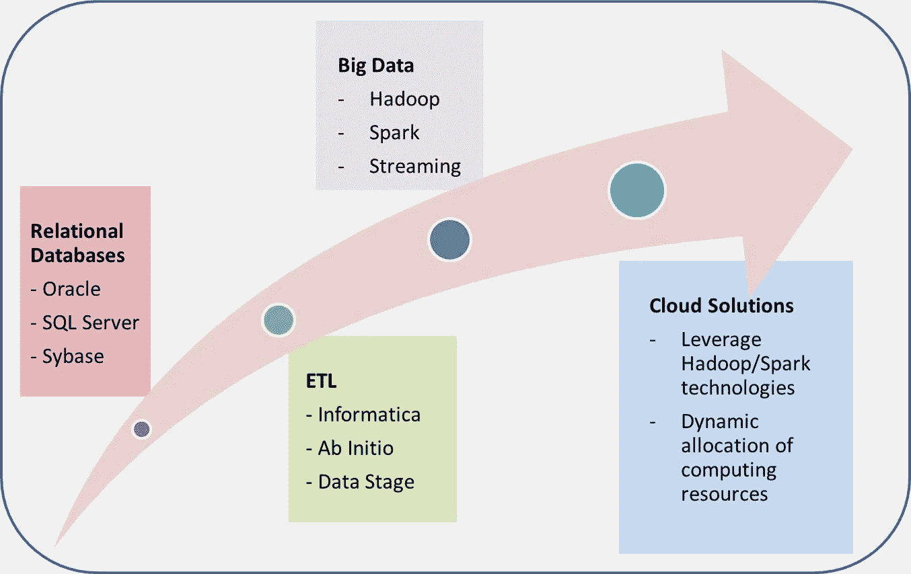
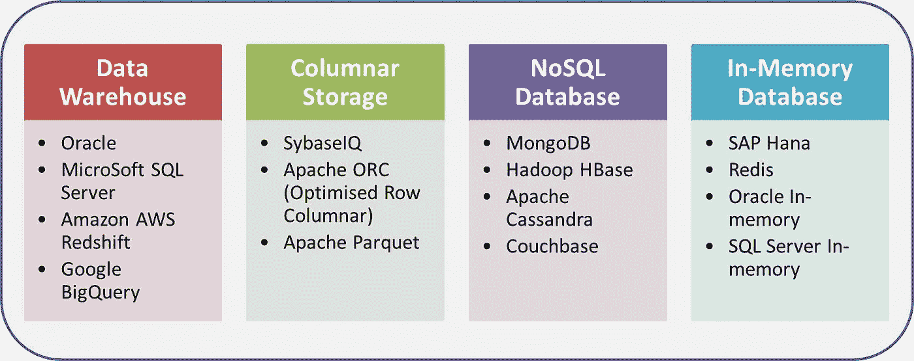

# 数据处理和数据访问中的大数据架构

> 原文：<https://towardsdatascience.com/big-data-architecture-in-data-processing-and-data-access-d03cff195e21?source=collection_archive---------2----------------------->

早在 1998 年，我就开始了作为 Oracle 数据库开发人员和管理员的职业生涯。在过去的 20 多年里，令人惊讶的是，它是如何通过包括关系型 OLTP(在线事务处理)数据库、数据仓库、ETL(提取、转换和加载)和 OLAP(在线分析处理)报告、大数据以及现在的人工智能、云和物联网在内的技术来处理不断增长的数据量的。所有这些技术都得益于计算能力的快速增长，特别是在处理器、内存、存储和网络速度方面。本文的目的是总结，首先是如何处理大量数据的基本原则，其次是一个思考过程，我希望它可以帮助您更深入地了解数据领域的任何新兴技术，并在当前和未来的技术浪潮中提出正确的架构。

在数据管道中，数据通常经过两个阶段:数据处理和数据访问。对于任何类型的数据，当它进入一个组织(在大多数情况下有多个数据源)时，它很可能不是干净的，或者不是可以由组织内外的最终业务用户直接报告或分析的格式。因此，首先需要数据处理，这通常包括数据清理、标准化、转换和汇总。最终的数据随后呈现在数据访问层，准备好进行报告并用于各方面的分析。数据处理有时也被称为数据准备、数据集成或 ETL 其中，ETL 可能是最受欢迎的名字。

数据处理和数据访问有不同的目标，因此通过不同的技术实现。大数据的数据处理从一开始就强调“扩展”,这意味着只要数据量增加，处理时间仍应在给定可用硬件的预期范围内。总的数据处理时间从几分钟到几小时到几天不等，这取决于数据量和处理中逻辑的复杂程度。另一方面，数据访问强调秒级的“快速”响应时间。在高层次上，数据处理的可扩展性主要是通过并行处理来实现的，而快速数据访问是通过基于访问模式的数据结构优化以及服务器上可用内存量的增加来实现的。

# **数据处理**

为了清理、标准化和转换来自不同来源的数据，数据处理需要触及即将到来的数据中的每一条记录。一旦记录干净并最终确定，工作就完成了。这从根本上不同于数据访问—后者导致不同用户和/或应用程序对相同信息的重复检索和访问。当数据量很小时，与数据访问相比，数据处理的速度不是一个大问题，因此通常发生在最终数据所在的同一个数据库中。随着数据量的增长，人们发现数据处理必须在数据库之外进行，以绕过数据库系统造成的所有开销和限制，而数据库系统显然不是为大数据处理而设计的。这是 ETL 和 Hadoop 分别开始在数据仓库和大数据时代发挥关键作用的时候。

大数据处理的挑战在于，要处理的数据量始终处于硬盘能够容纳的水平，但远远超过给定时间可用的计算内存量。高效数据处理的基本方法是将数据分成更小的部分，然后并行处理它们。换句话说，通过首先在编程中启用并行处理来实现可伸缩性，使得当数据量增加时，并行进程的数量将增加，同时每个进程继续处理与以前相似的数据量；第二，随着并行进程数量的增加，添加更多具有更多处理器、内存和磁盘的服务器。

大数据的并行处理首先是通过数据库系统中的数据划分技术和 ETL 工具实现的。对数据集进行逻辑分区后，可以并行处理每个分区。Hadoop HDFS(高度分布式文件系统)以最具可扩展性的方式采用了相同的原则。HDFS 所做的是将数据划分为数据块，每个数据块的大小不变。然后，这些块被分发到不同的服务器节点，并由元数据存储记录在所谓的 Names 节点中。当数据进程开始时，进程的数量由每个服务器节点上的数据块和可用资源(例如，处理器和存储器)的数量来确定。这意味着 HDFS 支持大规模并行处理，只要你有足够的处理器和多台服务器的内存。

目前 Spark 已经成为内存中最流行的大规模数据处理快速引擎之一。有意义吗？虽然内存确实变得更便宜了，但它仍然比硬盘更贵。在大数据领域，要处理的大数据量总是远大于可用的内存量。那么 Spark 是怎么解决的呢？首先，Spark 利用了具有多个数据节点的分布式环境中的内存总量。然而，内存量仍然不够，如果任何组织试图将大数据放入 Spark 集群，成本可能会很高。让我们考虑一下 Spark 适合什么类型的处理。数据处理总是从将数据从磁盘读取到内存开始，最后将结果写入磁盘。如果每个记录在写入磁盘之前只需要处理一次，这是典型的批处理情况，那么 Spark 与 Hadoop 相比不会有优势。另一方面，Spark 可以在数据转换的多个步骤中将数据保存在内存中，而 Hadoop 不能。这意味着 Spark 在多次迭代处理同一数据时具有优势，这正是分析和机器学习所需要的。现在考虑以下问题:由于可能有数十或数百个这样的分析过程同时运行，如何以一种经济高效的方式扩大您的处理规模？显然，单纯依靠内存中的处理并不能完全解决问题，大数据的分布式存储，如 Hadoop，仍然是补充 Spark 计算的大数据解决方案中不可或缺的一部分。

数据处理领域的另一个热门话题是流处理。它在降低处理速度方面提供了很大的优势，因为在给定的时间点，每当数据到达时，它只需要处理少量的数据。但是，它在两个方面不如批处理灵活:第一个方面是输入数据需要以“流”模式进入，第二个方面是某些需要跨时间段聚合的处理逻辑仍然需要在之后进行批处理。

最后，云解决方案提供了基于数据量(即并行进程的数量)以更动态的方式扩展分布式处理系统的机会。这在企业内部很难实现，因为需要规划、预算和购买新的服务器。如果容量规划不当，大数据处理可能会受到硬件数量的限制，或者额外购买导致资源浪费而未被使用。云上的处理获得了基础设施弹性的巨大优势，这可以为以更具成本效益的方式实现最佳规模提供更多保证。

A brief history of techologies for data processing

# **数据访问**

与数据处理相比，数据访问具有非常不同的特征，包括:

1.  数据结构在很大程度上取决于应用程序或用户需要如何检索数据
2.  需要很好地理解数据检索模式，因为大量用户或应用程序可能会重复检索一些数据。
3.  每次检索的数据量应该是有目标的，因此应该只包含可用数据的一小部分。

根据上述原则，在过去 20 年中出现了几个里程碑，反映了如何访问不断增长的数据量，同时仍能在几秒钟内返回所请求的数据:

1.  数据仓库:避免了当数据量很大时代价很高的表连接。这里出现了“事实表”的概念，其中所有的列都放在一起，而不像关系数据库那样遵循数据库规范化原则。
2.  列存储:每一列都被存储和索引，因此可以单独访问。当一行有许多列，而查询一次只检索几列时，这比传统关系数据库的基于行的访问提供了更快的响应时间。
3.  NoSQL 数据库:完全消除了连接和关系结构，以更具体的方式适应快速数据检索。
4.  内存数据库:通过将整个数据库或整个表保存在内存中来提供快速性能。

下表给出了每种数据库类型的一些流行示例，但并不打算给出一个完整的列表。请注意，一个数据库可以结合一种以上的技术。例如，Redis 是 NoSQL 数据库，也是内存数据库。此外，从数据仓库和列存储中检索数据会利用并行过程在任何适用的时候检索数据。因为根据用户和/或应用程序的数据内容、数据结构和检索模式，可能有许多不同类型数据库的选择，所以数据访问是一个组织需要快速和不断发展的领域。出于不同的目的，同时拥有不同类型的数据库或工具也应该是常见的。

# **总结**

正如我们所看到的，数据处理和数据访问之间的一个重要区别是，数据访问最终来自客户和企业的需求，选择正确的技术可以推动未来的新产品开发并增强用户体验。另一方面，数据处理是公司的核心资产，大规模处理和产生高质量的数据是公司与数据一起成长的基本推动因素。当数据量增长时，许多公司经历了其数据处理系统的停滞，并且从头开始重建数据处理平台是昂贵的。并行数据处理的原理和可伸缩性需要从一开始就仔细考虑和设计。数据处理还与数据管理和数据集成密切相关，这三者对于任何数据密集型组织的成功都至关重要。此外，每个组织现在都面临着来自开源社区和第三方供应商的大数据解决方案的许多选择。清楚地了解数据处理和数据访问之间的差异，不仅可以让 it 和业务领导构建可靠的数据架构，还可以做出正确的决策，稳步扩展和更新 IT。