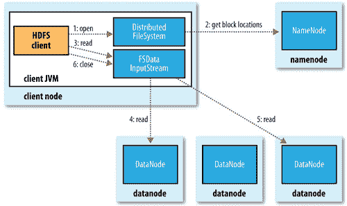
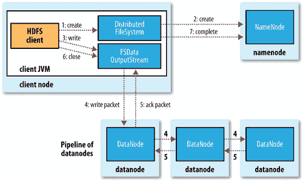

# 从 B 到 A 的大数据:Hadoop 分布式文件系统— HDFS

> 原文：<https://towardsdatascience.com/big-data-from-b-to-a-the-hadoop-distributed-filesystem-hdfs-992612cbf8aa?source=collection_archive---------28----------------------->

## HDFS 概念理解指南

Photo by [imgix](https://unsplash.com/@imgix?utm_source=medium&utm_medium=referral) on [Unsplash](https://unsplash.com?utm_source=medium&utm_medium=referral)

随着数据的显著增长，在机器网络上存储大量信息变得非常必要。因此，需要一个可靠的系统，称为分布式文件系统，来控制数据的存储和检索。然而，随着这种基础设施的实现，出现了许多挑战，例如，在不丢失数据的情况下处理硬件故障。

在本文中，我们将关注 Hadoop 的分布式文件系统——HDFS，它的设计、架构和数据流。

# HDFS 的设计

*Hadoop 分布式文件系统(HDFS)是一个分布式文件系统，旨在:*

> 在商用硬件上运行。

Hadoop 旨在运行于多家供应商提供的价格合理的设备上。硬件的性质在集群中提供了极大的可扩展性；坏的单元可以容易地被替换，而不需要昂贵的成本。尽管在大型集群中，硬件故障的概率变得更高，但 HDFS 将继续工作，不会有明显的变化。

> 高度容错

HDFS 是为处理大文件而设计的，它将大文件分成块，复制大文件，并将其存储在不同的集群节点中。因此，它具有高度容错和可靠的能力。

> 处理非常大的数据集

HDFS 旨在存储千兆字节或兆兆字节甚至千兆字节范围内的大型数据集。

> 流式传输数据并提供高吞吐量

假设数据在写入后永不更改的一次写入模式简化了复制。由于这种模式和独立的并行处理，数据吞吐量加快。

# HDFS 的建筑

HDFS 有一个主/从架构。它包括:

*   ***NameNode****:*称为主节点。它管理文件系统名称空间，并执行打开、关闭和重命名文件和目录等操作。它维护文件系统树和元数据(数据块数 ***** 、副本等)。)用于树中的所有文件和目录。NameNode 还维护和管理从属节点。

与元数据相关联的文件有:

*   FsImage:文件系统元数据的持久检查点。
*   EditLogs:它包含相对于最新的 FsImage 对文件系统所做的所有修改。
*   ***DataNode****:*称为从节点。它根据客户端或 namenode 的请求执行读写操作，并定期向 NameNode 报告它正在存储的数据块列表。
*   ***次 NameNode*** *:* 通常运行在单独的物理机上。它的作用是定期合并来自 NameNode 的 FsImage 和 EditLogs。这可以防止编辑日志变得太大。Is 还将合并的 FsImage 的副本存储到持久存储中，这可以在 NameNode 失败的情况下使用。

*从 Hadoop 版本 0.21.0 开始，引入了一种新类型的 namenode，称为* ***备份节点*** *，通过接收来自 namenode 的编辑来维护名称空间的最新状态，此外还有一个* ***检查点节点*** *，它创建了一个名称空间的检查点来替换第二个 namenode。*

> **Block:* 一个磁盘有一个块大小，是它能读写的最小数据量。HDFS 的文件被分成块大小的块，作为独立的单元存储。在 HDFS 中，块的默认大小是 128 MB (Hadoop 2.x)和 64 MB (Hadoop 1.x)。

# 数据流

> 阅读文件

A client reading data from HDFS from Hadoop The definitive guide

要从 HDFS 读取文件，客户端打开它希望读取的文件，分布式文件系统与 NameNode 通信以获取元数据。NameNode 用块的数量、它们的位置和它们的细节来响应。然后，客户端对分布式文件系统返回的流调用 read()，并连接到文件中第一个块的第一个(最近的)datanode。当一个块结束时，DFSInputStream 将关闭到 datanode 的连接，然后为下一个块寻找最佳的 datanode。这对于客户端来说是透明的，从客户端的角度来看，它只是在读取一个连续的流。当客户端完成读取时，它调用 FSDataInputStream 上的 close()。

> 写文件

A client writing data to HDFS Hadoop The definitive guide

当客户端想要将文件写入 HDFS 时，它调用 DistributedFileSystem 上的 create()，distributed file system 与 namenode 通信以在文件系统的命名空间中创建一个新文件，其中没有与之相关联的块。如果文件不存在，并且客户机有适当的权限，NameNode 创建文件；否则，文件创建会失败，并且客户端会抛出 IOException。DistributedFileSystem 返回一个 FSDataOutputStream，供客户端开始向其写入数据。当客户端写入数据时，DFSOutputStream 会将其拆分为数据包，然后写入一个内部队列，称为数据队列。数据队列由数据流处理器使用，它的职责是通过挑选合适的 datanodes 列表来存储副本，从而要求 namenode 分配新的块。datanodes 的列表形成了一个管道。数据流处理器将数据包传输到管道中的第一个 datanode，后者存储数据包并将其转发到管道中的第二个 datanode，依此类推。DFSOutputStream 还维护一个等待 datanodes 确认的内部数据包队列，称为 ack 队列。只有当数据包被管道中的所有 datanodes 确认时，才会从 ack 队列中删除该数据包。当客户端完成数据写入时，它在流上调用 close()。此操作将所有剩余的数据包刷新到 datanode 管道，并在联系 namenode 以发出文件完成的信号之前等待确认。namenode 已经知道文件是由哪些块组成的(通过请求块分配的数据流)，因此它只需等待块被最小化复制，然后就可以成功返回。

总之，HDFS 是一个可靠的分布式文件系统，可以跨大数据集群存储大文件。它被设计成可伸缩、高度可用和容错的。它的体系结构有助于管理机器网络中的分布式存储，并在硬件出现故障时维护副本。

“从 B 到 A 的大数据”系列文章涵盖了所有大数据概念:业务概念、工具、框架等。

更多类似的文章，请确保关注以获取最新的更新。

*你也可以在我的社交媒体简介* [*Linkedin*](https://www.linkedin.com/in/hajarkhizou/) *和*[*Twitter*](https://twitter.com/HajarKhizou)*上加入我。*