# Apache NiFi 和 Kafka Docker 示例

> 原文：<https://towardsdatascience.com/big-data-managing-the-flow-of-data-with-apache-nifi-and-apache-kafka-af674cd8f926?source=collection_archive---------2----------------------->


在 Hadoop 生态系统中，Apache NiFi 通常用于摄取阶段。Apache NiFi 提供了一种可伸缩的方式来管理系统之间的数据流。当你试图从 A 点到 B 点获取信息时，会出现许多问题。例如，网络可能出现故障，软件崩溃，人们犯错误，数据可能太大、太快或格式错误。NiFi 将在幕后处理这些问题，以便开发人员可以专注于应用程序本身。

NiFi 的一些特性包括:

## 保证交货

NiFi 保证数据的传递。这是通过有效使用专门构建的持久预写日志和内容存储库来实现的。

## 数据缓冲/压力释放

当给定的数据源超过处理或交付链的某个部分时，Nifi 可以缓冲数据。NiFi 还支持在指定时间过后删除排队数据的能力。

## 优先排队

NiFi 允许为如何从队列中检索数据设置一个或多个优先级方案。默认情况下是最早的优先，但有时应该先提取最新的数据、先提取最大的数据或其他自定义方案。

## 服务质量

有些时候，数据必须在几秒钟内处理和交付才能有价值。NiFi 使管理员能够将延迟优先于吞吐量或容忍度等。

# 术语

Apache NiFi 围绕着处理器的思想。处理器是图中工作的节点。这通常包括对数据执行某种操作、将数据加载到 NiFi 或将数据发送到某个外部系统。处理器一些例子是:

*   GetFile:加载文件的内容
*   UpdateAttribute:更新流文件属性(即 schema.name ),然后其他处理器可以访问这些属性
*   PublishKafka:将流文件的内容作为消息发送给 Apache Kafka

另一方面，进程组是处理器及其连接的集合。控制器服务可用于创建它们的进程组中的所有处理器。

控制器服务的一些示例包括:

*   AvroSchemaRegistry:在注册表中存储 Avro 模式，然后其他控制器服务可以检索这些模式
*   AvroRecordSetWriter:以 Avro 格式编写和编码数据

NiFi 中的另一个关键概念是流文件。流文件是图形中给定位置的数据和一些附加元数据。我们可以通过点击一个连接的 ***【列表队列】*** 下拉菜单选项来查看流文件。

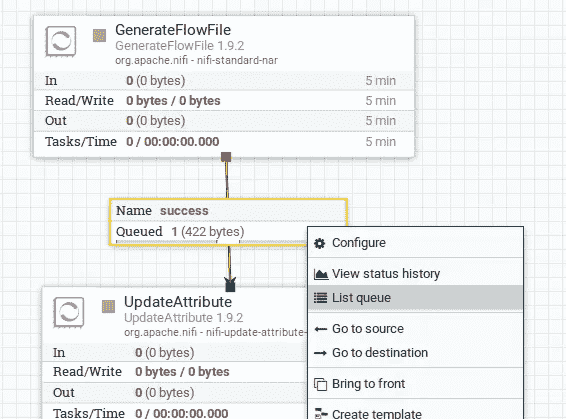

例如，以下流文件具有唯一的 id 和文件名。

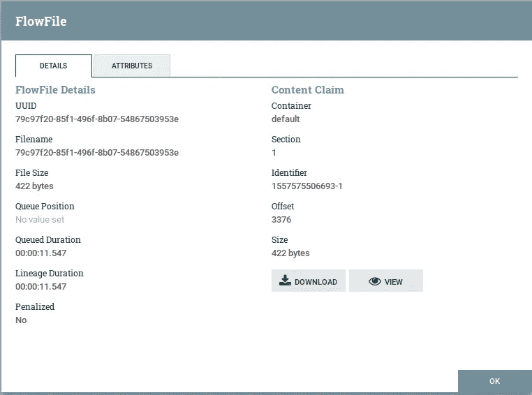

通过点击*视图*，我们可以看到实际数据从一个处理器转移到另一个处理器。

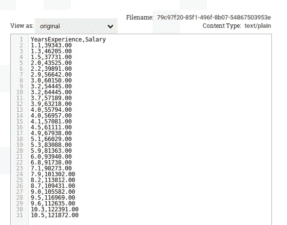

# 体系结构

NiFi 在主机操作系统上的 JVM 中执行。

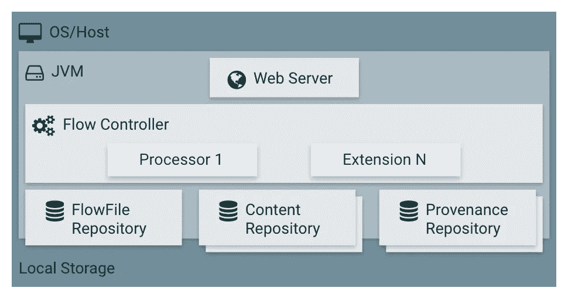

## 网络服务器

与大多数软件不同，Apache NiFi 的管理是通过用户界面完成的。

## 流量控制器

处理与处理器相关的所有逻辑。

## 流文件存储库

流文件存储库是 NiFi 存储流中当前活动的流文件的元数据的地方。

## 内容存储库

内容存储库是给定流文件的实际内容所在的地方。可以指定多个文件系统存储位置，以减少争用。

## 出处储存库

出处储存库是存储所有出处事件数据的地方。本质上，起源事件数据告诉你什么时候发生了什么。

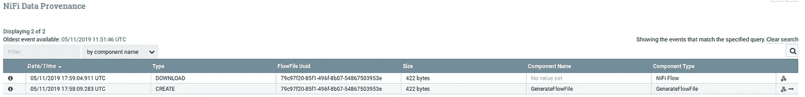

NiFi 还能够在集群中运行，使其能够无限扩展。

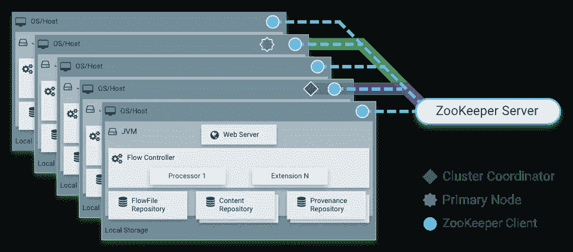

NiFi 集群中的每个节点对数据执行相同的任务，但是每个节点对不同的数据集进行操作。Apache ZooKeeper 用于选举集群协调器并自动处理故障转移。管理员可以通过任何节点的用户界面与 NiFi 集群进行交互，任何更改都会复制到集群中的所有节点。

# 密码

在本例中，我们将获取一个 CSV 文件并将其发布到 Kafka。我们将使用 docker 来设置我们的环境。将以下内容复制到`docker-compose.yml`并运行`docker-compose up -d`。

接下来，在你的主机上打开浏览器，进入`localhost:8080/nifi`。

在左上方的配置中，将一个处理器拖到主面板上。选择并配置 **GenerateFlowFile** 处理器每 60 秒运行一次，这样我们就不会不断地生成数据。

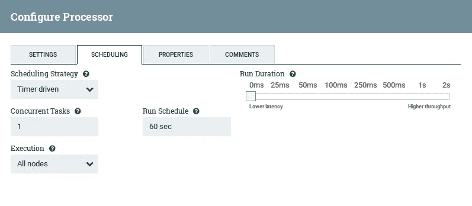

我们将使用一个简单的数据集，其中包含 30 个人的工作经验和薪水。

```
YearsExperience,Salary
1.1,39343.00
1.3,46205.00
1.5,37731.00
2.0,43525.00
2.2,39891.00
2.9,56642.00
3.0,60150.00
3.2,54445.00
3.2,64445.00
3.7,57189.00
3.9,63218.00
4.0,55794.00
4.0,56957.00
4.1,57081.00
4.5,61111.00
4.9,67938.00
5.1,66029.00
5.3,83088.00
5.9,81363.00
6.0,93940.00
6.8,91738.00
7.1,98273.00
7.9,101302.00
8.2,113812.00
8.7,109431.00
9.0,105582.00
9.5,116969.00
9.6,112635.00
10.3,122391.00
10.5,121872.00
```

同样，通过将数据粘贴到自定义文本属性来配置 **GenerateFlowFile** 。

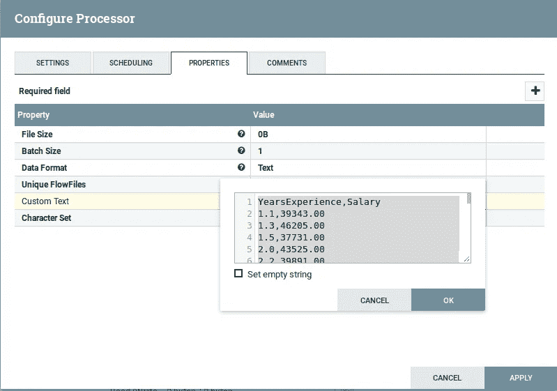

***注意:任何粗体属性为必填，其余为可选。***

将处理器拖到主面板上，并选择**更新属性**。对于 **UpdateAttribute** 处理器，在 properties 下，单击右上角的加号。然后，创建一个值为 **test.schema** 的 **schema.name** 属性。

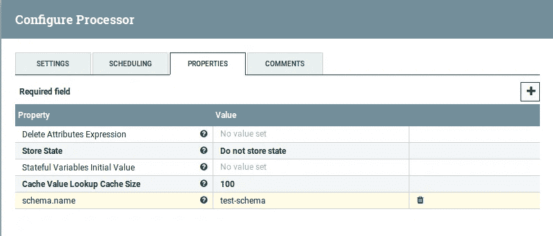

现在，我们将创建控制器服务。右击主面板，选择**配置**。

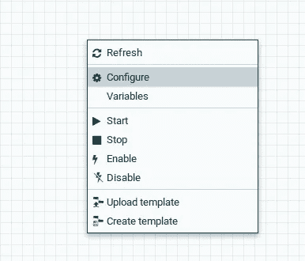

在这里，我们可以为我们的处理器组创建所有的控制器服务。

点击右上角的加号，选择 **AvroSchemaRegistry** 。在 properties 选项卡下，创建一个名为 **test-schema** 的新属性，并将下面的模式粘贴到 value 字段中。

```
{
   "type" : "record",
   "namespace" : "Test",
   "name" : "Employee",
   "fields" : [
      { "name" : "YearsExperience" , "type" : "float" },
      { "name" : "Salary" , "type" : "float" }
   ]
}
```

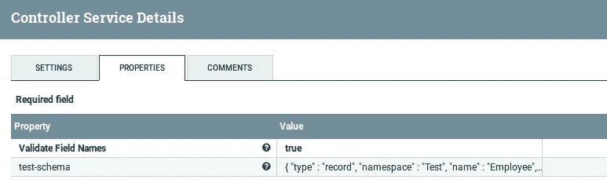

我们还需要 CSVReader。在 properties 选项卡下，将其配置为使用 schema name 属性，即 **AvroSchemaRegistry** ，并将第一行视为列标题。

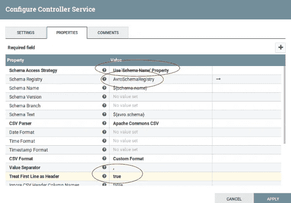

最后，创建一个 **AvroRecordSetWriter** ，并将其配置为使用 **AvroSchemaRegistry** 。

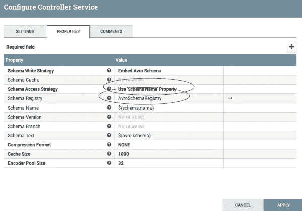

在继续之前，请确保通过单击最右侧的闪电图标来启用所有控制器服务。

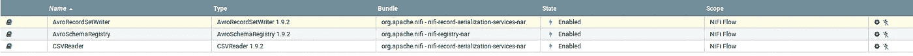

现在我们已经完成了控制器服务的设置，我们将通过运行以下命令来创建一个 Kafka 主题。

```
docker-compose exec kafka  \
kafka-topics --create --topic test --partitions 1 --replication-factor 1 --if-not-exists --zookeeper zookeeper:2181
```

验证它是否正常工作。

```
docker-compose exec kafka  \
kafka-topics --describe --topic test --zookeeper zookeeper:2181
```

创建 **PublishKafkaRecord** ，并对其进行如下配置。

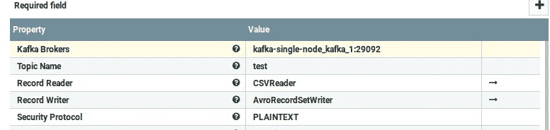

请务必检查**自动终止关系**，因为这是我们图表中的最后一个处理器。

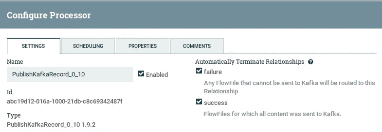

要创建处理器连接，请在它们之间拖动箭头。

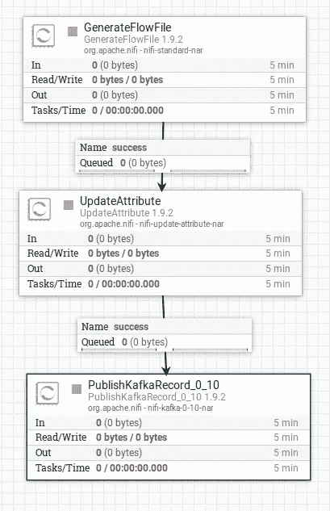

最后，要开始流程，右键单击每个处理器并选择 **start** 。如果一切都按预期运行，那么每个原始行都应该被写回。

```
docker-compose exec kafka  \
  kafka-console-consumer --bootstrap-server localhost:29092 --topic test --from-beginning --max-messages 30
```