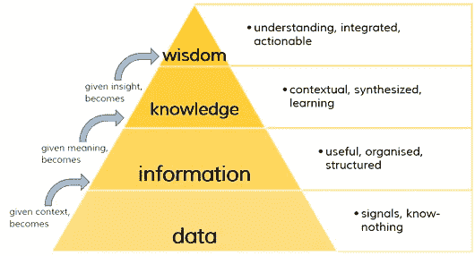
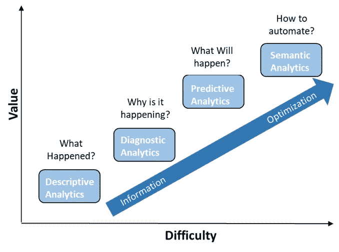

# 大数据:正在彻底改变世界的艺术和科学

> 原文：<https://towardsdatascience.com/big-data-the-art-science-that-is-revolutionizing-the-world-a2a596122c55?source=collection_archive---------29----------------------->

## 深入研究将极大改善我们生活方方面面的技术

Picture from [Unsplash](https://unsplash.com/photos/1K6IQsQbizI)

# 大数据:原因、方式和内容

近年来，信息技术经历了迅猛发展:

*   传感器现在便宜得离谱。
*   计算能力有了巨大的增长。
*   到处都有连接互联网的设备(智能手机、活动支架、智能手表、电视、汽车……现在甚至连热拌食品都有 wifi 了！)

这些因素和其他因素导致可用数据急剧增加。今天，我们能够产生、存储和发送比历史上任何时候都多的数据。

以至于在 2015 年，据估计 90%的可用数据都是在两年前创建的。从那以后，数据生成的速度只增不减。

事实上，据估计，目前每天会产生 2.5 万亿次数据。这是第一代 Iphone 的 2.5 倍 1⁰ ⁷字节，相当于 1 亿倍的存储容量。

所有这些数据就是俗称的大数据。要被认为是大数据，它必须符合以下特征，即所谓的 3 Vs 规则:

*   必须是高*变化的数据。*
*   那就是增加*的音量。*
*   并以巨大的*速度。*

# 大数据带来的数据科学的繁荣

然而，这些海量的数据导致了一个新的问题:

***我们用它做什么？***

可用的数据如此之多，以至于人类不可能从中研究和提取有价值的信息。从这些数据中分析和发现模式和见解需要几代人的时间。

幸运的是，电脑可以帮助我们。此外，在过去的几年里，机器学习算法的发展取得了巨大的进步。这些算法，加上我们以如此低的成本拥有的几乎无限的计算能力，导致了我们目前正在试验的数据科学的急剧扩展。

数据是提高业务成效的增长最快的驱动力。为了创造竞争优势，越来越多的组织使用他们的数据来提高效率、销售和营销效果。但是，现在大部分的数据仍然没有连接和充分利用。这就是数据科学在解决这个问题上发挥作用的地方。

目前使用的主要数据科学是:

## 数据工程

数据工程的重点是建立适当的基础设施，以促进组织内部的数据流动，并使这些数据准备成为有用的格式。

## 数据分析

数据分析侧重于从数据中发现有用的信息。数据科学的这一分支涉及对数据的描述和诊断分析，解释发生了什么以及为什么会发生。它还涉及数据可视化方面(这是一个完全独立的领域)

## 机器学习

机器学习是专注于让计算机从数据中学习的科学(和艺术)。他们通过学习导致特定结果的过去数据的特定特征之间的相关性来做到这一点，因此当向他们提供新数据时，他们可以做出准确的预测。

## 深度学习

深度学习是机器学习的一个子领域，专注于复制智能生物用于学习的学习机制。他们通过用简单的概念解构复杂的概念来做到这一点，因此，以一种分层的方式学习。使用人工神经网络来实现这一点。

# 数据科学的目标和路径

如前所述，如今数据严重脱节和利用不足，这门科学的最终目标是能够从原始数据(没有价值)到智慧，这最终将有助于决策，因为它将由客观信息驱动。

下图很好地传达了这一概念:

Figure by Author

总之，数据科学是一套从数据中自动提取知识的基本原则、流程和技术。最终目标是改进决策，所有任务都应服从于这一目标。

数据科学之路，从容易和不太有价值到困难和最有价值，如下所示:

Figure by Author

# 处理大数据的技术

后一种数据科学是围绕大量数据开发的，但是，当数据量如此之大，以至于单台计算机无法对其进行分析并提取有意义的见解时，并行分析(和大数据技术)就开始发挥作用了。

以下是一个典型的大数据基础架构示例。用于形成和使用大数据生态系统的一些技术包括:

*   批量:Hadoop，Hive，Apache Spark
*   溪流:阿帕奇卡夫卡
*   基础设施:Cloudera、Hortonworks、Mapr
*   自动化:Ansible，Chef，Jenkins，Airflow，Luigi
*   容器和集群管理:Docker、Mesos、DC/OS、Kubernetes、Marathon
*   语言:Scala，Java，Python
*   数据库:SQL(是的，你需要非常擅长 SQL :-))，NoSql 数据库，时间系列数据库
*   索引:弹性搜索
*   可视化:基巴纳，格拉法纳

在接下来的系列文章中，我们将重点关注大数据架构的数据分析和机器学习方面，具体来说，我们将使用 Apache Spark 及其 Python 实现:PySpark。

因此，如果您想了解更多关于这一令人惊叹的技术以及如何执行一些现实世界的项目，请继续关注下一篇文章！