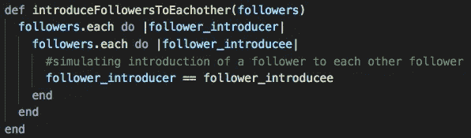
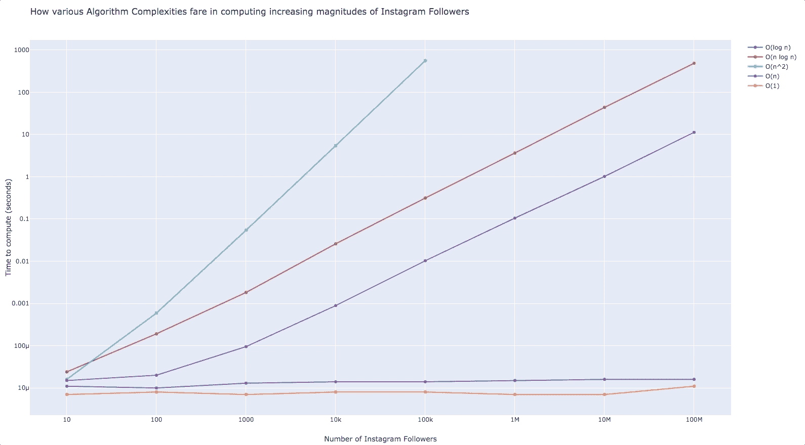

# 大 O——危险的实用介绍

> 原文：<https://towardsdatascience.com/big-o-a-perilously-practical-introduction-d476d597c942?source=collection_archive---------32----------------------->

# 什么是大 O，我们为什么要关心它？

大 O 符号是我们可以表达不同算法的性能的一种方式，更重要的是，它们如何相对于输入的大小增长。在这里，我将尝试用一些简单的实例来说明我们为什么应该关注它。快结束的时候，我把这些数据用可视化的方式呈现出来，帮你带走。大 O 是一个*巨大的*主题，我会愚蠢地试图在这篇文章中涵盖所有相关的内容，所以我也建议查看进一步阅读/查看中列出的其他来源！

想象你在一家[不可靠的](https://dictionary.cambridge.org/dictionary/english/dodgy)公司工作，开发可以分析 Instagram 数据的软件。软件设计的一个主要因素可能是它处理规模的能力。

Source: [Geralt](https://pixabay.com/users/geralt-9301/), via [Pixabay](https://pixabay.com/images/id-1940244/)

当你想对你的 100 个 Instagram 粉丝进行一些超级有意义的分析时，使用一个好的算法可能并不那么重要。你可以在几毫秒内计算出你想要的任何东西，不管你选择如何进行。但是当涉及到[科勒·卡戴珊和她的 1 亿](https://www.instagram.com/khloekardashian/)追随者时，使用一个扩展性差的算法可能会相当昂贵。你的老板可能希望你想出一个能在几秒钟内返回相关数据的函数。如果你做错了一点点，也许你会花上几年的时间！

一般来说，大 O 假设一个算法的上限，这或多或少代表了**最坏情况**的行为。这很好，因为当你把事情弄糟时，事情不会变得更糟。衡量**最佳情况**的场景没有那么有用。例如，如果您想使用特定的排序算法对您的关注者进行排序，但他们已经*排序了*，那么这并不能真正告诉我该算法的性能。

It’s not hard to be faster than Hide The Pain Harold

此外，当我们想要以一种**独立于机器的**方式比较算法时，大 O 是有用的。很有可能你的 2019 年 MacBook Pro 升级了所有规格，运行任何算法的速度都比这家伙 2001 年的笔记本电脑快。此外，与这些[怪物](https://www.networkworld.com/article/3236875/embargo-10-of-the-worlds-fastest-supercomputers.html)相比，你的笔记本电脑可能很糟糕。因此，在比较算法时，我们不希望这影响我们的发现。

因为我想展示规模对算法的影响，所以我将在同一台机器上运行所有的基准测试。更重要的是随着规模的增加所用时间的趋势，而不是实际所用时间本身。我可能会提醒你这一点，因为这很重要。

# 模特:(字面意思？)

为了展示不同算法复杂度的伸缩性，我选择在 ruby 中将 7 个不同的 Instagram 账户建模为 7 个独立的数组。为了简单起见，每个数组都包含唯一的整数来代表每个唯一的 Instagram 关注者。每个后续账户都被建模为比前一个账户多 10 倍的关注者。稍后你会看到这是如何让我们发现一些趋势的。

## 以下是幸运选中的 Instagram 账户:

*   我的金鱼: 10 个追随者(我和我的家人)
*   **我:** 100 个追随者(只有 8 个实际的追随者，占我自己创建的 92 个账户)
*   **我爸爸:** 1000 个粉丝(他有好看的鸟照片)
*   **我的狗:**一万关注者(狗很可爱)
*   **我想象中的女朋友:** 10 万粉丝
*   詹妮弗·安妮斯顿:100 万粉丝(她仅用了 [5 小时 16 分钟](https://www.guinnessworldrecords.com/world-records/397211-most-instagram-subscribers-in-24-hours)就达到了 100 万——这是更重要的吉尼斯世界纪录之一)
*   **剑桥公爵夫妇:**[1000 万粉丝](https://www.instagram.com/kensingtonroyal/)
*   **科勒·卡戴珊:** 1 亿粉丝(大家的最爱！)

# 流程:

为了有条理地展示这些例子，我进行了以下步骤。

首先，我使用 Ruby 和一个名为 [Benchmark](https://ruby-doc.org/stdlib-2.5.3/libdoc/benchmark/rdoc/Benchmark.html) 的模块来编写脚本并处理计算。基本上，Benchmark 允许我测量执行某些代码段所需的时间。

在运行的时候，我确保将我对每个账户的追随者应用每个算法所花的时间记录到一个文件中。

然后，对于日志，我随后使用 Python 处理数据，并将其转换成一个与 [Plotly](https://plot.ly/) 非常互动的图形，其结果你可以在这篇博文的结尾预览。

# 不同的时间复杂性:

这是文章的要点。下面的每一小节都将描述算法，以及它们在处理 10 个追随者和 1 亿追随者时的表现。再一次，试着去掉趋势，而不是实际花费的时间！

## O(1):常数

当所需的运算次数相同时，不管输入的大小如何，算法都是 O(1)。

在这个例子中，我只是返回每个 follower 数组中的第一个 follower。不管数组中有 100 万还是 1000 万个追随者，都需要相同数量的步骤来获得最终结果，因此理论速度是相同的。

我们最感兴趣的数字是最右边下方表格中的**真实值**。这些都是以秒来衡量的。它们是超级小的数字，但是不要担心，随着我们的进行，你将获得更好的数量感。为了减少混乱，在随后的部分中，我将只发布下面的表。

顺便说一下，如果你对如何理解这个输出感兴趣，可以看看这个[博客](http://rubylearning.com/blog/2013/06/19/how-do-i-benchmark-ruby-code/)中的**‘入门’**和**‘基准# bmbm’**部分。此外，如果您想找到代码或日志的副本，或者如果您想在自己的设备上运行它，请在页面底部找到我的 GitHub 链接。

## O(n):线性

当性能与输入数据集的大小成正比增长时，算法是线性的。

在这里，我只是返回一个更近的 Instagram follower(一个位于数组中 90%的位置，由**‘target’**标记)。我使用的是 Ruby 内置的可枚举#find，它从数组的开头开始，按顺序检查数组中的每一项，直到找到匹配项。

如你所见，每个后续账户的处理时间大约要长 10 倍，这是我们对线性复杂度的预期，因为每个账户都有 10 倍多的关注者。

## O(log n):对数

在这里，我试图执行与上面完全相同的任务。这里的不同之处在于，我使用的是 Ruby 的内置方法 [Array#bsearch](https://www.rubydoc.info/stdlib/core/Array:bsearch) ，它的工作方式是不断将数组一分为二，直到找到目标。你已经通过一步完成了数据集的*一半。*

请注意，为了使用 Array#bsearch，数组必须已经排序。

正如你所看到的，用这个二分搜索法处理粉丝每增加 10 倍所花费的时间几乎可以忽略不计。为了进行比较，在这种情况下，用这种算法从 1 亿人中找到一个特定的追随者似乎是有效的，然后在上面的线性搜索中从 100 人中找到一个。这个实现的伸缩性非常好。**哇！**

此外，如果将此与 O(1)进行比较，您可能会注意到它并没有太大的不同。

## O(n log n):线性算法

这是执行对数运算 *n* 次的结果。一些流行的排序算法，比如合并排序、快速排序和堆排序，平均花费 *n log n* 时间。

在这个例子中，我随机打乱了所有关注者的顺序。从这里，我开始了基准测试，并记录了将它们重新排序所需的时间。我从[这里](https://gist.github.com/aspyct/3433278)借用了一个合并排序的实现。

如果进行比较，它似乎比上面的线性算法扩展性差得多。花了大约 8 分钟的时间将科勒·卡戴珊的粉丝重新排序。事情不会变得更糟了…是吗？

## O(n):二次

二次算法通常是指运算次数是输入次数的平方。

*嵌套 for 循环*是一个常见的例子。

在这里，我模拟了 Instagram 账户的每个关注者向同一账户的每个其他关注者介绍自己的互动。是的，听起来很奇怪。

想象你和 10 个人坐在一个房间里。你是第一个向房间里的其他人介绍自己的人——一次一个人。一旦你完成了，你看着其他人也做同样的事情。这需要一些时间。现在想象一下，在一场音乐会上与 10，000 名其他人做同样的事情，你可能会在那里呆上几个月，甚至更久。你几乎不可能在同一个地方理解科勒·卡戴珊的其他 1 亿名追随者。你永远也完成不了。世界以这种方式终结。

如果您查看基准测试结果，关注者每增加 10 倍，就需要大约 100 倍的时间，因此需要 100 倍的运算量。处理 10 万个 Instagram 粉丝用了将近 10 分钟。

请注意，我甚至连 100 万以上的粉丝都没有。让我解释一下为什么——这不是因为我懒。如果我试图等待 100 万美元，需要 15 个小时(好吧，我想我可以在一夜之间完成)。处理公爵的 1000 万需要 64 天，处理科勒·卡戴珊的 1 亿粉丝需要将近 18 年。哎呀！

我想你现在明白了。二次比线性差得多。每当您需要处理大规模数据时，请远离它。

## 超越二次…

是的，存在诸如指数、阶乘和更高次多项式的算法。在许多情况下，它们是不切实际的，所以我想我就此打住。我们不想在这个危险的公司丢掉工作！

# 将所有这些放在一起:

这是我们绘制在图表上的所有数据点。请注意，我们图上的两个轴都使用对数刻度。轴上的每个刻度值代表大小增加 10 倍，而不是线性缩放。这是为了让我们可以正确地可视化我们的数据，因为它覆盖了一个巨大的规模(相信我，它看起来很可怕的法线)。

图中线条上升得越平缓，算法就越能有效地随大小缩放。如果我包括指数和阶乘，他们会直线上升！

我本来想写一个很酷的总结，但我觉得这个人已经写得很好了:

如果你想下载并自己玩这个，我已经把它放在我的 GitHub 页面[这里](https://github.com/Liko/blog-big-o)！

所有的代码，以及这篇文章，都是在一天的时间里完全从头开始写的。随着时间的推移，我会尽量更新它。利用一些好的算法，做事情**比我做**省力 10 倍**好 100 倍！**

谢谢！

## 进一步阅读/查看:

这一页，[https://www.bigocheatsheet.com](https://www.bigocheatsheet.com/)，很好地总结了这里所涵盖的内容。我肯定会花时间尽可能多的去理解。

这一页，[https://discrete.gr/complexity](https://discrete.gr/complexity/)，更详细地介绍了这个主题，并且有大量的练习题供你不及格(无论如何，这是第一次)。

如果你更喜欢视频，CS Dojo 在这里也很好地解释了这个主题的介绍。他在 YouTube 上有超过 100 万的用户是有原因的。