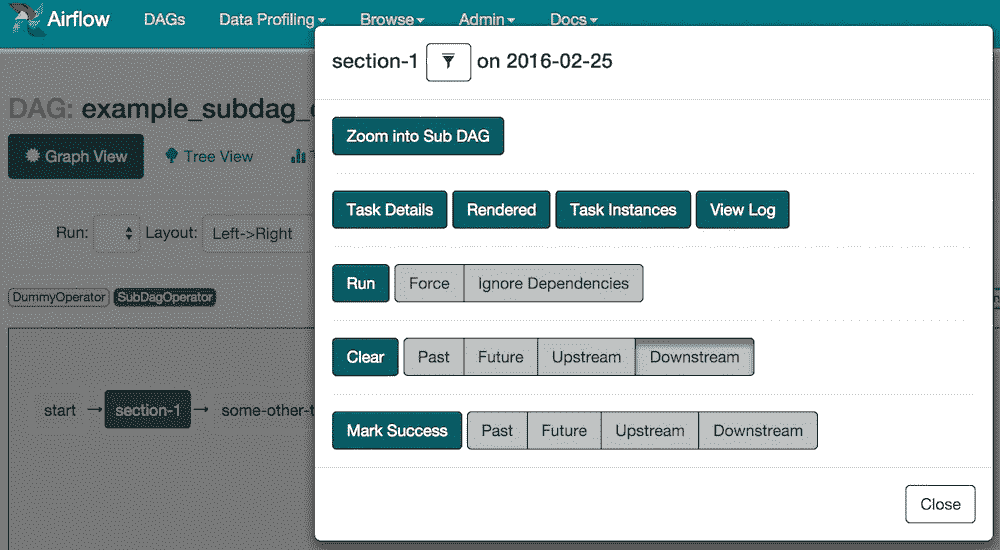
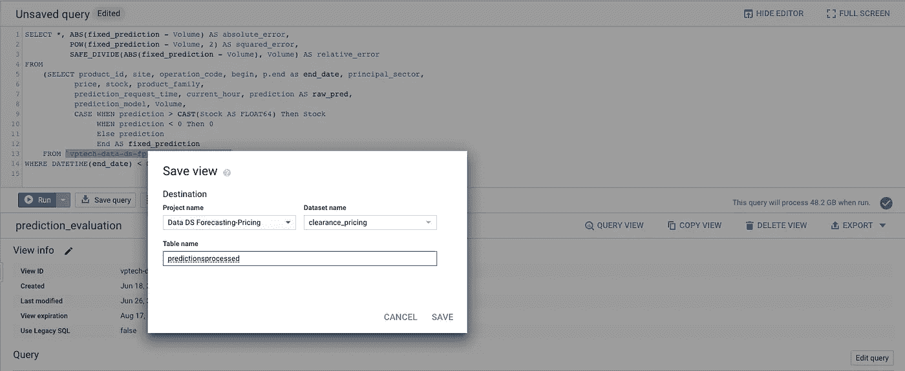
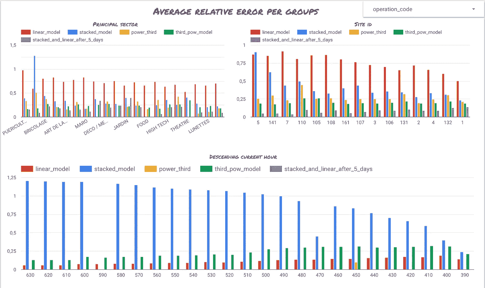
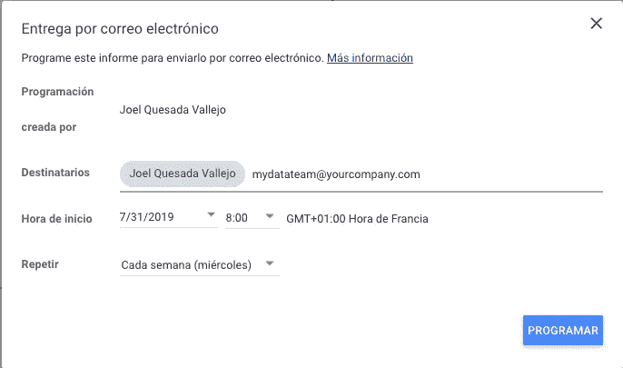

# 用于模型监控的 BigQuery 和 Data Studio

> 原文：<https://towardsdatascience.com/bigquery-and-data-studio-for-model-monitoring-7ce9062a2ab1?source=collection_archive---------23----------------------->

## 监控模型性能的简单方法

这篇文章将讨论机器学习(ML)模型生命周期中的一个阶段:模型的性能监控。这是您在处理需要持续维护的简单在线系统时面临的事情之一。在许多地方，您可以看到一旦您离线评估了模型，ML 模型的生命周期就结束了。然而，在大多数实际用例中，情况并非如此。

我们生活在一个动态的世界中，数据分布随时都在变化，这就意味着两个月前您认为是好的模型可能不再是好的了。让我们以销售预测为例:人们的行为每次都在变化，改变你的销售的外部变量随时都可能发生。另一个简单的例子是预测天气，一年前训练的模型的表现可能不如有新数据的新模型。许多预测应用程序也是如此。因此，我们需要某种方法来持续监控所有这些变化，并且如果必要的话，根据更新的数据重新训练我们的模型。

在这篇文章中，我们将展示一种简单的**方法**来监控我们模型的性能，方法是遵循两个简单的步骤:调度和报告。

## 计划您的预测并保存在 BigQuery 上

如果你读到这篇文章，你已经离线训练并验证了一个模型*。你已经经历了很多工作:数据探索、数据清洗、数据处理、特征工程、模型优化等。但是你仍然觉得你没有完成任务。你可能想知道什么时候*你应该重新培训你的模型。让我假设我们已经有了可以运行的东西:**

```
*python launch_predictions.py --date current*
```

*我们可以得到任何需要的预测。这太棒了！我们已经有了最重要的东西。现在是时候安排这些预测并将其存储在 BigQuery 中了。*

*为了安排我们的预测，我建议两种可能性:一种简单而好，另一种更复杂但对许多情况来说更好。先说最简单的。*

***克朗**。UNIX 系统中使用最广为人知的调度程序。通过简单的语法，您可以安排任何您想要的进程。在您的 UNIX 机器上，运行 crontab -e 并添加如下内容。*

```
** * * 15 0 0 docker run launch_predictions --date current*
```

*按照前面的示例，您可以使用简单的语法来调度预测器。这个 docker 容器将每 15 分钟被触发一次。如果您的过程是轻量级的和简单的，这是非常有用的。然而，我们的工作流越复杂，维护 cron 作业就变得越复杂。所以我们转向第二个候选人，一个工作流程编排者。*

***工作流协调器**。第二种选择是使用一些工作流程编排器，如[](https://airflow.apache.org/)****。**如果您的用例更复杂，最好使用工具来调度和监控工作流。例如，您希望监控您的数据管道以及一些管道崩溃的位置和原因。有了 Airflow，我们可以将我们的数据管道开发成有向无环图，使用 GUI 对它们进行调度和监控。这非常有用，比 cron 调度程序覆盖了更多的用例，尤其是在数据科学领域。***

******

***Airflow GUI***

***让我们将数据存储在 BigQuery 上。 **Data Studio 兼容更多数据源，不仅仅是 BigQuery，**但是在本帖中，我们将只使用 BigQuery。这里我有一个好消息，将数据保存到 BigQuery 就像将熊猫数据帧导出到 CSV 一样简单！
Pandas 的库已经实现了将我们的数据帧直接转储到 BigQuery 的功能。我们将需要安装 python 包[*pandas-gbq*](https://pandas-gbq.readthedocs.io/en/latest/)*及其依赖项。然后使用功能[熊猫。DataFrame.to_gbq](https://pandas.pydata.org/pandas-docs/stable/reference/api/pandas.DataFrame.to_gbq.html) 。如果你想做的不仅仅是将数据存储到 BigQuery 中，我推荐使用包[*Google-cloud-big query*](https://cloud.google.com/bigquery/docs/pandas-gbq-migration?hl=en-419)*。*****

## ****使用 Data Studio 构建仪表板****

****现在我们已经准备好在 BigQuery 中探索所有的预测。在潜入仪表板之前只是一小步。我们需要创建已处理数据的视图。在 BigQuery 中，这非常容易，因为它提供了一个网站 IDE 来生成 SQL 查询。我们需要进行 SQL 查询并生成一个视图。现在，我们准备好可视化我们的数据了！****

********

****Creating a view using BigQuery web's UI****

****现在让我们转到[数据工作室](https://datastudio.google.com/u/0/navigation/reporting)。我们可以使用一些模板来创建我们的仪表板。不过，我鼓励你从头开始写一份报告。在短短几个小时内，我们将成为 Data Studio 的大师，并能够创建有价值的报告。我们可以使用多个数据源来构建我们的仪表板。如果我们关注了这篇文章，我们可能需要选择 BigQuery 和我们的视图。如果我们的数据已经导入，我们需要知道 Data Studio 会缓存它，我们就可以开始播放，而不用担心每次都认为它在查询 BigQuery。我们可以决定数据刷新的频率:每 12 小时(默认)、每 4 小时或每小时。当然，你也可以手动恢复数据——在[谷歌文档](https://support.google.com/datastudio/answer/7020039?hl=en)中有更多关于它如何内部工作的信息。
我们已经导入了数据，是时候开始试验和创建我们的仪表板了。我们有多种方法来可视化我们的数据:动态表格、气泡图、条形图等。我鼓励您使用最适合我们用例的产品！****

********

****Data Studio report for sales forecasting online evaluation****

****上图显示了一个真实案例中的示例，在该案例中，我们对销售预测模型进行了评估，以确定最终销售额。预测存储在 BigQuery 中，用于以后的分析。这个仪表板和一些离线评估的不同之处在于，它会每天更新新的销售额。我们将能够看到我们的性能是否随着时间的推移而下降，或者我们的模型是否稳定。****

## ****安排并通过电子邮件发送我们的报告****

****最后，Data Studio 的另一个有用特性是报告调度。我们可以安排用电子邮件发送报告，这样我们的团队就不会错过任何东西！****

********

****Report email scheduling with Data Studio****

## ****结论****

****这篇文章解释了一个简单但强大的方法来监控我们的模型的性能。这里我们不讨论模型的系统健康监控；这超出了本文的范围，Data Studio 可能不是我们最好的工具。****

****随着时间的推移，您会监控我们模型的性能吗？您有自动化的培训和部署吗？我期待着阅读我们对这一主题的经验的评论。****