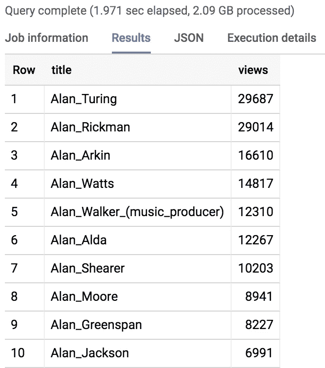
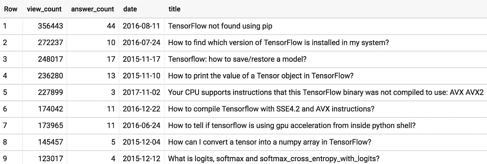
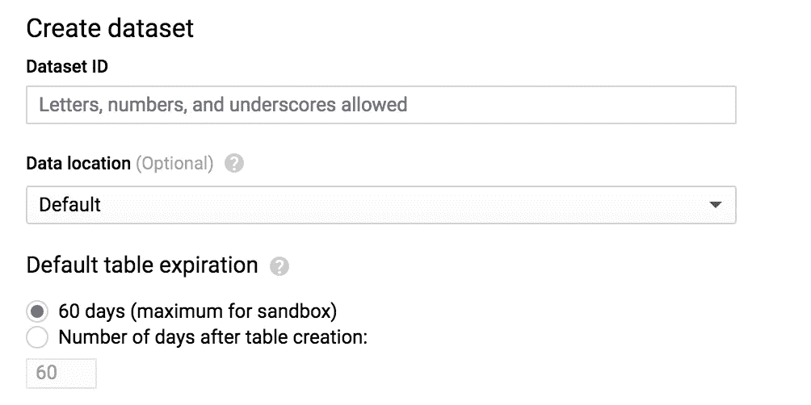
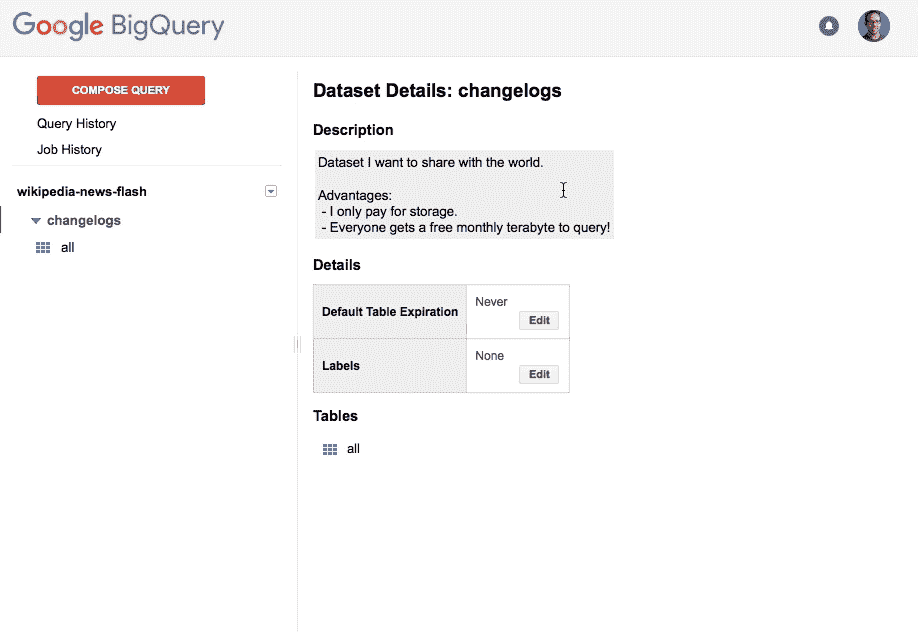
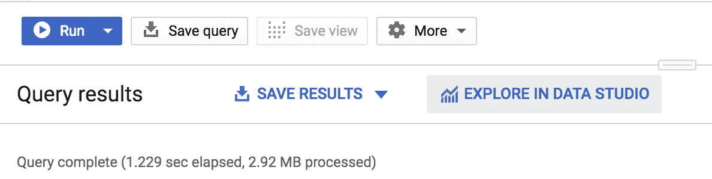
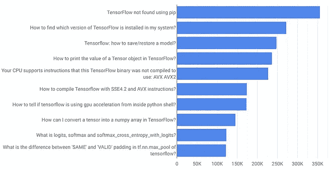

# 免费使用 BigQuery 无需信用卡:发现、学习和分享

> 原文：<https://towardsdatascience.com/bigquery-without-a-credit-card-discover-learn-and-share-199e08d4a064?source=collection_archive---------9----------------------->

## 如果您在注册 BigQuery 时遇到了困难，不用担心——现在注册并开始查询比以往任何时候都容易。新的沙盒模式甚至包括免费存储，不需要信用卡。

***重要更新*** : *我在 2020 年离开了谷歌，加入了雪花——所以我无法保持更新我的旧帖子。如果你想尝尝雪花啤酒，加入我们吧——我在❄️.玩得很开心*

 [## 雪花审判

signup.snowflake.com](https://signup.snowflake.com/) 

详见官方博文《[无信用卡查询:BigQuery 沙箱介绍](https://cloud.google.com/blog/products/data-analytics/query-without-a-credit-card-introducing-bigquery-sandbox)》。在这里，我们将把重点放在尽快开始使用和查询上。

# 步骤 0:创建帐户

进入 [BigQuery web U](https://console.cloud.google.com/bigquery) I，然后按照提示进行操作。在 60 秒内，不到 4 个步骤，你就可以开始查询了。

# 步骤 1:我的第一个查询

根据维基百科，让我们找出谁是最著名的艾伦。将此查询输入到[新的 BigQuery web UI](https://console.cloud.google.com/bigquery) 中，然后单击“运行”:

```
SELECT title, SUM(views) views
FROM `fh-bigquery.wikipedia_v3.pageviews_2019`
WHERE DATE(datehour) BETWEEN '2019-01-01' AND '2019-01-10'
AND wiki='en'
AND title LIKE r'Alan\_%'
GROUP BY title
ORDER BY views DESC
LIMIT 10
```

[](https://www.youtube.com/watch?v=XgvR3y5JCXg)

原来[艾伦·图灵](https://en.wikipedia.org/wiki/Alan_Turing)是 2019 年前 10 天在英文维基百科中浏览量最多的艾伦。尝试查找其他名称或时间段。你能猜出谁是最有名的史蒂夫吗？

如果您不熟悉 BigQuery 的标准 SQL，我们来分析一下这个查询:

*   这给了我每个标题的总浏览量。
*   `FROM `fh-bigquery.wikipedia_v3.pageviews_2019``:扫描[维基百科 2019 年浏览量表](https://console.cloud.google.com/bigquery?p=fh-bigquery&d=wikipedia_v3&t=pageviews_2019&page=table)。这张桌子是我共享的。
*   `WHERE datehour BETWEEN ‘2019–01–01’ AND ‘2019–01–10’`:我们只打算扫描 2019 年的前 10 天。
*   有很多维基百科——我只想把重点放在英文版上。这个过滤器工作得很好，因为表 primary [clustering](https://medium.com/google-cloud/bigquery-optimized-cluster-your-tables-65e2f684594b) 是我想要查询的 Wikipedia。哦，如果我过滤掉`en.m`——手机版英文维基百科——我会收到不同的结果。
*   `AND title LIKE r’Alan\_%’`:查询所有以“艾伦 _”开头的维基百科页面。该过滤器与通过标题的次级聚类一起工作得很好。注意，我在做`LIKE`的时候需要躲避`_`。
*   `GROUP BY title`:我们将为每个标题获得`SUM(views)`。
*   `ORDER BY views DESC`:根据哪个页面的浏览量最多对结果进行排序。
*   `LIMIT 10`:我们只想看到前 10 名。

这里发生了一些有趣的事情:

*   在这 10 天里，维基百科的浏览量超过了 56 亿次。在 BigQuery 中，这由超过 72 GB 的数据表示。在更大的范围内，2018 年维基百科所有浏览量的表格是 2.25 TB。
*   使用 BigQuery 的成本与被扫描的列的大小成正比——这里我们有一个好消息:当使用已经进行了日期分区和聚集的[表时，效果会好得多。例如，Alan 查询将花费我 73 GB，但是由于分区和集群，它最终只扫描了 2 GB。**这是一个巨大的差异——这意味着我每个月可以免费执行 500 次这样的查询，而不是只有 12 次**。](https://medium.com/google-cloud/bigquery-optimized-cluster-your-tables-65e2f684594b)

# 步骤 2:创建自己的表格

假设我们想深入研究关于栈溢出的张量流的所有问题。我们可以编写这样的查询:

```
SELECT view_count, answer_count, DATE(creation_date) date, title 
FROM `bigquery-public-data.stackoverflow.posts_questions`
WHERE 'tensorflow' IN UNNEST(SPLIT(tags, '|'))
ORDER BY view_count DESC
LIMIT 10
```



Top ten Tensorflow questions on Stack Overflow, by total # of views

这个查询使用了 1.66 GB 的免费配额，每个类似的查询都有类似的成本。我们可以做得更好:将您感兴趣的数据提取到一个新表中。有了 BigQuery 的沙盒模式，现在你还可以免费获得 [10 GB 的存储空间](https://cloud.google.com/free/)。因此，我们可以将所有 Tensorflow 问题提取到一个新的表中，而不是每次都在整个数据集上运行新的查询。

要创建新表，首先创建一个数据集。请注意，如果没有与您的帐户相关联的信用卡，BigQuery 会将任何表的生存期限制为 60 天。



Create a new dataset inside your BigQuery project. Lifetime of a table will be limited to 60 days in sandbox mode.

为了在之前的查询中创建一个新表，BigQuery 现在支持 [DDL](https://cloud.google.com/bigquery/docs/reference/standard-sql/data-definition-language) 和 [DML](https://cloud.google.com/bigquery/docs/reference/standard-sql/data-manipulation-language) SQL 命令:

```
CREATE TABLE `deleting.tensorflow_questions`
AS
SELECT view_count, answer_count, DATE(creation_date) date, title 
FROM `bigquery-public-data.stackoverflow.posts_questions`
WHERE 'tensorflow' IN UNNEST(SPLIT(tags, '|'))
```

现在，我可以在新表上编写这样的查询:

```
SELECT view_count, answer_count, date, title 
FROM `deleting.tensorflow_questions`
ORDER BY view_count DESC
```

好消息:这个查询现在只扫描 3 MB，这给了我更多的自由去试验。我每个月可以免费执行 30 多万次这样的查询！

# 分享

使用 BigQuery，你可以与你最亲密的朋友或全世界分享你的结果和发现。这在新的 web UI 上还没有实现，但是在 [BigQuery classic web UI](https://bigquery.cloud.google.com/) 上真的很容易:



How to share a BigQuery table on the [classic UI](https://bigquery.cloud.google.com/)

# 使用 Data Studio 可视化

多种工具和框架可以直接连接到 big query——我们喜欢它们。现在，在新的 BigQuery web UI 中，您可以快速地将结果导入 Data Studio:



Visualizing query results with Data Studio

# 更进一步

*   订阅 [/r/bigquery](http://reddit.com/r/bigquery) ，随时了解所有 bigquery 最新消息。
*   查看我们的[官方公开数据集](https://console.cloud.google.com/marketplace/browse?filter=solution-type:dataset)和一些[非官方数据集](https://www.reddit.com/r/bigquery/wiki/datasets)。
*   卡住了？询问关于堆栈溢出的社区。
*   想我吗？关注我在 Medium 和 Twitter [@felipehoffa](https://twitter.com/felipehoffa) 上的[最新帖子。](https://medium.com/@hoffa)