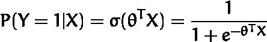
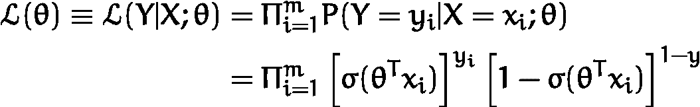
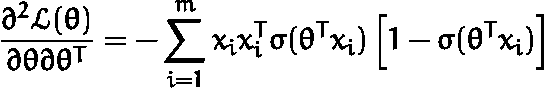

# 用逻辑回归进行二元分类

> 原文：<https://towardsdatascience.com/binary-classification-with-logistic-regression-31b5a25693c4?source=collection_archive---------10----------------------->

## 在线广告点击率的估算

在绩效营销中，一个重要的关键绩效指标(KPI)是由点击率(CTR)给出的。点击率是点击特定链接的用户与查看页面、电子邮件或广告(ad)的用户总数的比率。

估计 CTR 是一个二元分类问题。当用户观看广告时，他要么点击`(y=1)`要么不点击`(y=0)`。只有两种可能的结果，让我们使用*逻辑回归*作为我们的模型。与用于推断*连续*变量的线性回归相反，逻辑回归用于估计任意数量的*离散*类。我给出了一个简单的可视化，它为三个主要的数据科学问题提供了正确的模型:


How to choose a model

在这个故事中，在将学到的一切应用于 Kaggle 的“点击率预测”挑战之前，我想先引导您了解逻辑回归的技术细节。

# 二元逻辑回归:理论

逻辑回归的特征在于一个逻辑函数*来模拟标签 Y 变量 X 的条件概率*


The conditional probability.

在我们的例子中，Y 表示被点击或未被点击的状态，X 表示我们想要选择的特征(例如设备类型)。

我们将使用 *m* 个观察值，每个包含 *n* 个特征。对于它们中的每一个，我们将有 m 个 n+1 维的行向量 xᵢ。我们的标签 Y 只能是 0 或 1。参数将在 n+1 维的列向量θ中给出。


Definitions of Y, X and Θ.

用户点击给定观察值 X 的条件概率可以建模为 *sigmoid* 函数。



The conditional probability modeled with the sigmoid logistic function.

逻辑回归的核心是 sigmoid 函数。sigmoid 函数将连续变量映射到闭集[0，1]，然后可以将其解释为概率。右手边的每个数据点被解释为`y=1`，左手边的每个数据点被推断为`y=0`。


A plot of the sigmoid function with labeled sample data.

## 衍生(可选)

在推导条件概率时，sigmoid 函数自然出现。我们可以用贝叶斯定理来表示 P(Y|X)


Bayes’ theorem

根据贝叶斯解释

*   P(Y|X)为*后验，*
*   P(Y)为*先验，*
*   和 P(X)作为归一化因子。

我们将拟合数据的后验和先验，并且必须去掉未知的概率 P(X)。这可以通过使用补充条件概率来完成。


Complement conditional probability.

当将后验概率除以互补条件概率并取对数时，我们得到*对数优势(logit)*


The logit can be modeled as a linear function of X.

**这里我们假设 logit 是 X 中的线性函数！**现在，我们只需撤销对数并求解后验概率，即可导出 sigmoid 函数


Sigmoid derivation.

## 最大似然估计

到目前为止，我们已经用一组参数θ模拟了后验概率。我们如何确定θ的最佳选择？用户点击的条件概率等于 sigmoid 函数。所有情况的概率总和必须等于 1。因为我们只有两种情况，所以我们可以找到一种优雅的方式在一个表达式中表达这两种概率:


The probability mass function of the Bernoulli distribution.

右边是伯努利分布的概率质量函数(PMF)。伯努利分布描述了一个随机变量，它可以采取两种结果中的一种，比如我们的标签被点击或未被点击。现在，为了确定我们的参数θ，我们需要在只给定一个样本的情况下，最大化复制总体分布的概率。这种方法被称为*最大似然估计* (MLE)。我们主要是将样本中每个事件的所有概率结合起来。这种联合概率被称为似然性，它与概率有许多共同之处，但主要集中在参数上



The likelihood.

我们可以将上面的函数最大化，但是为了方便起见(为了获得更漂亮的导数),我们将对数应用于可能性。我们可以这样做，因为对数是单调递增的，因此保留了最大值的位置。通过应用对数，乘积变成和


The log-likelihood.

为了最大化对数似然，我们可以使用微积分。极值点的导数必须等于零


The first derivative of the log-likelihood.

## sigmoid 函数的导数(可选)

在最后一个结果中，我们使用了 sigmoid 函数对θ的导数。推导过程如下


Derivation of the derivative of the sigmoid function.

## 牛顿-拉夫森

为了执行 MLE，我们必须找到对数似然的一阶导数的根。我们可以使用*牛顿-拉夫森*求根算法来完成这项任务。牛顿-拉夫森法是最大化对数似然的标准方法。它需要计算二阶导数。在我们的例子中，我们可以通过分析来确定它。在其他情况下，二阶导数在计算上是昂贵的，我们可以使用*梯度下降(上升)*进行优化。二阶导数由下式给出



The second derivative of the log-likelihood.

牛顿-拉夫森方法告诉我们如何更新每次迭代的参数。


Newton-Raphson iteration.

# 估计 CTR

在这个故事的第二部分，我们想编写我们自己的逻辑回归实现。我制作的 Jupyter 笔记本已经作为[要点](https://gist.github.com/Knowledge91/8b839bec47c8113c8f279e0cc574a40a)出版。我们将使用“点击率预测”Kaggle 竞赛的数据。下载数据后，我们对其进行解包，并在对完整集进行训练之前准备一个 10000 行的样本。

```
unzip avazu-ctr-prediction.zip
gunzip train.gz
head -n10000 train > train_sample.csv
```

然后，我们将 CSV 加载到 panda 数据帧中，并将其分为训练集和测试集

```
df = pd.read_csv('train_sample.csv')
msk = np.random.rand(len(df)) < 0.8
train = df[msk]
test = df[~msk]
```

现在你应该关注特性探索，但是为了简单起见，我选择了列 *device_type、C1、C15* 和 *C16* 作为特性列。然后我可以准备我的特征矩阵 X 并使用*点击*列作为标签

```
m = len(train)
X_train = np.ones((m, 5))
X_train[:,1] = train.device_type.to_numpy()
X_train[:,2] = train.C1.to_numpy()
X_train[:,3] = train.C15.to_numpy()
X_train[:,4] = train.C16.to_numpy()y_train = train.click.to_numpy()
```

为了使我们的算法工作，我们需要先前导出的对数似然的一阶和二阶导数，其可以编码如下

```
def DLogLikelihood(X, y, theta):
    res = np.zeros(theta.shape[0])
    for i in range(0, X.shape[0]):
        x_i = X[i]
        y_i = y[i]
        res += x_i * (y_i - sigmoid(np.dot(theta, x_i)) )
    return resdef DDLogLikelihood(X, theta):
    res = np.zeros((theta.shape[0], theta.shape[0]))
    for i in range(0, X.shape[0]):
        x_i = X[i]
        sigma = sigmoid(np.dot(theta, x_i))
        res += np.outer(x_i, x_i) * sigma * ( 1 - sigma ) 
    return -res
```

迭代 Netwon-Raphons 步骤和我们的逻辑回归算法然后

```
def NewtonRaphsonTheta(X, y, theta):
    return theta - np.dot(
        np.linalg.inv(DDLogLikelihood(X, theta)),
        DLogLikelihood(X, y, theta))def logisticRegression(X, y, epochs=100):
    theta = np.zeros(X.shape[1])
    for i in range(epochs):
        theta = NewtonRaphsonTheta(X, y, theta)
    return theta
```

通过调用`logisticRegression(X, y)`,我们将迭代计算参数θ，然后可以用它来预测用户的点击概率

```
def predict(X, theta):
    res = np.zeros(X.shape[0])
    for i in range(len(res)):
        x = X[i]
        res[i] = sigmoid(np.dot(theta, x))
    return res
```

对于试运行，我们得到以下概率

```
theta = logisticRegression(X_train, y_train, epochs=100)
y_pred = predict(X_test, theta)print(y_pred)
[0.18827126 0.16229901 … 0.16229901 0.16229901 0.16229901]
```

为了评估该模型，我将测试集的预测与它们的实际值进行了比较，结果显示该模型相当差。为了改进，我们可以在特征选择上花更多的时间，在更多的数据上进行训练，同时不断地用评估指标测量模型性能，如*对数损失*或 *ROC* 曲线。

# **总结**

*   逻辑回归用于多分类问题
*   如果我们只有两个类，则使用二元逻辑回归
*   P(Y|X)由 sigmoid 函数建模，该函数从(-∞，∞)映射到(0，1)
*   我们假设 logit 可以建模为线性函数
*   为了估计参数θ，我们最大化对数似然
*   伯努利分布是具有两种可能结果的离散分布，用于二元分类
*   我们使用牛顿-拉夫森作为求根器，因为我们可以很容易地计算对数似然的二阶导数

[1]: Kaggle，点击率预测[https://www.kaggle.com/c/avazu-ctr-prediction](https://www.kaggle.com/c/avazu-ctr-prediction)

[2]:统计学习的要素，t .哈斯蒂，r .蒂布拉尼，j .弗里德曼[https://web.stanford.edu/~hastie/ElemStatLearn/](https://web.stanford.edu/~hastie/ElemStatLearn/)

[3]:牛顿-拉夫逊法[https://en.wikipedia.org/wiki/Newton%27s_method](https://en.wikipedia.org/wiki/Newton%27s_method)