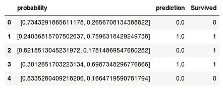
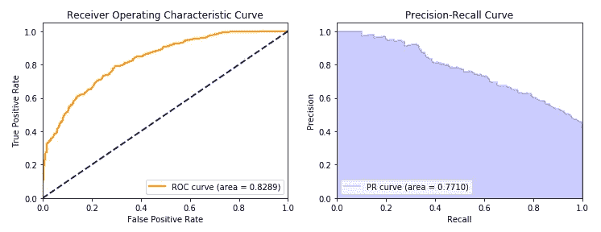
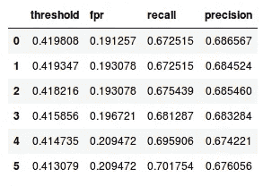
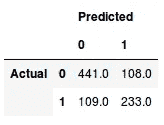

# HandySpark 简化二元分类器评估

> 原文：<https://towardsdatascience.com/binary-classifier-evaluation-made-easy-with-handyspark-3b1e69c12b4f?source=collection_archive---------13----------------------->


Photo by [SJ Baren](https://unsplash.com/@sjbaren?utm_source=medium&utm_medium=referral) on [Unsplash](https://unsplash.com?utm_source=medium&utm_medium=referral)

# TLDR；

**HandySpark** 是一个 Python 包，旨在改善 *PySpark* 用户体验，尤其是在涉及到**探索性数据分析**时，包括**可视化**功能，以及现在的**二进制分类器的扩展评估指标。**

使用 Google Colab 亲自尝试一下:

[](https://colab.research.google.com/github/dvgodoy/handyspark/blob/master/notebooks/Exploring_Titanic.ipynb) [## 谷歌联合实验室

### 使用 HandySpark 探索泰坦尼克号

colab.research.google.com](https://colab.research.google.com/github/dvgodoy/handyspark/blob/master/notebooks/Exploring_Titanic.ipynb) 

检查存储库:

[](https://github.com/dvgodoy/handyspark) [## dvgodoy/handyspark

### HandySpark——带来熊猫般的能力，激发数据帧——dvgodoy/HandySpark

github.com](https://github.com/dvgodoy/handyspark) 

# 介绍

在我之前的[帖子](/handyspark-bringing-pandas-like-capabilities-to-spark-dataframes-5f1bcea9039e)中，我介绍了 **HandySpark** ，这是我为 *PySpark* 开发的一个包，用来帮助缩小*熊猫*和 *Spark* 数据帧之间的差距。

今天，我很高兴地宣布新版本的[发布](https://github.com/dvgodoy/handyspark/releases/tag/v0.2.0a1)，它不仅解决了*分层*操作的一些*性能问题*(现在应该快几倍了！)，而且**使得评估二进制分类器更加容易。**

# 二元分类任务

我们将使用一个简单的二进制分类任务来说明 *HandySpark* 提供的扩展评估功能:再一次使用**泰坦尼克号**数据集预测乘客存活率。

让我们首先设置好一切，然后*加载*我们的数据:

Setting everything up and loading the Titanic dataset :-)

要评估一个模型，我们需要先*训练*它。为了训练一个模型，我们需要*首先清理*数据集。所以，就从这点开始吧！

# 使用 HandySpark 清理数据

我们知道`Age, Cabin`和`Embarked`缺少值。你可以使用`[isnull](https://dvgodoy.github.io/handyspark/handyspark.html#handyspark.HandyFrame.isnull)`方法很容易地检验这一点。

为了让我们的模型和管道尽可能简单，让我们只使用*数字* *变量*，比如`Age`、`Fare`、`SibSp`和`Parch.`

对于**输入`Age`的缺失值**，我们可以只对每个缺失值使用一个*简单平均值*，对吗？但是你真的认为一等舱、二等舱和三等舱的男女乘客的年龄差不多吗？

让我们使用`[stratify](https://dvgodoy.github.io/handyspark/handyspark.sql.html#handyspark.sql.dataframe.HandyFrame.stratify)`操作来检查一下，就像这样:

```
hdf.stratify(['Pclass', 'Sex']).cols['Age'].mean()Pclass  Sex   
1       female    34.611765
        male      41.281386
2       female    28.722973
        male      30.740707
3       female    21.750000
        male      26.507589
Name: Age, dtype: float64
```

这显然是有区别的……女性比男性年轻，阶级越低，乘客越年轻。毫不奇怪，我会说…

那么**离群值**呢？我们可以使用[图基的栅栏](https://en.wikipedia.org/wiki/Outlier#Tukey's_fences)方法来识别然后**栅栏**值被认为是极端的。对于`Fare`，我们有多少离群值？

```
hdf.cols['Fare'].outliers(k=3)Fare    53
Name: outliers, dtype: int64
```

请记住，图基的栅栏非常敏感——他们假设高于 *k 乘以四分位数间距(IQR)* 的一切都是**极值**。在我们的例子中，它导致了 53 个异常值！你可以尝试不同的 k 值来校准它，尽管…

所以，让我们用我们发现的数据来清理它。首先，我们*根据给定`Pclass`和`Sex`的平均值填充*缺失的`Age`值。接下来，我们使用 Tukey 的方法*保护* `Fare`值:

Cleaning up!

# 建立模型

一旦我们有了干净的数据集，我们就可以建立一个简单的分类器来预测乘客是否在泰坦尼克号灾难中幸存。让我们使用 Spark 的`RandomForestClassifier`来完成这个任务。

但是，记住 Spark ML 算法需要将所有特征整齐地*组装*成一个**特征向量**。此外，该特征向量**不接受*缺失的*值。**

这个怎么处理？我们可以简单地使用 *HandySpark* 的`imputer`和`fencer`方法来创建相应的**变压器**来填充缺失值和隔离异常值。然后，我们将这些变压器添加到我们的**管道**中，我们就可以开始了！

Training a classifier and making predictions

我们的**预测**是什么样子的？让我们把数据帧做成一个*手帧*，看看我们的标签和分类器生成的预测:

```
predictions.toHandy().cols[['probability', 'prediction', 'Survived']][:5]
```



First 5 rows from our predictions

**概率**列包含一个*向量*，其概率分别与类别 0 和 1 相关联。为了*评估*的目的，我们需要成为*阳性*病例的概率，因此我们应该查看概率向量的*第二个*元素。**预测**栏显示了相应的**类**，假设*阈值为 0.5* 。

# 评估模型

我们的模型有多好？我们可以只计算具有*匹配预测和幸存列*的行的比例，这就是我们的**准确度**。然而，事实证明，准确度是**而不是**评价二元分类器的一个很好的标准。

为了真正说明我们的模型有多好，我们需要其他指标，如**真阳性率** ( **TPR** ，也称为**召回**)、**假阳性率** ( **FPR** )和**精度**，这将 ***随我们选择的**阈值**而变化*，从而将预测概率转化为预测类别(0 或 1**

如果我们检查**每一个可能的阈值**并计算这些*度量*，我们可以为给定的模型建立**接收器工作特性** ( **ROC** )曲线和**精度召回** ( **PR** )曲线。

这就带来了另一个问题:*如何利用这些曲线*比较两个模型？它们可能在不同的点交叉，对吗？解决这个问题的一个方法是查看曲线下的**面积:粗略地说，*面积越大，*模型越好。这样我们就可以计算 ROC**** 曲线下的**面积( **AUROC** 、 **ROC AUC** ，或者有时只是 **AUC** )和 PR** 曲线下的**面积( **PR AUC** )。**

> 如果你想了解所有这些指标的更多信息，请查看这些帖子:[被困惑矩阵](/confused-by-the-confusion-matrix-e26d5e1d74eb)、[接收器操作特性曲线揭秘](/receiver-operating-characteristic-curves-demystified-in-python-bd531a4364d0)、[了解 AUC — ROC 曲线](/understanding-auc-roc-curve-68b2303cc9c5)和[了解 ROC 曲线](http://www.navan.name/roc/)(互动)。

# 使用 PySpark 评估模型

我们既有*好的*也有一些*坏的*消息……好的*消息是: *PySpark* 给了我们**两个** ROC AUC 和 PR AUC。坏消息是: *PySpark* 只给了我们**那个:-(***

Using PySpark Evaluator to get ROC AUC and PR AUC

如果我们想用*不同的阈值*做实验呢？出手相救:-)

# 使用 HandySpark 评估模型

*HandySpark* 扩展了 PySpark 的`BinaryClassificationMetrics`，因为它的 Java 对应物已经有了几个检索指标和阈值的方法，现在由 *HandySpark* 公开。但是也有新实现的方法。

*HandySpark* 还可以使用包含**预测概率**和**标签**的数据帧作为自变量，如下要点所示:

Plotring ROC and PR curves, getting metrics by threshold and confusion matrices with HandySpark!

让我们深入研究评估模型的所有这些新的可能性。

## 绘制曲线

一张图片胜过千言万语！所以，让我们从使用`plot_roc_curve`和`plot_pr_curve`方法的两条曲线的**图**开始。就这么简单:

```
fig, axs = plt.subplots(1, 2, figsize=(12, 4))
bcm.plot_roc_curve(ax=axs[0])
bcm.plot_pr_curve(ax=axs[1])
```



ROC and PR curves

**瞧啊**！现在我们可以说，如果我们愿意接受 20%的*假阳性率*，我们将得到 60%以上的*真阳性率*。够好吗？酷！

你会问，我们应该使用哪个**阈值**来实现这一点？

## 阈值和指标

我们可以使用`getMetricsByThreshold`方法获得**所有阈值**和相应的**指标**。它返回一个 Spark 数据帧，然后我们可以过滤出感兴趣的指标(在我们的例子中，FPR 介于 19%和 21%之间):

```
bcm.getMetricsByThreshold().filter('fpr between 0.19 and 0.21').toPandas()
```



Thresholds for FPR between 19% and 21%

我们需要*的误报率*最多为 20%，那么对应的**阈值为 0.415856** 。这将给我们 68.1%的*真阳性率* ( *召回*)和 68.3%的*精度*。

我们还可以查看使用特定的*阈值*构建的*混淆矩阵*，这产生了我们刚刚获得的指标。

## 混淆矩阵

混淆矩阵可以，呃… *混淆*！；-)为了尽量减少阅读时可能产生的任何误解，我已经用**标记了**列和行，所以你*不需要猜测*哪个类先出现，哪个是预测值和实际值。

用你选择的*阈值*调用`print_confusion_matrix`就行了，就这么简单:

```
bcm.print_confusion_matrix(.415856)
```



Confusion Matrix — not so confusing anymore :-)

# 最后的想法

我的目标是**改善 PySpark 用户体验**，让执行**数据清理**和**模型** **评估**变得更加容易。不用说，这是一项正在进行的工作，我已经计划了更多的改进。

如果你是使用 *PySpark* 的数据科学家，我希望你尝试一下 **HandySpark** 并**让我知道你对它的想法:-)**

[](https://github.com/dvgodoy/handyspark) [## dvgodoy/handyspark

### HandySpark——带来熊猫般的能力，激发数据帧——dvgodoy/HandySpark

github.com](https://github.com/dvgodoy/handyspark) 

*如果你有任何想法、评论或问题，请在下方留言或联系我* [*推特*](https://twitter.com/dvgodoy) *。*