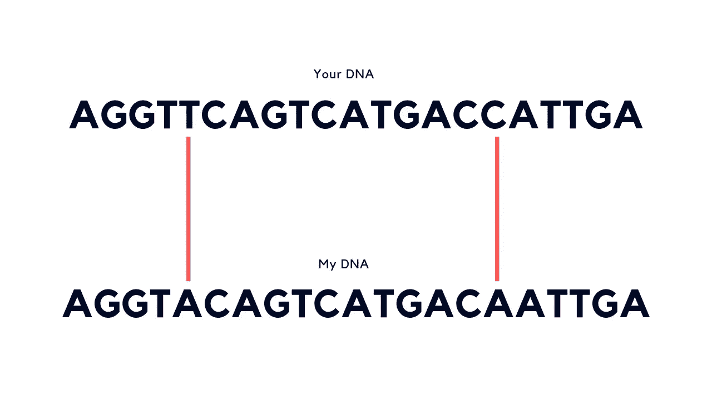
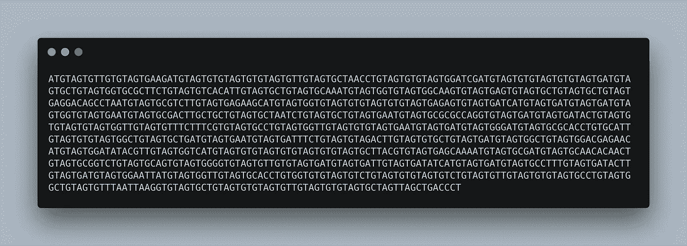
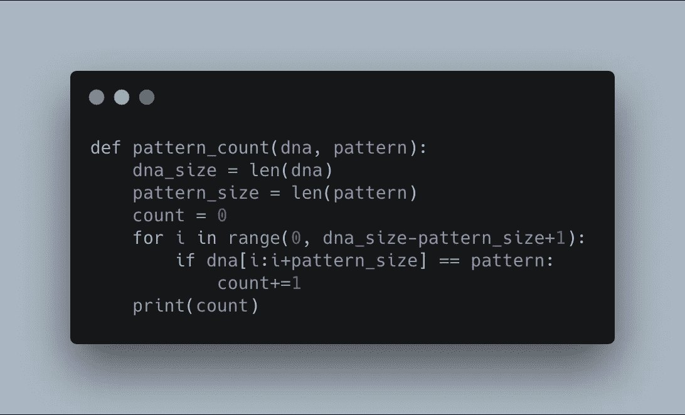

# 生物信息学:代码与生物学相遇的地方

> 原文：<https://towardsdatascience.com/bioinformatics-where-code-meets-biology-faa2b99cdfcb?source=collection_archive---------5----------------------->

## 医疗保健的未来简介

你和我有 30 亿个共同点。或者接近它。不只是你和我，其他人都一样。

这些东西会是什么呢？

我喜欢运动。你知道吗？

机器学习怎么样？我很喜欢。

我们可以继续努力，找出答案，但要达到 30 亿美元还需要一段时间。

即使我们成功了，我们也会比较错误的东西。

好吧，什么是正确的事情？

我们的 DNA。或者更具体地说，结合形成核酸的核碱基，这些核酸链在一起构成我们的 DNA。

DNA 是生命的语言。这是为所有生物奠定基础的密码。

就像一本书是由字母表的字母组合而成，你和我是由大约 32 亿个核碱基组合而成——腺嘌呤(A)、胸腺嘧啶(T)、胞嘧啶(C)和鸟嘌呤(G)。这个集合序列被称为基因组。

如果我们把 32 亿左右的 A、C、G 和 T 放在一起，30 亿左右是匹配的，但 2000 万到 3000 万是不同的。这些差异可以解释为什么我是金发而你是不同的颜色。如果你也是金发碧眼，我们可以把它添加到共同点列表中。

Although most of our DNA is the same, if we looked closely, we’d find a few differences. A difference of 1 letter is known as a SNP (single nucleotide polymorphism).

我在这里漏掉了一些东西，例如，不同的字母组如何编码蛋白质，其他组如何组成基因，基因内部如何有不同的版本等等。

为什么？

因为 DNA 是一种复杂的动物。理解所有 32 亿个字母是如何相互作用的仍然是一个很大的研究课题。众所周知，一个人不可能理解这样一种语言。

这就是计算机力量的来源。当生命的语言遇到自然的语言。这也是生物信息学出现的地方。

生物信息学结合了生物学、计算机科学、数学、统计学的原理来理解生物学数据。

# 寻找复制的起源

在 [Coursera 生物信息学专业](http://bit.ly/courserabioinformatics)中的第一个示例问题涉及寻找复制的**起源**。复制起点是复制开始的基因组序列。

在你出生之前，你开始是一个单细胞，然后一个在两个之间，两个变成四个，最后，四个变成你。对于第一个分裂的细胞，它必须复制自己的基因组。后续的每个细胞也是如此。

了解了这一点，你就可以开始想象寻找复制的起源是多么有价值。

比如说有一组细胞内含有非常擅长抗癌的蛋白质。我们怎样才能获得更多这样的细胞来增强我们的防御呢？

一种方法可能是在我们的好细胞中寻找原始复制，找到它，然后利用这些信息在体外产生更多的细胞，然后再把它们放回体内。

让我们试试。

## 故事时间

因为你的生物学家朋友知道你一直在练习你的编码技能，她来找你寻求帮助。

A fictional sequence of 1000 nucleobases which combine to create a DNA sequence of a strong cancer-fighting cell.

经过多次实验，从上面的细胞样本中切下部分 DNA，观察细胞是否会复制。她认为她已经找到了复制的起源。

可以肯定的是，她想知道它在整个序列中出现了多少次，以及它是否足够重要，足以成为复制的真正起源。

她给你看文件，然后你开始工作。

The code you write for your friend to find how many times a pattern occurs in a sequence of DNA.

稍加修改后，您认为您的代码可以运行了。它通过 DNA 序列寻找模式，如果找到匹配，它更新计数器。当它到达 DNA 模式的末尾时，它返回计数(该模式在 DNA 序列中出现的次数)。

“什么格局？”你问。

“TGTAGTGTG。”

你帮你的朋友运行代码。

结果返回为 18。

她发现的模式在好细胞的 DNA 序列中出现了 18 次。

“这有意义吗？”你问。

“它发生一次的概率小于 0.004%，所以 18 次肯定意味着什么，但我必须核实一下。”

你擅长编码，但不擅长统计，你的生物学家朋友也不擅长。她回到实验室找到她的统计学家朋友，进行更多的测试。

这里发生的是几个领域的结合。你的生物学家朋友通过实验发现了一个潜在的复制起源的方法，但这是漫长而乏味的。为了帮忙，你提供了一些你的计算机科学技能。然后找出你的结果是否有统计学意义。

这种不同领域的交叉是生物信息学发挥作用的一个例子。每个领域都带来了真知灼见，但将它们放在一起会让它们更有价值。

# 医疗保健的未来

上面的场景是一个简化的例子，真实世界中的生物信息学需要更多的步骤。

首先，你如何得到一个基因组？

幸运的是，在过去的几十年里，这部分已经有了快速的发展。第一个人类基因组测序花了 23 年时间，世界各地的团队和数十亿美元。现在，你可以在几天内以不到 15，000 美元的价格完成这项工作。

好了，你有了一个基因组，现在你要做什么？

好问题。这是用不同的统计和计算方法探索 DNA 的新方法正在积极研究的地方。

你在上面看到的 DNA 序列是线性的，单个字符串。但实际的 DNA 是不同的，它由两条链组成(一条链是另一条链的反面)，不同的区域并不总是以相同的方式相互作用。所以找到一个模式可能不像我们看到的那样简单。

好吧，假设你对基因组有了更多的了解，它是如何被应用的呢？

生物信息学最有趣的应用是**个性化医疗**。为个人量身定制的医疗保健，而不是为个人量身定制的医疗保健。

我有幸亲眼看到的一个项目是由 Max Kelsen 开发的[免疫疗法结果预测或 IOP](https://maxkelsen.com/blog/crc-p-cancer-ai-research)。目标是使用全基因组数据来开发预测癌症患者免疫治疗结果的工具。有些患者对免疫疗法的反应比其他人好，为什么？答案会隐藏在它们的基因组中吗？

生物信息学的应用也不仅限于预测癌症治疗的结果。

营养基因组学研究食物和基因组的相互作用。想象一个专门针对你的 DNA 制定的饮食计划。

我爸爸每天都要服用一些药物来缓解他的帕金森氏症和老年痴呆症的症状。服用它们的最初几年并不顺利。只是在尝试了几轮不同的药物后，他才发现一些没有让他感觉更糟的药物。药物基因组学——根据一个人的基因组制造药物——能帮助其他人更快找到合适的药物吗？

健康和科技不会很快消失。我们只是触及了这两个领域交汇处的表面。

我进入生物信息学是几天前开始的，在 Coursera 上开始了[生物信息学专业。但是随着我学习和经历的增多，我一定会分享我的发现。请务必继续关注。](http://bit.ly/courserabioinformatics)

这篇文章的视频版本可以在 YouTube 上找到。

为了[计算 0.004%的数字](https://stats.stackexchange.com/questions/230752/what-is-the-expected-number-of-occurrences-of-a-9-mer-in-500-random-dna-strings)，将`(1000–9+1)*(0.25)⁹`(长度为 9 的 A，C，G，T 的某个模式出现在 A，C，G，T 的随机序列中的概率)的结果四舍五入到最接近的千分之一。

像 23 和 me 这样的公司进行基因测试的费用要低得多，然而，这些服务使用基因分型而不是全基因组测序。