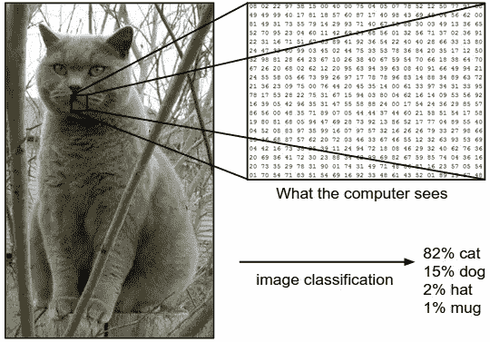
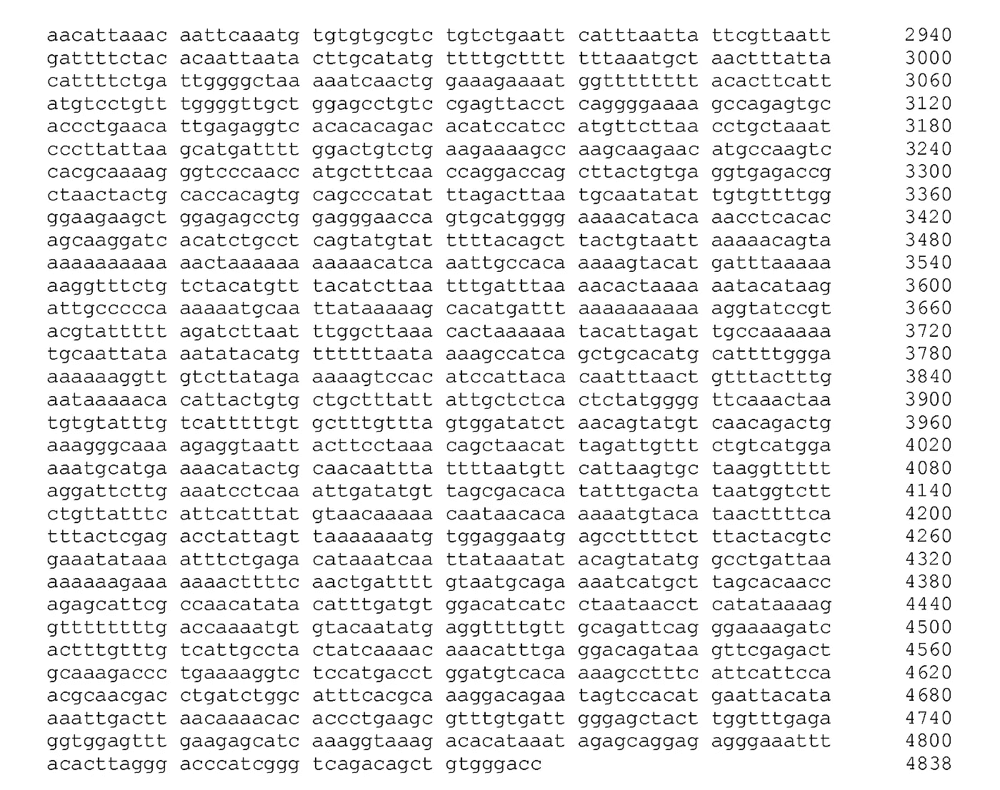

# 生物数据科学和为什么领域专业知识和背景是王道

> 原文：<https://towardsdatascience.com/biological-data-science-and-why-domain-expertise-and-context-is-king-in-55562787721?source=collection_archive---------22----------------------->

## 如果我给你看一张猫的照片，告诉你那是一只粉红色的熊猫，你会相信我吗？

如果我给你看一张猫的照片，告诉你那是一只粉红色的熊猫，你会相信我吗？你将如何证实我告诉你的是真的？你可以天生做到这一点，因为你有一个内置的神经元网络(不要与神经网络混淆)，你可以自己决定算法的图像分类是否正确。在 ImageNet 的情况下，这大约是 94%的精确度。在生物数据科学中，这是不可能的，这就是为什么它如此依赖于专业知识和背景。

Stanford [CS231n](http://cs231n.github.io/classification/)

# 生物数据科学和验证结果

如果我给你看一个金发的基因序列，并告诉你它是雀斑的编码，你会怎么做？你会相信我的话吗？我是说，我们才刚认识，而且是在网上认识的。你已经那么信任我了吗？！

不，很可能你必须依靠第二种算法，最有可能是[爆炸](https://blast.ncbi.nlm.nih.gov/Blast.cgi)，来告诉你我给你的基因序列是什么。

这就是生物数据科学如此依赖领域专业知识和背景的原因。如果你不能相信产生结果的算法，那么你也不能相信你的结果。

随着每天收集的生物学数据的爆炸式增长，将领域专业知识和生物学背景与数据科学技能结合起来变得更加重要。虽然查看基因组信息的庞大数据集并进行分析很容易，但这往往会导致重大错误。

举个例子，使用一个*n×m*矩阵的 *n* 个特征和 *m* 个患者。如果你用这个矩阵来运行一个二维卷积神经网络，你将会暗示相邻的样本有关系。对于独立的人来说，这是不正确的。

由于背景的重要性，确保你将生物数据科学工作与健康剂量的领域专业知识相结合，以确保你以正确的方式做酷的事情。

我叫亚历山大·泰特斯，我有旅行癖。我经常陷入沉思，迷失在树林中，而且经常同时迷失在两者之中。我的人生使命是重新定义职业成功，将个人和职业追求都包括在内。你可以在[*LinkedIn*](https://www.linkedin.com/in/alexandertitus/)*[*Twitter*](https://twitter.com/1alexandertitus)*[*上找到我，在网上分享一些想法*](https://alexandertitus.com/blog/) *。***