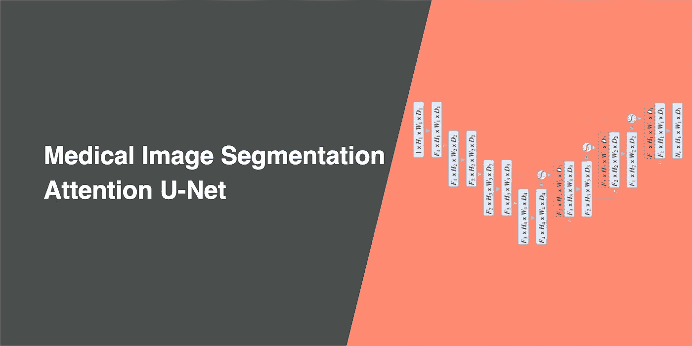
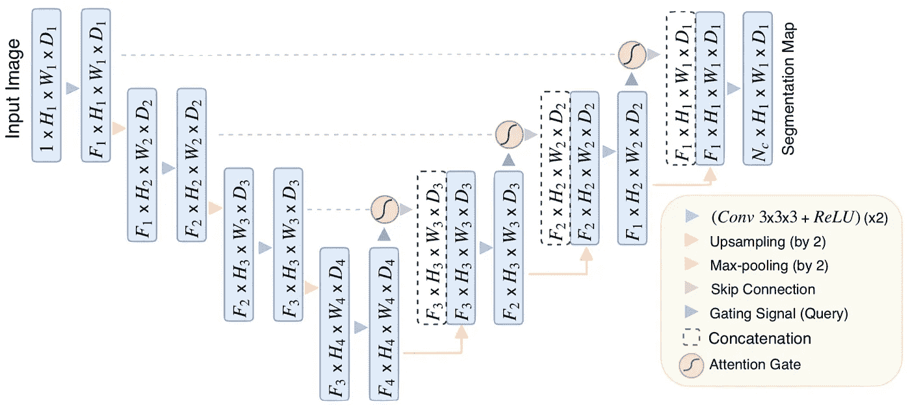

# 生物医学图像分割:注意力 U 网

> 原文：<https://towardsdatascience.com/biomedical-image-segmentation-attention-u-net-29b6f0827405?source=collection_archive---------8----------------------->

## 通过在标准 U-Net 上附加注意门来提高模型的灵敏度和准确性

医学图像分割已经被积极地研究以自动化临床分析。深度学习模型一般需要大量的数据，但获取医学图像既繁琐又容易出错。

Attention U-Net 旨在自动学习关注不同形状和大小的目标结构；因此，Oktay 等人的论文名称[“学习在哪里寻找胰腺”](https://arxiv.org/abs/1804.03999)

# 关注优图网之前的相关作品

## 优信网

U-Nets 通常用于图像分割任务，因为它的性能和对 GPU 内存的有效使用。它的目标是以较少的训练样本实现可靠的临床使用的高精度，因为获取带注释的医学图像可能是资源密集型的。[阅读更多关于优信网](/biomedical-image-segmentation-u-net-a787741837fa)的信息。

尽管 U-Net 具有出色的表示能力，但它依赖于多级级联卷积神经网络来工作。这些级联框架提取感兴趣的区域并进行密集预测。这种方法导致计算资源的过度和冗余使用，因为它重复提取低级特征。

## 注意模块

[【需要注意】Jetley 等](https://arxiv.org/abs/1804.02391)推出端到端可训练的注意模块。注意门常用于自然图像分析和自然语言处理。

注意力被用于执行特定于类的池化，这导致更准确和鲁棒的图像分类性能。这些注意力地图可以放大相关区域，从而显示出优于几个基准数据集的泛化能力。

## 软硬注意

注意力函数的工作原理是通过迭代区域提议和裁剪来使用图像区域。但这通常是不可微的，并且依赖于强化学习(一种基于采样的技术，称为强化)进行参数更新，这导致优化这些模型更加困难。

另一方面，软注意是概率性的，并且利用标准的反向传播，而不需要蒙特卡罗采样。Seo 等人的[的软注意方法通过实现非均匀、非刚性的注意图来展示改进，该注意图更适合于在真实图像中看到的自然物体形状。](https://arxiv.org/abs/1606.02393)

# 关注优信网有什么新内容？

## 注意门

为了提高分割性能， [Khened 等人](https://www.sciencedirect.com/science/article/abs/pii/S136184151830848X)和 [Roth 等人](https://www.ncbi.nlm.nih.gov/pubmed/29427897)依靠附加的在先对象定位模型来分离定位和后续分割步骤。这可以通过在 [U-Net](/biomedical-image-segmentation-u-net-a787741837fa) 架构之上集成注意力门来实现，而无需训练额外的模型。

因此，结合到 U-Net 中的注意门可以提高模型对前景像素的灵敏度和准确性，而不需要显著的计算开销。注意门可以逐渐抑制不相关背景区域的特征反应。

注意门在连接操作之前实现，以仅合并相关的激活。源自背景区域的梯度在反向传递期间被向下加权。这允许基于与给定任务相关的空间区域来更新先前层中的模型参数。

## 基于网格的门控

为了进一步改善注意机制， [Oktay 等人](https://arxiv.org/abs/1804.03999)提出了网格注意机制。通过实现基于网格的选通，选通信号不是用于所有图像像素的单个全局向量，而是适应于图像空间信息的网格信号。每个跳过连接的选通信号聚集来自多个成像尺度的图像特征。

通过使用基于网格的选通，这允许关注系数更具体地针对局部区域，因为它增加了查询信号的网格分辨率。与基于全局特征向量的门控相比，这实现了更好的性能。

## 软注意技术

附加软注意用于句子到句子的翻译( [Bahdanau 等人](https://arxiv.org/abs/1409.0473)和 [Shen 等人](https://www.aaai.org/ocs/index.php/AAAI/AAAI18/paper/viewFile/16126/16099))和图像分类( [Jetley 等人](https://arxiv.org/abs/1804.02391)和 [Wang 等人](https://arxiv.org/abs/1704.06904))。虽然这在计算上更昂贵，Luong 等人已经表明，软注意可以比乘法注意实现更高的准确性。

## 体系结构

下面是注意力 U-Net 的图解。

# 我的注意力 U-Net 实验

我将使用 Drishti-GS 数据集，其中包含 101 幅视网膜图像，以及光盘和光学杯的注释掩膜。50 幅图像用于训练，51 幅用于验证。

实验设置和使用的指标将与 [U-Net](/biomedical-image-segmentation-u-net-a787741837fa) 相同。

模型在 13 分钟内完成训练；每个时期大约需要 15 秒。

用于比较的几个 U-Net 模型之间的度量，如下所示。

测试从模型处理一些看不见的样本开始，以预测光盘(红色)和光学杯(黄色)。下面是对注意力优网、 [UNet++](/biomedical-image-segmentation-unet-a3f43342307b) 和[优网](/biomedical-image-segmentation-u-net-a787741837fa)的测试结果，以供对比。

# 结论

Attention U-Net 旨在通过在标准 U-Net 上附加注意门来进一步提高分割精度，并使用更少的训练样本。

Attention U-Net 消除了某些分割架构所需的外部对象定位模型的必要性，从而提高了模型对前景像素的灵敏度和准确性，而没有显著的计算开销。

Attention U-Net 还结合了基于网格的门控，这使得注意力系数更具体地针对局部区域。

阅读其他 U-Net 架构:

 [## 生物医学图像分割:U-Net

### 使用非常少的训练图像，并产生更精确的分割。

towardsdatascience.com](/biomedical-image-segmentation-u-net-a787741837fa)  [## 生物医学图像分割:UNet++

### 通过一系列嵌套、密集的跳过路径提高分段准确性

towardsdatascience.com](/biomedical-image-segmentation-unet-991d075a3a4b) 

这里是 PyTorch 代码的注意 U-Net 架构:

 [## 数据科学家:21 世纪最肮脏的工作

### 40%的吸尘器，40%的看门人，20%的算命师。

towardsdatascience.com](/data-scientist-the-dirtiest-job-of-the-21st-century-7f0c8215e845) 