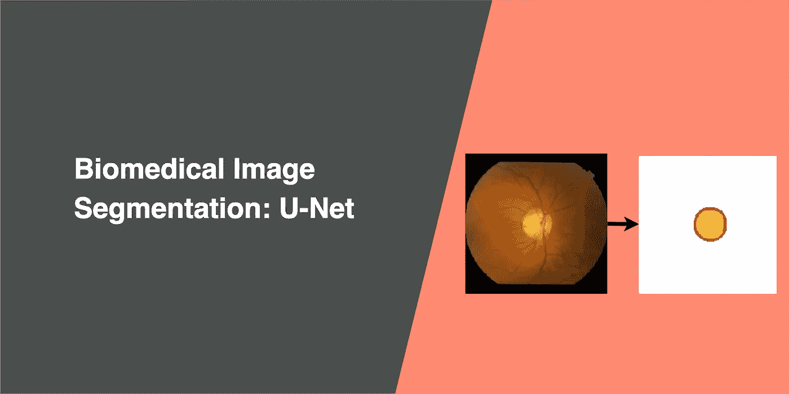
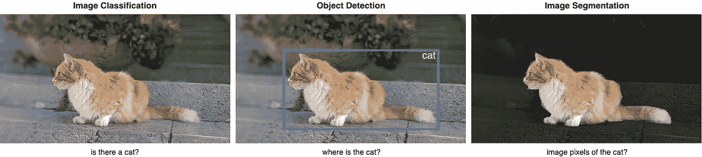
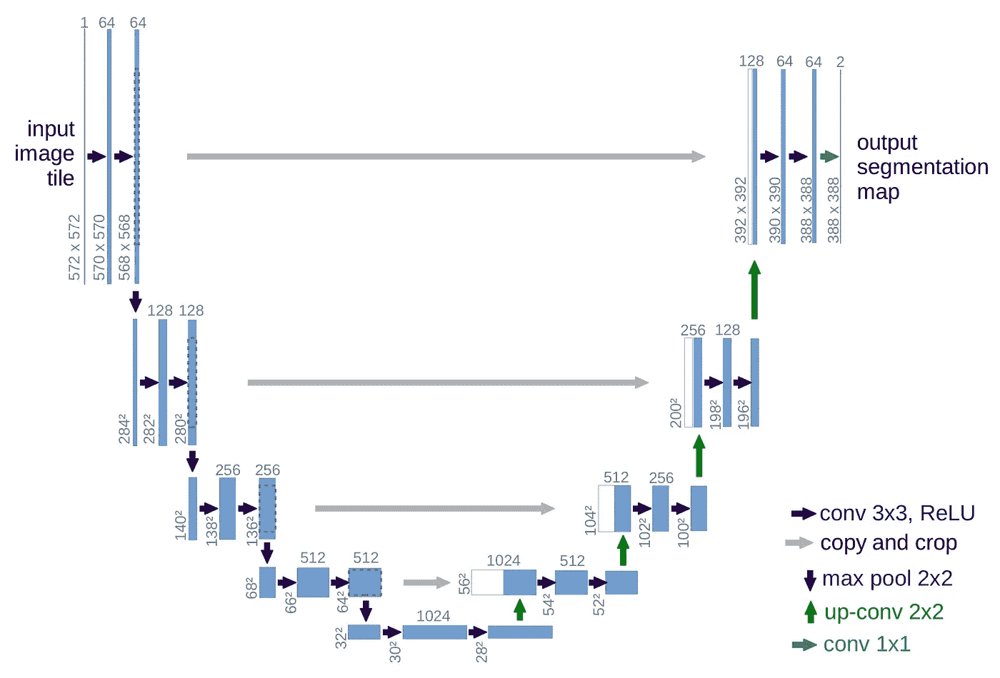
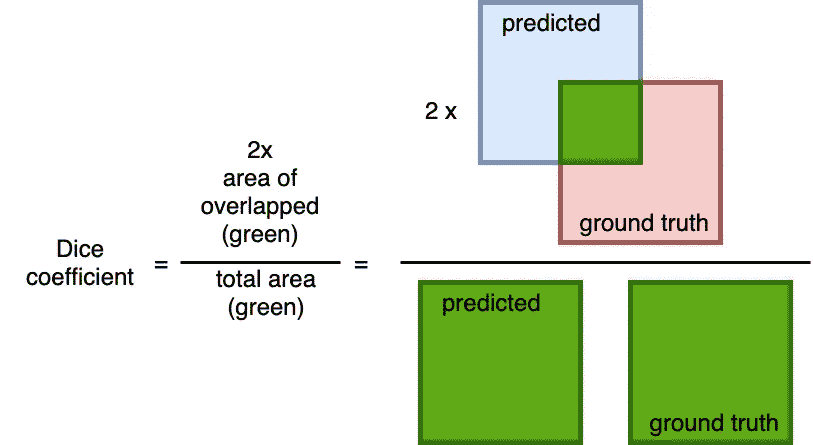
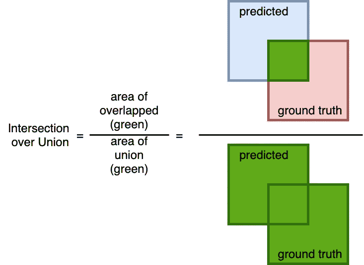
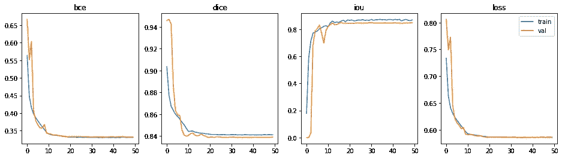
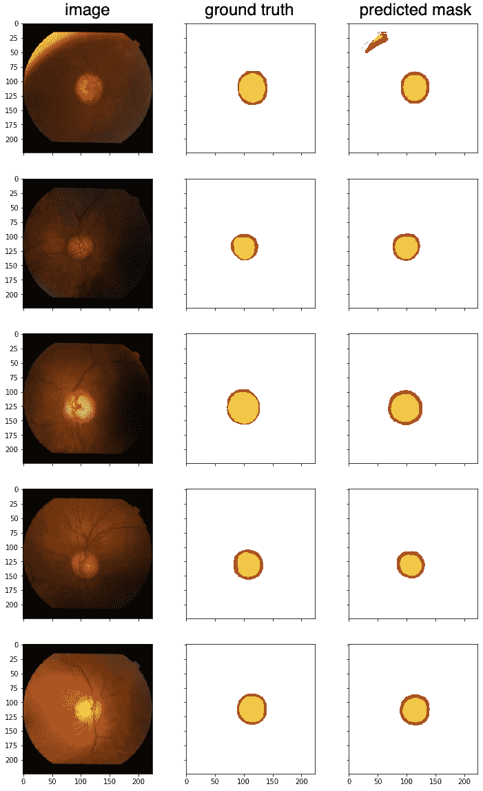
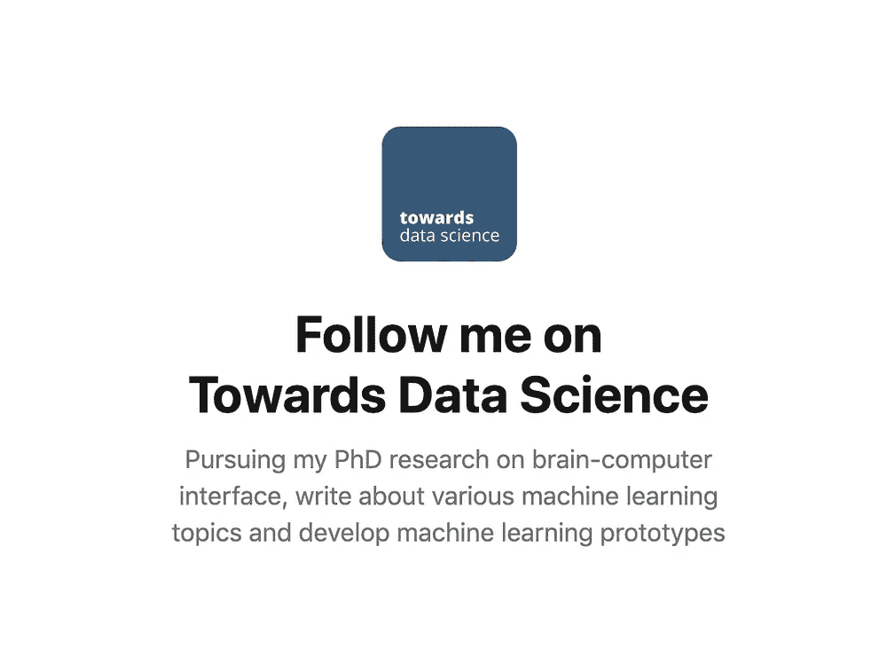

# 生物医学图像分割:U-Net

> 原文：<https://towardsdatascience.com/biomedical-image-segmentation-u-net-a787741837fa?source=collection_archive---------13----------------------->

## 使用非常少的训练图像工作，并产生更精确的分割

# 图象分割法

假设我们想知道一个物体在图像中的位置以及这个物体的形状。我们必须给图像中的每个像素分配一个标签，这样具有相同标签的像素就属于那个对象。与对象检测模型不同，图像分割模型可以提供图像中对象的精确轮廓。

## 图像分类、目标检测和图像分割的区别

**图像分类**帮助我们对图像中包含的内容进行分类。目标是回答“这个图像里有猫吗？”，通过预测是或否。

**物体检测**指定物体在图像中的位置。目标是识别“这张图片中的猫在哪里？”通过围绕感兴趣的对象绘制边界框。

**图像分割**为图像中的每个对象创建一个像素式遮罩。目标是通过对所需标签中的每个像素进行分类来识别图像中不同对象的位置和形状。

# 优信网

在本文中，我们将探索由奥拉夫·龙内伯格、菲利普·费舍尔和托马斯·布罗克斯撰写的 [U-Net](https://lmb.informatik.uni-freiburg.de/people/ronneber/u-net/) 。这篇[论文](https://arxiv.org/pdf/1505.04597.pdf)发表在 [2015 MICCAI](https://www.miccai2019.org/) 上，在 2019 年 11 月有超过 9000 次引用。

## 关于优信网

U-Net 用于生物医学图像的许多图像分割任务，尽管它也[用于自然图像的分割](https://www.tensorflow.org/tutorials/images/segmentation)。U-Net 已经超越了先前 Ciresan 等人的最佳方法，赢得了 ISBI 2012 EM(电子显微镜图像)分割挑战赛。

**需要更少的训练样本** 深度学习模型的成功训练需要数千个带注释的训练样本，但是获取带注释的医学图像是昂贵的。U-Net 可以用较少的训练样本进行端到端的训练。

**精确分割** 精确分割掩模在自然图像中可能并不重要，但是医学图像中的边缘分割误差导致临床设置中的结果不可靠。尽管训练样本较少，但 U-Net 可以产生更精确的分段。

## U-Net 之前的相关工作

如上所述， [Ciresan 等人](http://papers.nips.cc/paper/4741-deep-neural-networks)致力于神经网络分割神经元膜，用于电子显微镜图像的分割。网络使用滑动窗口通过提供像素周围的局部区域(小块)作为输入来预测每个像素的类别标签。

相关工作的限制:

*   由于滑动窗口、扫描每个补丁以及重叠造成的大量冗余，它非常慢
*   无法确定滑动窗口的大小，这会影响定位精度和上下文使用之间的权衡

## 体系结构

U-Net 具有优雅的架构，扩展路径或多或少与收缩路径对称，并产生 u 形架构。

**收缩路径(下采样)** 看起来像一个典型的 CNN 架构，通过连续堆叠两个 3×3 卷积(蓝色箭头)，然后是一个 2×2 最大池(红色箭头)进行下采样。在每一个下采样步骤中，通道的数量都会翻倍。

**扩展路径(上卷积)** 一个用于上采样的 2x2 上卷积(绿色箭头)和两个 3x3 卷积(蓝色箭头)。在每个上采样步骤中，通道数量减半。

在每个 2×2 上卷积之后，由于每个卷积中边界像素的丢失，特征图与来自收缩路径(灰色箭头)的相应层的连接提供了从收缩路径到扩展路径的定位信息。

**最终层** 一个 1x1 卷积，将特征图映射到所需数量的类。

# 我在优信网上的实验

我将使用 [Drishti-GS 数据集](https://cvit.iiit.ac.in/projects/mip/drishti-gs/mip-dataset2/Home.php)，这与 Ronneberger 等人在论文中使用的数据集不同。该数据集包含 101 个视网膜图像，以及光盘和视杯的注释掩模，用于检测青光眼，青光眼是世界上失明的主要原因之一。50 幅图像将用于训练，51 幅用于验证。

## 韵律学

我们需要一组指标来比较不同的模型，这里我们有二元交叉熵、Dice 系数和交集。

**二元交叉熵** 二元分类的常用度量和损失函数，用于衡量误分类的概率。

我们将使用 PyTorch 的 binary _ cross _ entropy _ with _ logits[。与 Dice 系数一起用作训练模型的损失函数。](https://pytorch.org/docs/stable/nn.functional.html#binary-cross-entropy-with-logits)

**骰子系数**

预测值和实际值之间重叠的常用度量标准。计算方法是 2 *预测值和实际值之间的重叠面积(*)除以预测值和实际值组合的总面积(*)。**

*该度量的范围在 0 和 1 之间，其中 1 表示完美和完全的重叠。*

*我将使用这个度量和二进制交叉熵作为训练模型的损失函数。*

***交集超过并集***

**

*一个简单(然而有效！)用于计算预测遮罩与地面真实遮罩的准确度的度量。计算预测值与实际值之间的重叠面积( *)并除以并集面积( *预测值与实际值*)的计算。**

*类似于 Dice 系数，该度量的范围从 0 到 1，其中 0 表示没有重叠，而 1 表示预测值和实际值之间完全重叠。*

## *培训和结果*

*为了优化该模型以及随后的 U-Net 实现以进行比较，使用具有 1e-4 学习率的 [Adam 优化器](https://pytorch.org/docs/stable/optim.html#torch.optim.Adam)和每 10 个历元具有 0.1 衰减(伽马)的 [Step LR](https://pytorch.org/docs/stable/optim.html#torch.optim.lr_scheduler.StepLR) 来训练超过 50 个历元。损失函数是二进制交叉熵和 Dice 系数的组合。*

*该模型在 11 分 33 秒内完成训练，每个历元用时约 14 秒。总共有 34，527，106 个可训练参数。*

**

*具有最佳性能的时段是时段# 36(50 个中的一个)。*

*   *二元交叉熵:0.3319*
*   *骰子系数:0.8367*
*   *并集上的交集:0.8421*

*用几个看不见的样本测试模型，预测光盘(红色)和光学杯(黄色)。*

**

*从这些测试样本来看，结果相当不错。我选择了第一张图片，因为它的左上角有一个有趣的边缘，这里有一个错误的分类。第二个图像有点暗，但没有问题得到部分。*

# *结论*

*U-Net 架构非常适合生物医学图像分割，尽管仅使用 50 幅图像进行训练，但仍取得了非常好的性能，并且具有非常合理的训练时间。*

*阅读周等人关于 UNet++的文章:*

* [## 生物医学图像分割:UNet++

### 通过一系列嵌套、密集的跳过路径提高分段准确性

towardsdatascience.com](/biomedical-image-segmentation-unet-991d075a3a4b) 

关注 U-Net:

 [## 生物医学图像分割:注意力 U 网

### 通过在标准 U-Net 上附加注意门来提高模型的灵敏度和准确性

towardsdatascience.com](/biomedical-image-segmentation-attention-u-net-29b6f0827405) 

嗨！，我是叮当。我喜欢构建机器学习项目/产品，我在[向数据科学](https://towardsdatascience.com/@jinglesnote)写关于它们的文章。在[媒体](https://medium.com/@jinglesnote)上关注我或者在 [LinkedIn](https://www.linkedin.com/in/jingles/) 上联系我。

以下是优信网的 PyTorch 代码:*