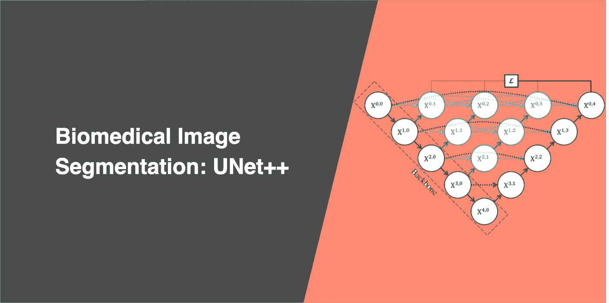
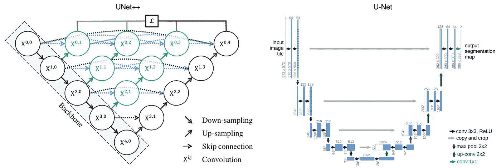
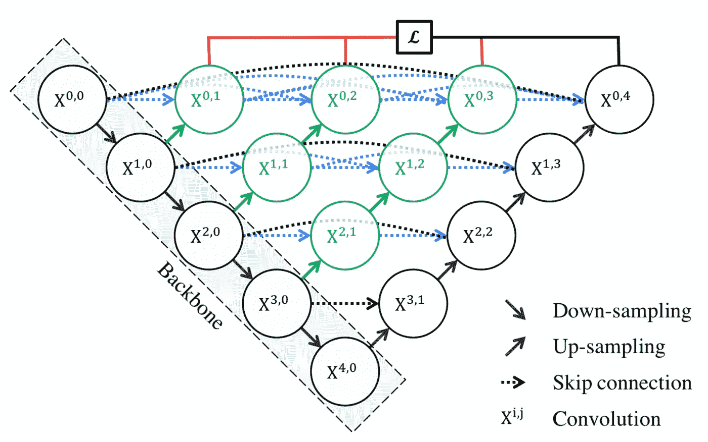
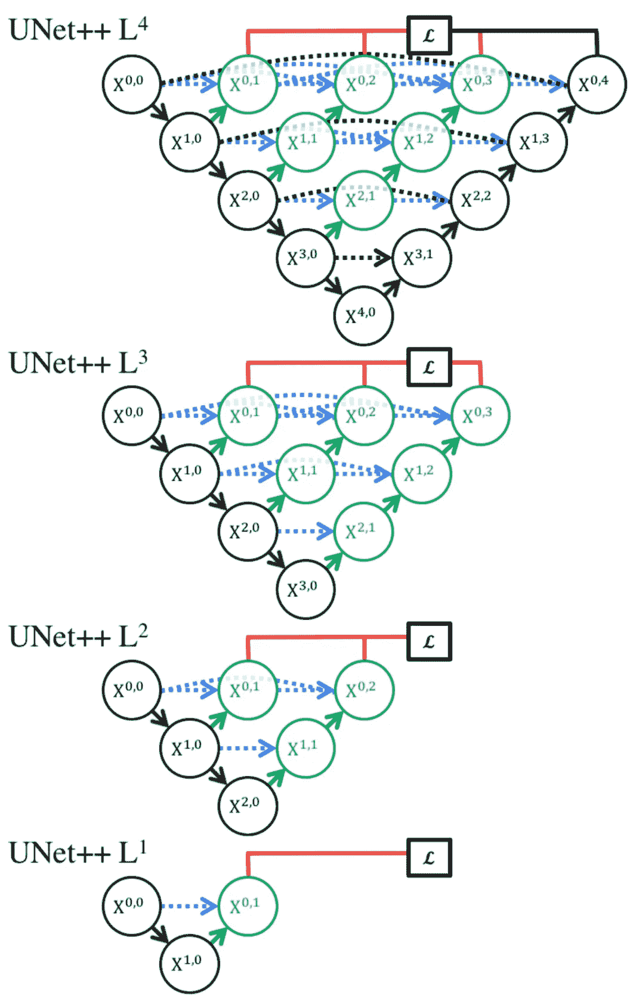
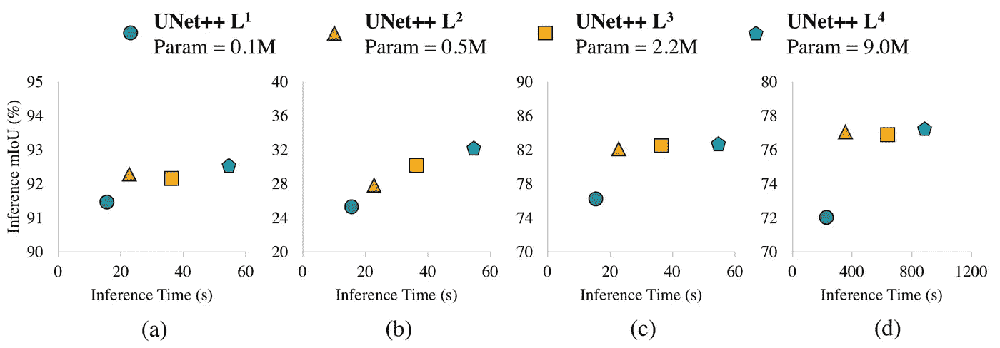
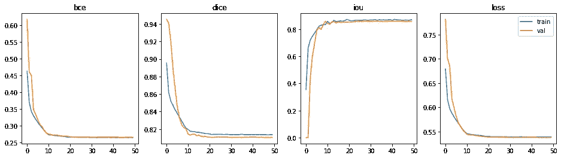
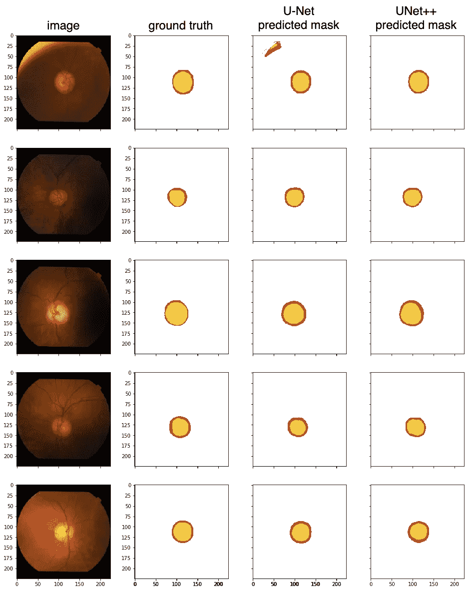
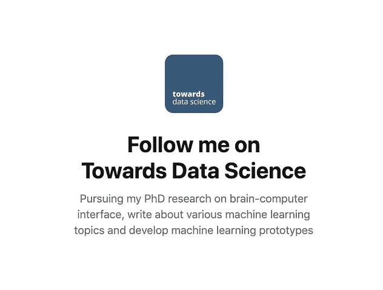

# 生物医学图像分割:UNet++

> 原文：<https://towardsdatascience.com/biomedical-image-segmentation-unet-991d075a3a4b?source=collection_archive---------9----------------------->

## 通过一系列嵌套、密集的跳过路径提高分段准确性

在这篇文章中，我们将探索由美国亚利桑那州立大学的周等人编写的用于医学图像分割的嵌套 U-Net 架构。这篇文章是 [U-Net 文章](/biomedical-image-segmentation-u-net-a787741837fa)的延续，我们将比较 UNet++和 Ronneberger 等人的原始 U-Net。

UNet++旨在通过在编码器和解码器之间包含密集块和卷积层来提高分割精度。

分割精度对于医学图像是至关重要的，因为边际分割误差会导致不可靠的结果；因此将被拒绝用于临床设置。

尽管数据样本较少，但为医学成像设计的算法必须实现高性能和高精度。获取这些样本图像来训练模型可能是一个消耗资源的过程，因为需要由专业人员审查的高质量的未压缩和精确注释的图像。

# UNet++有什么新功能？

下面是 UNet++和 U-Net 架构的图解。

UNet++在原有的 U-Net 基础上增加了 3 项功能:

1.  重新设计的跳过路径(显示为绿色)
2.  密集跳跃连接(以蓝色显示)
3.  深度监督(以红色显示)

## 重新设计的跳过路径

在 UNet++中，重新设计的跳过路径(显示为绿色)被添加进来，以弥合编码器和解码器子路径之间的语义鸿沟。

这些卷积层的目的是减少编码器和解码器子网的特征图之间的语义差距。因此，对于优化者来说，这可能是一个更直接的优化问题。

U-Net 中使用的 Skip 连接直接连接编码器和解码器之间的特征映射，从而融合语义不同的特征映射。

然而，使用 UNet++时，来自同一密集块的先前卷积层的输出与较低密集块的相应上采样输出融合。这使得编码特征的语义级别更接近在解码器中等待的特征映射的语义级别；因此，当接收到语义相似的特征图时，优化更容易。

skip 路径上的所有卷积层都使用大小为 3×3 的核。

## 密集跳跃连接

在 UNet++中，密集跳过连接(蓝色显示)在编码器和解码器之间实现了跳过路径。这些密集块受 [DenseNet](https://arxiv.org/abs/1608.06993) 的启发，目的是提高分割精度并改善梯度流。

密集跳跃连接确保所有先前的特征图被累积并到达当前节点，因为沿着每个跳跃路径的密集卷积块。这在多个语义级别生成全分辨率特征图。

## 深度监督

在 UNet++中，增加了深度监督(红色显示)，这样就可以修剪模型来调整模型复杂度，平衡*速度*(推理时间)和*性能*。

对于*精确*模式，所有分割分支的输出被平均。

对于*快速*模式，从一个分割分支中选择最终分割图。

周等人进行了实验以确定具有不同修剪水平的最佳分割性能。使用的度量标准是*交集/并集*和*推理时间*。

他们对四个分割任务进行了实验:a)细胞核，b)结肠息肉，c)肝脏，以及 d)肺结节。结果如下:

与 L4 相比，L3 的*推理时间*平均减少了 32.2%，同时略微降低了 Union 的*交集。*

L1 和 L2 等更激进的修剪方法可以进一步减少*推理时间*，但代价是显著的分割性能。

当使用 UNet++时，我们可以调整用例的层数。

# 我在 UNet++上的实验

我将使用 [Drishti-GS 数据集](https://cvit.iiit.ac.in/projects/mip/drishti-gs/mip-dataset2/Home.php)，这与 Ronneberger 等人在论文中使用的数据集不同。该数据集包含 101 个视网膜图像，以及光盘和视杯的注释掩模，用于检测青光眼，青光眼是世界上失明的主要原因之一。50 幅图像将用于训练，51 幅用于验证。

## 韵律学

我们需要一组指标来比较不同的模型，这里我们有二元交叉熵、Dice 系数和交集。

**二元交叉熵** 二元分类常用的度量和损失函数，用于度量误分类的概率。

我们将使用 PyTorch 的 binary _ cross _ entropy _ with _ logits[。与 Dice 系数一起用作训练模型的损失函数。](https://pytorch.org/docs/stable/nn.functional.html#binary-cross-entropy-with-logits)

**骰子系数**

预测值和实际值之间重叠的常用度量标准。计算是 2 *重叠面积(*预测值和实际值*之间)除以总面积(*预测值和实际值的组合*)。

该度量的范围在 0 和 1 之间，其中 1 表示完美和完全的重叠。

我将使用这个度量和二进制交叉熵作为训练模型的损失函数。

**并集上的交集**

一个简单(然而有效！)用于计算预测遮罩与地面真实遮罩的准确度的度量。计算重叠面积( *在预测值和实际值*之间)并除以并集面积( *预测值和实际值*)的计算。

类似于 Dice 系数，该度量的范围从 0 到 1，其中 0 表示没有重叠，而 1 表示预测值和实际值之间完全重叠。

## 培训和结果

为了优化该模型，训练超过 50 个时期，使用具有 1e-4 学习率的 [Adam 优化器](https://pytorch.org/docs/stable/optim.html#torch.optim.Adam)，以及每 10 个时期具有 0.1 衰减(伽马)的 [Step LR](https://pytorch.org/docs/stable/optim.html#torch.optim.lr_scheduler.StepLR) 。损失函数是二进制交叉熵和 Dice 系数的组合。

模型在 27 分钟内完成了 36.6M 可训练参数的训练；每个时期大约需要 32 秒。

具有最佳性能的纪元是纪元# 45(50 个中的一个)。

*   二元交叉熵:0.2650
*   骰子系数:0.8104
*   并集上的交点:0.8580

用于比较的几个 U-Net 模型之间的度量，如下所示。

测试从模型处理一些看不见的样本开始，以预测光盘(红色)和光学杯(黄色)。以下是 UNet++和 U-Net 的测试结果，以供比较。

从指标表来看，UNet++在*交集方面超过了 U-Net，但在*骰子系数*方面落后。从定性测试结果来看，UNet++已经成功地正确分割了第一幅图像，而 U-Net 做得并不太好。同样由于 UNet++的复杂性，训练时间是 U-Net 的两倍。人们必须根据它们的数据集来评估每种方法。*

# 结论

UNet++旨在通过一系列嵌套的密集跳过路径来提高分割精度。

重新设计的跳过路径使得语义相似的特征图的优化更加容易。

密集跳跃连接提高了分割精度并改善了梯度流。

深度监督允许模型复杂性调整，以平衡速度和性能优化。

阅读另一个 U-Net:

 [## 生物医学图像分割:U-Net

### 使用非常少的训练图像，并产生更精确的分割。

towardsdatascience.com](/biomedical-image-segmentation-u-net-a787741837fa)  [## 生物医学图像分割:注意力 U 网

### 通过在标准 U-Net 上附加注意门来提高模型的灵敏度和准确性

towardsdatascience.com](/biomedical-image-segmentation-attention-u-net-29b6f0827405)  [## 数据科学家:21 世纪最肮脏的工作

### 40%的吸尘器，40%的看门人，20%的算命师。

towardsdatascience.com](/data-scientist-the-dirtiest-job-of-the-21st-century-7f0c8215e845)  [## 7 个必不可少的人工智能 YouTube 频道

### 如何跟上最新最酷的机器学习进展

towardsdatascience.com](/7-essential-ai-youtube-channels-d545ab401c4) 

以下是 UNet++架构的 PyTorch 代码: