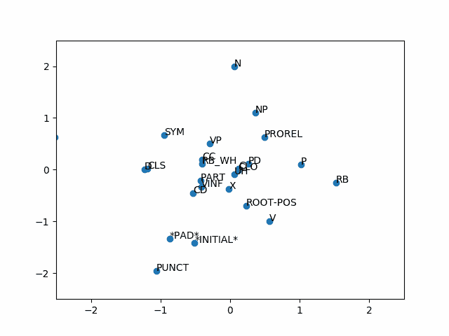
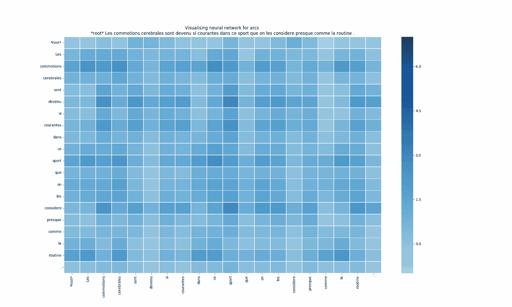
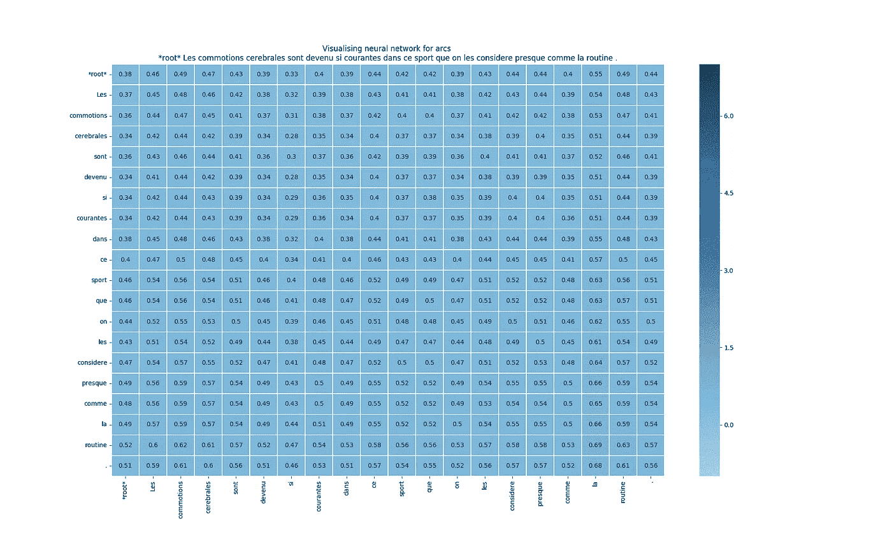
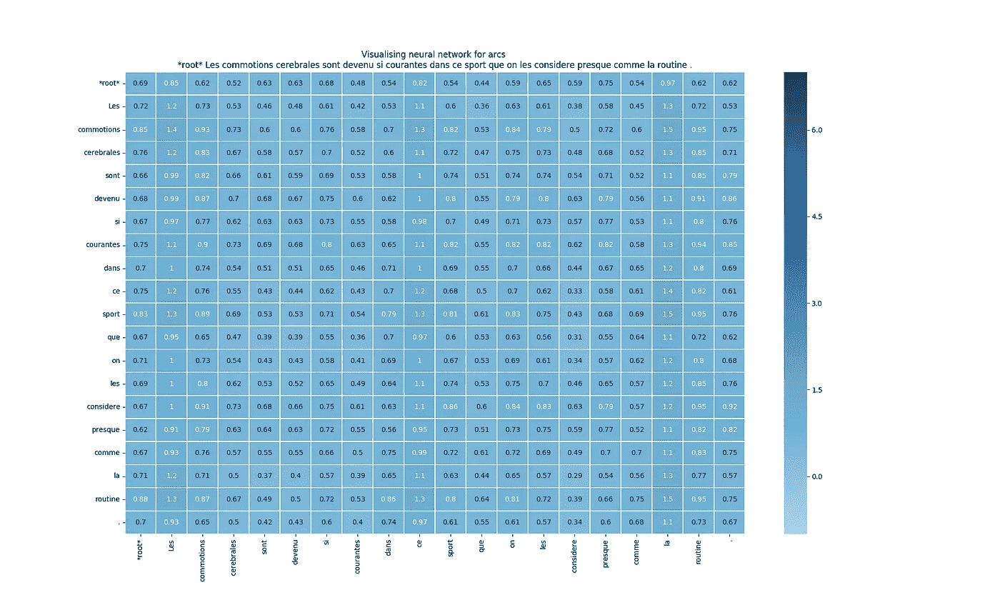
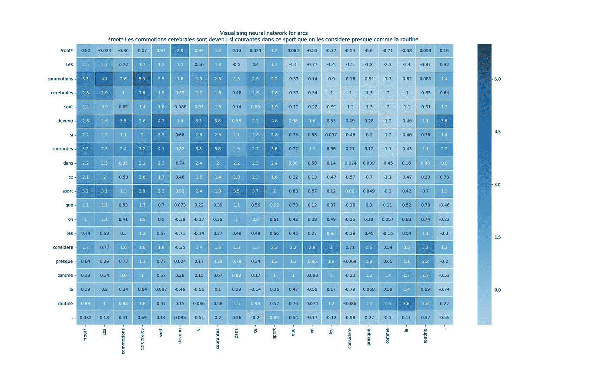
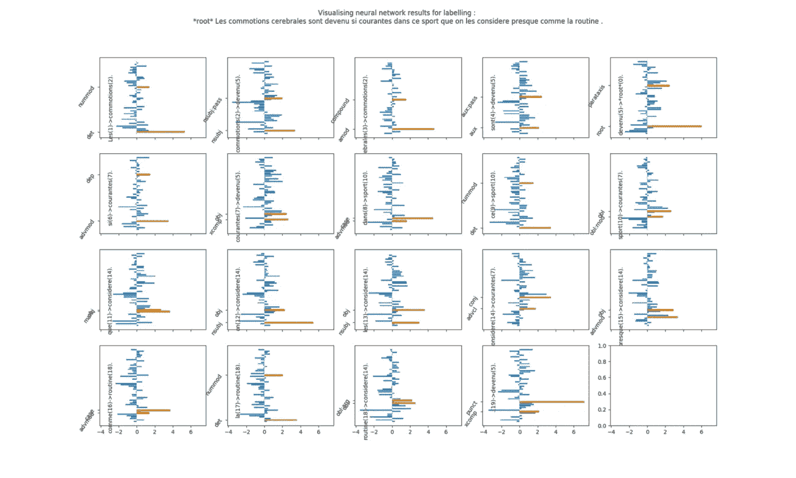

# Bist-Parser:依赖解析器的端到端实现

> 原文：<https://towardsdatascience.com/bist-parser-an-end-to-end-implementation-of-a-dependency-parser-5caf04a2cc12?source=collection_archive---------33----------------------->

本文是关于依赖解析的第二篇也是最后一篇文章。我们将为您提供一些简单的实施指南和工具来帮助您改进它。

# 词汇

*   **树库**是注释句法或语义句子结构的解析文本语料库。依赖树库是使用不同的方法创建的:要么直接感谢人工注释器，要么使用自动解析器提供第一次解析，然后由注释器检查。一种常见的方法是使用确定性过程，通过 head 规则将现有的树库翻译成新的语言。建立一个高质量的树木库既费时又费钱。
*   **CoNLL-U** —计算自然语言学习-Universal 是 CoNLL-X 格式的修订版。来自树库的句子被分开，每个单词或标点符号被放置在不同的行上。以下每一项都跟在单词后面，用表格隔开:
    –ID:句子中的单词索引，从 1 开始
    –FORM:词形或标点符号
    –LEMMA:词形的引理或词干
    –UPOS:通用词性标签
    –XPOS:语言特定词性标签；将不会在我们的模型
    中使用–专长:形态特征的无序列表，由通用依赖关系定义；表示名词的性别和数量，动词的时态等。
    –HEAD:单词的头，表示与当前单词相关的单词的索引
    –DEPREL:通用依赖关系；表示两个词(动词的主语或宾语，名词的限定词等)之间的关系。)
    –DEPS:特定于语言的部分依赖；不会在我们的型号
    中使用–杂项:评论或其他注释

An example of CoNLL-U format

*   **条目**是一个单词，或者一个句子中的标点符号。它有多个属性，如上所述。一个句子通常是条目的串联(单词本身是条目的属性:它的形式)，由空格分隔。

# 实施

Bist 解析器的实现来自其论文的作者。Xiezhq Hermann 在 GitHub 上发布了一个更新。你可以在这里找到[。它在 Python 3.x 上工作，使用 torch 0.3.1(有或没有 Cuda)。它非常完整，可以按原样使用。然而，为了使代码适应您的数据或对其进行升级，您必须完成每个模块，这可能是一项艰巨的任务。文章的这一部分将引导您浏览所有文件和流程。](https://github.com/xiezhq-hermann/bist-parser)

通用依赖(UD)是一个语法注释的开放社区框架。它提供了极大地帮助开发依赖解析器的语料库和工具。

从 UD，你可以下载你选择的句子语料库(任何可用的语言，甚至古法语！)，按原样使用它们，并开始用这种类型的命令训练您的 Bist 解析器:

`python src/parser.py --outdir [results directory] --train training.conll --dev development.conll --epochs 30 --lstmdims 125 --lstmlayers 2 [--extrn extrn.vectors]`

您可以在这里详细描述超参数，通过文件 ***parser.py*** 被模型捕获

你可能知道，当你在一个语料库上训练一个模型的时候，模型是偏向这个语料库的。你可以在多个语料库上训练你的模型，以使它更加一般化。有几种技术可以让你增加分数，以 [TreeBank 嵌入](https://www.aclweb.org/anthology/P18-2098)为例。这里，我们只是连接了一些树库，没有任何进一步的处理。

## 实用工具

*   创建一个 **ConllEntry** 类:每个条目都有众所周知的属性:id，form，lemma，Universal PoS tag，language Specific PoS tag，morphological features，head of current word，dependency relation，enhanced dependency relation，commentation。这些属性是根据通用依赖项 CoNLL-U 格式定义的。这种格式有助于模型理解它的输入是什么，以及它应该预测什么。
*   读取一个 CoNLL-U 文件，并将每个句子转换成一个 ConllEntry。
*   Count 词汇表:这个函数创建一个 ConllEntry 属性的[计数器](https://docs.python.org/2/library/collections.html#collections.Counter)，并允许您了解这些属性是如何分布在您的数据集中的。如果您想要确定数据集中最常用的单词或关系，此函数会很有用。

**mstlstm**

该文件包含您的模型。你所有的超参数和大部分的监测工作都发生在这个文件中。

方法 ***forward*** 遍历句子中的每个条目。它首先计算每个条目属性的向量。通过我们的模型，我们得到了描述单词、词性标签和专长的多个向量。然后将这些向量连接起来，为每个条目形成一个维度更大的向量。这些条目然后连接在一起形成句子向量。

首先，它将条目转换成向量。这里，主要属性是单词、词条(onto)和词性标签(PoS)的嵌入。但是，我们建议您尽可能添加更多功能。例如，你可以使用单词的特征来表示名词是单数还是复数，它的性别或者时态…嵌入这些特征可以让你的 BiLSTM 找到更多的模式。

Evolution of PoS embedding on two dimensions

然后，它向 BiLSTM 提供这些向量(for = forward，back = backward)。第 52 行评估句子的得分。这是创建完全加权有向图的部分。在第 57 行，它计算关系分数。这是这个模型中一个有趣的技巧:不是同时评估所有的可能性(|可能性| = |弧|。|labels|，这太高了)，它首先预测依赖项，然后预测关系。关于*错误*、*错误*和*错误*我们以后再看。

在下面的插图中，您可以看到依赖项评估在批处理中的演变。深蓝色单元格对应一个加重的弧线。这个例子来自一个典型的法语句子，“*在被认为是例行公事的情况下，体育运动中发生的骚乱。“你可以发现句子中的拼写错误；这在树银行中并不罕见。*

Les commotions cérébrales sont devenu si courantes dans ce sport qu’on les considére presque comme la routine.

这句话中值得注意的是单词“ *devenu* ”，它是词根(即主词)，以及由单词“ *que* ”和“ *comme”分隔的三个明确定义的命题。*

Evolution of dependency scores for the sentence “*root* Les commotions cerebrales sont devenu si courantes dans ce sport que on les considere presque comme la routine.”

Scores figure (1) — Initialization

Scores figure (2) — 200 sentences

Scores figure (3) — 1000 sentences

Score figure (4) — 6000 sentences

在上面的插图中，我们可以更好地理解我们的神经网络的进化。每一列对应一个作为头的标记，每一行对应一个作为从属的标记，每一个单元格对应从头到从属的弧的分数(或权重)。

我们认识到图 1 中的随机初始化，其中所有的分数都在零附近，我们在矩阵中看不到任何形状。
在第二张图中，我们可以看到 PoS =行列式向量已被考虑在内，我们可以在它们的列中辨认出一个形状。目前，行的变化不太明显。
在第三幅插图中，我们可以清楚地看到由“*阙*”分隔的两个命题弧线在它之前定义得很好，在它之后就不那么清晰了。标点符号与词根“ *devenu 联系得很好。*
在最后一个中，我们对主弧线有了清晰的认识，模型获得了信心，分数值也更加扩张。

一旦预测了依赖关系，模型就预测了关系类型。这里是每个关系的得分图，考虑到预测的关系，给出正确的依赖关系。

Relation score figure (1)— Initialization

Relation score figure (2) — 200 sentences

Relation score figure (3) — 1000 sentences

Relation score figure (4) — 6000 sentences

预测的关系类型用黄色表示，最不正确的关系类型用红色表示。

经过一些训练，预测变得越来越有信心。

该模式的主要方法是*。它首先打乱句子，每次以不同的顺序训练模型。然后，为每个句子调用方法 ***前进*** 。这将更新权重，返回一个分数 *e* 并更新两个列表 *errs* 和 *lerrs* 。回想一下， *e* 对预测人头不同于金人头(参考，来自语料库)的每个令牌进行计数。 *errs* 计算弧预测损失，而 *lerrs* 计算标签预测损失。然后将误差和 *lerrs* 相加，产生反向传播损失:*eers*。*

# *改进和一些结果*

*为了建立一个更有效的模型，您应该尝试添加单词 dropout 作为一个超参数，并尝试不同的值。我们试过 0，0.25，0.33，0.5，0.9，1 作为数值，最好的是 0.9。它强制模型从其他向量中学习比单词更多的东西。*

*您还可以分离每个特征，并在每个特征上使用嵌入。这将允许更大的灵活性和对模型更多的理解。*

*通过这样的实现，我们在法国红杉(通用依存)树库上获得了 87.70 的 **LAS 分数，而没有在这个语料库上进行专门的训练(在标签翻译之后，因为我们的标签与 UD 的不同)。***

*一旦训练好了依赖关系解析器，就可以使用依赖关系和关系来更好地理解数据。即使 NLU 模型能够找到许多模式，添加这些输入也是你应该考虑的真正收益。*

*本文的来源如下:*

*   *Bist-Parser 的论文:Kiperwasser，e .，& Goldberg，Y. (2016)。使用双向 LSTM 特征表示的简单而精确的依存句法分析。《计算语言学协会会刊》，第 4 卷，第 313-327 页。检索自[https://www . trans ACL . org/ojs/index . PHP/tacl/article/view/885/198](https://www.transacl.org/ojs/index.php/tacl/article/view/885/198)*
*   *本文的一个基线实现:[https://github.com/xiezhq-hermann/bist-parser](https://github.com/xiezhq-hermann/bist-parser)*