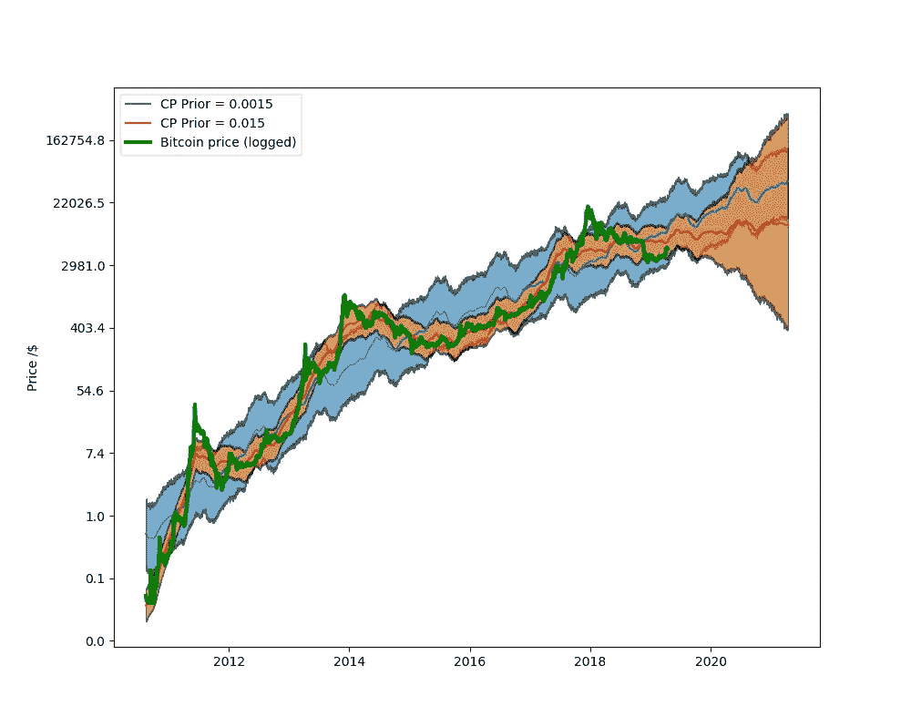

# 脸书先知的比特币预测价格建模

> 原文：<https://towardsdatascience.com/bitcoin-predictive-price-modeling-with-facebooks-prophet-b66efd0169a0?source=collection_archive---------10----------------------->



Two Bitcoin price predictions (blue and red lines) generated using Facebook’s Prophet package. The actual price data is in green, while the shaded areas denote the respective uncertainty in the estimate. As you can the uncertainty increases into the future. This is particularly the case with the tighter fitting price model (red).

这是一个快速浏览脸书的先知机器学习包使用比特币的例子。它假设您具备基本的 Python 知识，并对熊猫有所了解。

Prophet 是脸书为时间序列数据开发的开源预测程序。这个想法是，它应该使完全自动的预测变得容易，即使有杂乱的数据，而且它目前在 R 和 Python 中可用。在这篇文章中，我将使用 Python 2.7。

***注来自《走向数据科学》的编辑:*** *虽然我们允许独立作者根据我们的* [*规则和指导方针*](/questions-96667b06af5) *发表文章，但我们不认可每个作者的贡献。你不应该在没有寻求专业建议的情况下依赖一个作者的作品。详见我们的* [*读者术语*](/readers-terms-b5d780a700a4) *。*

# 安装 Prophet

如果你已经安装了 pip，你需要做的就是打开一个控制台，输入

```
pip install fbprophet
```

在 Windows 上，我遇到了一些与 Anaconda 相关的依赖问题，不得不首先运行

```
conda clean --all
conda update pystan
```

# 下载和准备数据

一旦你安装好了，我们将导入我们需要的模块

```
import quandl as qd
import pandas as pd
import numpy as npimport fbprophet
import matplotlib.pyplot as plt
```

Quandl 是一个惊人的存储库，拥有大量极其不同的数据集。你需要注册一个免费账户并生成一个 API。那我们准备开始了。首先从 Quandl 下载比特币市场数据，去掉零值(由于某种原因，价格数据在初始行中包含零)

```
KEY = "YOUR_API_KEY"
qd.ApiConfig.api_key = KEYbitcoin = qd.get("BCHAIN/MKPRU")
bitcoin = bitcoin.loc[(bitcoin !=0).any(1)]
```

这将价格数据放入一个名为比特币的熊猫数据框架中。要检查前几行，请键入

```
bitcoin.head()
```

您应该得到一个名为“值”的列和一个日期时间索引

```
 Value
Date 
2010–08–17 0.076900
2010–08–18 0.074000
2010–08–19 0.068800
2010–08–20 0.066700
2010–08–21 0.066899
```

现在，我们想将记录的数据绘制在线性图表上(原因将在后面变得明显)，所以用比特币为记录的价格值创建一个新列

```
bitcoin["log_y"] = np.log(bitcoin["Value"])
```

# 与先知一起工作

我们需要做的第一件事是做点家务。Prophet 要求我们将“日期”列的名称改为“ds ”,而我们的 y 列应该简单地称为“y”

```
bitcoin = bitcoin.rename(columns={"Date": "ds", "log_y" : "y"})
```

Prophet 所做的大部分工作都发生在幕后，但是有一些超参数允许我们轻松地微调我们的模型。我们将只调整*change point _ prior _ scale*参数。

转折点基本上是趋势突然改变方向的点，例如反转。Prophet 可以自动为您找到这些点，尽管您可以自己定义它们，尽管对于大型和特殊的数据集来说这是不切实际的。嘿，这就是机器的作用，对吧？*change point _ prior _ scale*参数基本上允许您选择您希望变点与数据匹配的紧密程度。

构建任何模型的目标是能够将其推广到其他数据/场景，并获得类似的结果。所以我们不希望我们的模型过多地跟随训练数据，这叫做过拟合。同样，拟合不足也会产生泛化能力差的模型。

因此，我们将使用这个超参数进行所有微调。该值越高，拟合越紧密，同样，该值越低，拟合越松散。在这个演示中，我选择的值(0.0015 和 0.015)之间相隔一个数量级。

```
priors = [0.0015, 0.015]
prophets, labels = [], []
for prior in priors:
    prophet = fbprophet.Prophet(changepoint_prior_scale=prior)
    prophet.fit(bitcoin)

    prophets.append(prophet)
    labels.append(r"CP Prior = " + str(prior))
```

此时，您应该有一个包含两个 prophet 对象的列表和一个用于绘制的标签列表。下一步是使用这些 prophet 对象来生成预测对象。(我们还将使用 *changepoint_prior_scale* 值前缀重命名“ds”列，以便跟踪数据。)

```
forecasts = []
for prophet in prophets:
    forecast = prophet.make_future_dataframe(periods=365 * 2,                                                    freq="D")
    forecast = prophet.predict(forecast)

    forecast = forecast.rename(columns={"ds" : str(priors[prophets.index(prophet)]) + "_ds"})
    forecasts.append(forecast)
```

差不多就是这样。如果一切顺利，您应该已经生成了两个预测对象的列表(实际上只是熊猫数据帧)。让我们将它们合并成一个数据帧，并将其中一个' _ds '列重命名为' Date ',删除另一个。

```
output = pd.merge(forecasts[0], forecasts[1], how = "inner", left_on = "0.0015_ds", right_on = "0.015_ds")
output = output.rename(columns={"0.0015_ds": "Date"}).drop("0.015_ds", axis=1)
```

最后，我们将索引设置为“日期”列

```
output = output.set_index(‘Date’)
```

我们现在将在一张图表上绘制所有内容

```
fig, ax = plt.subplots(1, 1, figsize=(10, 8))
ax.plot(output.index, output["yhat_x"], label=labels[0])
ax.fill_between(output.index, output["yhat_upper_x"], output["yhat_lower_x"], alpha=0.6, edgecolor = "k")ax.plot(output.index, output["yhat_y"], "r", label=labels[1]);
ax.fill_between(output.index, output["yhat_upper_y"], output["yhat_lower_y"], alpha=0.6, edgecolor = "k")
ax.plot(bitcoin.ds, bitcoin.y, color="green", linewidth=3, label=r"Bitcoin price (logged)")
a=ax.get_yticks().tolist()
ax.set_yticklabels(np.round(np.exp(a), 1))
plt.legend(loc="upper left")
plt.ylabel(r"Price /$")
plt.show()
```

“y_hat”标签是 Prophet 提供的估计值，x 或 y 后缀表示数据最初来自哪个数据框架(这里 x 是 0.0015 参数值，y 是 0.015)。

# 结论


这里的目标只是简单地摆弄一下 Prophet 包，我认为比特币会成为一个有趣的数据集。

仅仅通过目测，我认为从比特币最大化的角度来看，这两个预测都非常合理，我的意思是它们符合许多看涨投资者认为价格会发生的情况。

蓝色拟合可能有点不合适，但你可以看到，随着时间的推移，估计的不确定性保持相当稳定，甚至到未来。一般来说，它提供了更多的概括空间，但对趋势变化的反应可能太慢。因此我认为这是不可靠的。我不认为价格会长期保持这种趋势。

另一方面，红色拟合似乎过度拟合了数据。它紧紧跟随历史价格波动，并对趋势变化做出快速反应，然而不确定性真的会在未来爆发，使得这个预测也不可靠，尽管红色趋势更可信一些。

就我个人而言，我并不觉得这种价格预测特别有用，但关注这一点并观察脸书算法的结果会很有趣。