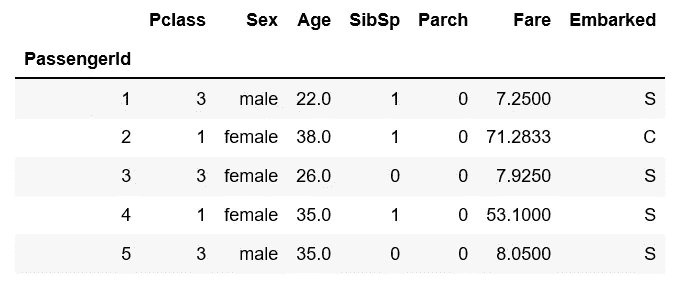
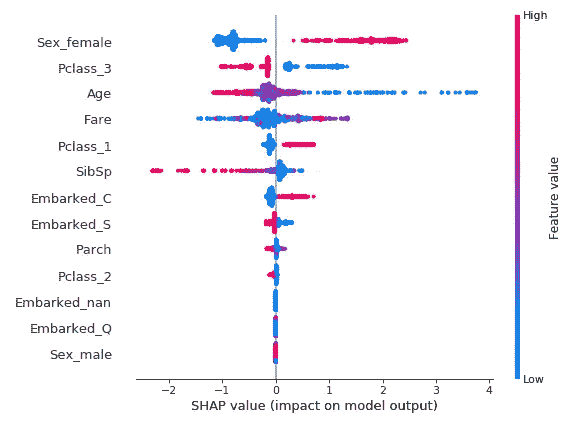
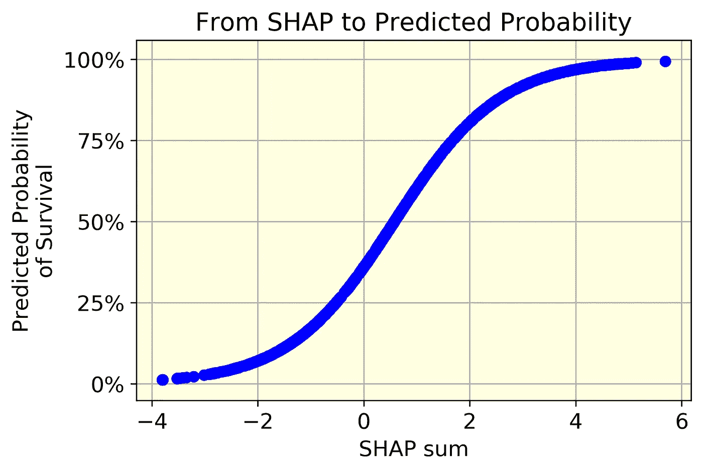
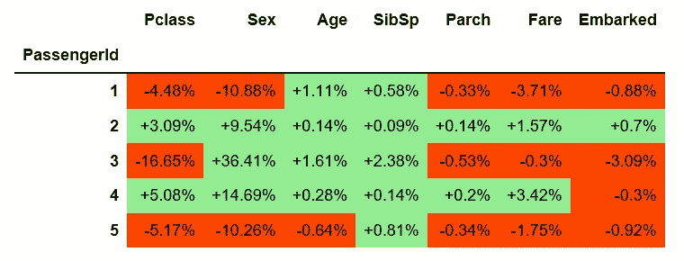
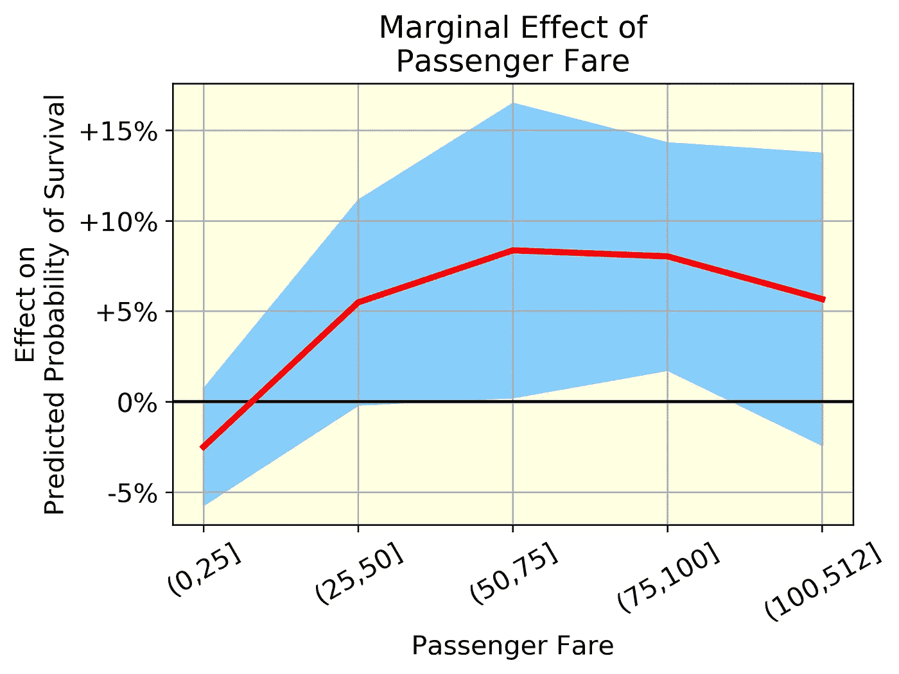

# 黑箱模型实际上比逻辑回归更容易解释

> 原文：<https://towardsdatascience.com/black-box-models-are-actually-more-explainable-than-a-logistic-regression-f263c22795d?source=collection_archive---------3----------------------->

## SHAP 价值观是不可理解的。但是，从它们开始，可以用对概率的影响来表达模型选择(这是一个人类更容易理解的概念)

# 可解释的和强大的之间永恒的斗争

从事数据科学家工作的人更清楚这一点:围绕机器学习的一个主要陈词滥调是，你必须在以下两者之间做出选择:

*   简单、可靠和可解释的算法，如逻辑回归；
*   强大的算法可以达到更高的精度，但代价是失去任何可懂度，如梯度增强或支持向量机。这些模型通常被称为“黑箱”，意味着你知道什么进入什么出来，但没有办法了解在引擎盖下实际发生了什么。

在下文中，我们将表明，不仅不需要在能力和可解释性之间做出选择，而且更强大的模型甚至比更肤浅的模型更具可解释性。

# 数据

举例来说，我们将使用最著名的数据集之一:标志性的[泰坦尼克号数据集](https://www.kaggle.com/c/titanic)。我们有一堆关于泰坦尼克号乘客的变量，我们想预测每个乘客生还的可能性有多大。

我们可以处理的变量有:

*   Pclass:票类；
*   性:乘客性；
*   年龄:乘客年龄；
*   SibSp:泰坦尼克号上兄弟姐妹/配偶的数量；
*   Parch:泰坦尼克号上父母/孩子的数量；
*   票价:客运票价；
*   装船:装船港。

(注:为了简单起见，去掉了一些其他变量，几乎没有进行任何数据预处理)。

数据看起来是这样的:

Data, first 5 passengers

# 好的老罗格

对于分类问题，逻辑回归常被用作基线。

在对定性特征(机票等级、乘客性别和装货港)进行一次性编码后，我们对训练数据进行简单的逻辑回归拟合。在验证集上计算的准确度总计为 **81.56%** 。

从这个模型中我们能得到什么启示？因为逻辑回归是这样建立的

分析围绕着 *β* 进行。很容易看出，在 *xⱼ* 每增加 1 个单位，几率就会增加*exp(βⱼ*倍。

解释很简单:年龄增加一岁将导致几率增加 0.961 倍。

那就是:

*   盖伊 A，25 哟:生存几率= 3
*   除了年龄(26 岁)之外，其他变量都与 A 相同:生存几率= 3× 0.961 = 2.883

这个模型在可解释性方面的局限性是不言而喻的:

*   *exp(βⱼ)* 和赔率之间的关系是线性的，例如，2 或 12 yo 之间的差异与 52 和 62 yo 之间的差异相同；
*   不允许相互作用，例如，无论乘客是在一等舱还是三等舱，60 岁对生存概率有相同的影响。

# 尝试黑盒:Catboost 和 SHAP

现在让我们尝试一个“黑盒”模型。在这个例子中，我们将使用 [Catboost](https://catboost.ai) ，这是一种在决策树上进行梯度提升的算法。

对相同的训练数据执行快速 Catboost(没有任何超参数调整)(这次不需要一键编码)会导致验证数据的 **87.15%** 准确度。

正如我们所料， **Catboost 的表现大大超过了 LogReg (87.15%对 81.56%)** 。到目前为止，不足为奇。

现在，机器学习中 64，000 美元的问题是:如果 Catboost 在预测未知数据的存活率方面比 LogReg 好得多，**我们难道不应该信任它，而不要太担心齿轮**？

嗯，看情况。如果是 Kaggle 比赛，答案可能是“是”，但总体来说是“**肯定不是！**”。如果你想知道为什么，只要看看一些高调的事件，如亚马逊"[性别歧视人工智能招聘工具](https://www.reuters.com/article/us-amazon-com-jobs-automation-insight/amazon-scraps-secret-ai-recruiting-tool-that-showed-bias-against-women-idUSKCN1MK08G)"或微软"[种族主义聊天机器人](https://www.bbc.com/news/technology-35902104)"。

因此，为了弄清楚 Catboost 正在做出什么决定，另一个叫做[SHAP(SHapley Additive explaints)](https://arxiv.org/abs/1705.07874)的工具来帮助我们了。SHAP(可能是机器学习可解释性的最先进水平)诞生于 2017 年，这是一种对任何预测算法的输出进行逆向工程的聪明方法。

对我们的数据和 Catboost 输出应用 SHAP 分析会生成一个矩阵，它与原始数据矩阵具有相同的维数，包含 SHAP 值。SHAP 价值观是这样的:

SHAP values, first 5 passengers

SHAP 值越高，生存的概率越高，反之亦然。此外，大于零的 SHAP 值导致概率增加，小于零的值导致概率减少。

**每个 SHAP 值表示**，这是这里的重要部分，**个体变量的观测水平对该个体最终预测概率的边际效应**。

这意味着:假设对于第一个人，我们知道除了年龄以外的所有变量。那么它的 SHAP 和就是-0.36-0.76+0.05-0.03-0.3-0.08 =-1.48。一旦我们知道了个人的年龄(也考虑了年龄和其他变量之间的相互作用)，我们就可以更新总和:-1.48 +0.11 =-1.37。

# SHAP:房间里有一头大象

你可以使用[SHAP 专用的 Python 库](https://github.com/slundberg/shap)来获得奇特的图(基本上包含关于 SHAP 值的描述性统计)。例如，您可以很容易地获得一个按特征细分的总结每个观测值的 SHAP 值的图。在我们的例子中:

**你能看见房间里的大象吗？**

如果你把这幅图给外行(甚至是你的老板)看，他可能会说:“漂亮的颜色。但是下面的尺子是什么？那些是美元吗？公斤？年？”

简而言之， **SHAP 值对于人类**(甚至对于数据科学家)来说都是不可理解的。

# 从形状到预测概率

概率的概念更容易理解。其实还不止这些:是先天的(毕竟这也是人们一直坐飞机的原因)。

From SHAP to Predicted Probability

希望从 SHAP 转移到概率，最显而易见的事情是绘制相对于 SHAP 和(每个个体)的预测生存概率(每个个体)。

显而易见，这是一个确定性函数。也就是说，我们可以无误地从一个量转换到另一个量。毕竟，**两者唯一的区别是概率必然在[0，1]内，而 SHAP 可以假设任何实数**。因此:

其中 f(。)是单调递增的 s 形函数，它将任何实数映射到[0，1]区间(为简单起见，f()可以是有界在[0，1]中的普通插值函数)。

From SHAP to Predicted Probability — An example

就拿个人来说吧。假设，已知除年龄以外的所有变量，其 SHAP 和等于 0。现在假设相对于年龄的 SHAP 值是 2。

我们知道函数 f()来量化年龄对预测生存概率的影响就足够了:简单来说就是 f(2)-f(0)。在我们的例子中，它是 f(2)-f(0) = 80%-36% = 44%

毫无疑问,**的生存概率比**的 SHAP 更容易理解。更容易理解的是:说这个个体年龄导致 SHAP 上升 2 或概率上升 44%?

# 那又怎样？

基于我们刚刚看到的，从上面看到的 SHAP 矩阵开始，应用公式就足够了:

获取以下内容:

Impact on predicted probabilities, first 5 passengers

例如，拥有一张三等票将第一个乘客的生存概率降低了-4.48%(对应于-0.36 SHAP)。请注意，3 号乘客和 5 号乘客也在三等舱。由于与其他特征的相互作用，它们对概率的影响(分别为-16.65%和-5.17%)是不同的。

可以对这个矩阵进行几种分析。我们只是报道一些情节作为例子。

Marginal Effect of Passenger Age

Marginal Effect of Passenger Fare

Interaction Effect: Passenger Fare vs. Ticket Class

红线表示平均效应(一组中所有个体的平均年龄效应)，而蓝带(平均标准偏差)表示同一组中个体之间年龄效应的可变性。可变性是由于年龄和其他变量之间的相互作用。

这种方法的附加价值在于:

*   我们可以用概率而不是 SHAP 值来量化影响。例如，我们可以说，平均而言，与 0-10 岁相比，60-70 岁的人存活概率会降低 27%(从+14%到-13%)；
*   我们可以想象非线性效应。比如看客运票价，生存概率上升到一点后略有下降；
*   我们可以表现互动。例如，乘客票价与机票等级。如果这两个变量之间没有相互作用，这三条线将是平行的。他们表现出不同的行为。蓝线(头等舱乘客)票价略有下降。特别有趣的是红线(三等舱乘客)的趋势:在乘坐三等舱的两个相同的人之间，支付 50-75 英镑的人比支付高达 50 英镑的人生存的可能性高约 15%(从-10%到+5%)。

# 包扎

像逻辑回归这样的简单模型做了大量的简化。黑盒模型更灵活，因此更适合复杂(但非常直观)的现实世界行为，如**非线性关系**和**变量之间的相互作用**。

可解释性意味着以人类可以理解的方式表达模型的选择，基于他们对现实的感知(包括复杂的行为)。

我们已经展示了一种将 SHAP 值转化为概率的方法。这使得我们有可能将黑盒功能可视化，并确保它与我们对世界的认识(定性和定量)一致:一个比简单模型描述的世界更具多面性的世界。

# 把密码给我！

代码可在此处找到:

 [## smazzanti/TDS _ black _ box _ models _ more _ explaible

### 此时您不能执行该操作。您已使用另一个标签页或窗口登录。您已在另一个选项卡中注销，或者…

github.com](https://github.com/smazzanti/tds_black_box_models_more_explainable/blob/master/Shap2Probas.ipynb) 

尽情享受吧！