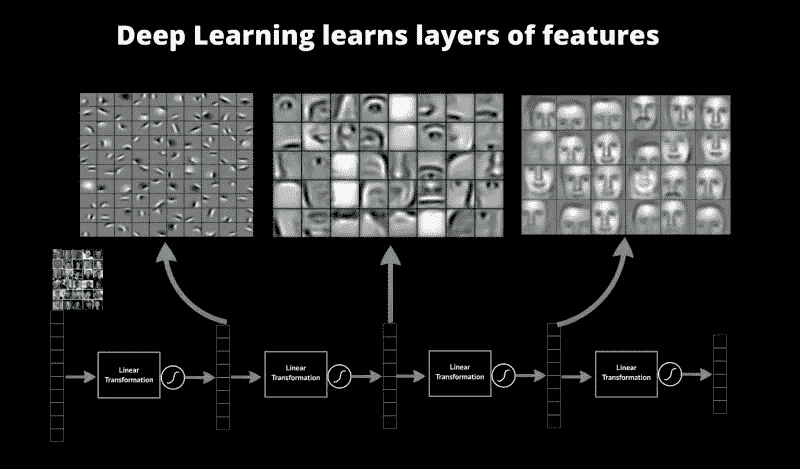

# 黑盒及其入侵

> 原文：<https://towardsdatascience.com/black-boxes-and-their-intrusion-620aa3c4c56b?source=collection_archive---------22----------------------->

到目前为止，人工智能领域已经成功地扩展到各个领域，并提供了前所未有的惊人支持和成果。但是，在每个英雄的故事中，都有一个对手。

Black Box visual

黑匣子:*在科学、计算和工程中，* ***黑匣子*** *是一种设备、系统或对象，可以根据其输入和输出来查看，而无需了解其内部工作情况。它的实现是“不透明的”(黑色)。几乎任何东西都可能被称为黑匣子:一个* [*晶体管*](https://en.wikipedia.org/wiki/Transistor) *，一个* [*算法*](https://en.wikipedia.org/wiki/Algorithm) *，或者是* [*人脑*](https://en.wikipedia.org/wiki/Human_brain) *。*

你可能听说过在软件开发过程中发生的黑盒测试，测试人员不知道被测试项目的内部结构/设计/实现，但是模型的工作被验证。

基本算法，如两个数字的 LCM，看起来比较简单，即使有时花费时间被认为是容易的，因为理解和解释这些算法的工作是容易掌握的。但是，当涉及到人工神经网络、卷积神经网络、递归神经网络等深度学习时，算法变得太复杂，人脑无法计算。它们包含许多隐藏层，不容易被与计算机通信的人追踪到。

Perceptron design

此外，当设计和实现深度学习模型时，它们被制作成便于使用，用户只需在几秒钟内给出输入并获取输出，而无需任何关于事物内部如何工作的先验知识。

无论深度学习模型能够提供多么准确的结果，任何应用都没有必要总是遵循某些预定义的规则。例如，在识别疾病的组织学数字的医学研究中，研究人员必须知道模型如何给出任何结果，以及它是在什么基础上得出结论的。“它真的知道自己在做什么吗？还是瞎猜的？”。在任何测试中绝对不允许出现任何不寻常或异常的模式。

任何代码如果易于调试，都被认为是干净或令人愉快的。如果对于任何给定的模型，假设一个输入给出一个假阳性输出，人们应该能够找出机器在哪里采取了错误的步骤，并使它学习一个更好的方法。但是由于所有的内部过程都是隐藏的和复杂的，它被认为是在一个“黑匣子”里。你只知道输入和输出。

医疗领域对深度学习的接受需要来自其他领域的证据，医学专家希望看到它在现实生活的其他关键领域取得成功，如自动驾驶汽车、机器人等。尽管基于深度学习的方法取得了巨大的成功，但仍然缺乏一种像样的深度学习算法理论。这是机器学习社区公认的。黑盒可能是另一个主要挑战，黑盒功能的法律影响可能是一个障碍，因为医疗专家不会依赖它。如果结果出错，谁能负责？

解开黑盒是一个重大的研究问题，为了解决这个问题，深度学习科学家正在努力解开这个众所周知的黑盒。一个解决方案建议开发一个工具包，显示每个单个神经元激活的视觉效果。因此，每个神经元的贡献是可见的，并且任何错误都可以很快被识别。

Example of a deep visualization toolbox implemented for face recognition.

最近在 5 月，来自麻省理工学院和其他地方的研究人员开发了一种交互式工具，首次让用户看到和控制自动机器学习系统如何工作。目的是建立对这些系统的信心，并找到改进它们的方法。