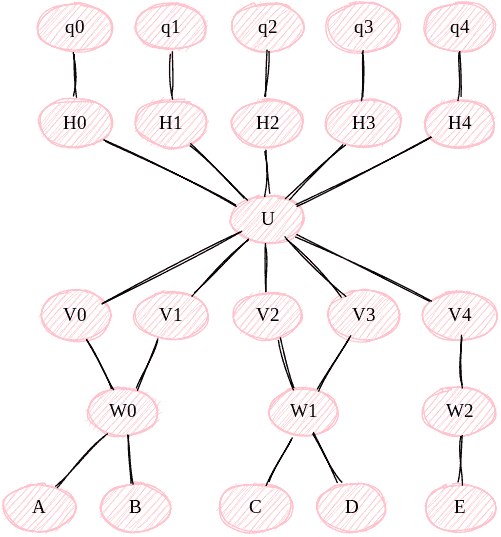
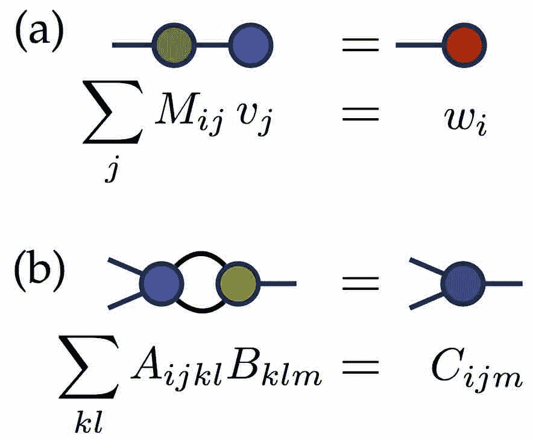
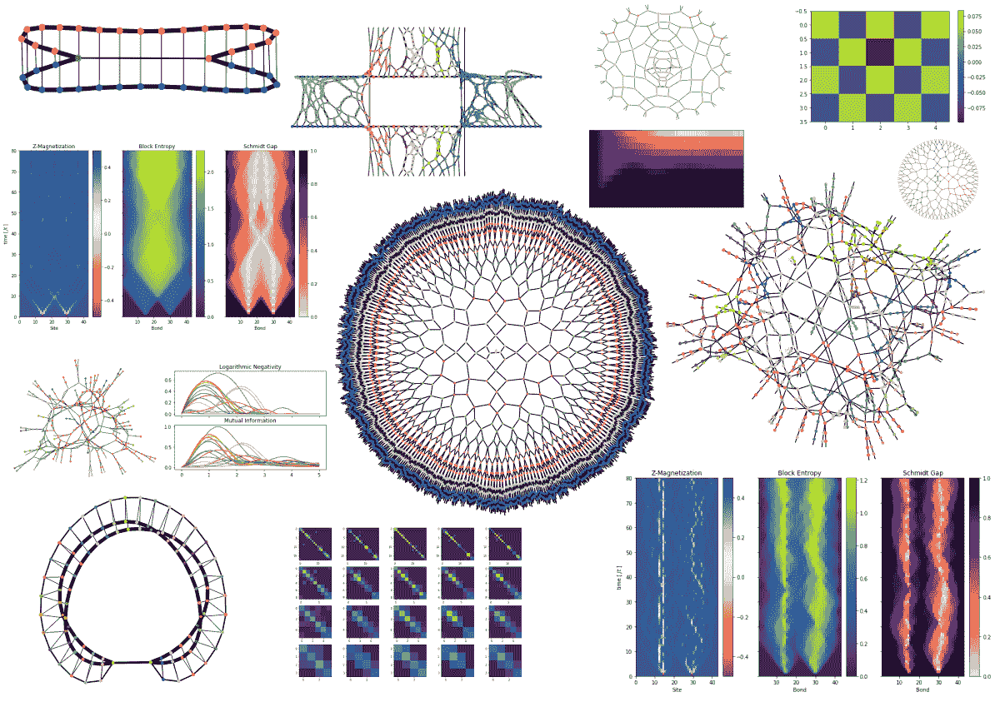
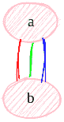
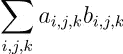

# 黑洞机器学习

> 原文：<https://towardsdatascience.com/black-hole-machine-learning-d7387a4bd30e?source=collection_archive---------14----------------------->

## [奇点研究](https://towardsdatascience.com/tagged/the-singularity-research)

## 通过理论物理的神经网络



主持人: [Sketchviz](https://sketchviz.com/)

```
# http://www.graphviz.org/content/cluster
graph G {
    node [style=filled,color=pink];
    q0 -- H0 -- U -- V0 -- W0 -- A;
    q1 -- H1 -- U -- V1 -- W0 -- B;
    q2 -- H2 -- U -- V2 -- W1 -- C;
    q3 -- H3 -- U -- V3 -- W1 -- D;
    q4 -- H4 -- U -- V4 -- W2 -- E;
}
```

在本文中，我们提供了一些链接，链接到使用张量网络的重要而有趣的代码和软件，张量网络是一种用于引力物理学和黑洞研究的数学工具。我们感兴趣的代码将涉及机器学习和人工智能的应用。我们将回顾张量网络的简史，并稍微解释一下它们是什么，我们将解释它们如何将理论物理与机器学习联系起来，并深入了解为什么谷歌这样的巨头会聘请李奥纳特·苏士侃这样的物理学家来咨询他们的人工智能和机器学习算法。我们还将展示量子计算如何发挥作用，以及如何使用量子计算机创建量子增强的人工智能和量子机器学习算法，迫使我们重新思考我们理解信息处理的方式。

## 用于 TensorFlow 的 Google tensor network 库

今年早些时候(2019 年 6 月)，[谷歌](https://ai.googleblog.com/2019/06/introducing-tensornetwork-open-source.html)的人工智能博客发布了一篇关于为其臭名昭著的 [TensorFlow](https://www.tensorflow.org/) 机器学习平台建造的名为“ [TensorNetwork](https://tensornetwork.readthedocs.io/en/latest/) 的图书馆的帖子。它是为张量网络的操作而建立的(我们将进入张量网络的简史，并在下面解释它们是什么)。谷歌开发这个库的工作是与 [X](https://x.company/) 、谷歌的 *moonshot factory* 创新技术以及[Perimeter Institute for theory Physics](https://www.perimeterinstitute.ca/research/research-initiatives/tensor-networks-initiative)共同完成的。今年早些时候，周界研究所参与了一个黑洞的成像。除了在 Github 上发布代码，他们还撰写了三篇关于 TensorNetwork 库的应用和性能基准的研究论文:

[TensorNetwork:物理和机器学习库](https://arxiv.org/abs/1905.01330)

TensorFlow 上的 TensorNetwork:使用树张量网络的自旋链应用

[用于机器学习的 TensorNetwork】](https://arxiv.org/abs/1906.06329)

如果你有兴趣阅读 TensorNetwork 的文档并深入研究代码，你可以查看[阅读文档页面](https://tensornetwork.readthedocs.io/en/latest/)。那么，为什么这么大惊小怪？张量网络有什么特别的，黑洞和机器学习有什么关系？什么是……张量网络？

## 张量网络简史

张量网络是物理学家使用的张量的图形符号，至少可以追溯到 20 世纪 70 年代，由罗杰·彭罗斯在他的[图形符号](https://en.wikipedia.org/wiki/Penrose_graphical_notation)中提出。他还在他的书[现实之路](https://www.amazon.com/gp/product/0679776311/ref=as_li_tl?ie=UTF8&tag=singularity07-20&camp=1789&creative=9325&linkCode=as2&creativeASIN=0679776311&linkId=c71d68a6f793ec73137f11366f9032ad)中多次提到张量网络是如何应用于物理学的。另一个有点晦涩但非常透彻的文本是 Predrag Cvitanovic 所著的《群论:鸟迹、李氏和例外群》一书。这本书实际上在几年前我还是大学生的时候就引起了我的注意，就在它第一次发行后不久，特别是因为我想了解量子引力，以及人们如何使用如此迷人的视觉工具来做一些非常深奥的数学。

这些张量的图形表示不仅仅是漂亮，它们实际上构成了当今理论物理中一些最深刻和最基本的概念的基础。物理学家和数学家使用它们来描述量子信息理论、AdS/CFT 通信、弦理论和全息原理，如、罗杰·彭罗斯、胡安·马尔德塞纳和约翰·普雷斯基尔。

## 其他张量网络机器学习实现

[量子激励张量网络的监督学习](https://arxiv.org/abs/1605.05775)



在本文中，E. Miles Stoudenmire 和 David J. Schwab 使用张量网络模型对手写数据 [MNIST](http://yann.lecun.com/exdb/mnist/) 进行机器学习分类，使用“*矩阵乘积状态*”。他们能够获得 1%的误差。他们还“讨论了张量网络形式如何给学习模型赋予额外的结构，并提出了一种可能的生成解释”。他们的代码可以在 [Github 库](https://github.com/emstoudenmire/TNML)中找到。

## [Quimb](https://quimb.readthedocs.io/en/latest/examples/ex_quantum_circuit.html)



Quimb 是一个 python 库，用于量子信息和多体计算，包括张量网络。它速度快，并针对效率进行了优化。它主要用于物理问题的应用，但也可以适用于其他应用。它可以在 GPU 上运行，并且可以以几何自由的方式计算张量运算和表示。它可以用`tensorflow`或`pytorch`优化任何张量网络

它对于量子计算机的模拟是有用的，因为它已经在 [IBM Qiskit](https://qiskit.org/) 中为计算进行了设置。对于许多问题，模拟是有效的，但是对于感兴趣的解空间不受某种对称性限制的高维计算，当然需要量子计算机来代替 Quimb 提供的经典模拟。

## 量子机器学习和一种新的信息论

在他的文章[NISQ 时代的量子计算和超越](https://arxiv.org/abs/1801.00862)中，John Preskill 描述了在“*嘈杂的中间规模量子(NISQ)* ”硬件上量子计算的当前状态。在他的[讲座](http://www.theory.caltech.edu/people/preskill/talks/APS-March-2016-preskill.pdf)中，他讨论了一种*量子信息理论*，类似于谷歌与数学物理学家约翰·c·贝兹和计算机科学家迈克·斯泰共同撰写的论文[物理、拓扑、逻辑和计算:一块罗塞塔石碑](http://math.ucr.edu/home/baez/rosetta.pdf)。论文的一个主题是我们应该重新思考信息论。

特别是，谷歌的论文解释了如何通过张量网络从量子物理学的角度思考信息论。毫不奇怪，量子计算中的标准符号[量子电路图](https://gist.github.com/The-Singularity-Research/cb887503d976188cd796aa34eeff2ee3)本身就是一个张量网络。

## 加速！

在 Google TensorNetwork 库的一个简短教程中，我展示了如何使用边的同时收缩来提供计算的实质性加速。该代码计算边顺序收缩的运行时间，然后计算边同时收缩的运行时间。

```
def one_edge_at_a_time(a, b):
  node1 = tn.Node(a)
  node2 = tn.Node(b)
  edge1 = node1[0] ^ node2[0]
  edge2 = node1[1] ^ node2[1]
  edge3 = node1[2] ^ node2[2]
  tn.contract(edge1)
  tn.contract(edge2)
  result = tn.contract(edge3)
  return result.tensordef use_contract_between(a, b):
  node1 = tn.Node(a)
  node2 = tn.Node(b)
  node1[0] ^ node2[0]
  node1[1] ^ node2[1]
  node1[2] ^ node2[2]
  # This is the same as
  # tn.contract_between(node1, node2)
  result = node1 @ node2
  return result.tensora = np.ones((1000, 1000, 10))
b = np.ones((1000, 1000, 10))%%time
one_edge_at_a_time(a, b)CPU times: user 15.7 s, sys: 1.88 s, total: 17.6 s
Wall time: 14.3 s
```

[29]:

```
array(10000000.)
```

这将依次收缩三条边，首先是红色，然后是绿色，然后是蓝色，如使用 Graphviz 生成的图像所示:

```
# http://www.graphviz.org/content/cluster
graph G0 {
    node [style=filled,color=pink];
    edge [color = red];
    a -- b;
    edge [color = green];
    a -- b;
    edge [color = blue];
    a -- b
}
```



主持于 [Sketchviz](https://sketchviz.com/)

```
%%time
use_contract_between(a, b)CPU times: user 495 ms, sys: 145 ms, total: 639 ms
Wall time: 1.75 s
```

[33]:

```
array(10000000.)
```

数学上，这转化为三阶张量的内积:



contracting 3 edges between two nodes “a” and “b”

如本文[文章](https://venturebeat.com/2019/06/04/googles-tensornetwork-library-speeds-up-computation-by-up-to-100-times/)中所述，拥有这样的算法可以在高维张量上执行更高效的计算，从而提供显著的加速(高达 100 倍)。加入新的“ [*张量处理单元*](https://cloud.google.com/tpu/)*【TPUs】*”后，谷歌设计了更高效的张量计算，用于机器学习目的，你就拥有了一个极其强大的机器学习框架，从硬件到云计算软件再到最终用户应用。

## 这能用来做什么？

到目前为止，张量网络方法已经在图像识别、多类分类问题、计算机视觉、物理学、材料科学、生物技术、量子化学和生物物理学中得到应用。由于 TensorNetwork 提供了一种将张量网络集成到标准神经网络层的简单方法，因此它们可以用于任何涉及神经网络的机器学习任务。

虽然这些方法对大多数机器学习社区来说可能是新的，但它们在物理和数学中有很长的应用历史，因此理论和概念理解在数学和理论物理社区中已经很好地建立。这提供了一种理解机器学习的新方法，并在受“*黑盒*”方法论困扰的领域提供了新的直觉。努力理解人工智能为什么做出某些决定并得出特定结论是一个问题，这导致人们担心人工智能在某些商业解决方案的应用中会有多大的偏见，例如人工智能辅助的招聘。随着执法部门现在在许多城市应用人工智能，确保人工智能是公平的，而不是做出不人道的决定，也成为许多人关注的问题。除此之外，张量网络方法可以在机器学习任务和计算效率方面提供改进，在更大规模上投资研究和实施这些方法似乎是明智的。

如果你有想法要分享，有问题，或者你需要量子机器学习的咨询服务，请通过 [LinkedIn](http://linkedin.com/in/amelie-schreiber-694481181) 联系作者，访问奇点[网站](https://thesingularityrese.wixsite.com/singularity/hacking-the-universe)，或者查看 Github [教程](https://github.com/The-Singularity-Research)。