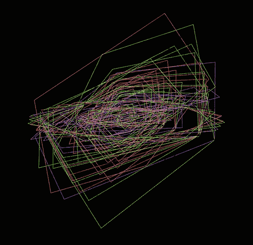
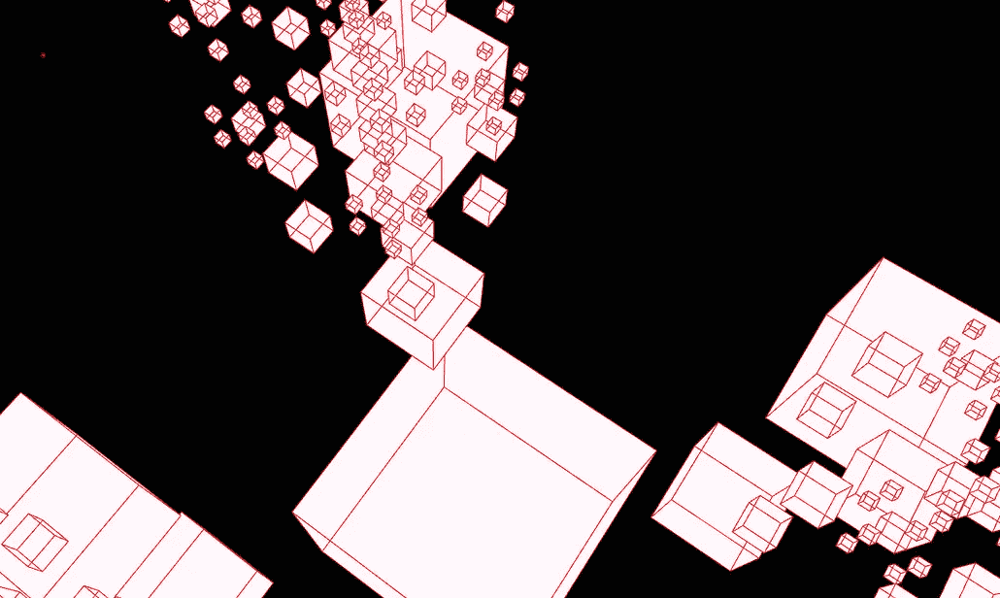

# Blender 2.8 油脂铅笔脚本和生成艺术

> 原文：<https://towardsdatascience.com/blender-2-8-grease-pencil-scripting-and-generative-art-cbbfd3967590?source=collection_archive---------8----------------------->


Quick, Draw! — Flock — Conway’s Game of Life

**什么**:学习 Blender Grease-Pencil 工具的基本脚本，重点是作为具体游乐场的[生成艺术](https://www.philipgalanter.com/downloads/ga2003_paper.pdf)。话少，代码多(评论)例子多。

为什么？主要是因为我们可以。还因为 Blender 是一个非常丰富的生态系统，而 2.8 版本的[Grease-Pencil](https://youtu.be/pywbPQD9vYU)是一个强大而通用的工具。生成艺术是展示工具潜力的迷人方式:如果你喜欢 Python，但不喜欢学习处理，或者仍然不确定是否要尝试 p5.js 或 Three.js，这里你会找到完美的游乐场。

**谁** : Python ≥ 3.6 和 [Blender 2.8](https://docs.blender.org/api/blender2.8/) 。我从其他关于生成艺术的资源中获得了灵感，特别是马特·皮尔森的《生成艺术》一书和 Kadenze 在线课程。

地点/时间:此时此地。也可以在这里找到完整的代码[(以及](https://github.com/5agado/data-science-learning/tree/master/graphics) [Blender utils 在这里](https://github.com/5agado/data-science-learning/blob/master/utils/blender_utils.py))。

# 设置

在 Blender 中，您可以使用 Python 控制台编辑器中的代码(一定要充分利用*自动完成*功能)


Python Console Editor


Text Editor

或者你可以更容易地运行。文本编辑器中的脚本。始终切换系统控制台，以便检查 Python 输出。有用的快捷键是用于运行脚本的`alt+P`和用于重新加载文件内容的`alt+R`。除非你只是玩玩或者做做实验，否则我建议用专用的 IDE 编写代码，然后回到 Blender 来验证结果。

这些都是开始的必要条件。这里是准备好油脂铅笔(GP)实例的代码。

**层次结构**是这样工作的:每个 GP 对象可以有多个*层*，这是一个组织你的工作的抽象。在一个层中，你可以创建*笔划*，这是一系列与*材质*相关的点。同一层的不同笔画可以有不同的材质。笔划位于*帧*中，这是 GP 对象的时间维度。我们将在后面的动画部分看到更多关于帧的内容，对于静态内容，我们只需要一个目标帧来绘制我们的笔划。

```
gp_layer = init_grease_pencil()
gp_frame = gp_layer.frames.new(0)
```

有了这个可重复使用的框架，我们就可以开始绘图了。

# 画

一个 [GP 笔划](https://docs.blender.org/api/blender2.8/bpy.types.GPencilStroke.html#bpy.types.GPencilStroke)仅仅是具有属性的点的集合。这里举例说明画线的方法。

对于给定的 GP 帧，创建一个新的笔划，定义长度(点数)并设置每个点的 3D 坐标。然后，您可以在屏幕上显示您的笔划(由于有了`display_mode`标志，在 3D 空间中是可编辑的)并在第 0 帧通过

```
gp_layer = init_grease_pencil()
gp_frame = gp_layer.frames.new(0)

draw_line(gp_frame, (0, 0, 0), (1, 1, 0))
```

我们可以通过重用之前的`draw_line`方法来绘制一个正方形，或者我们可以通过计算坐标和添加更多的点来更好地从头开始构建我们的正方形。类似的，移动到三维形状，以建立一个立方体。


From 0 to 3 Spatial Dimensions

下面的代码改为画一个圆。注意`draw_cyclic` 标志关闭循环(先连接最后一个笔画点)。

GP 现在是一等公民，因此可以依赖通用 Blender 对象的任何更高级别的实用程序/方法。对于笔画来说是不一样的，但这给了我们机会去学习/理解更多关于计算机图形学的基本机制，以及随之而来的数学。
例如，我们可以使用[旋转矩阵](https://en.wikipedia.org/wiki/Rotation_matrix)旋转我们的圆(只是一堆点)。

有了这两种方法，人们可以通过

```
def draw_sphere(gp_frame, radius: int, circles: int):
    angle = math.pi / circles
    for i in range(circles):
        circle = draw_circle(gp_frame, (0, 0, 0), radius, 32)
        rotate_stroke(circle, angle*i, 'x')
```


从这些基本组件和步骤中，您可以组合出几乎无限多种结果。下面是一些基本的例子，我用这些代码和一些数学模型来生成数据。


# 材料

材料是探索新维度的一种方式，试图逃离单调现实的沉闷。


Grease Pencil Materials

通过将其`material_index`属性设置为相应的材质索引，可以将每个笔划与特定的材质相关联。笔画粗细可以在创建时通过`line_width`属性设置。

```
gp_stroke = gp_frame.strokes.new()
gp_stroke.display_mode = '3DSPACE'  # allows for editing# The new lines needed to customize stroke thickness and material
gp_stroke.line_width = 100
gp_stroke.material_index = 1
```

请注意，一些属性位于层级别，而另一些属性位于材质级别。然后，您可以手动调整材质，并从用户界面获得实时反馈，但对于厚度，您可以只在层级别进行调整，除非您开始使用效果或修改器。


Basic Shapes with Different Materials

材料也可以通过编程来创建，但这是一篇专门文章的内容。现在享受一些我摆弄基本材料选项的结果。



# 动画


Dope Sheet Editor for Grease Pencil Mode

帧是你最好的动画朋友。它们是你讲述故事的媒介；你可以在 Blender 中[激活时间轴上的画布。从代码的角度来看，就是创建新的帧并访问它们来管理笔画。](https://youtu.be/pywbPQD9vYU?t=727)

在这个脚本中，我们设置目标帧数和相对距离，相应地更新场景变量，然后遍历这些帧，在时间轴中的每个目标位置创建一个。`gp_layer.frames.new`方法需要时间线上新帧的索引作为参数，如果已经存在，它将抛出一个错误。您也可以通过`gp_layer.frames[index]`访问帧，但是请注意帧列表中的索引不一定与时间轴帧号相匹配(因为帧的间距可能不同)。为此，你可以检查框架对象的`frame_number`属性。


Kinetic Rotating Square

在前面的例子中，我们使用了`gp_layer.frames.new`，它返回一个新的空白帧，没有过去的记忆。如果你要画全新的东西，可以用这个。相反，如果你对重用先前帧中绘制的内容感兴趣，你应该使用`gp_layer.frames.copy(gp_frame)`，其中`gp_frame`是一个实际的帧实例。这将给定帧的内容复制到下一个可用的时间轴位置。

下面的动画完全使用这种方法，每帧只绘制一个新线段，复制之前已经绘制的所有线段，并在每个线段绘制之间添加“立方体扩展效果”。


Dragon and Koch Curves

这真的是编写基本动画的全部知识。这里是我根据这篇文章的内容创作的一些例子。


3D L-Systems — Kinetic Rotating Square —Hexagon CA

作为奖励，我在这里接上了一张[草图——RNN 模型](https://github.com/tensorflow/magenta/tree/master/magenta/models/sketch_rnn)和相关的[快，画吧！数据集，](https://quickdraw.withgoogle.com/data)用于绘制代理的漂亮网格。


# 结论

在这篇文章中，我们介绍了油脂铅笔脚本的基础，重点是示例和方向的生成艺术。

关于 Grease-Pencil 没有太多要说的，如果不是要变得有创造性，拿出你自己有用的/有创造性的用例，当然利用 Blender 巨大的潜力。以混合为目标，例如混合 3D 和 2D，或者“[艺术数据可视化](https://www.instagram.com/p/Bqx31AYC48l/)”。

相反，我想以围绕[生成艺术](https://www.artnome.com/news/2018/8/8/why-love-generative-art)的建议结束，从一些基本的食谱和有效的创作惯例开始:

*   探索并结合多种数学函数和模型
*   从其他领域获得灵感(如生物学、建筑学、心理学、物理学)
*   分解现实和其他人的作品并试图复制
*   设计和试验可重用原子方法和对象的可组合层次
*   重新解释:以不同的方式可视化属性、对象和动作
*   “不要做相机能做的，做它不能做的”

必须开始探索的话题(有些高度相关):

*   [文法，L 系统](http://algorithmicbotany.org/papers/abop/abop.pdf)和[分形](https://www.youtube.com/watch?v=gB9n2gHsHN4)
*   [元胞自动机](https://www.goodreads.com/book/show/238558.A_New_Kind_of_Science) [、蜂群](https://team.inria.fr/imagine/files/2014/10/flocks-hers-and-schools.pdf)和[蚂蚁](https://en.wikipedia.org/wiki/Langton%27s_ant)
*   [软件/数字代理和紧急行为](https://www.goodreads.com/book/show/183954.Hidden_Order)
*   [人工生命](https://youtu.be/wQQ2NHECcvQ)
*   [程序内容生成](http://pcgbook.com/)
*   [混沌理论](https://www.goodreads.com/book/show/64582.Chaos)
*   [超出三维尺寸](https://youtu.be/2s4TqVAbfz4)

最后，我强烈建议潜入[机器学习和相关的生成模型](https://blog.openai.com/generative-models/)。这些技术的结果不言自明。

> “我听而忘，我看而记，我做而理解”——孔子

可以在我的[insta gram](https://www.instagram.com/amartinelli1/)和[Twitter【CS stuff】](https://twitter.com/5agado)上找到更多。