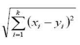
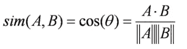

# 比较句子得分

> 原文：<https://towardsdatascience.com/bleu-bert-y-comparing-sentence-scores-307e0975994d?source=collection_archive---------16----------------------->

Blueberries — Photo by [Joanna Kosinska](https://unsplash.com/@joannakosinska?utm_source=unsplash&utm_medium=referral&utm_content=creditCopyText) on [Unsplash](https://unsplash.com/s/photos/blueberry?utm_source=unsplash&utm_medium=referral&utm_content=creditCopyText)

本故事的目标是理解 BLEU，因为它是 MT 模型的一种广泛使用的测量方法，并研究它与 BERT 的关系。

这是我的项目的第一个故事，我尝试在神经机器翻译(NMT)问题中使用 BERT 情境化嵌入向量。我对机器翻译比较陌生，因此，欢迎任何建议。

# 句子相似度

当涉及到机器翻译或其他自然语言处理(NLP)问题时，过程的输出是文本，测量结果的正确性并不简单。

评估机器翻译算法我们要问的问题是“这个翻译有多好？”或者“目标语言中的句子和源语言中的句子有多接近？”

为了理解这个问题，在这里我们将看看它的一个更简单的版本:“在*同一种语言*中的两个句子有多相似？”

在这个故事中，让我们使用以下袖珍句子:
`s0: James Cook was a very good man and a loving husband.
s1: James Cook was a very nice man and a loving husband.
s2: James Cook was a bad man and a terrible husband.
s3: James Cook was a nice person and a good husband.
s4: The sky is blue today and learning history is important.`

我想建议大家花一分钟思考一下句子之间的相似性，它们与第一个句子有多接近！

# 蓝色

BLEU:双语评价替角提供评分比较句子[1]。最初，它是为翻译开发的，使用参考翻译来评估预测的翻译，然而，它也可以用于句子相似性。[这里](https://machinelearningmastery.com/calculate-bleu-score-for-text-python/)很好的介绍了 BLEU(或者阅读原文)。

BLEU 背后的想法是统计句子中匹配的 *n-grams* 。一元词是一个单词(token)，二元词是一对两个单词，以此类推。在这种情况下，单词的顺序无关紧要。

为了消除错误的分数(例如，“the the the the”给“猫吃鸟”一个相对较好的分数)，引入了这个计数的修改版本。这个*修改的单字精度*惩罚了在参考文本中多次使用同一个单词。

BLEU 不能处理单词同义词，但是，它是一种快速、廉价的算法，与语言无关，并且与人类评估相关。

# 伯特

BERT:来自变压器的双向编码器表示是一个上下文化的单词嵌入(以及更多)[2]。[这里](http://jalammar.github.io/illustrated-bert/)是对 BERT 的一个很棒的总结(或者阅读原文)。

单词嵌入是映射到单词的向量，以帮助计算机理解单词。虽然“猫”或“狗”对计算机来说很难处理，但它们的矢量表示更适合。对嵌入映射的一个期望是相似的单词必须彼此靠近。

根据上下文，上下文化单词嵌入向量对于相同的单词具有不同的嵌入。BERT 嵌入的一个技巧是，它是用分隔符`CLS`和`SEP`训练的，这些分隔符也有上下文相关的嵌入向量。原论文中建议这些嵌入可以作为句子级嵌入。这里，我们将使用每个句子的`CLS`分隔符的嵌入向量作为句子的嵌入。`[CLS] This is a sentence with separators . [SEP]`

# 向量距离

这里，我们将使用相应的`CLS`句子级嵌入的欧几里德距离和余弦相似度来计算句子之间的相似度。

Euclidean distance

Cosine similarity

欧几里德距离的范围是[0，∞)，因此，为了匹配其他分数，让我们使用函数 f(x)=(1/1.2)^x 来获得(0，1)分数。该函数产生相对接近于 BLEU 的分数。余弦相似度具有正确的范围，但是，它与 BLEU 分数没有可比性。为了评估结果，我们必须调查句子之间的相对分数，而不是其他分数。

# 相似性得分

这是一个使用 BLEU 的分数表。正如我们所看到的，BLEU 认为第二个句子与第一个句子很接近(只有一个单词发生了变化)，但是它不能处理第四个句子的同义词。还有一个完全不同的句子得分比较高。

具有平滑功能的 BLEU 解决了后一个问题。

具有欧几里德距离的 BERT 获得了与 BLEU 相对相似的分数，但是它也处理同义词。BERT 向量的余弦相似性具有与空间相似性得分相似的得分。

Spacy 是一个工业级的自然语言处理工具。Spacy 使用嵌入向量的单词，句子的向量是其标记向量的平均值。更多关于空间相似性[这里](https://spacy.io/usage/vectors-similarity)。

BLEU and BERT scores of the pocket sentences, similarity to the first sentence

# 贝特斯科尔

*(2019 年 11 月 6 日更新)*

这是一个更新，因为我最近发现了一篇文章，其想法是使用 BERT 来评估机器翻译系统[4]。作者表明，与之前的分数(如 BLUE)相比，BERTScore 与人类判断的相关性更好。

BERTScore 与这里介绍的相似，但是，BERTScore 使用标记级 BERT 嵌入向量的相似性，而我们使用句子级嵌入。

# 摘要

这个故事介绍了评估句子相似性的 BLEU 分数，并将其与 BERT 向量距离进行了比较。这些例子试图说明定义一个相似的句子意味着什么是多么困难，这两种方法显示了定量测量某种相似性的可能答案。附在这个故事上的代码提供了 BLEU 和 BERT 以及 Spacy 的基本用法。对于详细的介绍，提供了额外的链接。

[相应的代码](https://colab.research.google.com/drive/11I3Zu1QX0KOZprVLF8ac_5vsN44hOj7r)在 Google Colab 中有。

# 参考

[1]帕皮尼，k .，鲁科斯，s .，沃德，t .，，朱，W. J. (2002 年 7 月). [BLEU:一种自动评估机器翻译的方法。](https://dl.acm.org/citation.cfm?id=1073135)见*计算语言学协会第 40 届年会论文集*(第 311-318 页)。计算语言学协会。

[2] Devlin，j .，Chang，M. W .，Lee，k .，& Toutanova，K. (2018 年)。 [Bert:用于语言理解的深度双向转换器的预训练。](https://arxiv.org/abs/1810.04805) *arXiv 预印本 arXiv:1810.04805* 。

[3]林春燕，吴凤珍(2004 年 7 月).[使用最长公共子序列和 skip-bigram 统计自动评估机器翻译质量。](https://dl.acm.org/citation.cfm?id=1219032)见*第 42 届计算语言学协会年会论文集*(第 605 页)。计算语言学协会。

[4]张，t .，基肖尔，v .，吴，f .，温伯格，K. Q .，&阿奇，Y. (2019)。 [BERTScore:用 BERT](https://arxiv.org/abs/1904.09675) 评估文本生成。 *arXiv 预印本 arXiv:1904.09675* 。

# 用伯特的故事学习 NMT

1.  [BLEU-BERT-y:比较句子得分](https://medium.com/@neged.ng/bleu-bert-y-comparing-sentence-scores-307e0975994d)
2.  嵌入关系的可视化(word2vec，BERT)
3.  [机器翻译:简要概述](/machine-translation-a-short-overview-91343ff39c9f)
4.  [使用 BERT 识别单词的正确含义](/identifying-the-right-meaning-of-the-words-using-bert-817eef2ac1f0)
5.  机器翻译:与 SOTA 相比
6.  [使用 TensorFlow 2.0 的简单 BERT】](/simple-bert-using-tensorflow-2-0-132cb19e9b22)