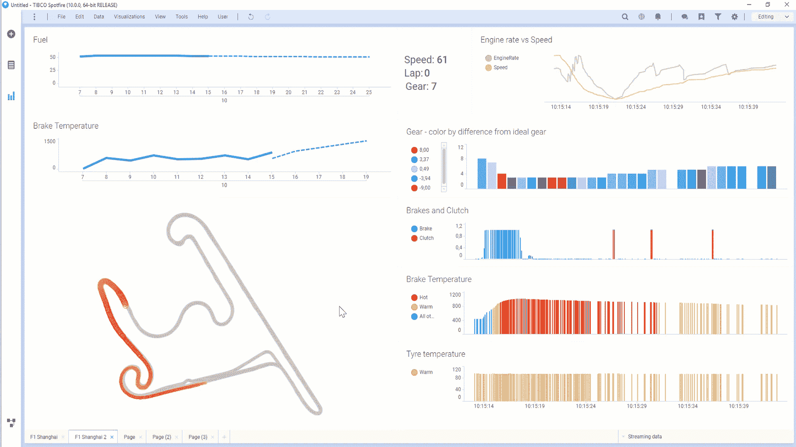

# 蒙住自己的眼睛，获得更好的商业智慧

> 原文：<https://towardsdatascience.com/blindfold-yourself-for-better-business-intelligence-a87ee02e71b0?source=collection_archive---------25----------------------->

*Streaming Business Intelligence can notify you before you take the wrong step*. © [Sergey Khakimullin](https://www.dreamstime.com/nexusplexus_info)

## *实时 BI 和查询未来 BI 的区别*

流业务智能允许业务分析师使用交互式 BI 工具来可视化动态信息。但是这种能力掩盖了工具的真正价值，即[查询未来](/how-to-query-the-future-a4a5e951d23e)。通过应用不断评估的算法，现在可以查询过去、现在和未来。

串流 BI 持续实时查询串流数据。例如，这个 BI 仪表板根据传感器读数和汽车发出的 GPS 位置数据，实时显示一级方程式赛车的路线。当接收到输入时，BI 工具在屏幕上闪烁数据更新。

但这种实时的视觉盛宴隐藏了流式商务智能的强大功能。神奇之处在于当你*不*看着屏幕时，它能评估连续的答案；流式 BI 会记住查询，并随着数据的每次变化不断重新评估它们。

流式商务智能使自助商务智能像自动回拨客户支持一样工作。你可以要求系统给你回电，挂断电话，然后继续你的业务，而不是等待代理。当客服代表准备好了，*他们会打电话给你*。

流式 BI 类似于自动回拨 BI:当您的问题得到回答时，它会给您打电话。该呼叫可以通过电子邮件、文本消息或您可以用 API 编程的任何基于推送的响应来传递。或者，当事件*没有*发生时，您可以被调用。举个例子:如果一个超过我前面 F1 赛车的机会 3 圈都没有发生，*发短信给我*。

以下是一些质疑未来的商业智能问题的真实例子:

*   告诉我，当一位高价值客户将一件产品添加到他的购物车中，但 5 分钟后才结账
*   当两次可疑登录在 5 分钟内相继发生时，请告诉我
*   告诉我什么时候一艘船离港口有一个小时的路程，但是没有地方停靠
*   告诉我飞机航线上什么时候预报有风暴
*   当我的供应链中任何 100，000 个零件的订单超过一个小时没有得到确认时，请告诉我
*   告诉我什么时候任何生产线开始降低产量。
*   根据我的交易算法，告诉我什么时候是交易谷歌股票的好时机
*   当我的司机走错方向时告诉我

自助式流媒体商务智能有助于打破*只看过去的思维*，并且像十年前颠覆性的自助式商务智能一样，有望改变每个企业使用数字数据的方式。

## 流式 BI 也适用于数据科学

自适应学习是数据科学，相当于人类通过不断观察环境来学习。自适应学习不是只在数据湖上训练模型，而是在变化的数据流上训练模型。

查询未来[问题可以包括机器学习和 AI 模型](https://link.medium.com/3GcSo4iYAV)。因此，您也可以在不观察的情况下，针对不断变化的实时条件应用预测分析。

流式商业智能允许分析师提出一类新的关于未来的商业问题，而不仅仅是已经发生的事情。这项技术使商业用户能够在一个新的计算方向上进行搜索:向前，而不是向后。

通过在你*不在的时候不断回答问题，流式商务智能技术有助于实现预测未来情况并据此采取行动的业务流程。*

## 了解更多信息

*更多关于串流 BI，阅读* [*如何查询未来*](/how-to-query-the-future-a4a5e951d23e?source=friends_link&sk=6f11501cc3c7ad84372cf5b8046f556e) *和本 3 分钟* [*如何查询未来中序列。*](https://link.medium.com/VsxTFbuAXV) *如需了解更多关于在串流商务智能中应用数据科学模型的信息，请阅读* [*为什么您应该了解串流数据科学*](/why-you-should-learn-about-streaming-data-science-2f603ad24aea?source=friends_link&sk=a07a70b9fb9c6037261b44afa8b1aa2d) *。*

## *关于作者*

马克·帕尔默是 TIBCO 软件公司分析部的 SVP。作为 StreamBase 的 CEO，他被《时代》杂志评为将改变你生活的 [*科技先锋之一*](https://about.me/mark.palmer) *。更重要的是，他是两个酷孩子的骄傲父亲。*