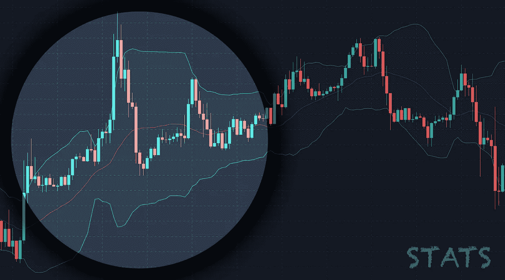
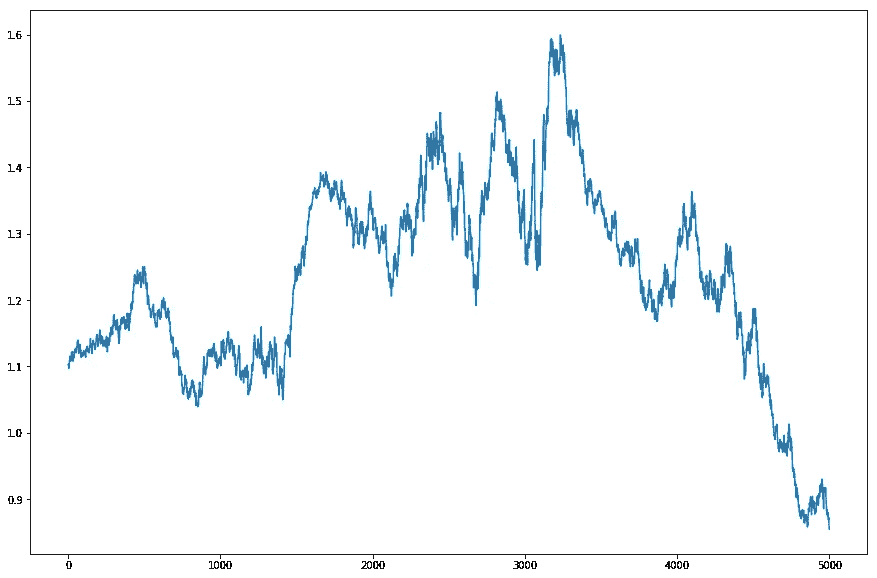
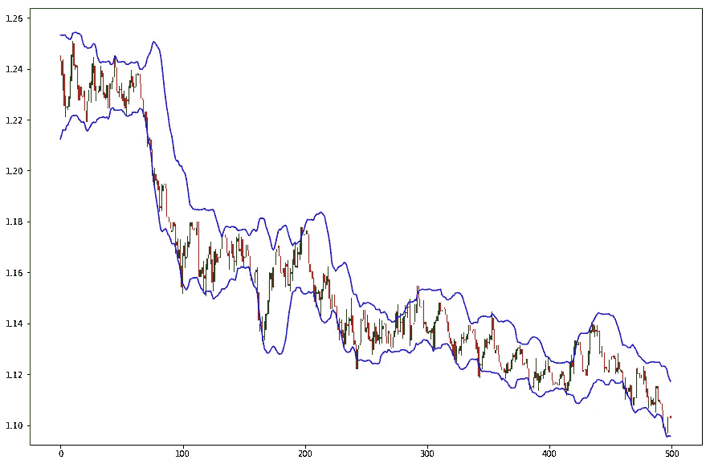
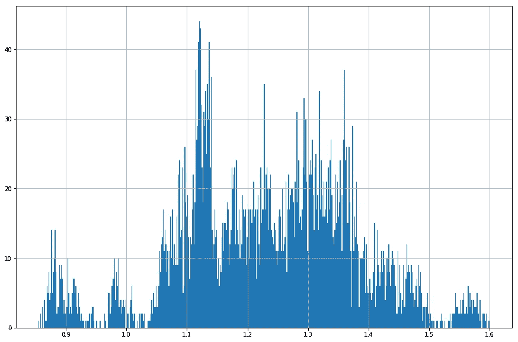
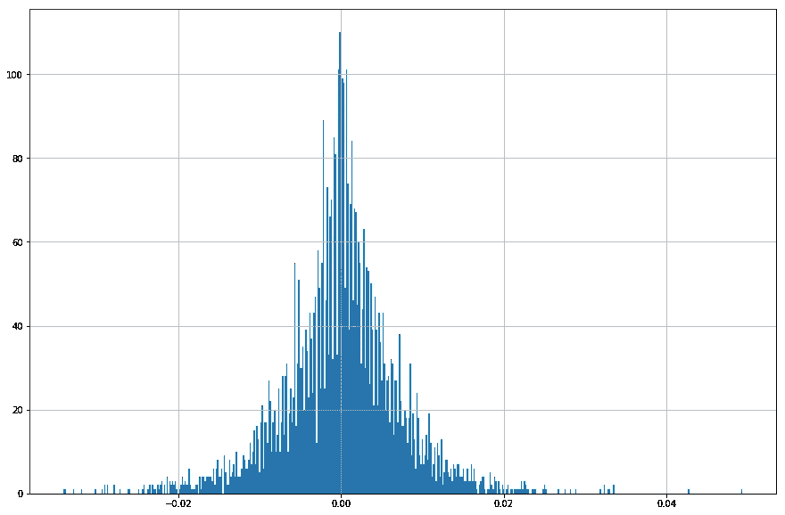

# 交易中的布林线统计

> 原文：<https://towardsdatascience.com/bollinger-bands-statistics-in-trading-dcc8783a8f88?source=collection_archive---------15----------------------->

有很多交易者使用**布林线**。我也喜欢布林线。它使用统计数据，并将统计数据带入交易世界。但是有多准确呢？在时间序列中使用标准差是正确的方法吗？一起来了解一下吧！



Bollinger Bands

> 没有领先指标

作为交易者，我们大多数人使用 OHLC 蜡烛图/条形图(开盘-盘高-盘低-收盘)。这张图表向我们展示了过去发生的事情。我们可以清楚地看到一家酒吧在哪里开业、搬迁和关闭。我们使用许多指标。它们都告诉我们过去发生了什么。对我来说；**没有领先指标。**过去的就过去了！然而，这是有可能的。如果我们有足够的过去的数据，我们将有足够的基础资产的统计数据。

> 数据数据数据…

我们需要数据！数据是关键。数据就是一切。我们需要从可靠的来源获取数据。在本文中，我将向您展示如何使用 Python 免费下载数据。我要用 AlphaVantage。

首先；请在 [AlphaVantage](http://alphavantage.co/) 网站注册一把免费钥匙。请注意，我不隶属于他们。

现在让我们使用 Python 下载数据。

```
def load_data(sym="EUR", to_sym="USD", interval="5min", dtype=2, intraday=False, outputsize="full"):
    key = "ENTER_YOUR_KEY"
    if dtype == 1: # Download stock
        if intraday:
            url = "[https://www.alphavantage.co/query?function=TIME_SERIES_INTRADAY&interval={}&symbol={}&apikey={}&datatype=csv&outputsize={](https://www.alphavantage.co/query?function=TIME_SERIES_INTRADAY&interval={}&symbol={}&apikey={}&datatype=csv&outputsize={)}".format(interval, sym, key, outputsize)
        else:
            url = "[https://www.alphavantage.co/query?function=TIME_SERIES_DAILY&symbol={}&apikey={}&datatype=csv&outputsize={](https://www.alphavantage.co/query?function=TIME_SERIES_DAILY&symbol={}&apikey={}&datatype=csv&outputsize={)}".format(sym, key, outputsize)
    elif dtype == 2: # Download forex
        print("FX")
        if intraday:
            url = "[https://www.alphavantage.co/query?function=FX_INTRADAY&interval={}&from_symbol={}&to_symbol={}&apikey={}&datatype=csv&outputsize={](https://www.alphavantage.co/query?function=FX_INTRADAY&interval={}&from_symbol={}&to_symbol={}&apikey={}&datatype=csv&outputsize={)}".format(interval, sym, to_sym, key, outputsize)
        else:
            url = "[https://www.alphavantage.co/query?function=FX_DAILY&from_symbol={}&to_symbol={}&apikey={}&datatype=csv&outputsize={](https://www.alphavantage.co/query?function=FX_DAILY&from_symbol={}&to_symbol={}&apikey={}&datatype=csv&outputsize={)}".format(sym, to_sym, key, outputsize)
    elif dtype == 3: # Download Crypto
        url = "[https://www.alphavantage.co/query?function=DIGITAL_CURRENCY_DAILY&symbol={}&market={}&apikey={}&datatype=csv&outputsize={](https://www.alphavantage.co/query?function=DIGITAL_CURRENCY_DAILY&symbol={}&market={}&apikey={}&datatype=csv&outputsize={)}".format(sym, to_sym, key, outputsize)
    print("Downloading", url)
    print("---")
    df = pd.read_csv(url)# rename columns
    if dtype == 3:
        df.rename(columns={'timestamp': 'Date', 'open (USD)': 'Open', 'high (USD)': 'High', 'low (USD)': 'Low', 'close (USD)': 'Close', 'volume': 'Volume'}, inplace=True)
    else:
        df.rename(columns={'timestamp': 'Date', 'open': 'Open', 'high': 'High', 'low': 'Low', 'close': 'Close', 'volume': 'Volume'}, inplace=True)
    df.sort_values(by="Date", ascending=True, inplace=True)
    print("Data loaded:", len(df), "rows")
    return df# Options
sym = "EUR"
to_sym = "USD" # only for fx and cryptocurrency
intraday = False # False: Daily
interval = "5min" # 1min 5min 15min 30min 60min - only if intraday is set to True
dtype = 2 # 1: stock 2: fx 3: crypto# load data
df = load_data(sym, to_sym, interval, dtype, intraday)
```

我们已经下载了我们的数据，下面是它的样子。

```
df['Close'].plot(figsize=(15, 10))
```



EURUSD Daily Closing Prices

这是欧元兑美元的日线图。现在我们需要做的是在图表上添加**布林线**并计算统计数据。

```
def add_bb(df, dev=2, lb=20, col="Close", lines=100):
    df['MA'] = df[col].rolling(lb).mean()
    df['STD'] = df[col].rolling(lb).std()
    df['OVB'] = df['MA'] + df['STD'] * dev
    df['OVS'] = df['MA'] - df['STD'] * dev
    plot_candles(df, lines=lines)
    get_stats(df, dev=dev)
```

请注意，我添加了两个新函数。第一个绘制蜡烛线，第二个计算并打印出布林线过去的统计数据。让我们快速定义这些函数。

```
def plot_candles(df, lines=100):
    df['Bar'] = df['High'] - df['Low']
    df['Body'] = abs(df['Close'] - df['Open'])
    df['Up'] = df['Close'] > df['Open']
    df['Color'] = np.where(df['Up'], "g", "r")
    if lines > 0:
        db = df[-lines:].reset_index(drop=True).reset_index()
    else:
        db = df.reset_index(drop=True).reset_index()
    plt.figure(figsize=(15, 10))
    plt.bar(db['index'], bottom=db['Low'], height=db['Bar'], color="#000000", width=0.2)
    plt.bar(db['index'], bottom=np.where(db['Up'], db['Open'], db['Close']), height=db['Body'], color=db['Color'], width=0.9)
    plt.plot(db['OVB'], color="b")
    plt.plot(db['OVS'], color="b")
    plt.show()def get_stats(df, high_col="Close", low_col="Close", high_dev="OVB", low_dev="OVS", dev=2):
    total = len(df)
    inside = len(df[(df[high_col]<=df[high_dev]) & (df[low_col]>=df[low_dev])])
    upside = len(df[df[high_col]>=df[high_dev]])
    downside = len(df[df[low_col]<=df[low_dev]])
    i = np.round(inside / total * 100, 2)
    u = np.round(upside / total * 100, 2)
    d = np.round(downside / total * 100, 2)
    # Print the stats
    print("Total bars:", total)
    print("Deviation", dev)
    print("Inside: ", i, "%", sep="")
    print("Up side: ", u, "%", sep="")
    print("Down side: ", d, "%", sep="")
```

现在让我们继续运行 add_bb()函数，看看结果

```
dev = 2 # standard deviation
lb = 20 # simple moving average (SMA) of last 20 bars including the final bar
lines = 500 # plot last 500 bars only
add_bb(df, dev=dev, lb=lb, lines=lines)
```



EURUSD Candlestick chart with Bollinger Bands

非常好的烛台图表在一个棘手的方式！这是布林线在两个标准差内的统计数据:

```
Total bars: 5000
Deviation 2
Inside: 89.96%
Up side: 5.3%
Down side: 4.36%
```

内意味着，总棒线收在 2 个标准差之间；上边意味着，总棒线收在上边带之上，下边意味着，总棒线收在下边带之下。

现在我们看到的是标准**布林线**的“过去”统计数据。请随意更改设置。例如，您可以用 200 SMA 设置一个标准差。

# 布林线准确吗？

如果你有统计学背景，你应该知道，标准差在正态分布数据中更有效。然而，收盘价不是正态分布的。您可以很容易地看到，运行下面的代码:

```
df['Close'].hist(bins=500, figsize=(15, 10))
```



EURUSD closing prices histogram

你可能认为这看起来像正态分布，但我可以很容易地说，它不是。它应该是这样的:



Normal distribution

这就是我所说的完美钟形曲线。如果你有这样的直方图，你可以有更好的统计，告诉你更多。波段之间的距离不会像布林线一样宽。

# 标准差告诉我们什么？

标准差表示:68.26%的数据落在平均值的一个标准差内，95.44%的数据落在平均值的两个标准差内，99.74%的数据落在平均值的三个标准差内。然而，如果我们使用一个标准偏差进行测试，结果如下:

```
Total bars: 5000
Deviation 1
Inside: 44.96%
Up side: 28.96%
Down side: 25.7%
```

可以尝试股票、外汇、加密货币；它们都给你相似的结果。在我看来，这一点也不准确！

# 结论

从统计学上来说，**布林线**可能无法满足你的需求。然而，你可以使用你最喜欢的交易策略，仍然可以获利！

**免责声明 **

我不是专业的财务顾问。这篇文章和代码，分享仅用于教育目的，而不是财务建议。你要对自己的输赢负责。

*本文的全部代码可以在这个资源库中找到:*

[](https://github.com/atillayurtseven/TheCurve/blob/master/Bollinger%20Bands%20Statistics.ipynb) [## atillayurtseven/TheCurve

### 此时您不能执行该操作。您已使用另一个标签页或窗口登录。您已在另一个选项卡中注销，或者…

github.com](https://github.com/atillayurtseven/TheCurve/blob/master/Bollinger%20Bands%20Statistics.ipynb) 

**啊也；记得在以下社交渠道关注我:**

[中等](https://medium.com/@atillayurtseven)
[推特](https://twitter.com/atillayurtseven)
[交易视图](https://www.tradingview.com/u/AtillaYurtseven/)

直到下次；保持安全，交易安全！！！

阿蒂拉·尤尔特塞文

***来自《走向数据科学》编辑的注释:*** *虽然我们允许独立作者根据我们的* [*规则和指导方针*](/questions-96667b06af5) *发表文章，但我们不认可每个作者的贡献。你不应该在没有寻求专业建议的情况下依赖一个作者的作品。详见我们的* [*读者术语*](/readers-terms-b5d780a700a4) *。*