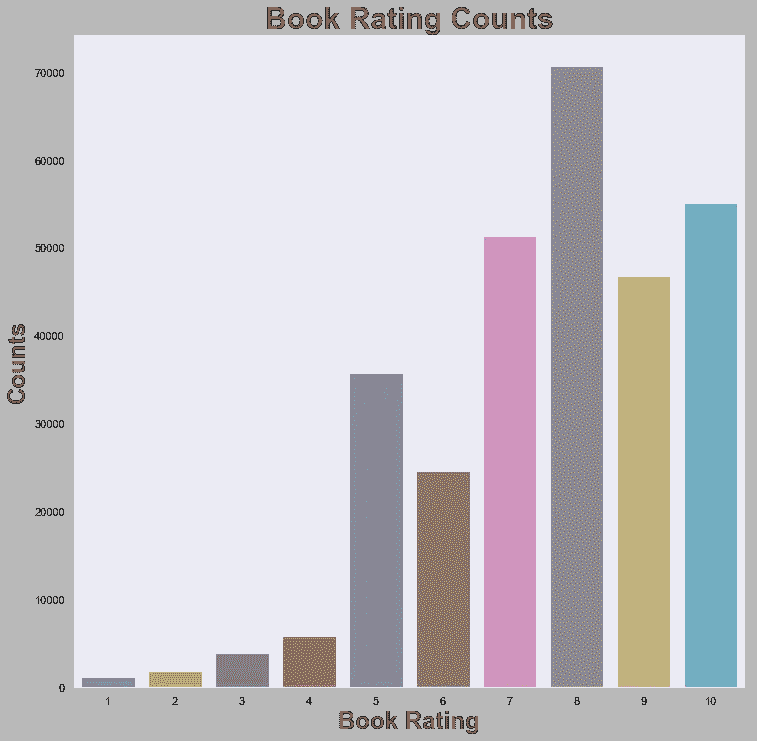
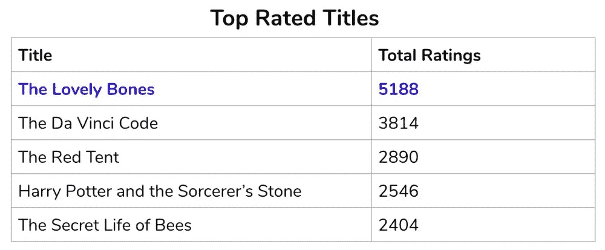
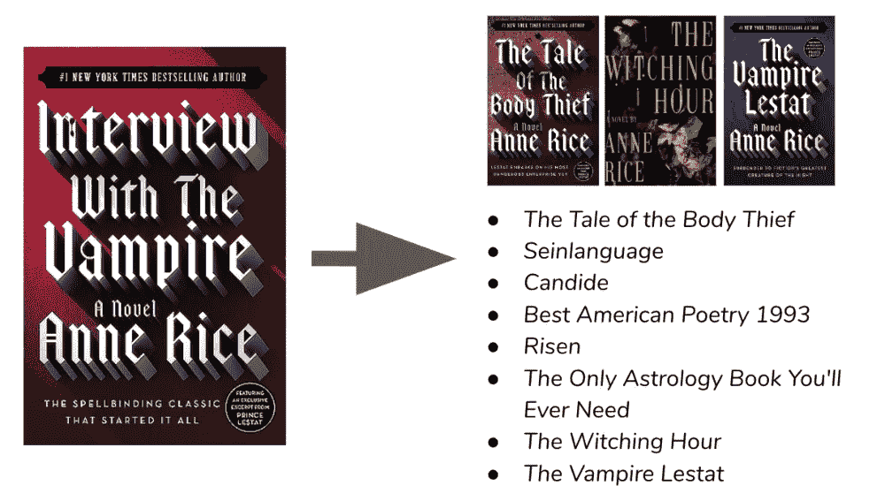
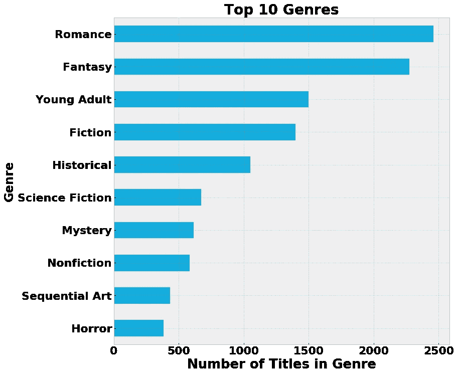
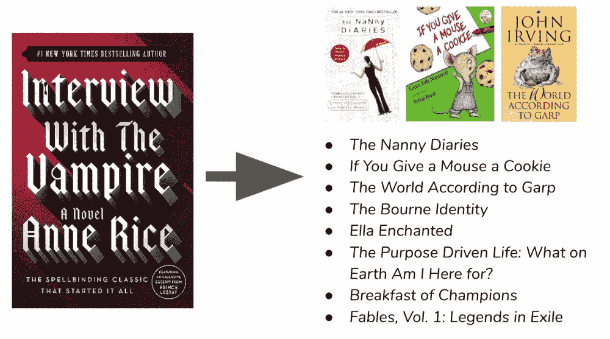

# 图书推荐引擎

> 原文：<https://towardsdatascience.com/book-recommender-engines-4c9d5b33db62?source=collection_archive---------23----------------------->

我决定建立几个推荐引擎，这样我就可以更好地探索它们如何运作的幕后。我构建了两个引擎，每个都推荐书籍。一个是基于合作者，另一个是基于内容。

**第一部分:合作者引擎**

使用 collaborator 引擎，推荐是基于用户与产品的交互方式。这包括购买或评价一个项目，以及观看或收听媒体。我选择了[图书穿越公司的](http://www2.informatik.uni-freiburg.de/~cziegler/BX/)数据集作为这个引擎，因为它包含了用户评分。

**探索性数据分析**

一旦我清理了数据，我想看一下评级，看看评分范围是什么样子的。评分范围为 1-10 分，在 12.3 万本被评分的书中，这些用户似乎喜欢他们所读的大部分内容。8 是最受欢迎的评级，很少有低于 5 的评级:

接下来，我想看看这些用户最喜欢的书是什么:

[*可爱的骨头*](https://www.goodreads.com/book/show/12232938-the-lovely-bones) 远超其他。这个数据集是在 2004 年创建的，而《可爱的骨头》是在 2002 年发布的，所以这个时间确实符合这本书在当时的受欢迎程度。

**推荐者**

接下来，我根据每个用户对多少本书的评价抽取了一个数据样本，并通过推荐器运行。我从一组用户样本开始，他们每个人都评价了 100 多本书。然后我测试了把各种书名输入系统，看看有什么书会被推荐。这里有一个例子:

在这种情况下，我要求根据 [*《采访吸血鬼》*](https://www.goodreads.com/book/show/43763.Interview_with_the_Vampire) 推荐书籍。右边是建议。我在列表的顶部展示了三个封面，以提醒这三个标题也是安妮·赖斯的，所以在这里推荐它们是合适的。两部其实和*采访吸血鬼*是一个系列的。

这里有些书是我意想不到的，比如《宋飞正传》或《老实人 T21》。然而，我的用户群实际上很小，所以它推荐的书籍是基于非常精选的读者群。

我试着把我的样本集中那些评价超过 100 本书的用户数量改为 50 本书，我的分数变得更差了。所以我试着把复习的书增加到 200 多本，我的分数变得更好了。这是出乎意料的，因为我们真的需要更多的用户样本来获得更平衡的推荐。有了这个用户群，很可能与那些评价更多书的人走得更少会给我们一个更志同道合的子集。

**第二部分:内容引擎**

使用基于内容的引擎，推荐是基于产品的特性进行的。考虑到这一点，我选择了来自 Kaggle 的 [Goodreads](https://www.kaggle.com/brosen255/goodreads-books) 数据集，因为它包含了每个标题的特征信息，比如流派和平均评级。

**探索性数据分析**

清理完数据后，我想看看流派划分是什么:

浪漫和幻想似乎让大多数其他类型相形见绌，这是我在转向模型时记住的事情。

**推荐者**

我根据出版年份提取了一个样本。在这种情况下，我调出了 1900 年及以后出版的所有书籍。与上一个引擎一样，我测试了将各种书名放入系统中，看看有什么书会被推荐。不过，我也想看看我之前测试过的一些相同的书，比如*采访吸血鬼*:

这一次，你可以看到它没有推荐任何其他安妮·赖斯的书籍。事实上，有一本图画书列出来了，如果你给一只老鼠一个饼干[。这不太符合年龄。我不会向阅读《吸血鬼访谈》的人推荐一本绘本。](https://www.goodreads.com/book/show/767680.If_You_Give_a_Mouse_a_Cookie)

看到这一点，我备份并调整了我要放入模型的数据列。我测试了各种字段，从评级数量到页数，再到是否包含作者或流派。虽然我注意到结果中有一些有趣的变化，例如当我删除页面作为一个功能时，出现了更多的儿童图画书，但我最好的结果仍然是包括所有书籍特定的数据列。

然而，根据推荐的书目来看，这个方向似乎是有缺陷的。分数看起来很大，但仔细看，结果并不那么好。问题是，对于基于内容的引擎，我们需要比我在这个数据集中所拥有的更多的数据。拥有书籍描述将是一个良好的开端。更完整的内容更好地描述了这本书的真实内容。

**结论**

在这两个引擎中，collaborator 引擎给我的基于书籍主题的推荐比 content 引擎稍好。后者给出了更好的分数，但仔细看，我可以看到主题也不匹配。但这并不意味着我会排除使用基于内容的引擎。对于这种引擎，我建议引入更多的描述性内容，并使用自然语言处理来评估单词之间的关系，并在此基础上提出建议。

**接下来的步骤**

我确实看到了这些引擎的巨大潜力。如果我在这个项目上有更多的时间，我会采取并建议考虑以下步骤:

1.  收集更大的主数据集来测试模型。我的 collaborator 引擎需要更多的用户评分才能更加平衡，而我的内容引擎需要更多的描述性内容。因此需要更大更完整的数据集。一个可以通过网络搜集或 API 收集，包括产品描述和用户评论。
2.  我也没有时间去做的一件事是研究如何导入外语包。如何在数据中处理外文图书将是下一步需要考虑的事情。要么导入一个可以处理外来字符的包，要么从数据集中删除它们。
3.  Goodreads 集合中有一些与作者相关的数据，我没有机会测试，比如作者类型和平均评分。我想看看这是否有助于获得更好的推荐。
4.  最后，我将探索在引擎上添加一个基于网络的前端的选项，该引擎具有消费者友好的界面。

该项目的完整代码可在 [GitHub](https://github.com/jenrhill/Book_Recommender) 上获得。干杯！