# 书名越来越长了吗？

> 原文：<https://towardsdatascience.com/book-titles-are-getting-longer-1c341fbd4829?source=collection_archive---------17----------------------->

## 印刷世界趋势的数据分析

photo from Pixabay

几周前，我注意到受欢迎的文学代理人宋东元表达了我一度怀疑的东西，的书名越来越长。

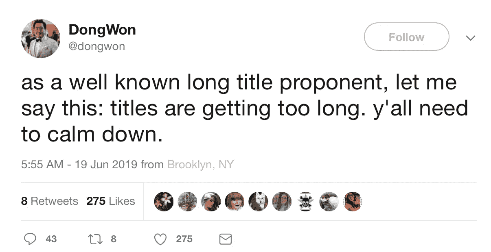

这一趋势似乎很有趣，因为其他媒体似乎正朝着相反的方向发展。例如，我们知道[的歌名](https://medium.com/@michaeltauberg/spotify-is-killing-song-titles-5f48b7827653) s 随着我们注意力的持续时间而缩短[。为什么文学小说的世界会有所不同？](https://medium.com/@michaeltauberg/music-and-our-attention-spans-are-getting-shorter-8be37b5c2d67)

为了调查这一说法，我使用《纽约时报》的书籍 AP 收集了自 2011 年以来所有畅销书的数据。下面我将展示更长的标题只是图书世界的众多趋势之一。

# 小说标题真的越来越长了

为了证实书名确实越来越长，我从《纽约时报》的纸质和电子书小说列表中抓取了所有可用的畅销书。然后我统计了一下这些小说标题的字数。下面是 2011 年 2 月以来每个月小说标题平均字数的剧情。

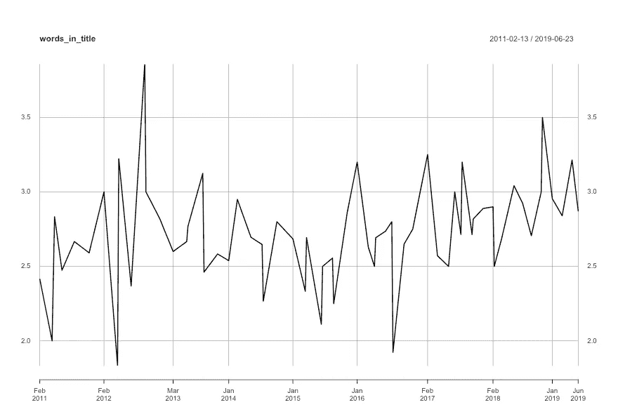

很明显，自 2016 年以来，有明显的上升趋势。小说标题从平均 2.5 个单词增加到现在的近 3 个。

为了再次确认这一点，我还计算了小说标题中的字母数量。这里，回归线再次显示出明显的上升趋势。现在的小说标题很可能是 14 个字母，而不是 12 个。

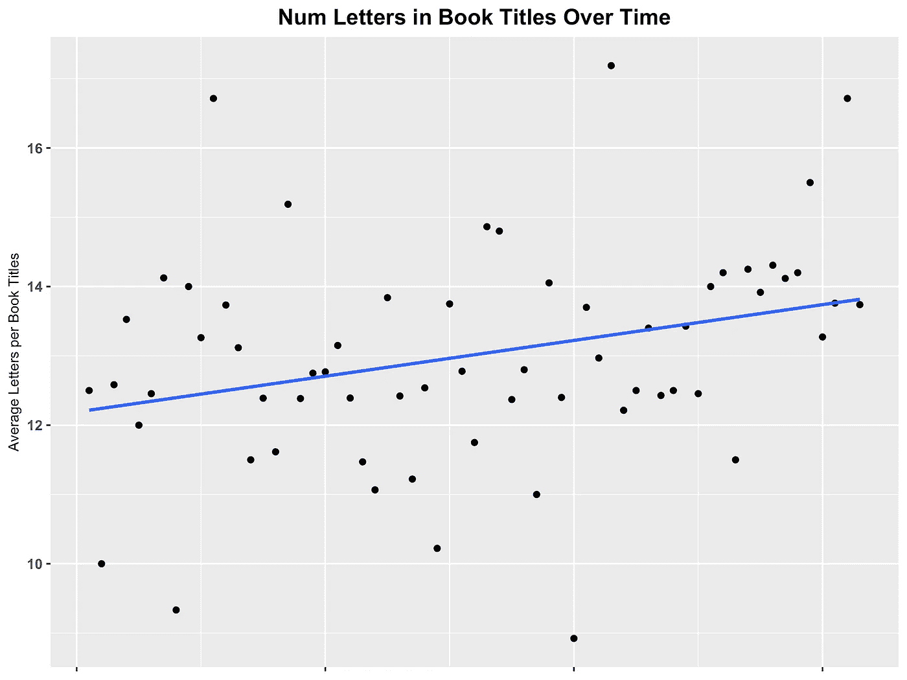

# 为什么标题越来越长？

仔细观察最长的书名，我注意到它们中的许多都来自著名的系列——最引人注目的是“有龙纹身的女孩”系列。以下是标题中包含 7 个或 7 个以上单词的畅销书列表。其中许多是其他成功作品的续集或前传。

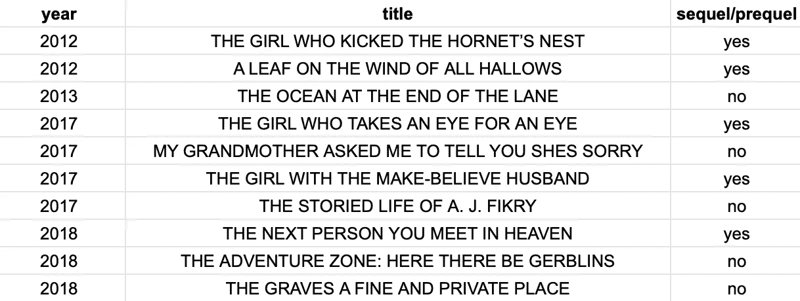

作为一个既定系列的一部分，这些标题需要参考过去的工作，使它们不那么简洁。此外，不是出自著名三部曲的小说通常仍然是由知名作家创作的(如尼尔·盖曼、弗雷德里克·巴克曼)。卖给现有的读者群意味着这些作者能够摆弄他们的书名，变得更有创造性。

我怀疑向电子阅读器和网上购买的转变也影响了小说的命名。在网上，远离拥挤的书架，读者不必一次阅读多本书。他们不需要等待一些有力的标题来吸引眼球。此外，从我公认的轶事经验来看，书店和机场售货亭这些天似乎主要出售非小说类书籍。另一方面，小说可以自由的小众和怪异，就像卖小说的互联网一样。

# 小说标题还告诉了我们什么？

正如我几年前注意到的，最受欢迎的小说似乎都围绕着一个迷人的词——“女孩”。根据 2019 年的更新数据，似乎“女孩”仍然是销量最高的一个词。

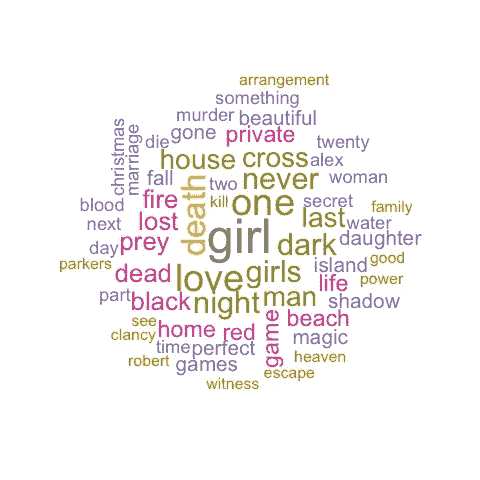

Word Cloud of the most popular terms in fiction book titles

然而，这并不意味着小说标题不会随着时间的推移而改变。在 2018 年，“黑暗”和“死亡”等词的流行程度赶上了“女孩”。像孩子的名字一样，最流行的名字往往会演变并反映当前的情绪。

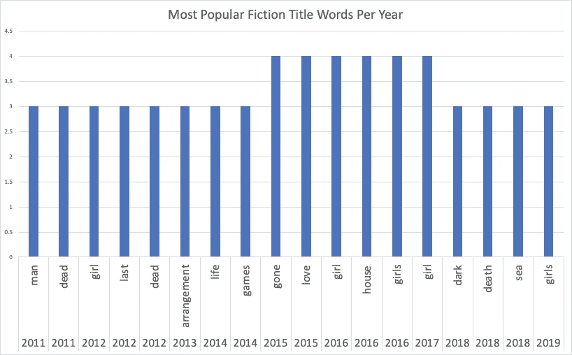

## “深色”是 2016 年后的趋势

2016 年后，小说标题的基调似乎发生了微妙但明显的转变。我们可以通过绘制特定单词每年的流行度来看出这一点。例如，“爱”最近已经失宠，而“夜”却成了时尚。同样，在书名中，“光”为“暗”让路。

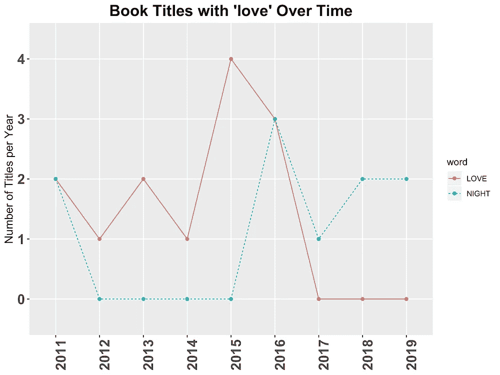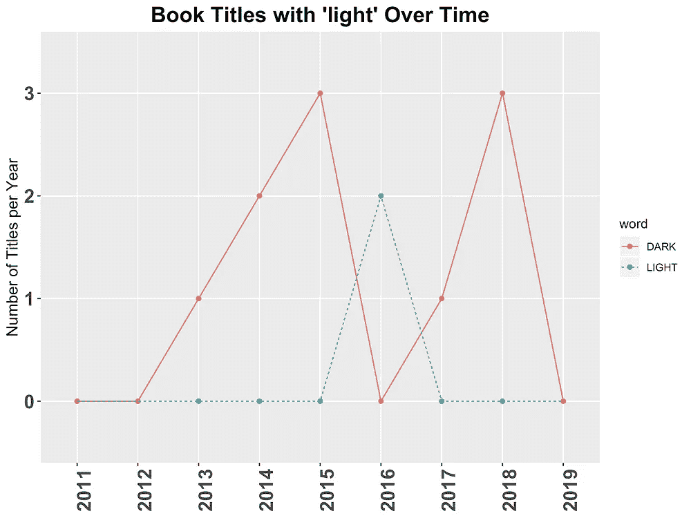

此外，出于我无法理解的原因，含有“死亡”一词的小说似乎在偶数年很受欢迎。似乎像巨人的[一样，死神不喜欢奇数。](https://www.espn.com/blog/sweetspot/post/_/id/68372/explaining-the-san-francisco-giants-even-year-prowess)

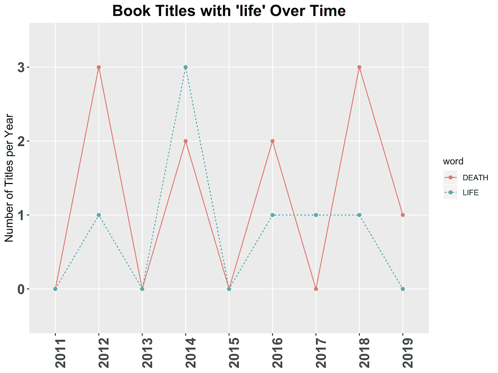

# 非小说类书籍的长度是一样的

我应用于小说畅销书的分析可以很容易地应用于非小说畅销书。下面我画出了每年的字数/非小说标题。右边是每年的信件/标题数量。正如我们所见，没有明显的延长趋势。

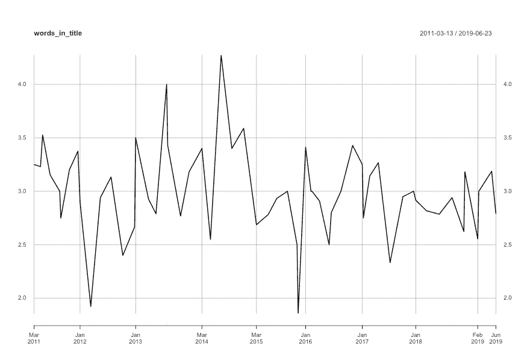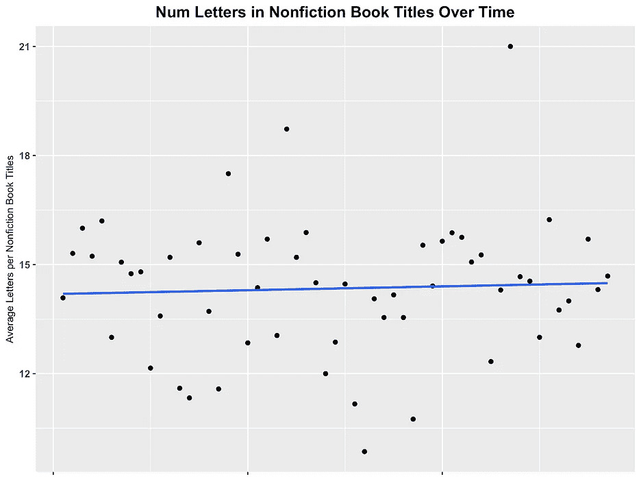

left — number of words in nonfiction titles per year : right — number of letters in nonfiction titles per month

鉴于非小说类作品很少成为一个系列的一部分，而且它们仍然在大商店里卖得很好，这并不令人惊讶。事实上，非小说类书籍与小说类书籍还有其他显著的不同。例如，下面是小说和非小说标题的字数直方图。

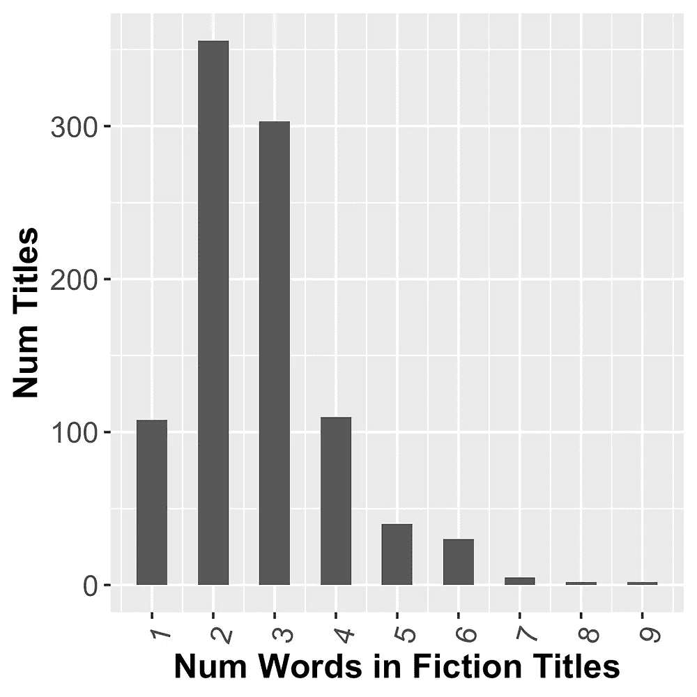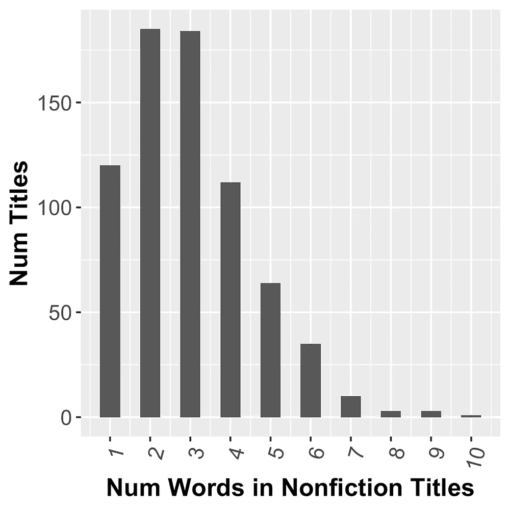

left — histogram of Fiction Titles : right — histogram of non-fiction titles

很明显，非小说类畅销书每个标题的字数分布更广。事实上，许多书的封面上只有一个词(例如，“Bossypants”，“Sapiens”，“Moneyball”，“Hunger”，“Freakonomics”)。

# 非小说类书籍的其他趋势

检查非小说标题中最受欢迎的词，我们看到重点较少是神秘事件，而更多是政治家的传记。这解释了“美国”和“总统”等词的常见用法(如“特朗普”和“肯尼迪”)。

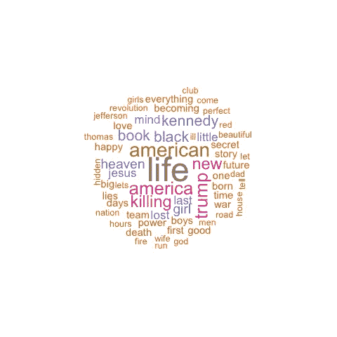

Word Cloud of the most popular words in Nonfiction Book Titles

或许正是因为这种政治品质，非小说类的标题在后特朗普时代变得更加负面。随着时间的推移，绘制这些头衔的平均情绪(或积极性)，我们看到 2016 年后急剧下降。

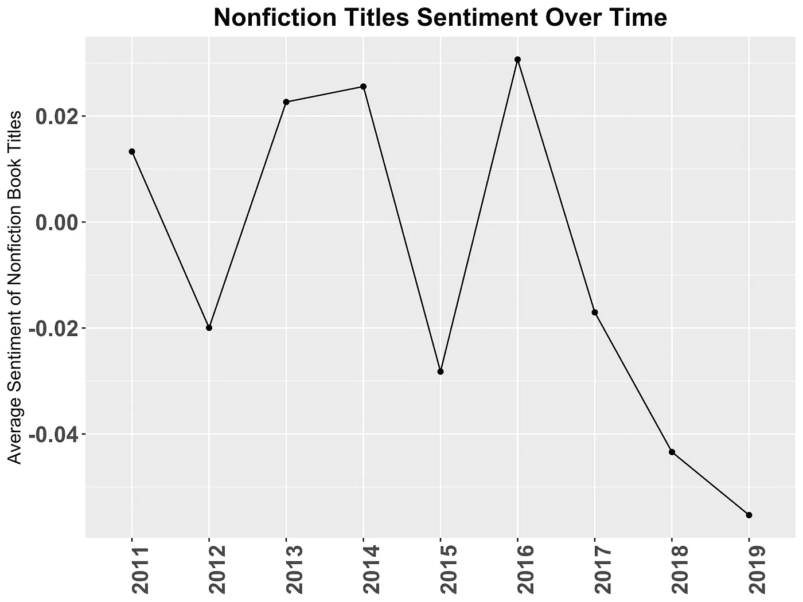

average sentiment of non-fiction titles per year (<0 has negative sentiment)

事实上，一些最负面的书名围绕特朗普时代的主题，并在过去 2 年出版。

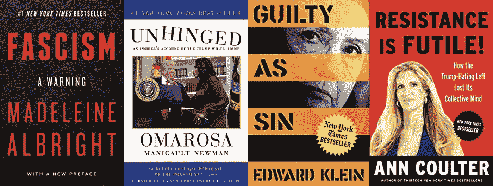

Some example of political books with negative titles in the past 2 years.

# 其他发现——女性阅读更多的小说

美国国家艺术基金会的调查数据表明，女性阅读更多的小说作品，而男性则更关注非小说类书籍。在研究了小说类和非小说类畅销书的区别之后，我很清楚这个观察是正确的。

这一点最好通过比较 NYT 对他们畅销书的描述来看。我们先看看小说书。

## 小说词汇云

下面我列出了小说描述中最常见的词语。左边的云仅从图中删除了“The”和“a”。在右边，所有常见的英语单词都被删除，只留下独特的单词。

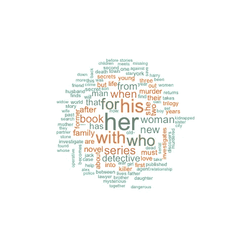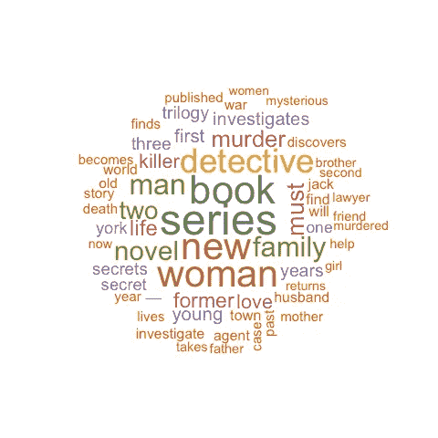

Word Clouds for the Descriptions of Fiction Bestsellers

很明显，畅销小说往往是' ***系列丛书之一'*** '，极有可能是' ***三部曲*** '。通常涉及一个' ***女人***'——要么是一个' ***律师*** ，要么是一个' ***代理人*** 。或者更好一点，一个' ***神探*** '。在' ***她的*** '旅途中，我们的主角将有可能' ***调查*** '一个' ***杀手*** '。也许是一个' ***的案子*** '一个' ***的被害人******的朋友*** '或' ***的旧爱*** '。在这个过程中，她将' ***'回归到'*** '到'*'，挖掘' ***秘密*** '，' ***发现***'***凶手*** '甚至可能找到'**【T75]她甚至可能会在这个过程中找到一个新的家庭。***

## *非虚构*

*非小说类畅销书的相同词云如下图。在左边，所有主要的英语停用词都被删除。在右边，它们被包括在内，但是“the”和“a”被删除。*

*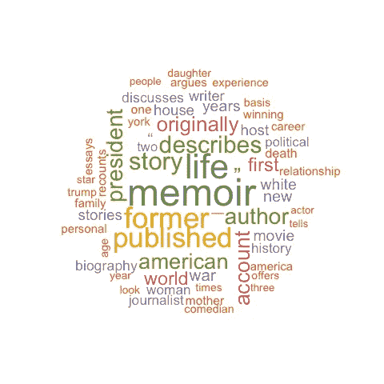**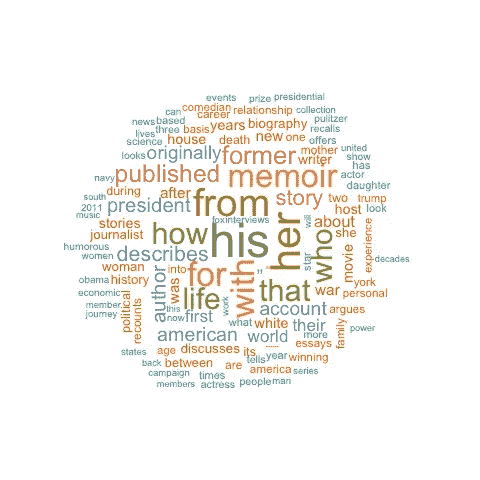

Word Clouds for the Descriptions of Non-Fiction Bestsellers* 

*在非小说中，主角似乎更有可能是男性。 ***他的*** '故事很可能是一个' ***回忆录*** '，一个' ***传记*** '或者干脆是他一生的' ***'记述*** '可能他是一个' ***前******美国******总统*** '。又或许他是一个' ***记者*** '或' ***喜剧演员*** '谁只想' ***告诉*** '他的’***生活******故事*** '对于第一个*'时间。他的书很可能会是' ***'幽默的*** '和' ***政治的*** '。它可能是' ***讨论***'***死亡*** '，' ***关系*** '，' ***家庭*** '或' ***战争*** '。不管是哪种方式，他都一定会挥洒大量笔墨看着' ***'背影*** '，看着他的'*'，讲述他的' ***'个人***'***故事*** '，也许，还会抱怨他的' ***母亲*** '。***

# **最后的想法**

**传统观点认为，媒体主要是由消费者塑造的。尽管如此，阅读小说的人口比例仍在下降，而且越来越以女性为主。此外，互联网颠覆了旧的发行模式，为文学界的所有参与者创造了新的激励。这导致了一些有趣的趋势。小说标题越来越长，而非小说标题却没有。非小说类书籍变得越来越负面，而小说类书籍的趋势更加微妙(黑暗书籍的扩散)。最后，男性和女性在阅读习惯上似乎有所不同。随着我们在文化和政治上的分裂，我们的印刷媒体也应该效仿。**