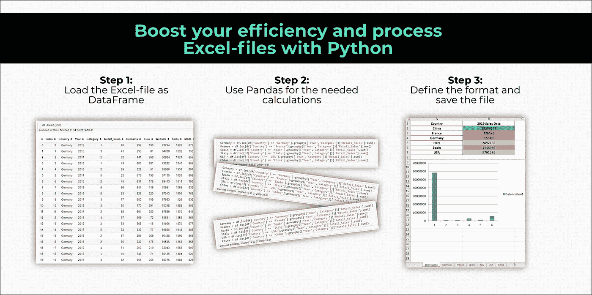
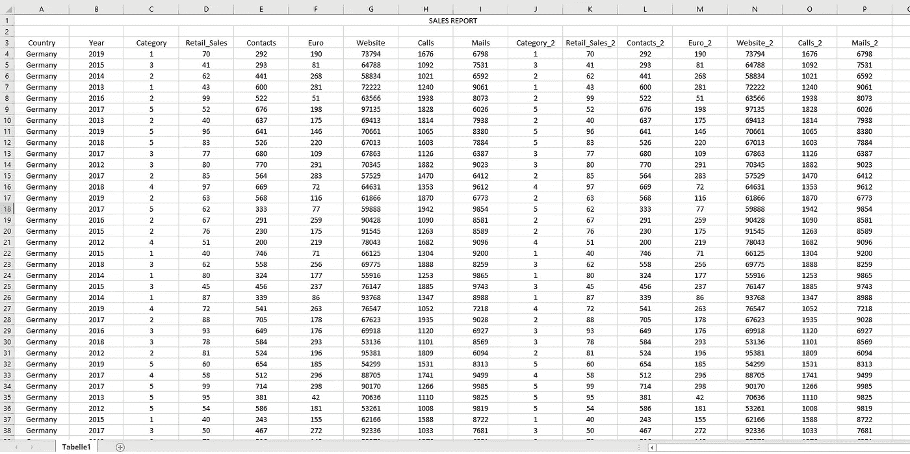
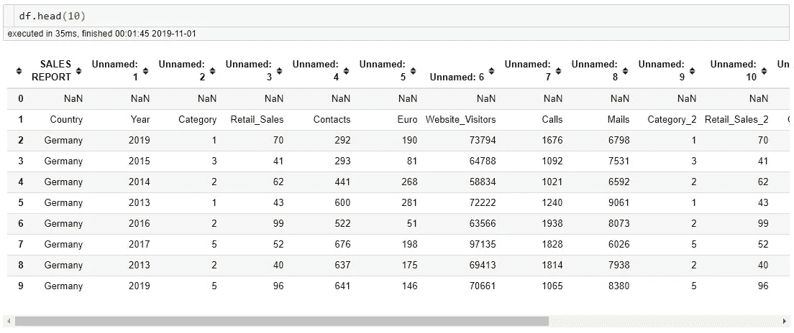
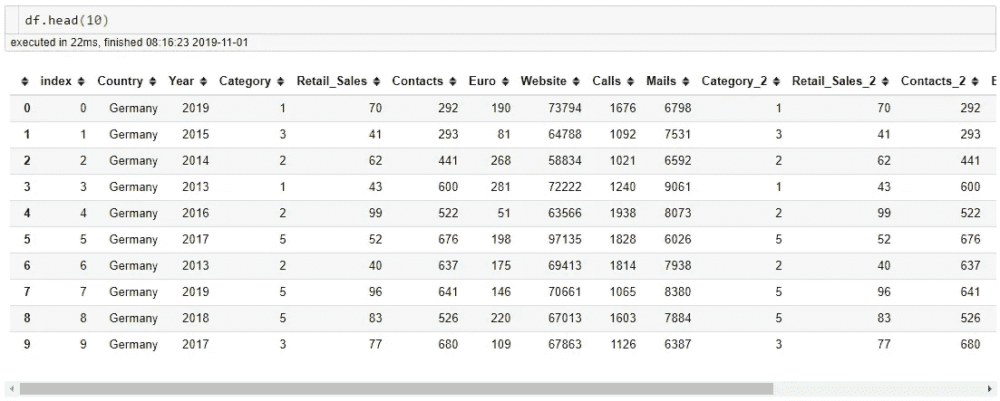
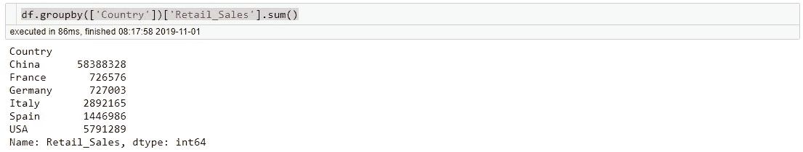
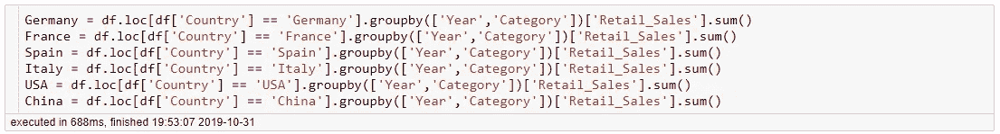
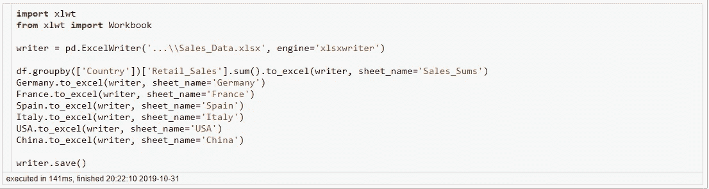
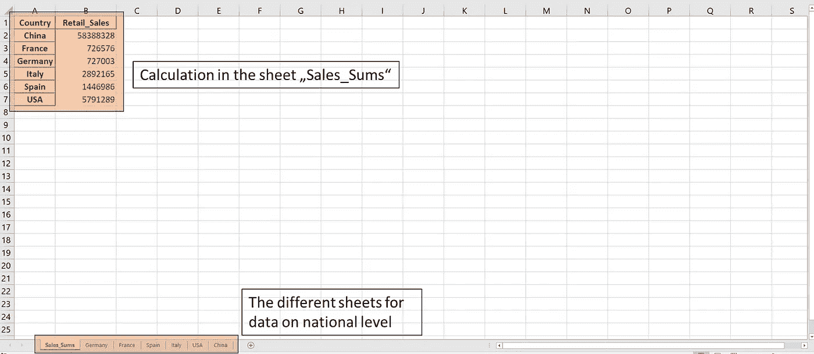
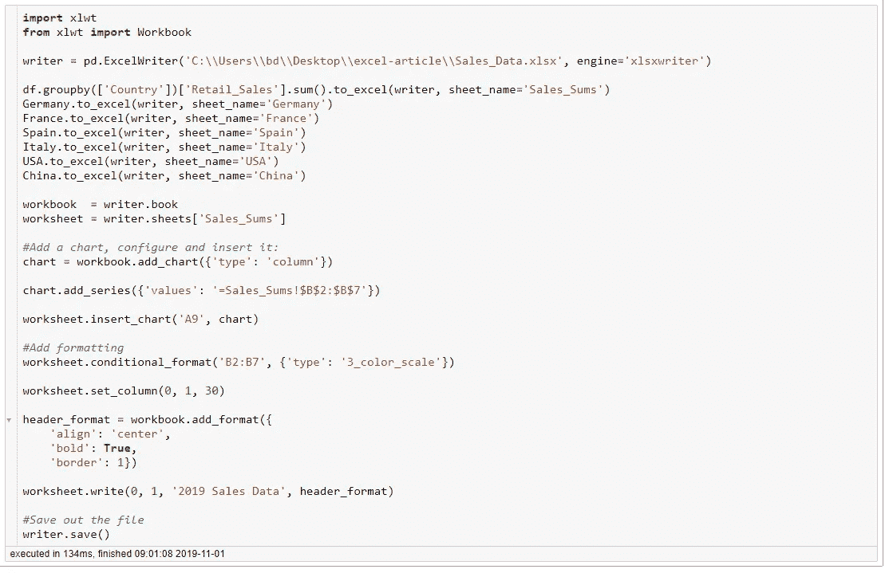
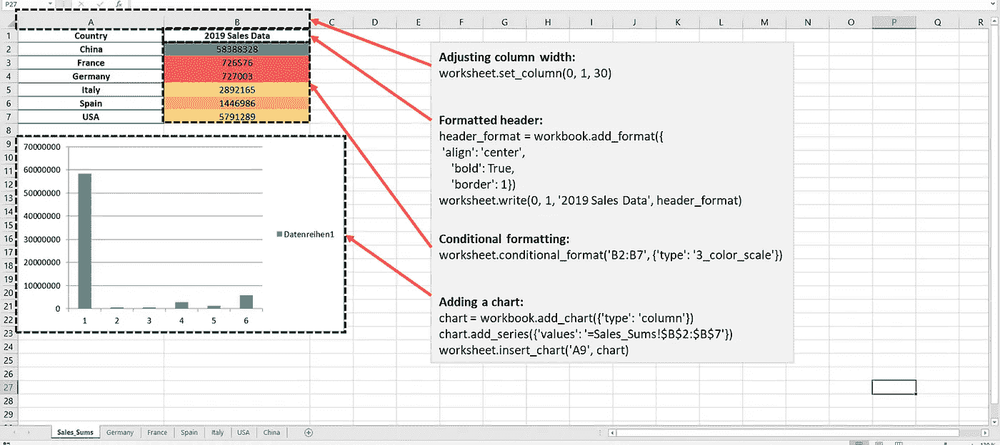

# 使用 Python 提高效率和处理 Excel 文件

> 原文：<https://towardsdatascience.com/boost-your-efficiency-and-process-excel-files-with-python-cae650c85d6c?source=collection_archive---------8----------------------->

## 使用 Python 加载、转换、修改和保存 Excel 文件，以改进您的报告流程



*做数据工作，就会接触 excel。即使你自己不使用它，你的客户或同事也会使用它。Excel 的伟大之处就在于它本身:适用于较小数据集的表格计算。但是我一直很讨厌那种有一百万行几百列的 excel 表格。这种工作簿速度慢，往往在一些计算后崩溃。所以我开始使用 python 来处理大型 excel 文件，这提供了另一个很大的优势:你可以创建可重复的代码并提供文档。让我们跳进来吧！*

## 用 Python 读取 Excel 文件

我们要处理的文件包含近一百万行和 16 列:



Python 提供了`read_excel()`来读取 Excel 文件作为数据帧:

```
import pandas as pd
import numpy as np
df = pd.read_excel(...\\Excel-Tutorial.xlsx')
```



如你所见，到目前为止数据看起来很干净，但我们的列标题似乎是错误的。许多 excel 地图包含标题或其他信息来引导读者。我们可以跳过这部分，定义一个标题行:

```
df = pd.read_excel('…\\Excel-Tutorial.xlsx', header=[1]).reset_index()
```



参数`header=[1]`指定我们希望使用 excel 表格中的第二行作为标题。跳过所有以前的行。

## 用熊猫做一些计算

营销部门的一个典型问题可能是，我们每年在不同国家的销售额是多少:



我们在 86 毫秒内完成了这个计算。用 Python 处理 Excel 文件的一个很大的优点是，任何类型的计算都比在 Excel 中快得多。操作越复杂，速度优势越大。

另一个需求可能是销售部门需要按年份和类别分组的每个国家的数据。因为他们要向全国市场提供数据，我们必须将计算结果保存在不同的工作表中:



## 将结果保存为 Excel

下一步，我们想再次将文件保存为 Excel 格式，以便提供给销售和市场部。我们将创建一个`pd.ExcelWriter`对象并创建不同的工作表:



很容易，不是吗？让我们看看新创建的工作簿:



如你所见，我们的数据帧被正确保存到指定的工作表中。在我们把好的结果发给两个部门后，第二天我们就收到了一封邮件:他们要求一些格式化和可视化。因为我们每个月都必须转换这种数据，所以我们决定也用 Python 来执行这些任务。

## 格式化和可视化

要添加格式和可视化，我们必须再次创建一个 writer 对象:



如您所见，代码的第一部分与第一个示例中的相同。我们创建一个 writer 对象。`xlsxwriter`让我们访问 Excel 的功能，如图表和格式。为了访问这个特性，我们需要获得工作簿对象`workbook = writer.book`和工作表对象`worksheet = writer.sheet['Sales_Sums']`。在本例中，我们将在第一张纸上进行修改。我们添加一个图表，指定数据的范围(`=Sales_Sums!$B$2:$B$7'`)并将其添加到工作表的单元格`A9`中。

同样，我们为销售数据添加格式。我们在范围`B2:B7`上添加了一个 3 色标，以在视觉上突出显示低值或高值。我们还调整了第一列和第二列的宽度`worksheet.set_column(0,1,30)`。我们还格式化了销售数据的列标题，并将其重命名为`2019 Sales Data`。最后一步，我们保存文件:



这个结果比 Excel 好得多，提供了一个很大的优势。下个月我们只需点击一下就能复制出完全相同的文件。

## 结论

Python 非常适合处理 Excel 文件。您可以更轻松地处理大文件，创建可重复的代码，并为您的同事提供文档。我们还看到了我们可以轻松访问 Python 的高级功能。您可以自动化整个报告流程。

## 延伸阅读:

创建图表:

 [## 使用 Pandas 和 XlsxWriter 创建 Excel 图表

### 使用 Pandas 和 XlsxWriter 创建带有图表的 Excel 文件的介绍。

pandas-xlsxwriter-charts . readthedocs . io](https://pandas-xlsxwriter-charts.readthedocs.io/) 

带有熊猫透视的 Excel 报表:

[](https://pbpython.com/pandas-pivot-report.html) [## 从熊猫数据透视表生成 Excel 报表

### 上一篇数据透视表文章描述了如何使用 pandas pivot_table 函数在一个

pbpython.com](https://pbpython.com/pandas-pivot-report.html) 

用 Python 格式化 Excel 文件:

 [## 教程 2:向 XLSX 文件添加格式

### 在上一节中，我们使用 Python 和 XlsxWriter 模块创建了一个简单的电子表格。这转换了…

xlsxwriter.readthedocs.io](https://xlsxwriter.readthedocs.io/tutorial02.html) 

[如果您喜欢中级数据科学，并且尚未注册，请随时使用我的推荐链接加入该社区。](https://medium.com/@droste.benedikt/membership)