# 提升您的图像分类模型

> 原文：<https://towardsdatascience.com/boost-your-image-classifier-e1cc7a56b59c?source=collection_archive---------12----------------------->

## 提高分类器准确性的技巧

图像分类被认为是一个即将解决的问题。有趣的部分是当你不得不使用你所有的狡猾来获得额外的 1%的准确性。我在参加 Analytics Vidhya 主办的 [*英特尔场景分类挑战赛时遇到过这样的情况。我非常喜欢这场比赛，因为我试图从我的深度学习模型中提取所有的汁液。下面的技术通常可以应用于手头的任何图像分类问题。*](https://datahack.analyticsvidhya.com/contest/practice-problem-intel-scene-classification-challe/)

# 问题

问题是将给定的图像分为 6 类

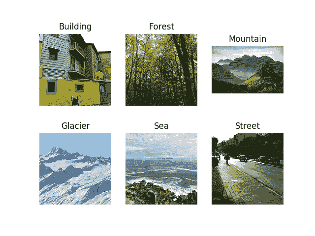

Data Classes

我们收到了来自世界各地的各种自然场景的 **~25K** 图片

# 渐进调整大小

它是一种技术，在训练 CNN 从较小到较大的图像尺寸的同时，顺序地调整所有图像的尺寸。渐进调整在他精彩的 *fastai* 课程“程序员实用深度学习*”中有简要描述。使用这种技术的一个很好的方法是使用较小的图像大小(比如 64x64)训练一个模型，然后使用该模型的权重在 128x128 等大小的图像上训练另一个模型。每个较大比例的模型在其架构中结合了先前较小比例的模型层和权重。*

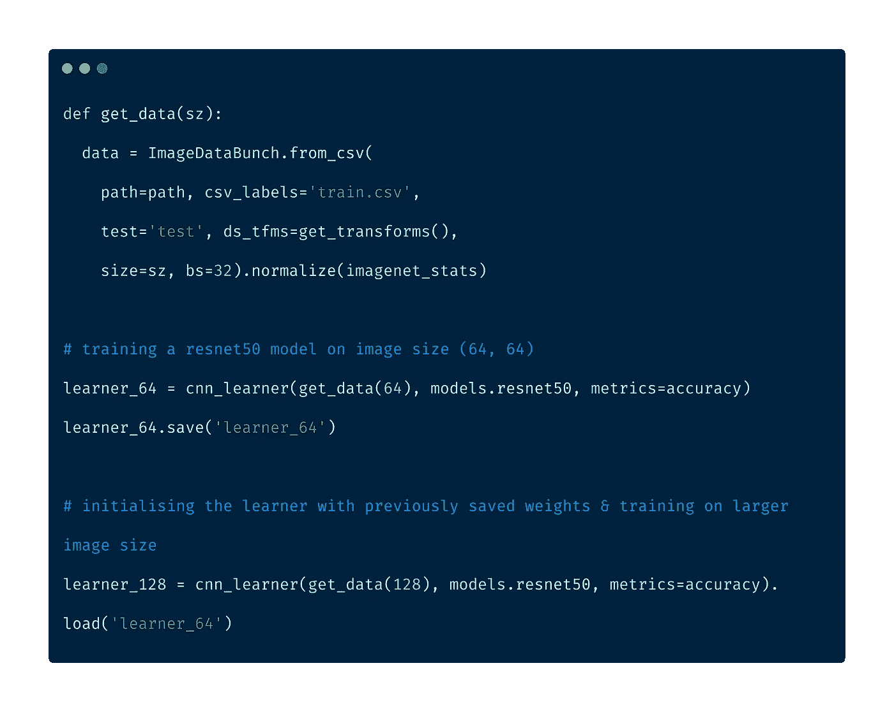

Progressive Resizing

# 法斯泰

fastai 库是一个强大的深度学习库。如果 FastAI 团队发现一篇特别有趣的论文，他们会在不同的数据集上进行测试&研究如何对其进行调整。一旦成功，它将被纳入他们的图书馆，并随时可供其用户使用。该库包含许多内置的艺术(SOTA)技术。fastai 建立在 pytorch 类型的基础上，对于大多数任务(如果不是所有任务的话)都有很好的默认参数。一些技术是

1.  循环学习率
2.  单周期学习
3.  结构化数据的深度学习

# 合理权重初始化

在检查可用的标准数据集时，我偶然发现了 Places365 数据集。Places365 数据集包含来自 365 个场景类别的 180 万幅图像。挑战中提供的数据集与该数据集非常相似，因此在该数据集上训练的模型已经学习了与我们自己的分类问题相关的特征。因为我们问题中的类别是 Places365 数据集的子集，所以我使用了用 places365 权重初始化的 ResNet50 模型。

型号砝码以 [pytorch 砝码](https://github.com/CSAILVision/places365)的形式提供。下面的实用函数帮助我们将数据正确地加载到 *fastai* 的 CNN 学习器中。

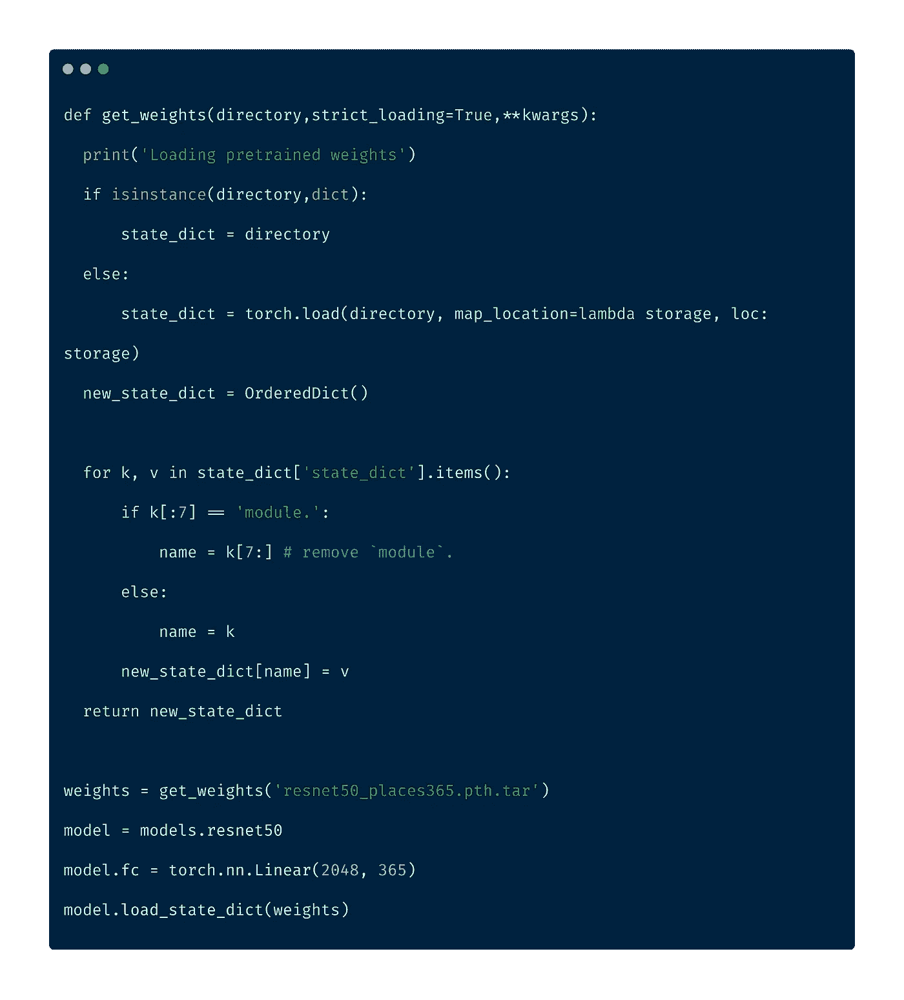

# 混合增强

混合增强是一种增强类型，其中我们通过两个现有图像的加权线性插值来形成新图像。我们取两幅图像，根据它们的张量对它们进行线性组合。

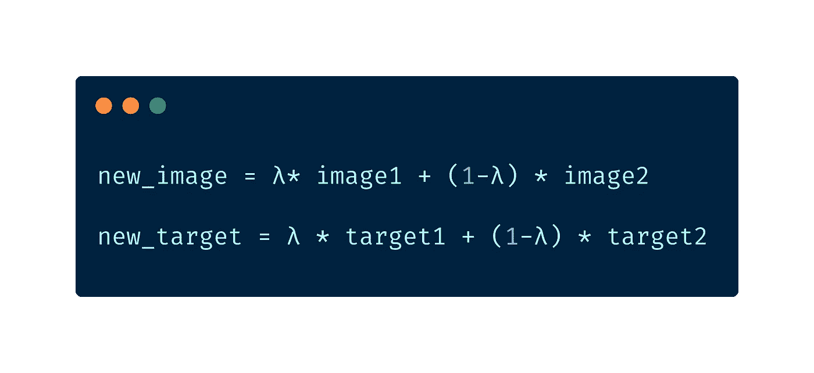

Mixup Augmentation

λ是从贝塔分布中随机抽样的。尽管[论文](https://arxiv.org/abs/1710.09412)的作者建议使用λ=0.4，但是 *fastai* 库中的默认值被设置为 0.1

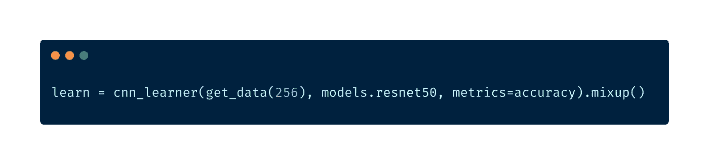

Mixup Augmentation in fastai

# **学习速率调谐**

学习率是训练神经网络最重要的超参数之一。 *fastai* 有办法找出一个合适的初始学习率。这种技术被称为*循环学习率，*我们以较低的学习率进行试验&以指数方式增加学习率，记录下学习过程中的损失。然后我们绘制损失与学习率的关系图&选择损失最大的学习率。

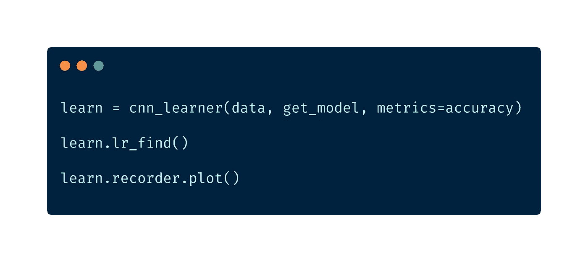

LR finder in fastai

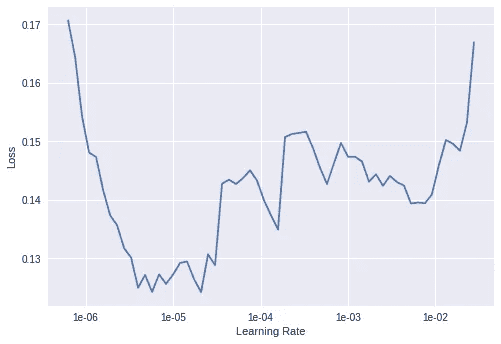

Loss is steepest at 1e-06

该库还为我们自动处理带重启(SGDR)的随机梯度下降。在 SGDR，学习率在每个时期开始时被重置为最初选择的值，该值随着时期减少，如在*余弦退火*中。这样做的主要好处是，由于学习率在每个时期开始时被重置，学习者能够跳出局部最小值或可能陷入的鞍点。

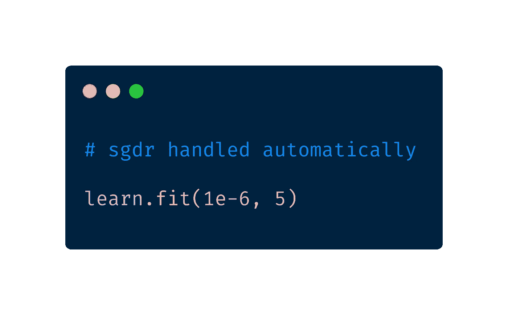

SGDR in fastai

# 一般敌对网络

gan 是 Ian Goodfellow 在 2014 年推出的。gan 是由两个网络组成的深度神经网络架构，两个网络相互对立。GANs 可以模拟任何数据分布。他们可以学习生成与任何领域的原始数据相似的数据——图像、语音、文本等。我们使用 fast.ai 的 Wasserstein GAN 实现来生成更多的训练图像。

GANs 涉及训练两个神经网络，一个称为*生成器*，它生成新的数据实例，而另一个称为*鉴别器*评估它们的真实性，它决定每个数据实例是否属于实际的训练数据集。你可以在这里查阅更多关于它的[。](https://github.com/fastai/course-v3/blob/master/nbs/dl1/lesson7-wgan.ipynb)

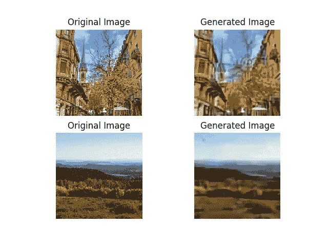

GAN generated sample images

# **去除混淆图像**

> 训练神经网络的第一步是根本不接触任何神经网络代码，而是从彻底检查你的数据开始。这一步至关重要。我喜欢花大量的时间(以小时为单位)浏览数以千计的例子，理解它们的分布并寻找模式。
> 
> -安德烈·卡帕西

正如安德烈·卡帕西所说，“数据调查”是重要的一步。根据数据调查，我发现有一些图像包含 2 个或更多的类。

> 方法 1

使用以前训练的模型，我对整个训练数据进行预测。然后丢弃那些预测不正确但概率得分大于 0.9 的图像。这些是模型明显分类错误的图像。深入调查后，我发现这些图片被贴标签的人贴错了标签。

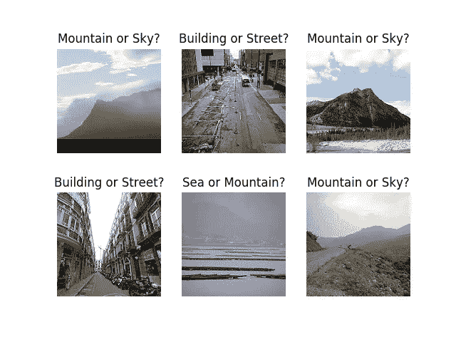

Confusing Images

我还从训练集中删除了那些预测概率在 0.5 到 0.6 范围内的图像，理论上图像中可能存在不止一个类别，因此模型为每个类别分配了大致相等的概率。通过观察这些图像，这个理论最终被证明是正确的

> 方法 2

fast.ai 提供了一个方便的小部件“图像清理器小部件”，允许您为模型清理和准备数据。ImageCleaner 用于清理不属于数据集的图像。它连续渲染图像，并让您有机会从文件系统中删除该文件。

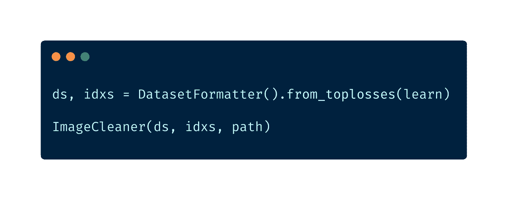

# **测试时间增加**

测试时间增强包括获取原始图像的一系列不同版本，并通过模型传递它们。然后从不同版本计算平均输出，并作为图像的最终输出。

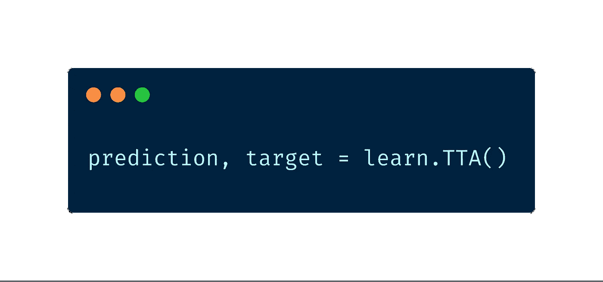

Test Time Augmentation in fastai

以前也使用过一种类似的技术，叫做 10 作物测试。我第一次在 [ResNet](https://arxiv.org/pdf/1512.03385.pdf) 报纸上读到关于 10 作物技术的报道。10 裁剪技术包括沿着四个角裁剪原始图像，沿着中心裁剪一次，得到 5 个图像。对它的倒数重复同样的操作，得到另外 5 幅图像，总共 10 幅图像。然而，测试时间增加比 10 作物技术更快

# 组装

机器学习中的集成是一种使用多种学习算法来获得比单一算法更好的预测性能的技术。组装效果最好

1.  组成模型具有不同的性质。例如，将 ResNet50 和 InceptionNet 组合起来会比将 ResNet50 和 ResNet34 组合起来有用得多，因为它们在本质上是不同的
2.  成分模型具有较低的相关性
3.  改变每个模型的训练集；所以会有更多的变化

在这种情况下，我通过选择最大发生类来整合所有模型的预测。如果有一个以上的类出现次数最多，我会随机选择其中一个类。

# **结果**

> 公共排行榜—排名 29 (0.962)
> 
> 私人排行榜—排名 22 (0.9499)

# **结论**

1.  渐进调整大小是一个很好的开始。
2.  必须花时间理解你的数据并将其可视化。
3.  一个伟大的深度学习库，如 fastai，带有合理的初始化参数，肯定会有所帮助。
4.  尽可能随时随地使用迁移学习，因为它通常会带来好的结果。最近，深度学习&迁移学习甚至被应用于结构化数据，所以迁移学习绝对应该是首先尝试的。
5.  像混音增强，TTA，循环 LR 等最先进的技术肯定会帮助你提高 1%或 2%的准确率。
6.  始终搜索与您的问题相关的数据集&如果可能的话，将它们包含在您的训练数据中。如果存在在这些数据集上训练的深度学习模型，则使用它们的权重作为模型的初始权重。