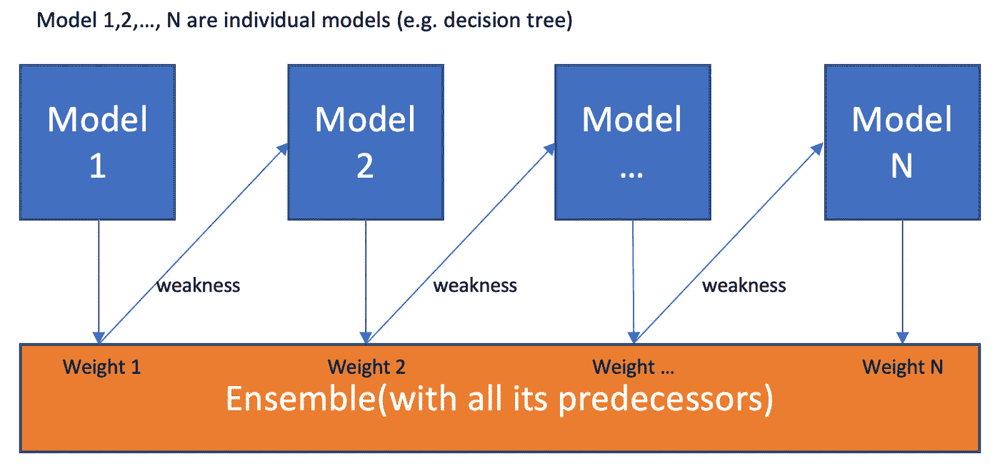
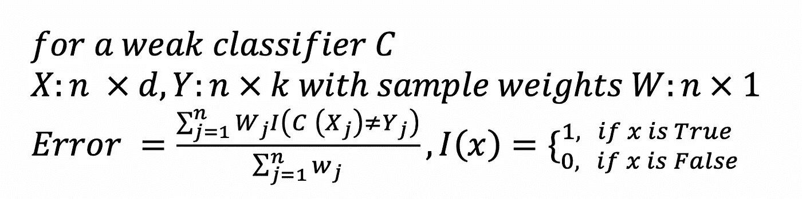
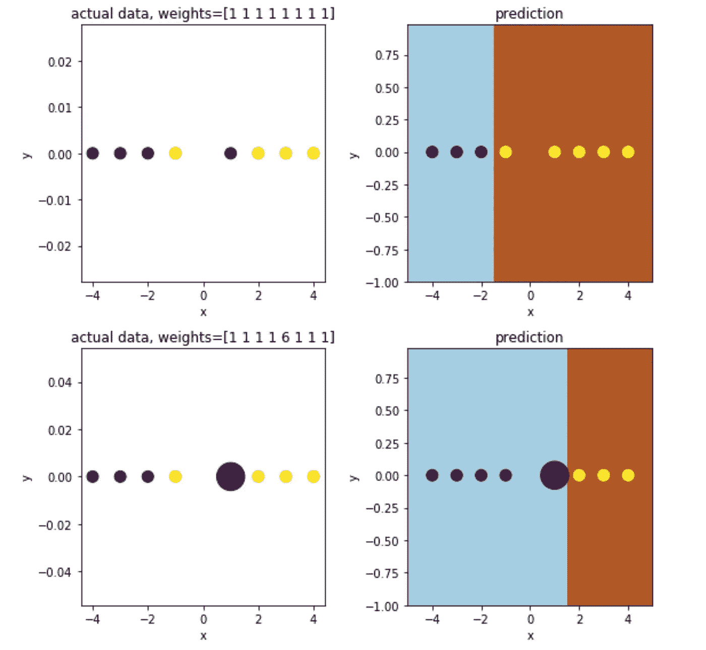
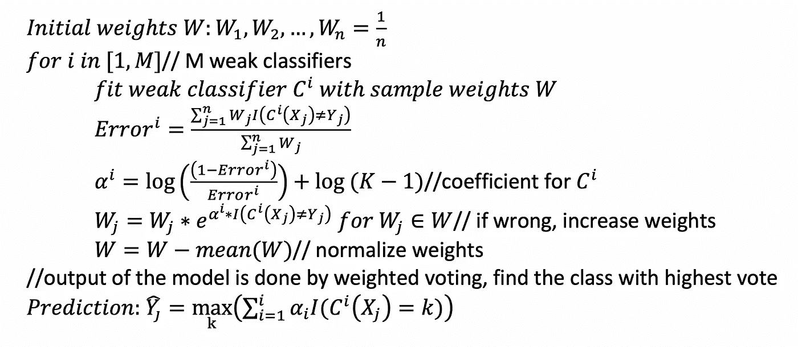
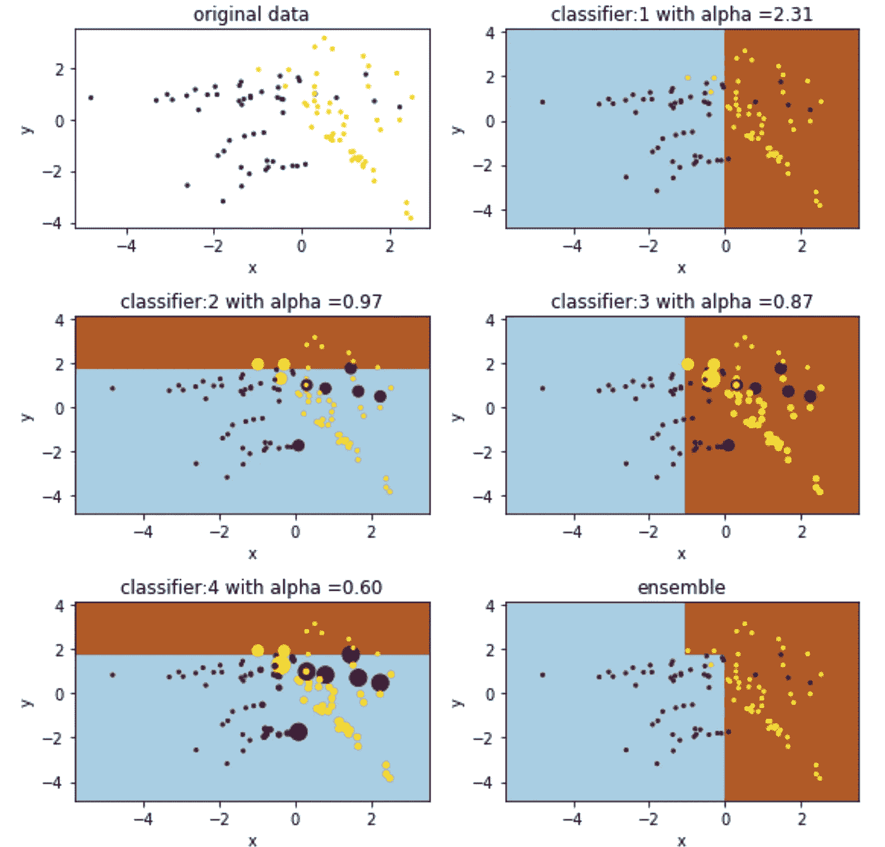
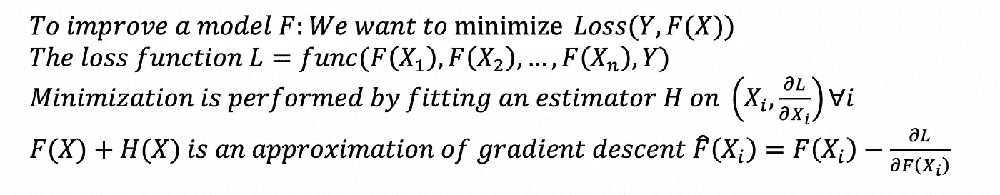
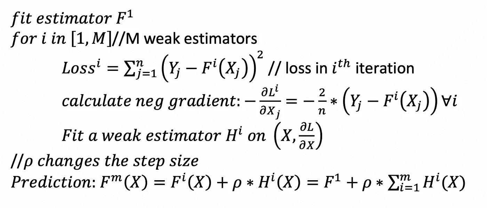
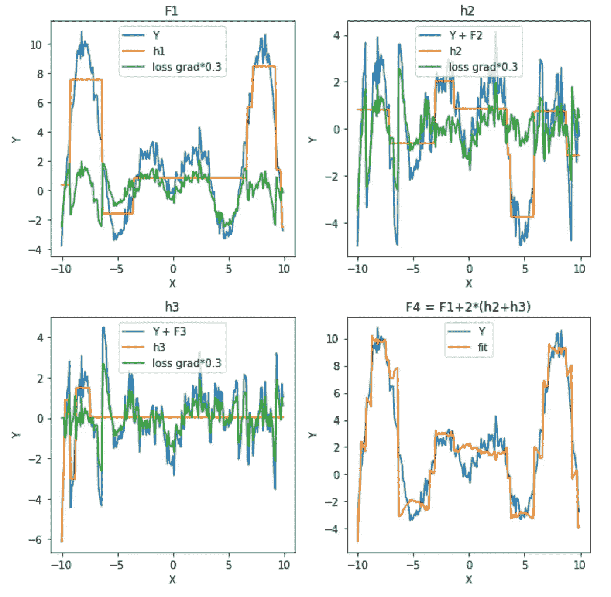
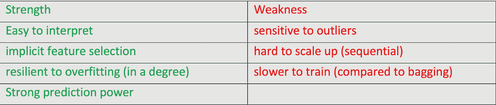

# 增压算法解释

> 原文：<https://towardsdatascience.com/boosting-algorithms-explained-d38f56ef3f30?source=collection_archive---------2----------------------->

## 理论、实现和可视化

与许多关注单个模型完成的高质量预测的 ML 模型不同，boosting 算法试图通过训练一系列弱模型来提高预测能力，每个弱模型补偿其前任的弱点。

One is weak, together is strong, learning from past is the best

要理解 Boosting，关键是要认识到 boosting **是一个通用算法，而不是一个特定的模型**。Boosting 需要您指定一个弱模型(例如回归、浅层决策树等)，然后对其进行改进。

解决了这个问题，是时候探索弱点的不同定义和相应的算法了。我将介绍两种主要算法:自适应增强(AdaBoost)和梯度增强。

# 1.adaboost 算法

## 1.1 弱点的定义

AdaBoost 是一种专门为分类问题开发的提升算法(也称为离散 AdaBoost)。弱点由弱估计量的误差率来识别:

在每次迭代中，AdaBoost 识别错误分类的数据点，增加它们的权重(在某种意义上，减少正确点的权重)，以便下一个分类器将额外注意使它们正确。下图说明了权重如何影响简单决策树桩(深度为 1 的树)的性能

How sample weights affect the decision boundary

现在确定了弱点，下一步是找出如何组合模型序列，使整体随着时间的推移变得更强。

## 1.2 伪代码

研究人员提出了几种不同的算法。这里我将介绍最流行的方法 SAMME，这是一种处理多分类问题的特定方法。(【朱，】邹，S. Rosset，T. Hastie，“多级 AdaBoost”，2009 )。

AdaBoost 使用增强的样本权重训练一系列模型，根据误差为各个分类器生成“置信度”系数α。低误差导致大α，这意味着在投票中更高的重要性。

the size of dots indicates their weights

## 1.3 Python 中的实现

Scikit-Learn 通过 [SAMME](https://web.stanford.edu/~hastie/Papers/samme.pdf) (多分类的特定算法)提供了 AdaBoost 的一个很好的实现。

> 参数: **base_estimator** :对象，可选(默认=无)
> 
> 构建增强系综的基本估计量。如果`None`，则基本估计量为`DecisionTreeClassifier(max_depth=1)`
> 
> **n_estimators** :整数，可选(默认值=50)
> 
> 增强终止时估计器的最大数量。在完美匹配的情况下，学习过程会提前停止。
> 
> **learning_rate** : float，可选(默认=1。)
> 
> 学习率将每个分类器的贡献缩小`learning_rate`。
> 
> **算法** : {'SAMME '，' SAMME。R'}，可选(default='SAMME。r’)
> 
> 如果是萨姆。那就用 SAMME。r 实升压算法。`base_estimator`必须支持类别概率的计算。如果是“SAMME ”,则使用 SAMME 离散增强算法。
> 
> **random_state** : int，RandomState instance 或 None，可选(默认为 None)

# 2.梯度推进

## 2.1 弱点的定义

梯度推进解决问题的方式有所不同。梯度增强不是调整数据点的权重，而是关注预测和实际情况之间的差异。

weakness is defined by gradients

## 2.2 伪代码

梯度增强需要微分损失函数，并且适用于回归和分类。我将使用一个简单的最小二乘法作为损失函数(用于回归)。[分类](http://www.ccs.neu.edu/home/vip/teach/MLcourse/4_boosting/slides/gradient_boosting.pdf)的算法也有同样的想法，但是数学稍微复杂一些。( [J. Friedman，贪婪函数逼近:梯度推进机](https://statweb.stanford.edu/~jhf/ftp/trebst.pdf))

Gradient Boosting with Least Square

以下是弱估计量 H 如何随时间推移而建立的可视化。每次我们将新的估计量(在这种情况下，max_depth =3 的回归树)拟合到损失梯度(在这种情况下，LS)。

gradient is scaled down for visualization purpose

## 2.3 Python 中的实现

同样，你可以在 Scikit-Learn 的[库](https://scikit-learn.org/stable/modules/generated/sklearn.ensemble.GradientBoostingRegressor.html)中找到渐变提升函数。

> 回归:
> 
> **损失** : {'ls '，' lad '，' huber '，'分位数' }，可选(默认='ls ')
> 
> 分类:
> 
> **损失** : { '偏差'，'指数' }，可选(默认= '偏差')
> 
> 其余的都一样
> 
> **learning_rate** : float，可选(默认值=0.1)
> 
> **n_estimators** : int(默认值=100)
> 
> 梯度增强对过拟合相当稳健，因此较大的数量通常会产生更好的性能。
> 
> **子样本**:浮点型，可选(默认值=1.0)
> 
> 用于拟合单个基础学习者的样本分数。如果小于 1.0，这将导致随机梯度增强。`subsample`与参数`n_estimators`交互。选择`subsample < 1.0`会导致方差减少，偏差增加。
> 
> **标准**:字符串，可选(default="friedman_mse ")
> 
> 衡量分割质量的函数。

# 优势和劣势

1.  易于解释:boosting 本质上是一个集合模型，因此很容易解释它的预测
2.  预测能力强:通常 boosting > bagging (random forrest)>决策树
3.  适应过度拟合:[见本文](https://jeremykun.com/2015/09/21/the-boosting-margin-or-why-boosting-doesnt-overfit/)
4.  对异常值敏感:由于每个弱分类器都致力于修复其前任的缺点，因此该模型可能会过于关注异常值
5.  难以扩展:因为每个评估器都是建立在它的前辈之上的，所以这个过程很难并行化。

# **总结**

助推算法代表了一种不同的机器学习视角:将一个弱模型变成一个更强的模型，以修复其弱点。现在您已经了解了 boosting 的工作原理，是时候在实际项目中尝试一下了！