# 升压和 AdaBoost 解释清楚

> 原文：<https://towardsdatascience.com/boosting-and-adaboost-clearly-explained-856e21152d3e?source=collection_archive---------2----------------------->

Time to visualize the full iceberg !

## 直观的解释

助推技术最近在 Kaggle 竞赛和其他预测分析任务中有所上升。我会尽量解释清楚 Boosting 和 AdaBoost 的概念。最初的文章发表在我的个人博客上:[https://maelfabien.github.io/machinelearning/adaboost/](https://maelfabien.github.io/machinelearning/adaboost/)

在本文中，我们将讨论:

*   快速回顾一下装袋
*   装袋的极限
*   增压的详细概念
*   计算中的升压效率
*   代码示例

我最近为我正在关注和/或构建的一些教程创建了一个专门的 GitHub 库。我还添加了 ML recaps:

https://github.com/maelfabien/Machine_Learning_Tutorials

# 一、装袋的局限性

接下来，考虑一个二元分类问题。我们要么将观察分类为 0，要么分类为 1。这不是文章的目的，但为了清楚起见，让我们回忆一下装袋的概念。

Bagging 是一种代表“引导聚合”的技术。本质是选择 T 个 bootstrap 样本，在这些样本中的每一个上安装一个分类器，并并行训练模型。通常，在随机森林中，决策树是并行训练的。所有分类器的结果然后被平均到一个装袋分类器中:

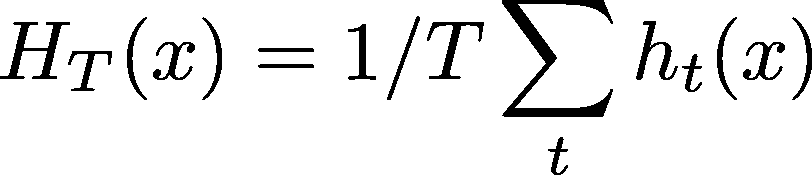

Formula for a Bagging Classifier

这个过程可以用下面的方式来说明。让我们考虑 3 个分类器，它们产生一个分类结果，可能是对的，也可能是错的。如果我们绘制 3 个分类器的结果，那么在某些区域分类器会出错。这些区域用红色表示。

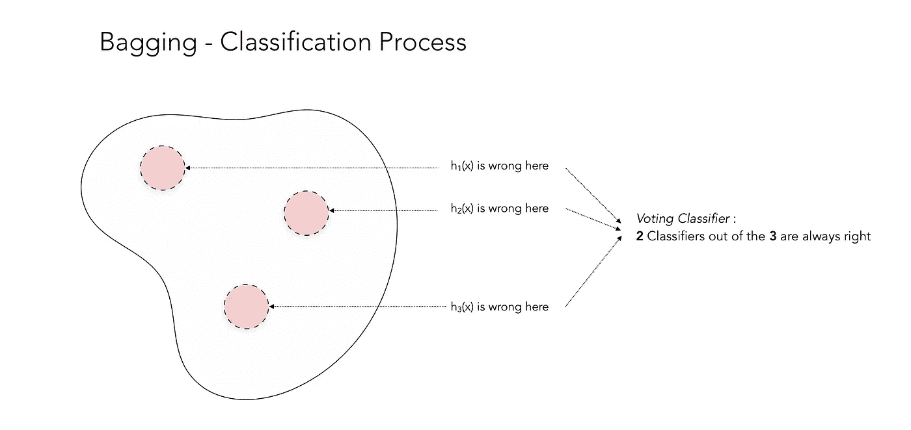

Example case in which Bagging works well

这个例子非常完美，因为当一个分类器错误时，另外两个是正确的。通过投票分类器，你获得了很大的准确性！但是正如你可能猜到的，当所有的分类器在相同的区域出错时，也有 Bagging 不能正常工作的情况。

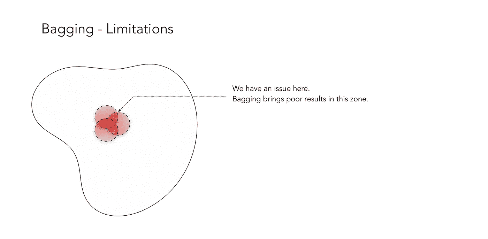

出于这个原因，发现助推背后的直觉如下:

*   我们需要依次训练模型，而不是训练并行模型
*   并且每个模型应该关注先前分类器表现差的地方

# 二。升压简介

# a.概念

上述直觉可以这样描述:

*   在整套设备上训练 h1 型
*   使用 h1 表现不佳的区域的夸大数据来训练模型 h2
*   用 h1 ≠ h2 的区域的夸大数据训练模型 h3
*   …

我们可以按顺序训练模特**，而不是按**平行**训练模特。这就是助推的本质！**

Boosting 通过随时间调整误差度量来训练一系列低性能算法，称为弱学习器。弱学习者是错误率略低于 50%的算法，如下图所示:

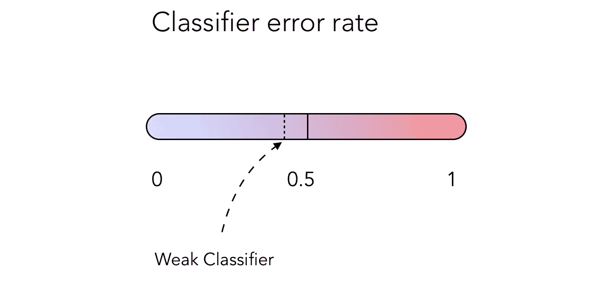

A weak classifier, achieving just under 50% error rate

# b.加权误差

我们如何实现这样的分类器？通过在整个迭代中加权误差！这将给予先前分类器表现不佳的区域更多的权重。

让我们考虑 2D 图上的数据点。他们中的一些会被很好地分类，其他的不会。通常，当计算错误率时，归因于每个错误的权重是 1/n，其中 n 是要分类的数据点的数量。

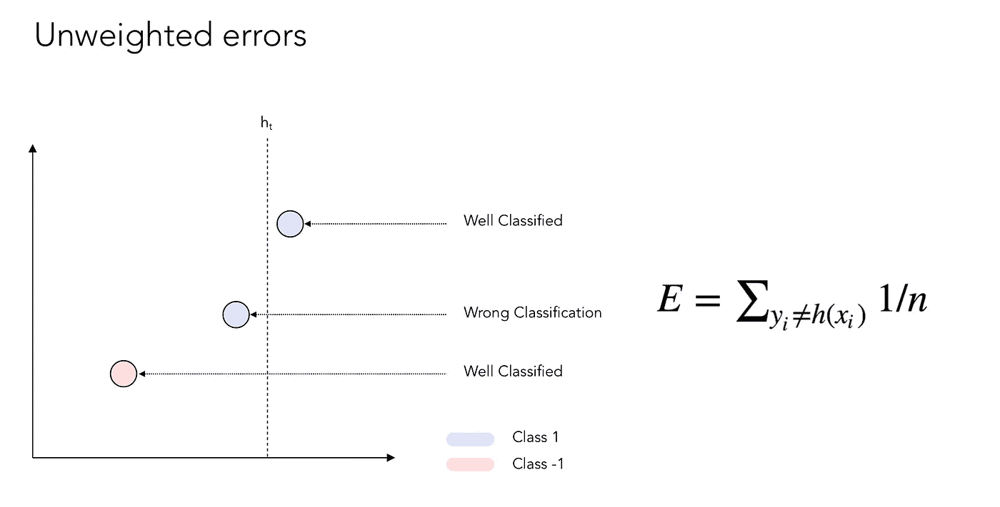

Unweighted Errors

现在，如果我们对误差施加一些权重:

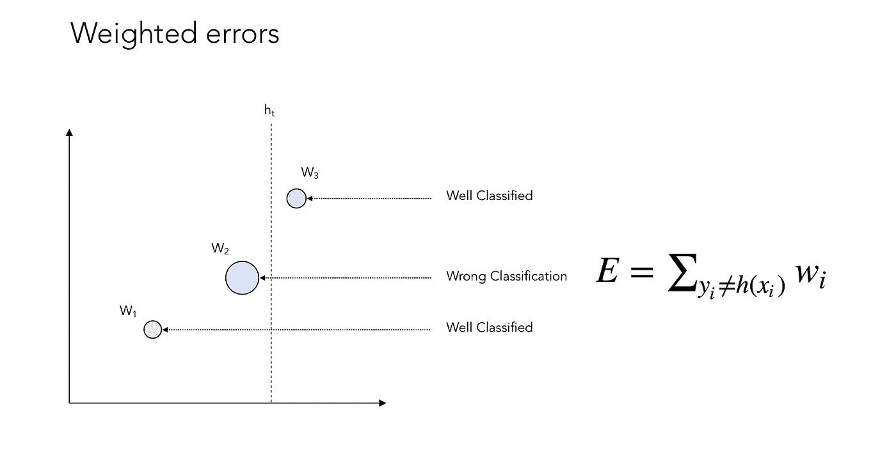

Weighted Errors

您现在可能会注意到，我们对没有很好分类的数据点给予了更多的权重。下面是加权过程的一个示例:

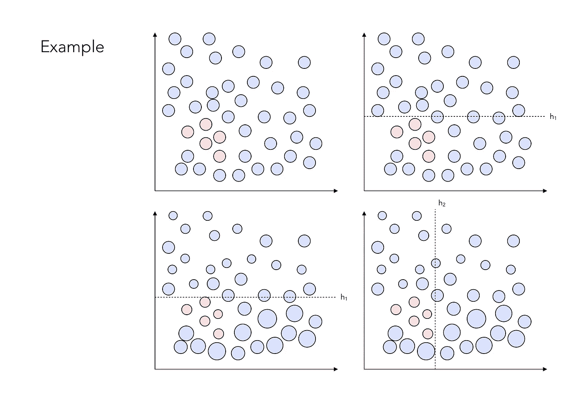

Example of weighting process

最后，我们希望构建一个强大的分类器，可能如下所示:

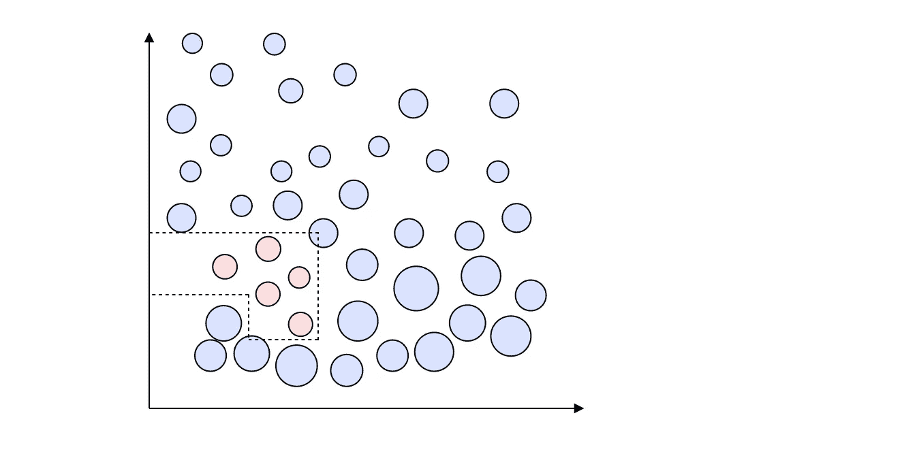

Strong Classifier

# c.树桩

你可能会问，一个人应该实现多少个分类器才能让它正常工作？每一步是如何选择每个分类器的？

答案就在所谓树桩的定义里！树桩定义了一个一级决策树。主要思想是，在每一步，我们想找到最佳的树桩，即最佳的数据分割，使总误差最小化。你可以把一个树桩看做一个测试，其中的假设是，位于一侧的所有东西都属于 1 类，位于另一侧的所有东西都属于 0 类。

树桩可能有多种组合。让我们看看在这个简单的例子中有多少种组合？让我们花一分钟来数一数。

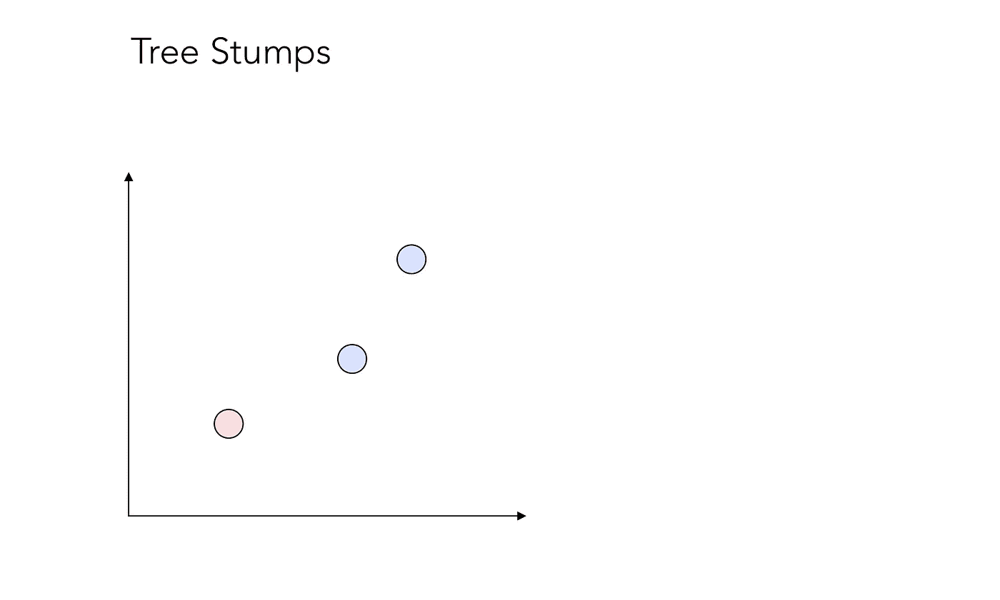

3 data points to split

嗯，答案是……12！这可能看起来令人惊讶，但却很容易理解。

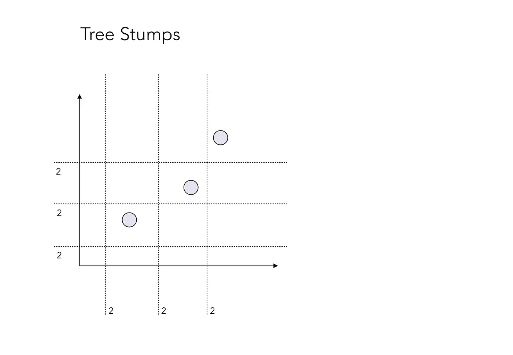

12 Stumps

我们可以进行 12 种可能“测试”。每条分隔线边上的“2”简单地表示这样一个事实，即在一边上的所有点可能属于类 0 或类 1。因此，有两个测试嵌入其中。

在每次迭代 t 时，我们将选择 ht，即通过最大程度地降低总体错误率来最好地分割数据的弱分类器。回想一下，差错率是一个修改后的差错率版本，它考虑了之前介绍的内容。

# d.寻找最佳分割

如上所述，通过在每次迭代 t 识别最佳弱分类器 ht，通常是具有 1 个节点和 2 个叶子(树桩)的决策树，找到最佳分裂。假设我们试图预测一个想借钱的人是否会是一个好的还款人:

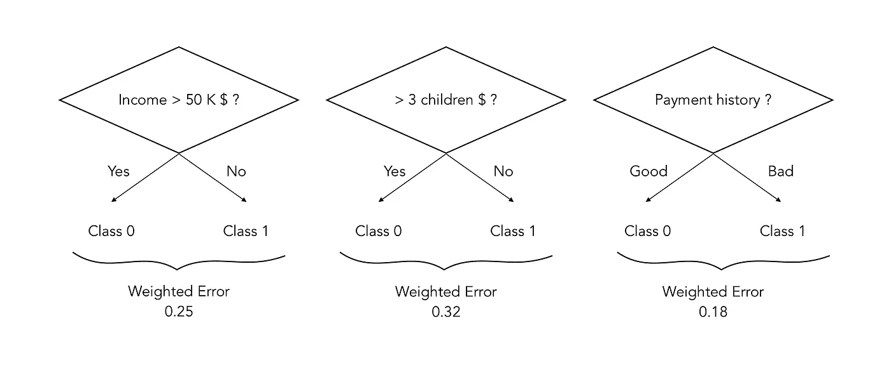

Identifying the best split

在这种情况下，在时间 t 的最佳分割是保留支付历史，因为这种分割产生的加权误差最小。

请注意，像这样的决策树分类器实际上可能比简单的树桩更深。这将是一个超参数。

# e.组合分类器

下一个逻辑步骤是将分类器组合成一个符号分类器，根据一个点将位于边界的哪一侧，它将被分类为 0 或 1。这可以通过以下方式实现:

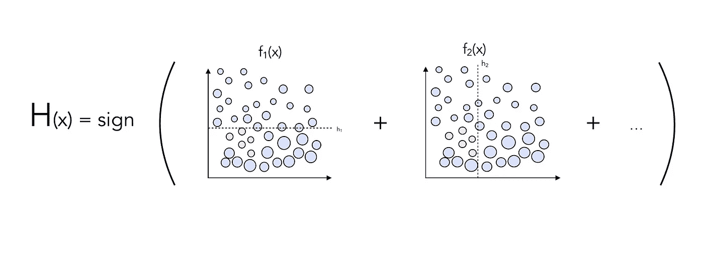

Combining classifiers

你认为有可能改进分类器的方法吗？

通过在每个分类器上增加权重，避免对不同的分类器给予相同的重要性。

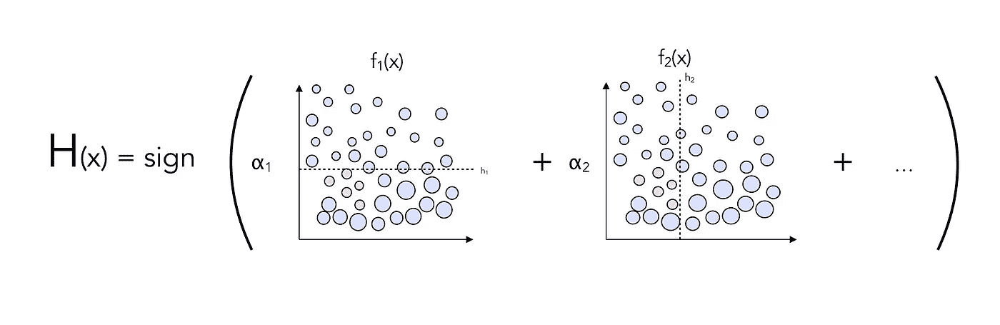

AdaBoost

# f.包装它

让我们用一小段伪代码来总结一下到目前为止我们所介绍的内容。

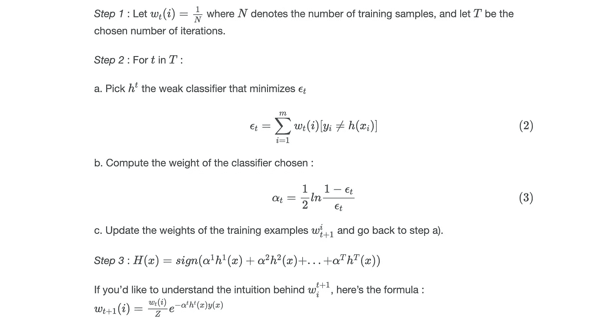

Pseudo-Code

需要记住的关键要素是:

*   z 是一个常量，它的作用是将权重归一化，使它们加起来等于 1！
*   αt 是我们应用于每个分类器的权重

我们完事了。这个算法叫做 **AdaBoost** 。为了完全理解所有的升压方法，这是需要理解的最重要的算法。

# 三。计算

Boosting 算法训练起来相当快，这很好。但是既然我们考虑了每一个可能的残肢并且递归地计算指数，为什么它们训练起来很快呢？

好吧，这就是奇迹发生的地方。如果我们适当地选择αt 和 Z，那么在每一步应该改变的权重简化为:

Weights after choice of α and Z

这是一个非常强的结果，并且它与权重应该随着迭代而变化的说法不矛盾，因为被错误分类的训练样本的数量下降了，并且它们的总权重仍然是 0.5！

*   没有要计算的 Z
*   没有α
*   无指数

还有另一个技巧:任何试图分割两个分类良好的数据点的分类器都不会是最佳的。甚至不需要计算。

# 四。我们来编码吧！

现在，我们将通过一个手写数字识别的简单例子来快速了解如何在 Python 中使用 AdaBoost。

现在让我们加载数据:

x 包含长度为 64 的数组，这些数组是简单的扁平 8×8 图像。这个数据集的目的是识别手写数字。让我们来看看一个给定的手写数字:

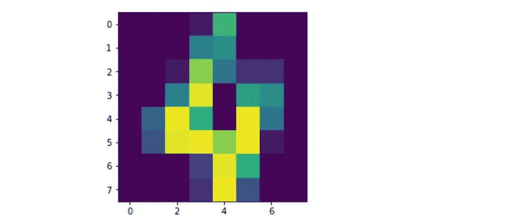

8x8 image of a handwritten “4”

如果我们坚持深度为 1(树桩)的决策树分类器，下面是如何实现 AdaBoost 分类器:

它应该会取得 26%左右的成绩，这一成绩还有很大的提高空间。关键参数之一是顺序决策树分类器的深度。准确性如何随着决策树的深度而提高？

在这个简单的例子中，深度为 10 时达到最高得分，准确率为 95.8%。

# 四。结论

已经讨论过 AdaBoost 是否过拟合。最近，它被证明在某些点上过度拟合，人们应该意识到这一点。AdaBoost 也可以用作回归算法。

AdaBoost 广泛用于人脸检测，以评估视频中是否有人脸。关于这个话题我很快会再做一篇文章！在下一篇文章中，我们还将介绍渐变提升:)

*我希望这篇文章清楚地介绍了 AdaBoost 的概念，并且现在对你来说已经很清楚了。如果您有任何问题或评论，请不要犹豫，发表评论。*

参考资料:

[1][https://www . coursera . org/lecture/ml-classification/learning-boosted-decision-stumps-with-AdaBoost-bx5YA](https://www.coursera.org/lecture/ml-classification/learning-boosted-decision-stumps-with-adaboost-bx5YA)

[2][https://ru . coursera . org/lecture/ml-class ification/learning-boosted-decision-stumps-with-AdaBoost-bx5YA](https://ru.coursera.org/lecture/ml-classification/learning-boosted-decision-stumps-with-adaboost-bx5YA)

[3]https://www.youtube.com/watch?v=UHBmv7qCey4