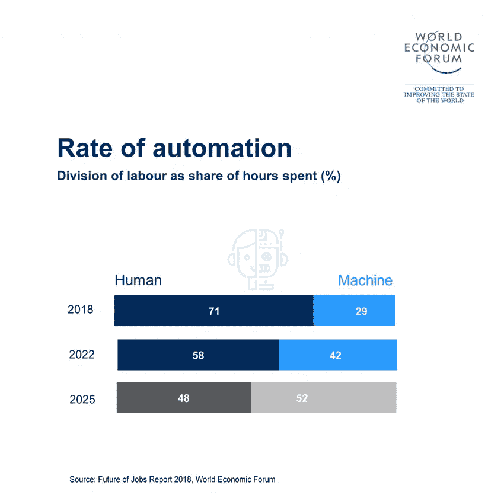
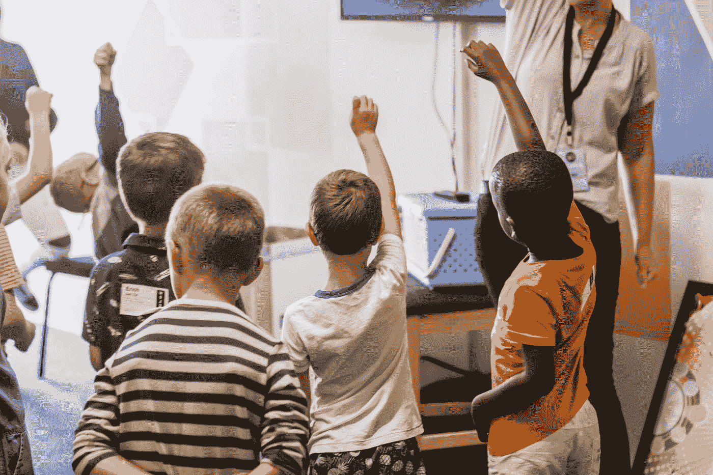

# 使用人工智能提升我们的教育系统和劳动力

> 原文：<https://towardsdatascience.com/boosting-our-educational-system-and-our-workforce-using-ai-a676afacb9cd?source=collection_archive---------24----------------------->

Photo by [Ian Schneider](https://unsplash.com/@goian?utm_source=medium&utm_medium=referral) on [Unsplash](https://unsplash.com?utm_source=medium&utm_medium=referral)

在任何国家，最重要的资源是人力资本。熟练的劳动力和运转良好的教育体系是高附加值服务的基础。随着人工智能的扩散，我们预计现有的工作实践将被打破，从而不仅创造新的机会，也带来新的挑战。

在过去的一年里，我们看到了很多预测。一些专家预测，在未来几年，大约 40%的工作岗位将会消失。其他人说人工智能革命将创造[数百万个新岗位](http://www3.weforum.org/docs/WEF_Future_of_Jobs_2018.pdf)，其中一些甚至还没有被发明出来。

Image: World Economic Forum

这没有什么新鲜的。如果我们看一看银行推出自动柜员机时的情况，我们可以看到类似的模式。随着自动取款机的使用，许多人预测银行出纳员的时代将会结束。然而，统计数据显示并非如此。1985 年，美国有 6 万台自动取款机和 48.5 万名银行出纳员。2002 年，自动取款机的数量增加到 352，000 台，银行出纳员的数量增加到 527，000 名。

我们对此的解释是，许多人发现使用新机器很方便；因此，银行交易的数量开始激增。另一方面，银行开始关注更好的客户服务；从而为他们的分支机构增加更多的员工来处理更复杂的任务。我们也可以在今天的网上银行中看到这种模式。尽管一些银行关闭了几家分支机构，90%的交易都在网上进行，但美国银行员工的数量实际上是一样的。这证明了这不仅仅是自动化接管人类工作的问题。

将会发生什么的真相很可能介于两者之间。让我们明确一点，在大多数情况下，AI 不会接管工作，但它会自动执行该工作内的特定任务。实质上，就业市场将发生如下变化:

*   有些工作将会过时，比如开车。无人驾驶汽车将能够在不需要人类司机的情况下运送人员和货物。
*   有些工作受 AI 影响不会太大，比如护理。在护理行业中，人的因素仍然是至关重要的。
*   一些新的工作将会被创造出来，比如器官创造者，他们的角色将会是从有机材料中开发器官和身体部分。
*   许多现有的工作将永远改变。这些工作从低收入的工作如店员到高收入的工作如律师。人工智能将增加他们的任务，以使他们更安全，更快，更精确。

为了准备这场革命，我们需要帮助今天和明天的工人适应和获得新技能。我们可以通过实施以下措施来实现这一目标:

# 总人口

Photo by [mauro mora](https://unsplash.com/@mauromora?utm_source=medium&utm_medium=referral) on [Unsplash](https://unsplash.com?utm_source=medium&utm_medium=referral)

任何人工智能战略的第一步都是告知公众人工智能如何显著改善他们的生活质量。马耳他进行的一项调查。人工智能特别工作组发现，尽管 60%的受访者听说过人工智能，但他们并不了解它到底是什么。最初，只有 42%的受访者认为他们与人工智能系统互动过，但当他们面对具体的例子时，这一数字飙升至 80%。人们没有意识到他们正在使用人工智能，因为计算机系统没有明确提到它。因此，帮助人们理解如何识别人工智能系统是至关重要的。这样做，他们可以利用它的潜力，同时摆脱他们可能有的潜在恐惧。

为了解决这个问题， ***政府将发起一场全国性的人工智能意识运动*** ，旨在让人们放心，并帮助他们建立对人工智能的信任。

# 劳动力

Photo by [Josue Isai Ramos Figueroa](https://unsplash.com/@jramos10?utm_source=medium&utm_medium=referral) on [Unsplash](https://unsplash.com?utm_source=medium&utm_medium=referral)

考虑到对就业市场的影响可能相当复杂， ***将成立一个智囊团*** 来解决这些问题。它的作用将是开展研究，提出具体行动，在不同利益攸关方之间开展对话，制定培训路径和起草潜在的激励措施。这样做，我们希望确定未来的技能差距，并帮助受影响行业的工作人员提高技能。

弱势工人也将受益于国家再培训计划，该计划旨在通过短期课程和在职培训帮助他们发展新的数字技能。 ***还将支持雇主*** 利用外部培训计划。为此，我们将利用由欧洲社会基金(ESF)资助的€500 万英镑“投资于技能”方案。

# 教师

Photo by [Polargold](https://unsplash.com/@polargold?utm_source=medium&utm_medium=referral) on [Unsplash](https://unsplash.com?utm_source=medium&utm_medium=referral)

教育工作者是积极创造未来劳动力的人。正因为如此，他们必须 ***配备最好的人工智能工具*** 旨在协助他们(但不产生任何额外负担)。 ***人工智能组件将被引入课程*** 导致教学学位，从而确保新教师得到良好的装备。另一方面，知名教育工作者将被告知与他们有关的新发展，从而使他们意识到存在的不同机会。 ***各级培训也将提供*** 。希望从国外获得认证的教育工作者也可以通过 ***财务报销计划*** 获得认证。

每年，教育部计划组织一次关于人工智能教育的年度会议*，旨在实现这些目标，同时也庆祝良好的实践。通过国际专家的参与，先进的教学方法将立即传播给马耳他的教育工作者。*

# *学生*

**

*Photo by [Nicole Honeywill](https://unsplash.com/@nicolehoneywill?utm_source=medium&utm_medium=referral) on [Unsplash](https://unsplash.com?utm_source=medium&utm_medium=referral)*

*还将推出针对学生及其家庭的不同举措。这些包括但不限于:*

*   ****人工智能家庭挑战赛*** 是一个家庭、学校和社区在导师的指导下共同努力使用人工智能解决挑战的计划。*
*   ****AI 主题周末*** 和各年龄段孩子的动手工作坊。*
*   ****人工智能奥林匹克竞赛*** 旨在挑战学生使用人工智能解决现实世界的问题。获胜的队伍将参加[全球人工智能大会](http://globalaicongress.org)。*

*学校也将受益于个性化人工智能学习系统的部署。 ***教育 AI 系统*** 将管理义务教育阶段儿童的升学情况；定制他们的道路，为他们提供渐进的个性化学习曲线。*

*从管理的角度来看，人工智能将被引入所有级别，从而有助于数据的收集和汇总。然后， ***人工智能管理系统*** 将预测分析趋势，帮助决策者做出明智的决定。这种系统的结果可能是多种多样的；例如推出新的儿童政策或干预措施，而这些政策或措施并没有在教育系统中取得应有的进展。当然，这项措施是一个长期目标，只有在教育工作者、工会、家长、学生和其他利益相关者的积极参与下才能实现。*

*所有这些项目都将由一个专门的工作组负责，该工作组的任务是在全国范围内将人工智能引入教育。*

# *毕业生和研究生*

**

*Photo by [Logan Isbell](https://unsplash.com/@loganisbell?utm_source=medium&utm_medium=referral) on [Unsplash](https://unsplash.com?utm_source=medium&utm_medium=referral)*

*[马耳他大学](https://www.um.edu.mt)在 AI 方面已经走在前列。人工智能系起源于 90 年代初，在过去的几年里，其课程的学生人数大幅增加。然而，不管他们的研究领域是什么，毕业生理解人工智能的好处是至关重要的。正因为如此，马耳他大学将在不同院系开设的所有课程 中开设 ***AI 选修课。****

*此外，该大学将推出一个 ***人工智能平台*** ，这是一个大学内部的跨学科实体，旨在促进不同院系和机构在未来几年的合作。这样一来，该大学将能够增加学生、学者、研究领域和专业的数量。它还将促进与公共和私人组织的合作，从而加速人工智能的意识。*

*[马尔他艺术、科学和技术委员会(MCAST)](https://www.mcast.edu.mt) ，也将在其所有课程中引入必要的人工智能组件*。它还将在未来五年推出专门针对人工智能的研究生课程。**

**[教育部](https://education.gov.mt/)还将支持民办高等教育机构，帮助其 ***开发 AI 相关模块*** 。**

**为了保持这一势头，政府还将每年提供 ***50 个奖学金*** 来帮助更多的学生从事研究生水平的人工智能研究。此外，高等教育奖学金计划(TESS)仍将用于 ***支持海外留学学生*** 。此外，任何获得硕士或博士学位的人将有资格获得分别为期一年或两年的*(收入的第一个€6 万英镑)。***

# ***前方的路***

******

***Photo by [Xan White](https://unsplash.com/@xwpics?utm_source=medium&utm_medium=referral) on [Unsplash](https://unsplash.com?utm_source=medium&utm_medium=referral)***

***还有很长的路要走。这将有助于我们缩小教育差距，确保每个人都充分发挥自己的潜力，支持处于危险中的儿童，重新培训我们的劳动力，塑造未来的专业人士。这并不容易，前方的路将带领我们探索未知的领域。可以肯定的是，我们正朝着把马耳他变成人工智能发射台的正确方向前进。我们不仅在努力用人工智能来塑造我们的岛屿，而且在未来的几年里也在努力塑造我们邻近的大陆。***

****AI 战略的完整文档可以在这里下载*[*https://Malta . AI*](https://malta.ai)***

**[*AI 策略的总结可以在这里找到！*](https://medium.com/@alexieidingli/the-ai-launchpad-is-finally-here-2523426ef77d)**

**[**阿列克谢·丁力教授**](http://www.dingli.org/) 是马耳他[大学](https://www.um.edu.mt/)的 AI 教授。二十多年来，他一直在人工智能领域进行研究和工作，协助不同的公司实施人工智能解决方案。他的工作被国际专家评为世界级，并赢得了几个当地和国际奖项(如欧洲航天局、世界知识产权组织和联合国等)。他出版了几本同行评审的出版物，并且是马耳他[的一部分。由马耳他政府成立的人工智能工作组，旨在使马耳他成为世界上人工智能水平最高的国家之一。](https://malta.ai/)**