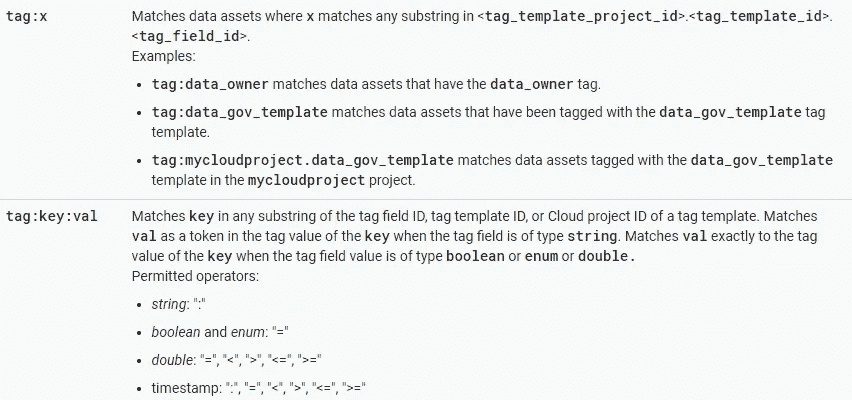

# 使用谷歌云数据目录推进数据治理之旅

> 原文：<https://towardsdatascience.com/boosting-the-data-governance-journey-with-google-cloud-data-catalog-d67acc3e3ffb?source=collection_archive---------24----------------------->

## 关于 Google Cloud 中数据发现和元数据管理的思考

Photo by [Jesse Bowser](https://unsplash.com/@jessebowser?utm_source=unsplash&utm_medium=referral&utm_content=creditCopyText) on [Unsplash](https://unsplash.com/s/photos/road?utm_source=unsplash&utm_medium=referral&utm_content=creditCopyText)

我们生活在信息时代，我相信没有人不同意公司现在可以访问前所未有的大量数据。因此，从可靠性角度管理数据资产自然变得越来越复杂。

我所说的管理数据资产是指:

*   寻找负担得起的储物解决方案；
*   使用最合适和最新的信息进行业务绩效和营销分析；
*   授予消费者适当的访问权限；
*   遵守隐私法规，如 GDPR、HIPAA 和 CCPA

—仅列出一些挑战。

我敢打赌，与数据管理相关的讨论是目前企业对话中的五大问题之一，我经常将它们视为更大问题的一部分，名为**数据治理**。不幸的是，尽管[对数据治理的兴趣在过去几年中显著增长](https://trends.google.com/trends/explore?date=today%205-y&q=%2Fm%2F0fxl7g)，但是没有一个通用的解决方案可以解决所有方面的问题。

在这条漫长的道路上，有指导公司的原则和最佳实践。然而，尽管人们可能会找到任何高层次的指导，但我已经认识到(自从我开始从事数据治理工作以来)，对于大多数公司来说，确定合适的工具来解决每个元素仍然是一个挑战。话虽如此，让我们来看看常见的数据治理构建块:

*50 most common words compiled from a bunch Data Governance related documents I*’ve *read in 2019 (thanks* [*jasondavies.com/wordcloud*](https://www.jasondavies.com/wordcloud/) *for the amazing word cloud generator!)*

现在，请看看[谷歌云数据目录的文档](https://cloud.google.com/data-catalog/)。可能你已经注意到了上图中突出显示的大多数单词在那里都用得很多。这是因为数据目录无疑由治理基础工具组成，这意味着选择合适的目录解决方案增加了数据治理之旅的成功机会。

让我们深入了解该产品如何适应数据治理环境！

# 数据发现

数据分布在多个数据源和格式上，从数据仓库到流媒体渠道……[数据目录](https://cloud.google.com/data-catalog/)目前处于测试版，并原生集成到 3 个最常用的谷歌云数据处理和存储工具中: [BigQuery](https://cloud.google.com/bigquery/) 、 [Pub/Sub](https://cloud.google.com/pubsub/) 和 [Storage](https://cloud.google.com/storage/) 。

此处的“本地”是指，一旦您在组织的某个 GCP 项目中启用了数据目录，并向用户和/或服务帐户授予了正确的 IAM 角色，由这些服务管理的资产就可以被编入索引并通过目录被发现。BigQuery 数据集、表和视图以及发布/订阅主题会被自动索引，而[存储桶需要用户定义的配置](https://cloud.google.com/data-catalog/docs/how-to/filesets)。

随后，列出所有 BigQuery 资产就是执行搜索的问题，这可以通过使用 Data Catalog 的 UI 或 API 来完成。就像选择一个复选框一样简单，如下图所示:

BigQuery assets search in the Data Catalog UI

相同的用例适用于发布/订阅和存储资产。此外，数据分析师可以利用类似 Gmail 的搜索机制，使用广泛而灵活的[搜索语法](https://cloud.google.com/data-catalog/docs/how-to/search-reference)来细化他们的查询，该搜索语法可以处理简单的关键字和限定谓词。

# 分类和元数据

数据发现为治理增加了巨大的价值，但是当处理太多数据时，即使是最有经验的分析师也会迷失方向。那么，个人或第三方系统如何检查数据源是否可信呢？它的数据是最新的吗？它的数据从哪里来？有什么机密信息吗？发现机制本身通常不会回答这些问题，或者只是部分地回答。这里，**数据分类**登场了。

可以根据多个方面对数据进行分类:存储类型、质量、可信度、法规遵从性、弃用状态等等。数据目录提供了基于模板和标签的可定制分类机制，允许用户以各种形式对其数据进行分类。

它从集成系统中读取的信息集，加上用户提供的用来丰富其分类模式的信息，被称为**元数据**。*对于 Data Catalog 的用户来说，这是一个重要的概念，因为系统不会存储任何属于索引资产的数据。数据目录*仅存储和管理元数据。

下图显示了从 BigQuery 收集的关于给定表的信息数据目录的示例。它代表了所谓的技术元数据。这种元数据通常由源系统管理，不直接由用户更改。

Technical Metadata example

另一方面，下图显示了一种与[虚构的]公司业务严格相关的元数据——毫不奇怪，所谓的**业务元数据**。

Business Metadata example

请注意突出显示的字符串:它们指的是根据审计清单和法规遵从性对 BigQuery 资产进行分类的模板。这种模板可以用来对尽可能多的资产进行分类，以便在所有资产之间保持业务元数据的组织和标准化。

*快速提示:通过使用 Data Catalog 的 API，可以构建简单的代码来自动化创建和更新标签的过程，正如我在这个资源库中展示的:*[*【https://github.com/ricardolsmendes/datacatalog-tag-manager】*](https://github.com/ricardolsmendes/datacatalog-tag-manager)。

# 数据管理

虽然 Data Catalog 实际上并不访问数据，但它确实是一个**数据管理**工具。举个普通的例子，它的标记机制可能被数据公民用来跟踪数据。它存放在哪里？用哪个系统来管理？可能会存档甚至删除吗？

精心设计的*“模板+标签数据管理模式”*当然可以利用 Data Catalog 的搜索功能(已经在数据发现部分提到过)，因为资产可以通过它们的标签轻松找到，从而建立一个数据管理框架。我的意思是:可以通过用来创建附加到资产上的标签的模板和标签的值来找到资产。看看`tag`搜索限定符文档，看看它是如何工作的:

The tag search qualifier ([https://cloud.google.com/data-catalog/docs/how-to/search-reference](https://cloud.google.com/data-catalog/docs/how-to/search-reference))

想想看，创建一个带有`archive_at`和`delete_at`字段的模板是可能的。这种模板可用于将标签附加到数据资产。适当的查询允许数据管理器(为什么不允许自动化过程？)使用数据目录来查找哪些资产包含要在给定日期存档或删除的数据，以便可以对这些资产采取行动。然后，我会说*“数据目录支持基于元数据的数据管理”*。有道理？

# 目录

所有上述特征和元数据构建了一个**目录**。尽管我们正在讨论服务的名称，*“cat a log”*可以定义如下:*名词——系统地排列的带有描述性细节的项目的完整枚举*。所以，是的，我们可以检查数据治理的目录组件！

不仅如此，在这种情况下，目录还包含对当今企业至关重要的技术方面:

1.  它是基于云的；
2.  它可以按需扩展:无论你公司的数据仓库和数据流有多大，元数据都会得到适当的管理；
3.  用户按量付费:谁用的多，付费就多；谁用的少，付的就少。

Pricing overview — effective January 22, 2020 ([https://cloud.google.com/data-catalog/pricing](https://cloud.google.com/data-catalog/pricing))

最后，从为所有公司元数据构建集中存储库的意义上来说，它提高了透明度。拥有正确证书的人将拥有所有公司资产元数据的真实来源，让参与数据治理计划的各方清楚底层数据发生了什么。

# 多用户参与选项

在结束之前，说几句关于**用户参与度**的话。数据公民拥有独特的技能组合。无论您擅长编程还是在使用 GUI 组件时表现更好，您都能够利用数据目录获得更好的治理体验。

我相信这一点，因为该产品既可以从本机 UI 使用，也可以从 API 使用。对于那些不想编码的人来说，用户界面可以在 https://console.cloud.google.com/datacatalog 的[找到。对于开发人员来说，可以通过简单的 REST 调用或使用惯用的客户端库来访问 API，这促进了代码的整洁并降低了错误率(基于我的**个人**经验)。目前，客户端库可用于 Python、Java 和 NodeJS](https://console.cloud.google.com/datacatalog)[https://cloud . Google . com/data-catalog/docs/reference/libraries](https://cloud.google.com/data-catalog/docs/reference/libraries)。

顺便说一下，我个人的偏好是利用客户端库尽可能地自动化与目录相关的任务。

# 最终考虑

嗯，我在第一段提到了*可靠性*。当然，可靠性是主观的，但是我试图将例子和想法与数据治理概念和数据目录特性联系起来。这种混合中的特性与概念相匹配的方式使我依赖 Google Data Catalog 作为一流的元数据管理工具。我不打算在这里下定论，但是我希望这篇文章能够帮助公司决定何时在一个或另一个解决方案之间设计他们的数据治理策略。

正如我在本文中强调的，数据目录并不适合所有的数据治理需求。然而，作为谷歌云平台的一部分，它可以与其他 GCP 本地产品一起使用，以满足更多需求，如[存档](https://cloud.google.com/storage/features/)、[加密](https://cloud.google.com/security/encryption-at-rest/)和[访问控制](https://cloud.google.com/iam/)。

如果你决定采用这种方法，请成为我的客人来交流知识和经验。

就这些了，伙计们！

## 参考

*   **【谷歌云】云中数据治理的原则和最佳实践**:[http://services . Google . com/FH/files/misc/Principles _ best _ practices _ for _ data-governance . pdf](http://services.google.com/fh/files/misc/principles_best_practices_for_data-governance.pdf)
*   **【里卡多·门德斯】谷歌云数据目录动手指南，心智模型**:[https://medium . com/Google-Cloud/Data-Catalog-hands-on-guide-a-mental-model-dae7f 6 DD 49 e](https://medium.com/google-cloud/data-catalog-hands-on-guide-a-mental-model-dae7f6dd49e)