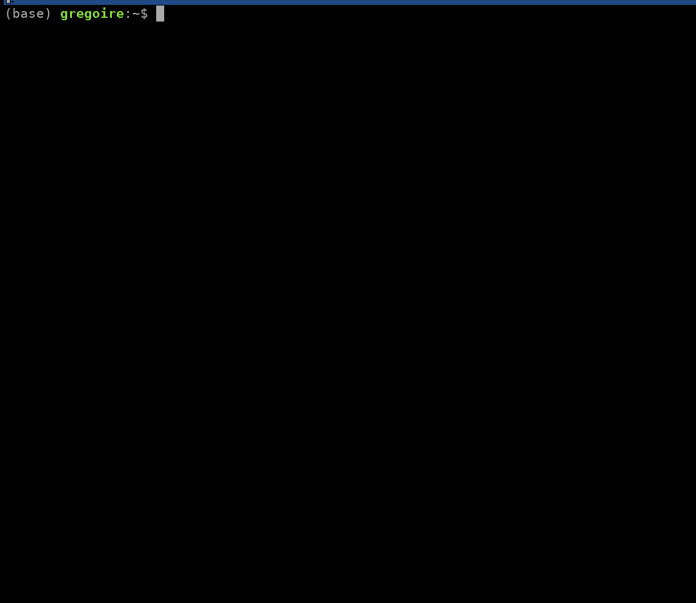
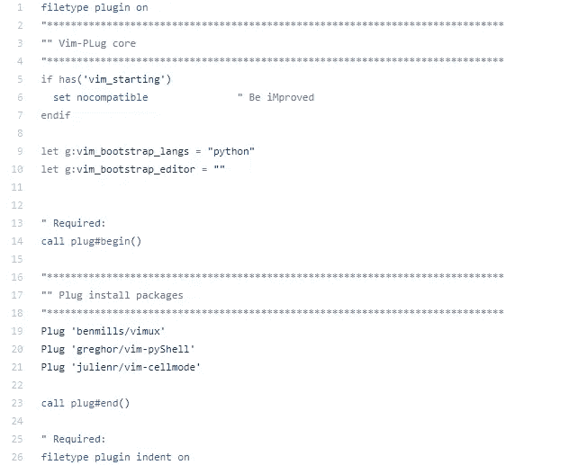
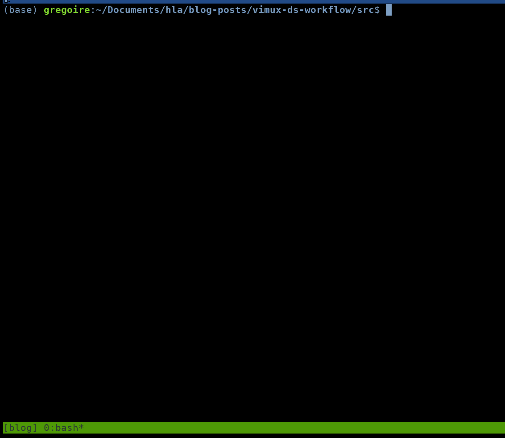
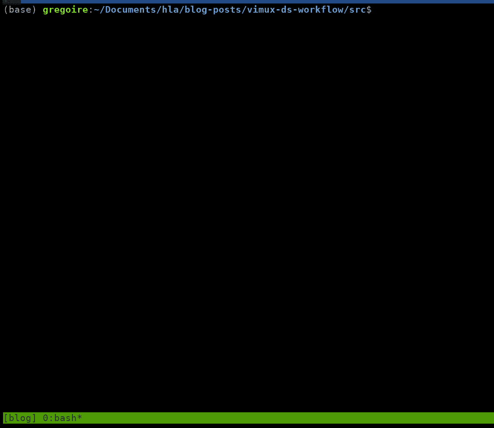

# 使用 vim+tmux 提升您的数据科学工作流程

> 原文：<https://towardsdatascience.com/boosting-your-data-science-workflow-with-vim-tmux-14505c5e016e?source=collection_archive---------7----------------------->


Photo by [SpaceX](https://unsplash.com/@spacex?utm_source=medium&utm_medium=referral) on [Unsplash](https://unsplash.com?utm_source=medium&utm_medium=referral)

和大多数同行一样，我在 Jupyter 生态系统中开始了我的数据科学职业生涯。Jupyter 是一个很好的环境，易于设置，提供了有用的内置功能。

在某些时候，我仍然觉得我需要超越。笔记本固有的一些限制开始扼杀我的生产力。仅举几个例子:

*   笔记本的版本控制是有问题的。我一直害怕将包含客户数据的笔记本输出发送到网上。此外，在代码实际上没有改变的情况下，让 git 跟踪输出修改是非常不方便的。
*   尽管最近取得了一些进展，但是在 Jupyter 环境中，像高级搜索和替换这样的编辑功能仍然非常有限。
*   当项目变大时，同时打开几个笔记本是很常见的。从一台笔记本浏览到另一台笔记本是一件痛苦的事情，尤其是当它们隐藏在互联网标签的海洋中时。浏览器是用来搜索的，不是为了代码而开发的！

因此，我积极寻找替代方案，幸运的是，我遇到了一群很酷的家伙，他们教会了我老式的代码开发方式。它依赖于 vim + tmux 组合，该组合结合了一个强大的终端嵌入式编辑器和一个多路复用器。它们一起提供了高级编辑功能以及数据浏览所需的交互性。此外，**该工作流程可以完全通过键盘操作，从而节省了大量时间**，因为您不再需要不断地在键盘和鼠标之间切换。

你可能想知道为什么我没有考虑使用像 Pycharm 这样的 IDE。嗯，有两个主要原因。首先，ide 不是真正可移植的，作为一名顾问，我倾向于在许多不同的环境中工作。其次，也是更重要的一点，在黑屏上工作看起来更酷，你可以执行代码，以(几乎)思考的速度从一个窗格移动到另一个窗格。

这篇文章首先旨在指导您建立一个基于 vim + tmux 的基本但实用的数据科学环境。我还将展示这样的设置如何提高您的项目生产率。

*免责声明:要阅读这篇文章，你需要对 vim 有基本的了解。如果你是个彻头彻尾的新手，也许可以先看看这篇* [*文章*](https://medium.com/actualize-network/how-to-learn-vim-a-four-week-plan-cd8b376a9b85) *再回来。*

# Tmux

Tmux 是一个命令行工具，可以在一个终端窗口中启用多个窗口和窗格。技术上，它被称为多路复用器。安装就像`sudo apt-get install tmux`一样简单。然后，您可以使用以下内容创建第一个会话:

```
tmux new -s mycoolproject
```

在一个会话中，您可以使用前缀命令`ctrl+b`和一些特定的键来控制窗口和窗格。例如，`ctrl+b “`产生窗口的水平分割。然后，您可以使用`ctrl+b arrows`在窗格之间导航。

tmux 的一大优势是它允许我们并行运行多个会话。这对于**在不同项目之间快速切换非常方便，不会有弄乱脚本的风险**。您可以使用`ctrl+b d`脱离当前会话，使用`tmux ls`列出现有会话，并使用`tmux a -t <session name>`连接到不同的会话。



Quick overview of tmux capabilities.

定制 tmux 相当容易，您只需要编辑位于您的主目录中的配置文件`.tmux.conf`。例如，许多人喜欢将前缀命令重新绑定到`ctrl+a`。

我的目的只是在这里提供一个 tmux 的简要概述，但是如果你想了解更多，还有很多很棒的教程。这个[小抄](https://gist.github.com/MohamedAlaa/2961058)也值得看一看。

# ❤️维姆❤️

我喜欢维姆。真的。Vim 是那些像黑咖啡、周日早晨慢跑或戈达尔电影一样的东西之一，起初可能会觉得有点刺耳，但随着时间的推移和练习，它会变得越来越令人愉快。

有人说学习曲线很陡。是真的。但是，当你开始掌握新的快捷方式或宏来大大提高你的生产力时，这也是非常有益的。

Vim 是一个高度可定制的文本编辑器，直接嵌入在终端中。默认情况下，Vim 存在于所有类似 Unix 的系统中。无需安装。基本配置的功能有限，但您可以快速添加功能(如语法突出显示、自动完成等..)通过调整或添加插件到`.vimrc`，配置文件位于您的主目录中，在启动编辑器时加载。

我在这个[回购](https://github.com/greghor/vimux-ds-workflow)中做了一个简单的`.vimrc`。它将帮助您重复下面描述的步骤。然而，我强烈建议建立自己的配置文件，以便更好地感受 vim 的精神。

在本教程中，我们将使用三个插件:

*   [vimux](https://github.com/benmills/vimux) ，使 vim 能够与 tmux 交互
*   vim-pyShell ，一个专门为简化 ipython 的使用而设计的 vimux 包装器
*   [vim-cellmode](https://github.com/julienr/vim-cellmode) ，ipython 的类 matlab 代码块执行

安装插件最简单的方法是通过插件管理器。我个人使用 [vim-plug](https://github.com/junegunn/vim-plug) ，但是还有很多其他好的选择。

Vim-plug 易于安装。它只需要一个 bash 命令:

```
curl -fLo ~/.vim/autoload/plug.vim  [https://raw.github.com/junegunn/vim-plug/master/plug.vim](https://raw.github.com/junegunn/vim-plug/master/plug.vim)
```

然后你只需要在`call plug#begin()`和`call plug#end()`之间的`.vimrc`中指定想要的插件，如下图所示。



First lines of .vimrc

要安装插件，打开`.vimrc`执行命令`:PlugInstall`。然后重启 vim 来获取配置文件。

# 代码执行

一旦我们的插件启动并运行，我们就可以开始从 vim 向终端发送指令。

在 tmux 会话中，用 vim 打开一个 python 脚本。在正常模式下，您可以使用命令`:call StartPyShell()`从新安装的插件中调用专用函数来启动 ipython 终端。默认情况下，这将在屏幕底部创建一个窗格，并启动一个 ipython 会话。

代码可以通过以下方式执行:

*   逐行发送指令。为此，将光标移动到所需的行并运行命令`:call RunPyShellSendLine()`。
*   发送用`##{/##}`分隔的代码块。在这种情况下，转到程序块并调用`RunTmuxPythonCell(0)`。



Sending commands directly from vim to the shell with vimux

这已经很酷了，但它实际上需要相当多的输入。我们能做得更好吗？

# 通过相关映射提高您的生产力

自动化重复性任务。这是缩短开发时间从而提高生产力的秘密。好消息是 vim 真的很擅长这个。

主要思想在于为最常见的任务创建映射。让我们仔细看看如何实际实现映射。同样，这是在`.vimrc`中完成的。在下面的代码片段中，第 2 行和第 3 行分别将快捷键`,ss`和`,sk`映射到 ipython 启动和停止命令，而第二个块定义了代码执行的映射。

众所周知，数据科学中的大部分时间都用于数据准备。这一步严重依赖于数据帧操作。因此，定义与基本操作相关的映射，如:

*   打印数据帧的第一个元素:`,sdh`
*   打印数据帧信息:`,sdi`
*   绘制数据帧的内容:`,spp`
*   显示直方图:`,sph`
*   显示变量的内容:`,so`
*   获取一个 iterable 的长度:`,sl`

会为你节省很多时间吗？此外，由于检查是通过将光标下的变量/对象传递给后端函数来执行的，因此**不会因为大量的打印和输出**而污染您的脚本。不需要额外的输入。

让我们看看这些映射是如何工作的！



Few mappings were sufficient to really boost my productivity!

# 总结想法

将 vim 的高级编辑功能与一些设计良好的映射结合起来，确实提高了我的生产率。这个工作流程帮助我满足了工作中固有的紧迫的最后期限。的确，它需要大量的初始投资，但我相信，从节省时间和工作舒适度来看，回报要高得多。

让我对 vim 惊叹不已的是无穷无尽的定制可能性。所以要有创意，开始破解`.vimrc`并实现你自己的映射！

感谢阅读！如果你喜欢这类内容，你可能也会对这个[帖子](https://greghor.medium.com/5-killer-vim-features-for-your-data-science-daily-routine-ec814fc6c090)感兴趣。请随意[关注我的 Medium](https://greghor.medium.com/) ，不要错过我的下一篇关于如何在数据科学中使用 vim 的文章。你也可以通过使用我的[附属链接](https://greghor.medium.com/membership)加入 Medium 来支持我的写作。