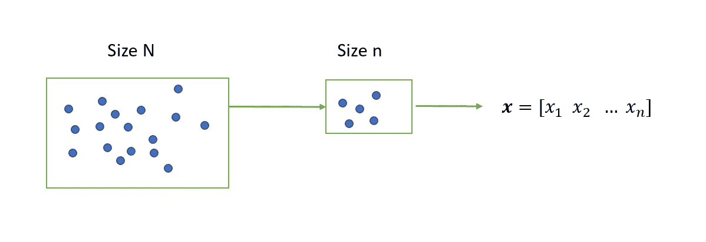
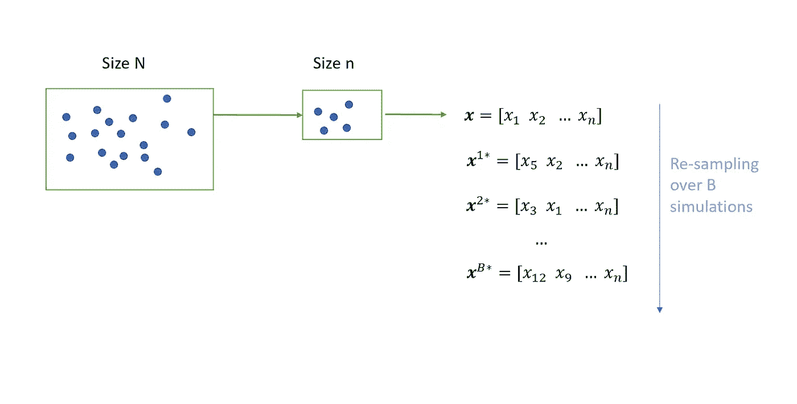
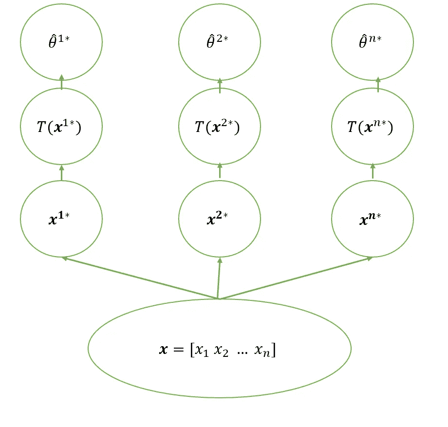
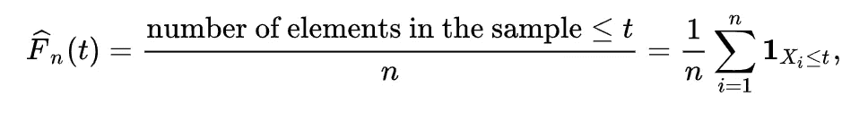
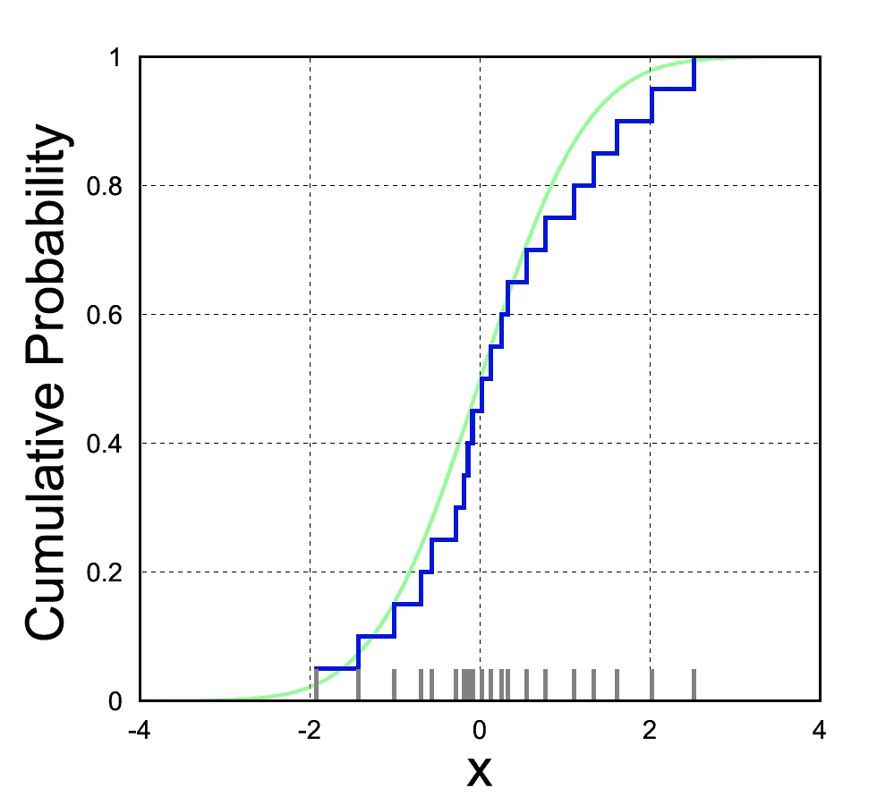
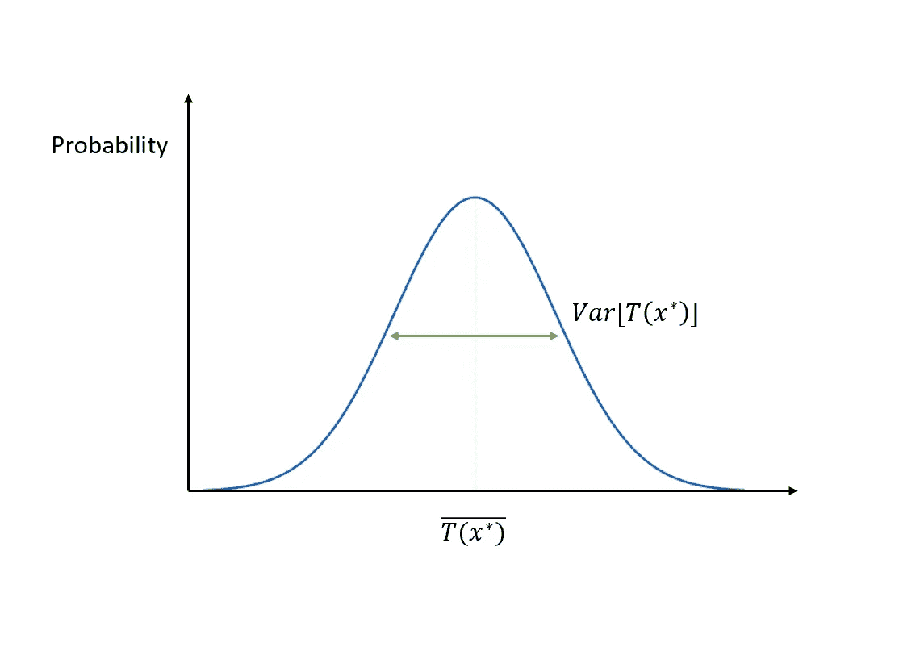

# 自助抽样

> 原文：<https://towardsdatascience.com/bootstrap-sampling-31bc54e7193a?source=collection_archive---------24----------------------->

无论何时处理数据，您应该做的第一件事就是调查相关的统计属性。特别是，您可能有兴趣知道您的数据是否遵循已知的分布。

为什么这很重要？想想你的数据分析的目标:一旦你有了一个观察样本，你想计算一些统计数据(即均值、标准差……)，以及建立置信区间和进行假设检验。为此，您需要假设您的数据遵循已知的分布，如正态分布、X 平方分布或 T-student 分布。

不幸的是，大多数时候你的数据是在没有已知分布的情况下呈现给你的，因此你不知道它们的密度函数的形状。在这里，Bootstrap 抽样提供了帮助:这种技术的目的是在不知道潜在分布形状的情况下评估其统计数据和属性。

它是如何工作的？想象一下，给你提供了一组数据(你的人口)，你得到了一个大小为 n(T1)的样本。

现在，如果你对你的初始样本进行 B 次重采样(你可以把 B 设置成你想要的大小。一般来说，它被设置为等于或大于 10000)，您将生成 B 个进一步的样本，每个样本的长度为 *n* (有可能出现一个或多个重复的值)。

现在，对于每个样本，您可以计算感兴趣的参数的估计值。这将是每个样本 T( **x^** 1*)的通用函数，我们称之为θ̂1*.

现在，这个想法是，如果我们收集所有我们计算的统计数据，我们可以生成一个初始人口的概率函数的近似值。近似分布的一个标准选择是观测数据的**经验分布函数**。

在统计学中，经验分布函数是与样本的经验测量相关的分布函数。它是一个累积分布，在每个 *n* 数据点上跳跃 1/ *n* 。在公式中:

其中 **1** 为指示函数，其二进制值为 1(如果 *xi* 小于 *t* )或 0(如果 *xi* 大于 *t* )。直觉上，它是一个“经验”CDF:事实上，我们不知道 *x* 小于 *t* 的概率，然而每当 *x* 实际上小于 *t* 时，该函数就将其值增加 1/ *n* 。这个函数的形状是这样的:

所以，你能做的是使用这个经验函数，而不是概率分布，来计算相关的统计数据和置信区间。此外，如果 *n* (每个样本的大小)足够大，您可以用正态分布来近似您的估计的概率分布，得到:

Bootstrap 抽样是一种强大的技术:同样，从一个未知的分布，您可以近似一个概率分布，以便您可以计算相关的统计数据。